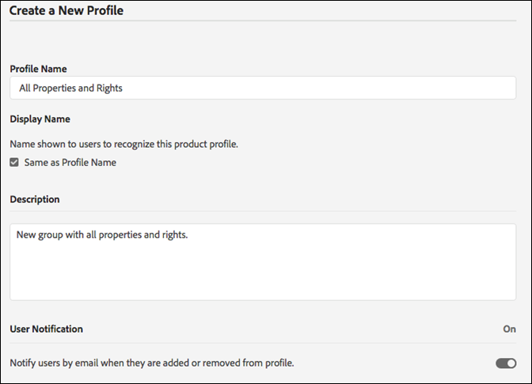
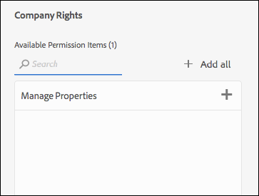
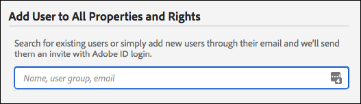

# Permisos de usuario

>[!NOTE]
>
>Adobe Experience Platform Launch se está convirtiendo en un conjunto de tecnologías de recopilación de datos en Experience Platform. Como resultado, se han implementado varios cambios terminológicos en la documentación del producto. Consulte el siguiente [documento](../../term-updates.md) para obtener una referencia consolidada de los cambios terminológicos.

## Tipos de permiso

Hay dos permisos de usuario que se deben conocer para su uso con etiquetas en Adobe Experience Platform:

* **Permisos de Experience Cloud:** los permisos de [!DNL Experience Cloud], que se encuentran en Admin Console a nivel de compañía, regulan quién puede controlar los permisos de grupo y la pertenencia a grupos de todos los productos de [!DNL Experience Cloud].
* **Permisos para etiquetas:** los permisos para las etiquetas se encuentran en el Admin Console a nivel de Perfil de producto. Estos permisos determinan qué usuarios realmente pueden realizar determinadas acciones cuando inician sesión en la interfaz de usuario de la recopilación de datos.

Este artículo examina en detalle los distintos tipos de permisos.

### Permisos de Experience Cloud

Esta sección analiza los factores que son importantes de comprender al utilizar Platform. Consulte [Funciones administrativas en la Guía del usuario de Enterprise](https://helpx.adobe.com/es/enterprise/using/admin-roles.html) para obtener toda la información de los permisos de [!DNL Experience Cloud].

#### Administrador de organización

Los administradores de organización suelen denominarse “Org Admin”. La función principal de un administrador de organización es asignar permisos a otros usuarios. Esto se realiza mediante la creación de perfiles (o grupos) de producto que contienen un conjunto específico de derechos dentro de un producto específico y luego asignan usuarios, existentes o nuevos, a ese perfil de producto.

Los administradores de organización empresarial no heredan ningún derecho para las etiquetas en Platform. Deben agregarse a un perfil de producto que tenga los permisos adecuados si desea hacer algo en la interfaz de usuario de recopilación de datos.

#### Administrador de productos

Un administrador de producto (o “Product Admin”) es similar a un administrador de organización, pero tiene un ámbito más limitado. Un administrador de productos solo tiene permiso para modificar perfiles de producto para un producto específico de [!DNL Adobe] y no de todos los productos de [!DNL Adobe] a los que la compañía tiene acceso.

### Permisos para etiquetas

Dentro de [!DNL Experience Cloud], no se asignan derechos ni permisos a usuarios individuales. Se les asigna un perfil de producto (consulte Permisos de Experience Cloud más atrás). A continuación, se asignan a uno o varios perfiles de producto a los usuarios individuales.

Dentro de un perfil de producto, los permisos para etiquetas se dividen en cuatro dimensiones.

1. Plataformas
1. Propiedades
1. Derechos de propiedad
1. Derechos de compañía

#### Plataformas

Cada propiedad tiene una plataforma. Actualmente hay dos plataformas que puede utilizar para etiquetas: *Web* y *Mobile*. Puede utilizar este tipo de permiso para restringir o conceder acceso a un tipo concreto de propiedad. Esto puede resultar útil cuando el equipo que administra las aplicaciones móviles es diferente del que administra los sitios web.

#### Propiedades

Es una lista de todas las propiedades que existen dentro de la compañía. Puede utilizar este tipo de permiso para restringir o conceder acceso a propiedades existentes específicas (por nombre).

#### Derechos de propiedad

Las propiedades que cree en la interfaz de usuario de la recopilación de datos estarán disponibles en el Admin Console para que asigne permisos. Si un perfil de producto dado no tiene acceso a la propiedad A1, los usuarios que pertenezcan a dicho perfil no podrán ver ni modificar la configuración de la propiedad A1.

Suponiendo que un usuario pertenece a un perfil con acceso a la Propiedad A1, lo que puede hacer dentro de la Propiedad A1 se determina según lo dispuesto en los derechos otorgados de este grupo de permisos. Los usuarios con permisos de Propiedad A1, pero sin derechos asignados, tienen acceso de solo lectura.

Los permisos disponibles en este grupo son:

* **Desarrollo:** esto le permite crear reglas y elementos de datos. También puede crear bibliotecas e implementarlas en entornos de desarrollo existentes. Puede enviar una biblioteca para su aprobación cuando esté lista. La mayoría de las tareas diarias en la interfaz de usuario de recopilación de datos requieren este derecho.
* **Aprobar:** Esto le permite tomar una biblioteca enviada y crearla en el entorno de ensayo. También puede aprobar una biblioteca para publicarla una vez completada la prueba.
* **Publicar:** esta opción le permite publicar bibliotecas aprobadas en el entorno de producción.
* **Administrar extensiones:** Esto otorga la capacidad de instalar nuevas extensiones en una propiedad, modificar la configuración de la extensión para una extensión ya instalada y eliminar una extensión. Consulte la documentación de descripción general de las extensiones para obtener [más información sobre las extensiones](../managing-resources/extensions/overview.md). Esta función suele pertenecer a TI o Marketing, según su organización.
* **Administrar entornos:** esta opción le permite crear y modificar entornos. Consulte la [documentación de entornos](../publishing/environments.md) para obtener más información. Esta función pertenece normalmente al grupo de TI.

#### Derechos de compañía

Los derechos de compañía se aplican a permisos que abarcan varias propiedades. Actualmente, existen dos:

* **Administrar propiedades:** esta opción le permite crear nuevas propiedades en la interfaz de usuario de la recopilación de datos y modificar los metadatos y la configuración en el nivel de propiedad. También puede eliminar propiedades. Lea la [documentación de propiedades](companies-and-properties.md) para obtener más información. Normalmente esta función recae sobre los administradores.
* 
* otorga la capacidad de crear nuevas propiedades en [!DNL Platform Launch] y modificar los metadatos y la configuración al nivel de propiedad. También puede eliminar propiedades. Puede obtener más información sobre las propiedades [aquí](companies-and-properties.md). Normalmente esta función recae sobre los administradores.
* **Develop Extensions:** otorga la capacidad de crear y modificar paquetes de extensión que sean propiedad de la compañía, incluidas versiones privadas y solicitudes de lanzamiento público.
* **Administrar configuraciones de aplicación:** Esta opción solo está disponible para los clientes con licencia de Adobe Journey Optimizer o cualquier otra solución que les permita acceder a la mensajería móvil en la aplicación y a la mensajería push.  Esto le permite administrar las aplicaciones de las que conoce el Experience Cloud, así como las credenciales push necesarias para comunicarse con el servicio de Firebase Cloud Messaging y el servicio de notificaciones push de Apple.

### Permisos totales de usuario

Los permisos totales del usuario los determina su pertenencia total a distintos perfiles de producto. Si un usuario pertenece a varios perfiles de producto, los permisos de cada perfil se suman en lugar de multiplicarse.

Por ejemplo: el Perfil de producto A otorga a Enrique el derecho de desarrollo para la Propiedad 1. El Perfil de producto B otorga a Henry el derecho de publicación para la Propiedad 2. Enrique puede desarrollar en la Propiedad 1 y publicar en la Propiedad 2, pero no puede publicar en la Propiedad 1 ni desarrollar en la Propiedad 2 porque no se le han otorgado derechos explícitos para ello.

## Situaciones de derechos

Las distintas compañías tienen diferentes necesidades al crear nuevos perfiles de producto. Estas necesidades varían según el tamaño de la compañía, la estructura organizativa, el número de sitios, el número de personas involucradas en la administración de etiquetas, etc.

A continuación se presentan algunas situaciones comunes y un punto de inicio recomendado para crear perfiles de producto y añadirles usuarios.

### Encargado individual

Si dirige una compañía pequeña con una persona a cargo de todo, conceda este permiso de usuario a todas las propiedades y asígneles todos los derechos enumerados arriba.

### Separación de tareas

Muchas personas participan en el etiquetado. Tiene un conjunto de personas (puede ser un asesor externo) que crea reglas y elementos de datos, pero no desea que tengan acceso al entorno de producción. Desea asegurarse de que nadie trabaja en Producción excepto en el equipo de TI.

1. Cree una cuenta para los consultores y asígneles únicamente el derecho de desarrollo.
1. El consultor desarrolla y prueba dentro de los límites establecidos.
1. Si el consultor desea una nueva extensión o está preparado para publicar, un representante de su organización (con los derechos apropiados) se encarga de esas acciones.

### Para compañías

Una compañía puede tener varias instalaciones divididas geográficamente, con equipos diferentes responsables de cada ubicación geográfica. Dentro de esos equipos, distintas personas se encargan de desarrollar y publicar.

Es similar a la “Separación de tareas” anterior, pero se organiza por áreas geográficas.

* América del Norte
   * Grupo de desarrollo
   * Grupo de publicación
* Europa
   * Grupo de desarrollo
   * Grupo de publicación
* ...
   * Grupo de desarrollo
   * Grupo de publicación

## Ejemplos

Algunos ejemplos de los tipos de funciones que podría tener en su organización y de los permisos que debe asignar pueden ayudar a aclarar este concepto.

Aquí se describen algunas de las funciones que puede aplicar a su organización y una matriz para mostrar los permisos que necesitan para realizar su trabajo.

* Administrador: quiere ver lo que está sucediendo, pero no debería poder realizar ningún cambio.
* Especialista en marketing: puede instalar extensiones y configurar nuevas etiquetas para propiedades existentes, pero no puede publicar en los entornos de ensayo o producción.
* Desarrollador de aplicaciones móviles: es responsable de implementar soluciones de Adobe y de terceros dentro de una aplicación móvil nativa.
* Equipo de TI: no modifica ninguna etiqueta, pero tiene control absoluto sobre los entornos de ensayo y producción y qué incluye cada uno.
* Versátil: hace de todo.

| Función | Propiedades | Derechos de compañía | Derechos de propiedad |
|--- |--- |--- |--- |
| Administrador | Inclusión automática |  |  |
| Experto en marketing | Inclusión automática | Administrar propiedades | Desarrollo Gestión de extensiones |
| Desarrollador de aplicaciones móviles | Inclusión automática | Administrar propiedades Administrar configuraciones de aplicación | Desarrollo Gestión de extensiones |
| Equipo de TI | Inclusión automática | Aprobación Publicación Gestión de entornos |
| Versátil | Inclusión automática | Administrar propiedades | Desarrollo Aprobación Publicación Gestión de extensiones Gestión de entornos |
| Desarrollador de extensiones | Inclusión automática | Gestión de propiedades Desarrollo de extensiones | Desarrollo |

## Asignación de permisos de usuario

Los pasos a continuación le guían por el proceso de asignación de permisos. También puede ver este proceso [en vídeo](https://www.youtube.com/watch?v=ba28BHX8cwU).

Los pasos del 1 al 3 a continuación se pueden evitar navegando directamente a la [Adobe Admin Console](https://adminconsole.adobe.com/enterprise/products). Si pertenece a más de una organización, seleccione la organización correcta en la barra de navegación superior a la derecha.

### 1. Inicie sesión en Experience Cloud

Inicie sesión en [https://experiencecloud.adobe.com/](https://experiencecloud.adobe.com/) con su Adobe ID y, a continuación, elija la organización que desea utilizar en la interfaz de usuario de recopilación de datos en el menú [!UICONTROL Navegación].

Abra el selector de soluciones haciendo clic en el icono de 9 puntos del menú [!UICONTROL Navegación] y, a continuación, seleccione **[!UICONTROL Administración]**.

Si no puede ver este enlace, las dos condiciones siguientes son verdaderas:

* No es administrador de organización.
* No es administrador de productos de ningún producto de [!DNL Experience Cloud].

En cualquier caso, pídale a un administrador de organización que siga estos pasos, o que le convierta en administrador de producto de etiquetas para que pueda hacerlo usted mismo.

>[!NOTE]
>
>Si no sabe quién es el administrador de organización, póngase en contacto con el servicio de atención al cliente.

### 2. Abra Admin Console

Seleccione **Admin Console**.

Seleccione la tarjeta **[!DNL Experience Platform Launch]-`Company Name`**.

<!-- Scott, update above image. Rebranding. -->

También puede seleccionar **[!UICONTROL Productos]** en la parte de navegación superior y, a continuación, seleccionar **[!DNL Experience Platform Launch]-`Company Name`** en la parte de navegación izquierda.

Si no ve una tarjeta de [!DNL Experience Platform Launch] o si [!DNL Experience Platform Launch] no aparece en esta lista, no es administrador de organización, pero es administrador de otros productos de Experience Cloud. Como no es administrador de Experience Platform Launch, debe buscar un administrador de organización que pueda realizar estos pasos por usted o que pueda hacerle administrador de producto de [!DNL Platform Launch].

Después de seleccionar Platform Launch, se muestra una lista de perfiles de producto. Piense en estos perfiles como en grupos de permisos. Se crea un perfil para usted llamado “[!DNL Platform Launch] - `Company Name`”.

### 3. Cree el perfil de producto

Si está editando un perfil de producto existente, omita este paso.

Seleccione editar este perfil de producto o cree uno nuevo.

Para crear un nuevo perfil de producto, seleccione **[!UICONTROL Nuevo perfil]**.

Asigne un nombre y una descripción al nuevo perfil, configure si los usuarios deben recibir correos electrónicos cuando se añadan o se eliminen de este perfil y, a continuación, seleccione **[!UICONTROL Listo]**.

### 4. Edite el perfil de producto

Seleccione el perfil de producto de la lista y, a continuación, abra la pestaña **[!UICONTROL Permisos]**. Puede asignar permisos en dos dimensiones: propiedades y derechos.

Para asignar propiedades a esta definición de grupo, abra la sección **[!UICONTROL Propiedades]**.

Una lista muestra las propiedades de la etiqueta.

De forma predeterminada, las nuevas configuraciones de producto incluyen propiedades automáticamente. Esto significa que todas las propiedades (presentes y futuras) se incluyen en la definición del grupo.

Si se desactiva la inclusión automática, todas las propiedades disponibles actualmente aparecen en la parte izquierda. Para mover propiedades a esta definición del grupo, seleccione **[!UICONTROL Añadir]**.

Seleccione **[!UICONTROL Guardar]** cuando haya terminado.

### 5. Asignación de derechos

Asigne los derechos que desee que formen parte de la definición de su grupo. Abra la sección **[!UICONTROL Derechos]**.

Los derechos no se incluyen automáticamente. Debe asignar cada derecho a su perfil. Puede añadir rápidamente todos los derechos a este perfil utilizando el botón [!UICONTROL + Añadir todo] o puede asignar derechos individuales utilizando los botones individuales + (añadir). Para obtener más información sobre los permisos asociados a cada derecho, consulte [Escenarios de derechos](#rights-scenarios). Seleccione **[!UICONTROL Guardar]** cuando haya terminado. Si [!UICONTROL Guardar] no está disponible, no se realizó ningún cambio y no se le asignarán nuevos derechos.

Primero asigne derechos de propiedad:

A continuación, asigne derechos de compañía:

Algunas notas importantes a tener en cuenta sobre la asignación de derechos:

* La ausencia de derechos significa que solo tiene acceso de solo lectura. Si pertenece a una configuración de producto con propiedades de inclusión automática y sin derechos, tendrá acceso de solo lectura a todas las propiedades de etiquetas.
* Si no asigna las propiedades de gestión correctamente, no podrá añadir ninguna propiedad al iniciar sesión.
* Un usuario puede pertenecer a varios grupos, pero los derechos de esos grupos no se combinan en un conjunto de permisos maestro. Ese usuario solo tendrá los derechos explícitamente concedidos por cada grupo.

   Por ejemplo, si el Grupo 1 da acceso a la Propiedad A con derecho de desarrollo y el Grupo 2 da acceso a la Propiedad B con derecho de publicación, los derechos de desarrollo y publicación no se combinan para la Propiedad A y la Propiedad B. Solo se puede desarrollar en la Propiedad A y publicar en la Propiedad B.

### 6. Asignación de usuarios a grupos

Para asignar usuarios para que formen parte del grupo, abra la pestaña [!UICONTROL Usuarios] y, a continuación, seleccione [!UICONTROL Añadir usuario].

Seleccione los puntos suspensivos (...) para obtener opciones adicionales, como operaciones de usuario masivas.

>[!NOTE]
>
>Ser administrador de organización o administrador de productos no le otorga derechos dentro del producto de la etiqueta. Debe pertenecer al menos a un perfil de producto.

Busque el usuario que desee añadir al grupo. Puede buscar por nombre o por dirección de correo electrónico. Esto se rellena automáticamente con los usuarios existentes de su organización. Cuando encuentre el usuario que desee, seleccione su nombre.

Una vez que haya añadido usuarios, estos reciben un mensaje de correo electrónico que les informa de que ahora tienen derechos. Para iniciar sesión, siga el vínculo a la [IU de recopilación de datos](https://launch.adobe.com).

>[!NOTE]
>
>Si el usuario no existe, simplemente puede escribir su dirección de correo electrónico completa y, a continuación, proporcionar un nombre y un apellido. El nuevo usuario recibe un correo electrónico y, cuando crea un ID de [!DNL Adobe] a partir de esa invitación por correo electrónico, se vincula con la cuenta de usuario que se ha creado para ellos. Si asigna permisos por su cuenta, no debería encontrar este problema.

## Problemas habituales

### Error al cargar la cuenta

Cuando inicia sesión en la interfaz de usuario de Data COelection, recibe un mensaje que dice &quot;Error Loading Account&quot;.

Resolución: El usuario no pertenece a ningún perfil de producto de etiqueta. Consulte los pasos anteriores para crear un perfil y asignarle derechos, así como para asignar un usuario a un perfil.

### Botón de propiedad atenuado

Una vez que haya iniciado sesión, no puede añadir ninguna propiedad.

Solución: su cuenta de usuario no pertenece a ninguna configuración de producto que tenga derecho de gestión de propiedades. Regrese al paso 5 anterior.
