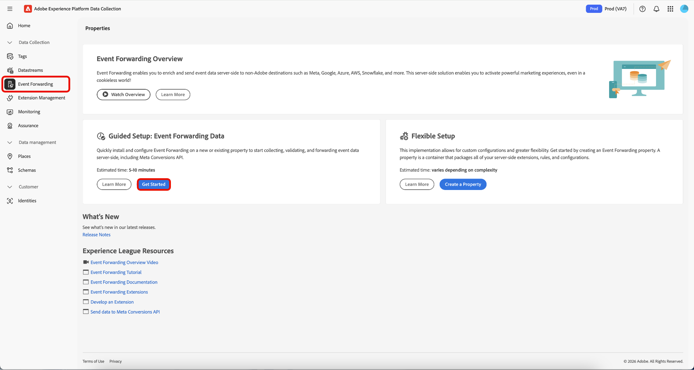
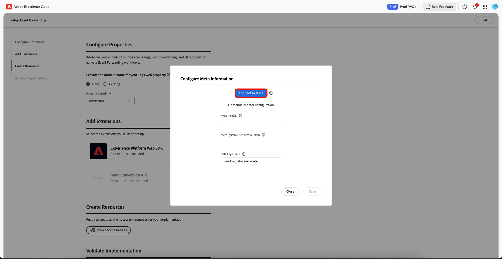
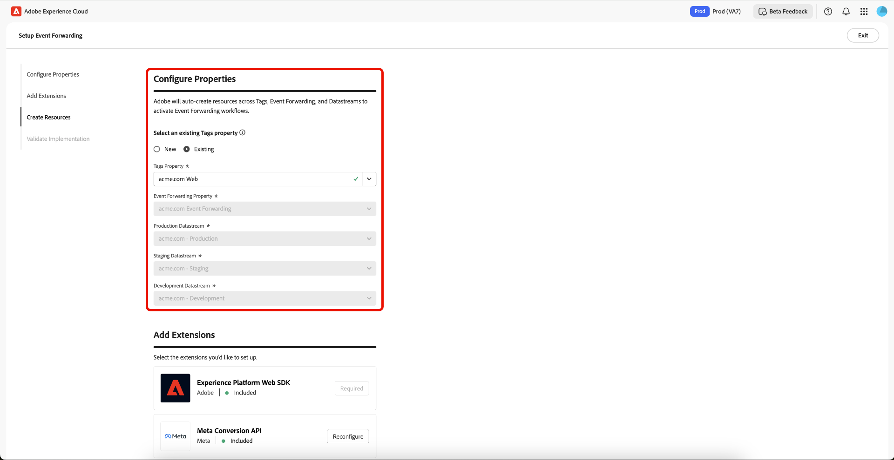

# Resumen de la configuración guiada del reenvío de eventos

>[!IMPORTANT]
>
>La función de configuración guiada está disponible para los clientes que hayan adquirido el paquete Real-Time CDP Prime y Ultimate. Póngase en contacto con su representante de Adobe para obtener más información.

>[!NOTE]
>
>Cualquier cliente existente puede utilizar los flujos de trabajo de configuración guiada para crear una implementación de referencia que se pueda utilizar para lo siguiente:
>
>* Utilícelo como el inicio de una implementación completamente nueva.
>* Aproveche esta implementación como referencia que puede examinar para ver cómo se ha configurado y luego duplicarla en las implementaciones de producción actuales.

La función de configuración guiada le ayuda a configurarse de forma sencilla y eficaz. Esta herramienta automatiza varios pasos que se realizan en las etiquetas de Adobe y en el reenvío de eventos, lo que reduce significativamente el tiempo de configuración.

Esta configuración puede instalar automáticamente las extensiones. [!DNL Meta] recomienda esta implementación híbrida para recopilar y reenviar conversiones de eventos del lado del servidor. La función de configuración guiada está diseñada para ayudarle a empezar con una implementación de reenvío de eventos y no pretende ofrecer una implementación integral y funcional que se adapte a todos los casos de uso.

## Introducción a la configuración guiada {#guided-setup}

Para comenzar con la característica, seleccione **[!UICONTROL Get Started]** en la interfaz de usuario de **[!UICONTROL Event Forwarding]** colecciones de datos.

>[!INFO]
>
>También puede acceder a la configuración guiada directamente desde la página de inicio de Recopilaciones de datos.

### Crear una nueva propiedad de etiquetas {#new-property}

En la sección Configurar propiedades, seleccione **[!UICONTROL New]** e introduzca los nuevos detalles de **[!UICONTROL Property Domain]**.

Seleccione **[!UICONTROL Add]** para [!DNL Meta Conversion API] en la sección Agregar extensiones. En la página Configurar información de [!DNL Meta], tiene la opción de escribir manualmente sus **[!UICONTROL Meta Pixel ID]**, **[!UICONTROL Meta System User Access Token]** y **[!UICONTROL Data Layer Path]**, o bien puede usar la opción **[!UICONTROL Connect to Meta]**.

#### Conectar con [!DNL Meta] mediante sus credenciales {#meta-credentials}

Seleccione **[!UICONTROL Connect to Meta]**, luego ingrese sus credenciales de [!DNL Meta] y seleccione **[!UICONTROL Log in]**, luego seleccione **[!UICONTROL Next]**.

Se le solicitará que **cree un portafolio de negocios**. Escriba **[!UICONTROL Business portfolio name]** y seleccione **[!UICONTROL Next]**.

Seleccione su portafolio de negocios de la lista y luego seleccione **[!UICONTROL Next]**. Puede ver la configuración de Business Portfolio, Ad Account y [!DNL Meta Pixel]. Seleccione **[!UICONTROL Continue]** para confirmar la configuración y luego seleccione **[!UICONTROL Next]**.

Espere unos minutos para que se complete el proceso de instalación y, a continuación, seleccione **[!UICONTROL Done]**.

Sus **[!UICONTROL Meta Pixel ID]**, **[!UICONTROL Meta System User Access Token]** y **[!UICONTROL Data Layer Path]** se rellenarán automáticamente. Seleccione **[!UICONTROL Save]**.

#### Creación de recursos para la nueva propiedad de etiquetas {#create-resources}

En la sección Crear recursos, seleccione **[!UICONTROL Pre-check resources]** para comprobar la organización y las propiedades en busca de conflictos o de los recursos existentes necesarios para la implementación.

La página Acciones de tarea muestra una lista de tareas y acciones. Seleccione **[!UICONTROL Create Resources]** para crear estas tareas.

Espere unos minutos para que las reglas, los elementos de datos, las extensiones, las bibliotecas, los SDK, etc. necesarios terminen de instalarse. La sección Creación de recursos proporciona vínculos a las propiedades y los recursos creados.

#### Valide la implementación {#validate-implementation}

La sección Validar implementación proporciona el vínculo incrustado que puede utilizar en el sitio web. **[!UICONTROL Start Validation]** ejecuta la prueba en la sesión actual del explorador en esta página de configuración guiada. Si la validación se realiza correctamente, la misma implementación debería funcionar cuando implemente el vínculo incrustado en el sitio.

Seleccione **[!UICONTROL Send PageView Event]** para enviar un evento de prueba a través de Adobe Experience Platform Edge Network. Luego se reenvía del lado del servidor a [!DNL Meta]. Seleccione **[!UICONTROL Finished Validation]** para completar la instalación.

>[!NOTE]
>
>Si se producen errores durante el proceso de validación, seleccione el vínculo **[!UICONTROL Assurance]** para revisar los eventos que pueden haber fallado.

### Usar una propiedad de etiquetas existente {#existing-property}

En la sección Configurar propiedades, seleccione **[!UICONTROL Existing]** y, a continuación, seleccione su propiedad de etiquetas en el menú desplegable. El sistema intenta encontrar la propiedad de reenvío de eventos que ya está adjunta a esta propiedad a través de los flujos de datos. Ahora puede seguir reconfigurando [!DNL Meta Conversion API], luego comprobar previamente y crear recursos.

Si la propiedad de etiquetas seleccionada no está conectada a una propiedad de reenvío de eventos o si faltan flujos de datos, se crean automáticamente.

Para configurar tu [!DNL Meta Conversion API], sigue el proceso resaltado arriba en [Conéctate a [!DNL Meta] usando tus credenciales](#meta-credentials).

Ahora que ha generado **[!UICONTROL Meta Pixel ID]**, **[!UICONTROL Meta System User Access Token]** y **[!UICONTROL Data Layer Path]**, seleccione **[!UICONTROL Pre-Check resources]** para crear el flujo de trabajo del reenvío de eventos.

Dado que está utilizando una propiedad de etiquetas existente, el proceso de configuración difiere ligeramente del flujo de trabajo de la nueva propiedad. Puede ver que el sistema omitirá la creación de la propiedad web, el host y el entorno, ya que estos ya existen. Finalmente, seleccione **[!UICONTROL Create Resources]** para crear las tareas que aún no están disponibles.

>[!INFO]
>
>La configuración guiada añade automáticamente notas a las propiedades que se actualizan durante el proceso. Puede verlas en la sección Notas del panel derecho de la propiedad Etiquetas en el modo de edición. Puede ver cuándo la herramienta de configuración guiada actualizó o creó la propiedad. Esta pista de auditoría le ayuda a seguir las modificaciones realizadas por la función de configuración guiada.

Espere unos minutos para que las reglas, los elementos de datos, las extensiones, las bibliotecas, los SDK, etc. necesarios terminen de instalarse. La sección Creación de recursos proporciona vínculos a las propiedades y los recursos creados.

La sección Validar implementación proporciona el vínculo incrustado que puede utilizar en el sitio web. **[!UICONTROL Start Validation]** ejecuta la prueba en la sesión actual del explorador en esta página de configuración guiada. Si la validación se realiza correctamente, la misma implementación debería funcionar cuando implemente el vínculo incrustado en el sitio.

Seleccione **[!UICONTROL Send PageView Event]** para enviar un evento de prueba a través de Adobe Experience Platform Edge Network. Luego se reenvía del lado del servidor a [!DNL Meta]. Seleccione **[!UICONTROL Finished Validation]** para completar la instalación.

>[!NOTE]
>
>Si se producen errores durante el proceso de validación, seleccione el vínculo **[!UICONTROL Assurance]** para revisar los eventos que pueden haber fallado.

## Próximos pasos {#next-steps}

En esta guía se explica cómo utilizar la herramienta de configuración guiada para crear y configurar propiedades para [!DNL Meta Conversions API].

Consulte la documentación de [!DNL Meta] sobre las [prácticas recomendadas para [!DNL Conversions API]](https://www.facebook.com/business/help/308855623839366?id=818859032317965) para obtener más información sobre cómo implementar de forma eficaz su integración. Para obtener información más general sobre las etiquetas y el reenvío de eventos en Adobe Experience Cloud, consulte [información general sobre etiquetas](../../home.md).
