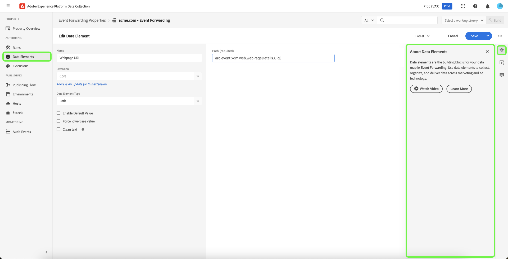

# Información general sobre el reenvío de eventos

>[!NOTE]
>
>Adobe Experience Platform Launch se ha convertido en un conjunto de tecnologías de recopilación de datos en Adobe Experience Platform. Como resultado, se han implementado varios cambios terminológicos en la documentación del producto. Consulte el siguiente [documento](../../term-updates.md) para obtener una referencia consolidada de los cambios terminológicos.

El reenvío de eventos en Adobe Experience Platform permite enviar datos de eventos recopilados a un destino para su procesamiento en el servidor. El reenvío de eventos reduce el peso de la página web y la aplicación al utilizar la red perimetral de Adobe Experience Platform para ejecutar tareas normalmente realizadas en el cliente. Las reglas de reenvío de eventos, implementadas de forma similar a las etiquetas, pueden transformar y enviar datos a nuevos destinos, pero en lugar de enviar estos datos desde una aplicación cliente como un explorador web, se envían desde los servidores de Adobe.

Este documento proporciona información general de alto nivel sobre el reenvío de eventos en Platform.

>[!NOTE]
>
>Para obtener información sobre cómo se ajusta el reenvío de eventos al ecosistema de recopilación de datos en Platform, consulte la [información general sobre recopilación de datos](../../../collection/home.md).

Reenvío de eventos combinado con Adobe Experience Platform [SDK web](../../../edge/home.md) y [SDK móvil](https://aep-sdks.gitbook.io/docs/) proporciona las siguientes ventajas:

**Rendimiento**:

* Realice una sola llamada desde una página que contenga una carga útil de datos que luego se federe en el servidor para reducir el tráfico de red del lado del cliente y ofrecer una experiencia más rápida para los clientes.
* Reduzca la cantidad de tiempo que tardan las páginas web en cargarse para mejorar el rendimiento del sitio.
* Reduzca el número de tecnologías del lado del cliente necesarias para ofrecer su experiencia y enviar datos a muchos destinos.

**Administración de datos**:

* Aumente la transparencia y el control sobre qué datos se envían donde se distribuyen todas las propiedades.

## Diferencias entre el reenvío de eventos y las etiquetas {#differences-from-tags}

En cuanto a la configuración, el reenvío de eventos utiliza muchos de los conceptos mismos que las etiquetas, como [reglas](../managing-resources/rules.md), [elementos de datos](../managing-resources/data-elements.md)y [extensiones](../managing-resources/extensions/overview.md). La diferencia principal entre ambos puede resumirse de la siguiente manera:

* Etiquetas **recopila** datos de evento de un sitio web o aplicación móvil nativa y los envía a Platform Edge Network.
* Reenvío de eventos **send** datos de evento entrantes de Platform Edge Network a un punto final que represente un destino final o un punto final que proporcione datos con los que desee enriquecer la carga útil original.

Mientras que las etiquetas recopilan datos de evento directamente desde su sitio o aplicación móvil nativa mediante los SDK web y móviles de la plataforma, el reenvío de eventos requiere que los datos de evento ya se envíen a través de la red perimetral de la plataforma para reenviarlos a los destinos. En otras palabras, debe implementar la plataforma web o el SDK móvil en la propiedad digital (ya sea mediante etiquetas o utilizando código sin procesar) para utilizar el reenvío de eventos.

### Propiedades {#properties}

El reenvío de eventos mantiene su propia tienda de propiedades separadas de las etiquetas, que puede ver en la interfaz de usuario de la recopilación de datos seleccionando **[!UICONTROL Reenvío de eventos]** en el panel de navegación izquierdo.

Lista de propiedades de reenvío de eventos **[!UICONTROL Edge]** como su plataforma. No distinguen entre web o móvil porque solo procesan los datos recibidos de Platform Edge Network, que puede recibir datos de evento de plataformas web y móviles.

### Extensiones {#extensions}

El reenvío de eventos tiene su propio catálogo de extensiones compatibles, como el [Principal](../../extensions/web/core/event-forwarding.md) extensión y [Conector de Adobe Cloud](../../extensions/web/cloud-connector/overview.md) extensión. Puede ver las extensiones disponibles para las propiedades de reenvío de eventos en la interfaz de usuario seleccionando **[!UICONTROL Extensiones]** en la navegación izquierda, seguido de **[!UICONTROL Catálogo]**.

### Elementos de datos {#data-elements}

Los tipos de elementos de datos disponibles en el reenvío de eventos se limitan al catálogo de elementos compatibles [extensiones](#extensions) que les proporcionan.

Aunque los propios elementos de datos se crean y configuran del mismo modo en el reenvío de eventos que para las etiquetas, hay algunas diferencias importantes en la sintaxis en lo que se refiere a cómo hacen referencia a los datos de Platform Edge Network.

#### Referencia a datos de Platform Edge Network {#data-element-path}

Para hacer referencia a los datos de Platform Edge Network, debe crear un elemento de datos que proporcione una ruta válida a esos datos. Al crear el elemento de datos en la interfaz de usuario, seleccione **[!UICONTROL Principal]** para la extensión y **[!UICONTROL Ruta]** para el tipo .

La variable **[!UICONTROL Ruta]** para el elemento de datos debe seguir el patrón `arc.event.{ELEMENT}` (por ejemplo: `arc.event.xdm.web.webPageDetails.URL`). Esta ruta debe especificarse correctamente para que se envíen los datos.

### Reglas {#rules}

La creación de reglas en las propiedades de reenvío de eventos funciona de forma similar a las etiquetas. La diferencia clave es que no se pueden seleccionar eventos como componentes de regla. En su lugar, una regla de reenvío de eventos procesa todos los eventos que recibe de la variable [datastream](../../../edge/datastreams/overview.md) y reenvía esos eventos a los destinos si se cumplen determinadas condiciones.

#### Tokenización de elementos de datos {#tokenization}

En las reglas de etiquetas, los elementos de datos se tocan con una variable `%` al principio y al final del nombre del elemento de datos (por ejemplo: `%viewportHeight%`). En las reglas de reenvío de eventos, los elementos de datos se etiquetan con `{{` al principio y `}}` al final del nombre del elemento de datos (por ejemplo: `{{viewportHeight}}`).

#### Secuencia de acciones de regla {#action-sequencing}

La variable [!UICONTROL Acciones] de una regla de reenvío de eventos siempre se ejecuta secuencialmente. Asegúrese de que el orden de las acciones es correcto al guardar una regla. Esta secuencia de ejecución no se puede ejecutar de forma asíncrona como con las etiquetas .

## Secretos {#secrets}

El reenvío de eventos permite crear, administrar y almacenar secretos que se pueden utilizar para autenticarse en los servidores a los que se envían datos. Consulte la guía de [secretos](./secrets.md) sobre los distintos tipos de secretos disponibles y cómo se implementan en la interfaz de usuario.

## Pasos siguientes

Este documento proporciona una introducción de alto nivel al reenvío de eventos. Para obtener más información sobre cómo configurar esta función para su organización, consulte la [guía de introducción](./getting-started.md).
