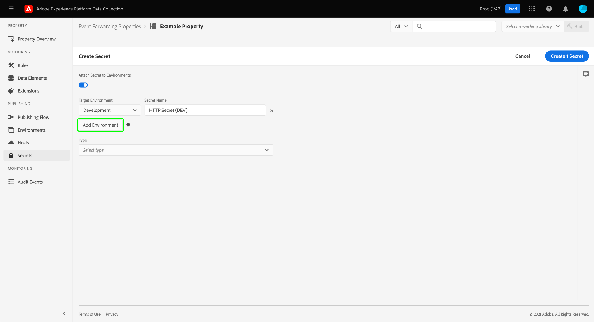
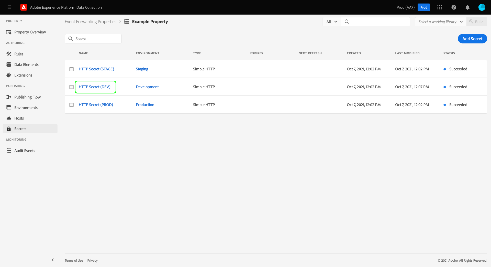

# Configuración de secretos en el reenvío de eventos

En el reenvío de eventos, un secreto es un recurso que representa una credencial de autenticación para otro sistema, lo que permite el intercambio seguro de datos. Los secretos solo se pueden crear dentro de las propiedades de reenvío de eventos.

Actualmente hay tres tipos de secreto compatibles:

| Tipo secreto | Descripción |
| --- | --- |
| [!UICONTROL Token] | Una cadena única de caracteres que representa un valor de token de autenticación conocido y entendido por ambos sistemas. |
| [!UICONTROL HTTP] | Contiene dos atributos de cadena para un nombre de usuario y una contraseña, respectivamente. |
| [!UICONTROL OAuth 2] | Contiene varios atributos para admitir la variable [tipo de concesión de credenciales de cliente](https://datatracker.ietf.org/doc/html/rfc6749#section-1.3.4) para el [OAuth 2.0](https://datatracker.ietf.org/doc/html/rfc6749) especificación de autenticación. El sistema le pide la información necesaria y, a continuación, se encarga de la renovación de estos tokens en un intervalo especificado. |
| [!UICONTROL Google OAuth 2] | Contiene varios atributos para admitir la variable [OAuth 2.0](https://datatracker.ietf.org/doc/html/rfc6749) especificación de autenticación para usar en la variable [API de Google Ads](https://developers.google.com/google-ads/api/docs/oauth/overview) y [Pub/Sub API](https://cloud.google.com/pubsub/docs/reference/service_apis_overview). El sistema le pide la información necesaria y, a continuación, se encarga de la renovación de estos tokens en un intervalo especificado. |

{style=&quot;table-layout:auto&quot;}

Esta guía proporciona información general de alto nivel sobre cómo configurar los secretos para el reenvío de eventos ([!UICONTROL Edge]) en la interfaz de usuario del Experience Platform o la interfaz de usuario de la recopilación de datos.

>[!NOTE]
>
>Para obtener instrucciones detalladas sobre cómo administrar los secretos en la API de Reactor, incluido el JSON de la estructura de un secreto, consulte [guía de API sobre secretos](../../api/guides/secrets.md).

## Requisitos previos

En esta guía se da por hecho que ya está familiarizado con la administración de recursos para etiquetas y reenvío de eventos en la interfaz de usuario, incluida la creación de un elemento de datos y una regla de reenvío de eventos. Consulte la guía de [administración de recursos](../managing-resources/overview.md) si necesita una introducción.

También debe comprender bien el flujo de publicación de las etiquetas y el reenvío de eventos, incluido cómo agregar recursos a una biblioteca e instalar una compilación en el sitio web para realizar pruebas. Consulte la [información general de publicación](../publishing/overview.md) para obtener más información.

## Crear un secreto {#create}

>[!CONTEXTUALHELP]
>id="platform_eventforwarding_secrets_environments"
>title="Entornos para secretos"
>abstract="Para que el reenvío de eventos pueda utilizar un secreto, este debe asignarse a un entorno existente. Si no se ha creado ningún entorno para la propiedad de reenvío de eventos, debe configurarlo antes de continuar."
>additional-url="https://experienceleague.adobe.com/docs/experience-platform/tags/publish/environments/environments.html" text="Resumen de los entornos"

Para crear un secreto, seleccione **[!UICONTROL Reenvío de eventos]** en la navegación de la izquierda, abra la propiedad de reenvío de eventos en la que desea agregar el secreto. A continuación, seleccione **[!UICONTROL Secretos]** en la navegación izquierda, seguido de **[!UICONTROL Crear nuevo secreto]**.

La siguiente pantalla permite configurar los detalles del secreto. Para que el reenvío de eventos pueda utilizar un secreto, este debe asignarse a un entorno existente. Si no tiene ningún entorno creado para la propiedad de reenvío de eventos, consulte la guía de [entornos](../publishing/environments.md) para obtener instrucciones sobre cómo configurarlas antes de continuar.

>[!NOTE]
>
>Si aún desea crear y guardar el secreto antes de agregarlo a un entorno, deshabilite la variable **[!UICONTROL Adjuntar secreto a entornos]** antes de rellenar el resto de la información. Tenga en cuenta que tendrá que asignarlo a un entorno más adelante si desea utilizar el secreto.
>
>

En **[!UICONTROL Entorno de destino]**, utilice el menú desplegable para seleccionar el entorno al que desea asignar el secreto. En **[!UICONTROL Nombre secreto]**, proporcione un nombre para el secreto en el contexto del entorno. Este nombre debe ser único en todos los secretos de la propiedad de reenvío de eventos.

Un secreto solo se puede asignar a un entorno a la vez, pero si lo desea, puede asignar las mismas credenciales a varios secretos en distintos entornos. Select **[!UICONTROL Agregar entorno]** para agregar otra fila a la lista.

Para cada entorno que agregue, debe proporcionar otro nombre único para el secreto asociado. Si agota todos los entornos disponibles, la variable **[!UICONTROL Agregar entorno]** no estará disponible.

Desde aquí, los pasos para crear el secreto difieren según el tipo de secreto que esté creando. Consulte las subsecciones siguientes para obtener más información:

* [[!UICONTROL Token]](#token)
* [[!UICONTROL HTTP]](#http)
* [[!UICONTROL OAuth 2]](#oauth2)
* [[!UICONTROL Google OAuth 2]](#google-oauth2)

### [!UICONTROL Token] {#token}

Para crear un secreto de token, seleccione **[!UICONTROL Token]** de la variable **[!UICONTROL Tipo]** lista desplegable. En el **[!UICONTROL Token]** que aparece, proporcione la cadena de credencial que reconoce el sistema al que se está autenticando. Select **[!UICONTROL Crear secreto]** para guardar el secreto.

### [!UICONTROL HTTP] {#http}

Para crear un secreto HTTP, seleccione **[!UICONTROL HTTP simple]** de la variable **[!UICONTROL Tipo]** lista desplegable. En los campos que aparecen a continuación, proporcione un nombre de usuario y una contraseña para la credencial antes de seleccionar **[!UICONTROL Crear secreto]** para guardar el secreto.

>[!NOTE]
>
>Una vez guardada, la credencial se codifica usando la variable [Esquema de autenticación HTTP &quot;básico&quot;](https://www.rfc-editor.org/rfc/rfc7617.html).

### [!UICONTROL OAuth 2] {#oauth2}

Para crear un secreto de OAuth 2, seleccione **[!UICONTROL OAuth 2]** de la variable **[!UICONTROL Tipo]** lista desplegable. En los campos que aparecen a continuación, proporcione la [[!UICONTROL ID de cliente] y [!UICONTROL Secreto del cliente]](https://www.oauth.com/oauth2-servers/client-registration/client-id-secret/), así como su [[!UICONTROL URL del token]](https://www.oauth.com/oauth2-servers/access-tokens/client-credentials/) para su integración de OAuth. La variable [!UICONTROL URL del token] en la interfaz de usuario es una concatenación entre el host del servidor de autorización y la ruta del token.

En **[!UICONTROL Opciones de Credencial]**, puede proporcionar otras opciones de credenciales como `scope` y `audience` en forma de pares clave-valor. Para agregar más pares de clave-valor, seleccione **[!UICONTROL Agregue otro]**.

Finalmente, puede configurar la variable **[!UICONTROL Actualizar desplazamiento]** para el secreto. Representa el número de segundos antes de la caducidad del token que el sistema realizará una actualización automática. El tiempo equivalente en horas y minutos se muestra a la derecha del campo y se actualiza automáticamente a medida que escribe.

Por ejemplo, si el desplazamiento de la actualización está establecido en el valor predeterminado de `14400` (cuatro horas) y el token de acceso tiene un `expires_in` valor de `86400` (24 horas), el sistema actualizará automáticamente el secreto en 20 horas.

>[!IMPORTANT]
>
>Un secreto de OAuth requiere al menos cuatro horas entre actualizaciones y también debe ser válido durante un mínimo de ocho horas. Esta restricción le proporciona un mínimo de cuatro horas para intervenir si surgen problemas con el token generado.
>
>Por ejemplo, si el desplazamiento se define en `28800` (ocho horas) y el token de acceso tiene un `expires_in` de `36000` (diez horas), el intercambio fallaría debido a que la diferencia resultante sería de menos de cuatro horas.

Cuando termine, seleccione **[!UICONTROL Crear secreto]** para guardar el secreto.

### [!UICONTROL Google OAuth 2] {#google-oauth2}

Para crear un secreto de Google OAuth 2, seleccione **[!UICONTROL Google OAuth 2]** de la variable **[!UICONTROL Tipo]** lista desplegable. En **[!UICONTROL Ámbitos]**, seleccione las API de Google a las que desee utilizar este secreto para conceder acceso. Actualmente se admiten los siguientes productos:

* [API de Google Ads](https://developers.google.com/google-ads/api/docs/oauth/overview)
* [Pub/Sub API](https://cloud.google.com/pubsub/docs/reference/service_apis_overview)

Cuando termine, seleccione **[!UICONTROL Crear secreto]**.

Aparece una ventana emergente que le informa de que el secreto debe autorizarse manualmente a través de Google. Select **[!UICONTROL Crear y autorizar]** para continuar.

Aparece un cuadro de diálogo que le permite introducir las credenciales de su cuenta de Google. Siga las indicaciones para conceder acceso al reenvío de eventos a sus datos en el ámbito seleccionado. Una vez completado el proceso de autorización, se crea el secreto.

>[!IMPORTANT]
>
>Si su organización tiene una directiva de reautenticación establecida para aplicaciones de Google Cloud, los secretos creados no se actualizarán correctamente después de que caduque la autenticación (entre 1 y 24 horas, dependiendo de la configuración de la directiva).
>
>Para resolver este problema, inicie sesión en la consola de administración de Google y vaya a la **[!DNL App access control]** para que pueda marcar la aplicación de reenvío de eventos (reenvío de eventos de Adobe Real-Time CDP) como [!DNL Trusted]. Consulte la documentación de Google en [definición de la duración de la sesión para Google Cloud services](https://support.google.com/a/answer/9368756) para obtener más información.

## Editar un secreto

Una vez creados los secretos para una propiedad, puede encontrarlos enumerados en el **[!UICONTROL Secretos]** espacio de trabajo. Para editar los detalles de un secreto existente, seleccione su nombre en la lista.

La siguiente pantalla le permite cambiar el nombre y las credenciales del secreto.

>[!NOTE]
>
>Si el secreto está asociado con un entorno existente, no se puede reasignar el secreto a otro entorno. Si desea utilizar las mismas credenciales en un entorno diferente, debe [crear un nuevo secreto](#create) en su lugar. La única manera de reasignar el entorno desde esta pantalla es si nunca asignó el secreto a un entorno de antemano o si eliminó el entorno al que se adjuntó el secreto.

### Reintentar un intercambio secreto

Puede reintentar o actualizar un intercambio secreto desde la pantalla de edición. Este proceso varía según el tipo de secreto que se esté editando:

| Tipo secreto | Reintentar protocolo |
| --- | --- |
| [!UICONTROL Token] | Select **[!UICONTROL Secreto de Exchange]** para volver a intentar el intercambio secreto. Este control solo está disponible cuando hay un entorno adjunto al secreto. |
| [!UICONTROL HTTP] | Si no hay ningún entorno adjunto al secreto, seleccione **[!UICONTROL Secreto de Exchange]** para cambiar la credencial a base64. Si hay un entorno adjunto, seleccione **[!UICONTROL Secreto de Exchange e Deploy]** para intercambiar a base64 e implementar el secreto. |
| [!UICONTROL OAuth 2] | Select **[!UICONTROL Generar token]** para intercambiar las credenciales y devolver un token de acceso del proveedor de autenticación. |

## Eliminar un secreto

Para eliminar un secreto existente en  **[!UICONTROL Secretos]** espacio de trabajo, seleccione la casilla de verificación situada junto al nombre antes de seleccionar **[!UICONTROL Eliminar]**.

## Uso de secretos en el reenvío de eventos

Para utilizar un secreto en el reenvío de eventos, primero debe crear una [elemento de datos](../managing-resources/data-elements.md) que hace referencia al propio secreto. Después de guardar el elemento de datos, puede incluirlo en el reenvío de eventos [reglas](../managing-resources/rules.md) y agregue esas reglas a un [biblioteca](../publishing/libraries.md), que a su vez se puede implementar en los servidores de Adobe como un [versión](../publishing/builds.md).

Al crear el elemento de datos, seleccione el **[!UICONTROL Principal]** extensión y, a continuación, seleccione **[!UICONTROL Secreto]** para el tipo de elemento de datos. El panel derecho se actualiza y proporciona controles desplegables para asignar hasta tres secretos al elemento de datos: uno para [!UICONTROL Desarrollo], [!UICONTROL Ensayo]y [!UICONTROL Producción] respectivamente.

>[!NOTE]
>
>Solo aparecen los secretos adjuntos a los entornos de desarrollo, ensayo y producción para sus respectivos menús desplegables.

Al asignar varios secretos a un solo elemento de datos e incluirlo en una regla, puede hacer que el valor del elemento de datos cambie dependiendo de dónde se encuentre la biblioteca contenedora en la variable [flujo de publicación](../publishing/publishing-flow.md).

>[!NOTE]
>
>Al crear el elemento de datos, se debe asignar un entorno de desarrollo. Los secretos para los entornos de ensayo y producción no son obligatorios, pero las compilaciones que intentan realizar la transición a esos entornos fallarán si sus elementos de datos de tipo secreto no tienen un secreto seleccionado para el entorno en cuestión.

## Pasos siguientes

En esta guía se explica cómo administrar secretos en la interfaz de usuario. Para obtener información sobre cómo interactuar con secretos mediante la API de Reactor, consulte la [guía de extremo secret](../../api/endpoints/secrets.md).
