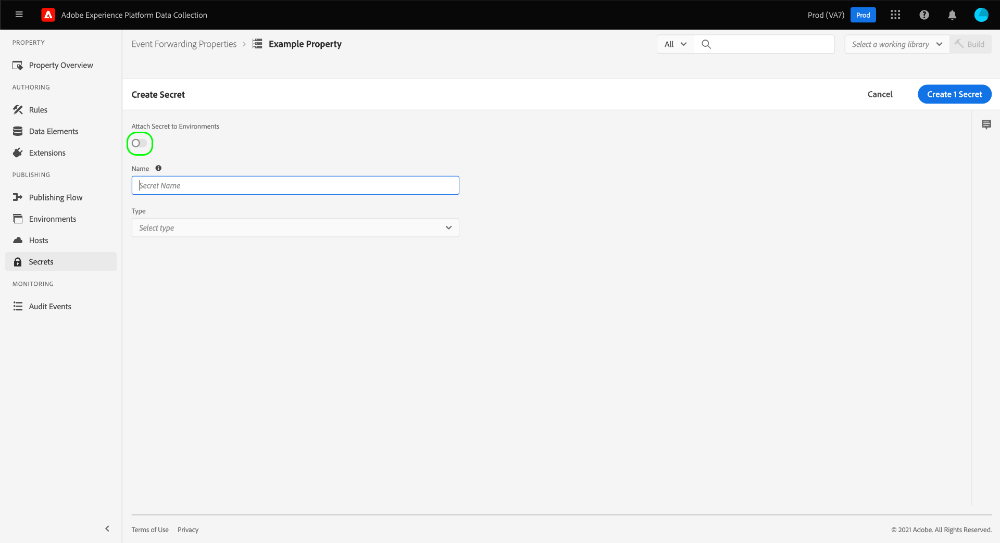
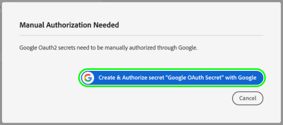
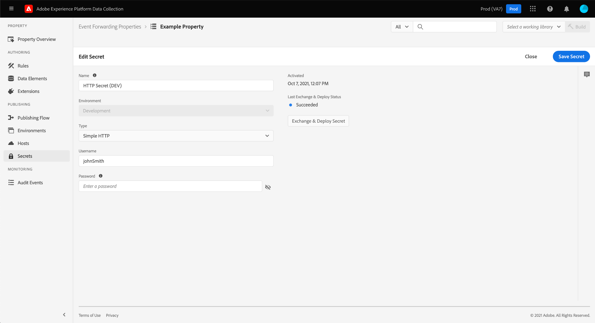

# Configurar secretos en el reenvío de eventos

En el reenvío de eventos, un secreto es un recurso que representa una credencial de autenticación para otro sistema, lo que permite el intercambio seguro de datos. Los secretos solo se pueden crear dentro de las propiedades del reenvío de eventos.

Actualmente se admiten los siguientes tipos de secretos:

| Tipo de secreto | Descripción |
| --- | --- |
| [!UICONTROL Google OAuth 2] | Contiene varios atributos para admitir el [OAuth 2.0](https://datatracker.ietf.org/doc/html/rfc6749) especificación de autenticación para su uso en [API de Google Ads](https://developers.google.com/google-ads/api/docs/oauth/overview) y [Pub/Sub API](https://cloud.google.com/pubsub/docs/reference/service_apis_overview). El sistema solicita la información necesaria y, a continuación, gestiona la renovación de estos tokens en un intervalo especificado. |
| [!UICONTROL HTTP] | Contiene dos atributos de cadena para un nombre de usuario y una contraseña, respectivamente. |
| [!UICONTROL [!DNL LinkedIn] OAuth 2] | El sistema solicita la información necesaria y, a continuación, gestiona la renovación de estos tokens en un intervalo especificado. |
| [!UICONTROL OAuth 2] | Contiene varios atributos para admitir el [tipo de concesión de credenciales de cliente](https://datatracker.ietf.org/doc/html/rfc6749#section-1.3.4) para el [OAuth 2.0](https://datatracker.ietf.org/doc/html/rfc6749) especificación de autenticación. El sistema solicita la información necesaria y, a continuación, gestiona la renovación de estos tokens en un intervalo especificado. |
| [!UICONTROL OAuth 2 JWT] | Contiene varios atributos para admitir el perfil de token web JSON (JWT) para [Autorización de OAuth 2.0](https://datatracker.ietf.org/doc/html/rfc7523#section-2.1) subvenciones. El sistema solicita la información necesaria y, a continuación, gestiona la renovación de estos tokens en un intervalo especificado. |
| [!UICONTROL Token] | Una única cadena de caracteres que representa un valor de token de autenticación conocido y entendido por ambos sistemas. |

{style="table-layout:auto"}

Esta guía proporciona información general de alto nivel sobre cómo configurar secretos para un reenvío de eventos ([!UICONTROL Edge]) en la IU del Experience Platform o en la IU de recopilación de datos.

>[!NOTE]
>
>Para obtener instrucciones detalladas sobre cómo administrar secretos en la API de Reactor, incluido el ejemplo JSON de la estructura de un secreto, consulte la [Guía de API de secretos](../../api/guides/secrets.md).

## Requisitos previos

En esta guía se da por hecho que ya está familiarizado con la administración de recursos para etiquetas y reenvío de eventos en la interfaz de usuario, incluido cómo crear un elemento de datos y una regla de reenvío de eventos. Consulte la guía de [administración de recursos](../managing-resources/overview.md) si necesita una introducción.

También debe tener una comprensión práctica del flujo de publicación para etiquetas y reenvío de eventos, incluido cómo añadir recursos a una biblioteca e instalar una compilación en el sitio web para probarlos. Consulte la [resumen de publicación](../publishing/overview.md) para obtener más información.

## Crear un secreto {#create}

>[!CONTEXTUALHELP]
>id="platform_eventforwarding_secrets_environments"
>title="Entornos para secretos"
>abstract="Para que el reenvío de eventos pueda utilizar un secreto, este debe asignarse a un entorno existente. Si no se ha creado ningún entorno para la propiedad de reenvío de eventos, debe configurarlo antes de continuar."
>additional-url="https://experienceleague.adobe.com/docs/experience-platform/tags/publish/environments/environments.html?lang=es" text="Resumen de los entornos"

Para crear un secreto, seleccione **[!UICONTROL Reenvío de eventos]** en el panel de navegación izquierdo, abra la propiedad de reenvío de eventos en la que desee agregar el secreto. A continuación, seleccione **[!UICONTROL Secretos]** en el panel de navegación izquierdo, seguido de **[!UICONTROL Crear nuevo secreto]**.

La siguiente pantalla le permite configurar los detalles del secreto. Para que el reenvío de eventos pueda utilizar un secreto, este debe asignarse a un entorno existente. Si no ha creado ningún entorno para la propiedad de reenvío de eventos, consulte la guía de [entornos](../publishing/environments.md) para obtener instrucciones sobre cómo configurarlos antes de continuar.

>[!NOTE]
>
>Si aún desea crear y guardar el secreto antes de agregarlo a un entorno, deshabilite la variable **[!UICONTROL Adjuntar secreto a los entornos]** alternar antes de rellenar el resto de la información. Tenga en cuenta que tendrá que asignarlo a un entorno más adelante si desea utilizar el secreto.
>
>

En **[!UICONTROL Entorno de destino]**, utilice el menú desplegable para seleccionar el entorno al que desea asignar el secreto. En **[!UICONTROL Nombre secreto]**, proporcione un nombre para el secreto en el contexto del entorno. Este nombre debe ser único en todos los secretos de la propiedad de reenvío de eventos.

Un secreto solo se puede asignar a un entorno a la vez, pero puede asignar las mismas credenciales a varios secretos en entornos diferentes si lo desea. Seleccionar **[!UICONTROL Agregar entorno]** para agregar otra fila a la lista.

Para cada entorno que agregue, debe proporcionar otro nombre único para el secreto asociado. Si se agotan todos los entornos disponibles, la variable **[!UICONTROL Agregar entorno]** El botón no estará disponible.

A partir de aquí, los pasos para crear el secreto difieren según el tipo de secreto que esté creando. Consulte las subsecciones siguientes para obtener más información:

* [[!UICONTROL Token]](#token)
* [[!UICONTROL HTTP]](#http)
* [[!UICONTROL OAuth 2]](#oauth2)
* [[!UICONTROL OAuth 2 JWT]](#oauth2jwt)
* [[!UICONTROL Google OAuth 2]](#google-oauth2)
* [[!UICONTROL [!DNL LinkedIn] OAuth 2]](#linkedin-oauth2)

### [!UICONTROL Token] {#token}

Para crear un secreto de token, seleccione **[!UICONTROL Token]** desde el **[!UICONTROL Tipo]** desplegable. En el **[!UICONTROL Token]** que aparece, proporcione la cadena de credencial reconocida por el sistema en el que se está autenticando. Seleccionar **[!UICONTROL Crear secreto]** para guardar el secreto.

### [!UICONTROL HTTP] {#http}

Para crear un secreto HTTP, seleccione **[!UICONTROL HTTP simple]** desde el **[!UICONTROL Tipo]** desplegable. En los campos que aparecen a continuación, proporcione un nombre de usuario y una contraseña para la credencial antes de seleccionar **[!UICONTROL Crear secreto]** para guardar el secreto.

>[!NOTE]
>
>Una vez guardada, la credencial se codifica con la variable [Esquema de autenticación HTTP &quot;básico&quot;](https://www.rfc-editor.org/rfc/rfc7617.html).

### [!UICONTROL OAuth 2] {#oauth2}

Para crear un secreto de OAuth 2, seleccione **[!UICONTROL OAuth 2]** desde el **[!UICONTROL Tipo]** desplegable. En los campos que aparecen a continuación, indique su [[!UICONTROL ID de cliente] y [!UICONTROL Secreto del cliente]](https://www.oauth.com/oauth2-servers/client-registration/client-id-secret/), así como su [[!UICONTROL URL de token]](https://www.oauth.com/oauth2-servers/access-tokens/client-credentials/) para su integración con OAuth. El [!UICONTROL URL de token] El campo de la interfaz de usuario es una concatenación entre el host del servidor de autorización y la ruta del token.

En **[!UICONTROL Opciones de credenciales]**, puede proporcionar otras opciones de credenciales como `scope` y `audience` en forma de pares clave-valor. Para añadir más pares clave-valor, seleccione **[!UICONTROL Añadir otro]**.

Por último, puede configurar la variable **[!UICONTROL Actualizar desplazamiento]** valor del secreto. Representa el número de segundos antes de la caducidad del token que el sistema realizará una actualización automática. El tiempo equivalente en horas y minutos se muestra a la derecha del campo y se actualiza automáticamente a medida que escribe.

Por ejemplo, si el desplazamiento de actualización está establecido en el valor predeterminado de `14400` (cuatro horas) y el token de acceso tiene un `expires_in` valor de `86400` (24 horas), el sistema actualizará automáticamente el secreto en 20 horas.

>[!IMPORTANT]
>
>Un secreto de OAuth requiere al menos cuatro horas entre actualizaciones y también debe ser válido durante un mínimo de ocho horas. Esta restricción le proporciona un mínimo de cuatro horas para intervenir si surgen problemas con el token generado.
>
>Por ejemplo, si el desplazamiento se establece en `28800` (ocho horas) y el token de acceso tiene un `expires_in` de `36000` (diez horas), el intercambio fallaría debido a que la diferencia resultante es de menos de cuatro horas.

Cuando termine, seleccione **[!UICONTROL Crear secreto]** para guardar el secreto.

### [!UICONTROL OAuth 2 JWT] {#oauth2jwt}

Para crear un secreto JWT de OAuth 2, seleccione **[!UICONTROL OAuth 2 JWT]** desde el **[!UICONTROL Tipo]** desplegable.

![El [!UICONTROL Crear secreto] pestaña con el secreto JWT de OAuth 2 resaltado en la [!UICONTROL Tipo] desplegable.](../../images/ui/event-forwarding/secrets/oauth-jwt-secret.png)

>[!NOTE]
>
>El único [!UICONTROL Algoritmo] que actualmente es compatible con la firma del JWT es RS256.

En los campos que aparecen a continuación, indique su [!UICONTROL Emisor], [!UICONTROL Asunto], [!UICONTROL Audiencia], [!UICONTROL Reclamaciones personalizadas], [!UICONTROL TTL], luego seleccione la [!UICONTROL Algoritmo] en el menú desplegable. A continuación, introduzca la variable [!UICONTROL ID de clave privada], así como su [[!UICONTROL URL de token]](https://www.oauth.com/oauth2-servers/access-tokens/client-credentials/) para su integración con OAuth. El [!UICONTROL URL de token] Este campo no es obligatorio. Si se proporciona un valor, el JWT se intercambia con un token de acceso. El secreto se actualizará según el `expires_in` de la respuesta y el atributo [!UICONTROL Actualizar desplazamiento] valor. Si no se proporciona un valor, el secreto insertado en el perímetro es el JWT. El JWT se actualizará según el [!UICONTROL TTL] y [!UICONTROL Actualizar desplazamiento] valores.

![El [!UICONTROL Crear secreto] pestaña con una selección de campos de entrada resaltados.](../../images/ui/event-forwarding/secrets/oauth-jwt-information.png)

En **[!UICONTROL Opciones de credenciales]**, puede proporcionar otras opciones de credenciales como `jwt_param` en forma de pares clave-valor. Para añadir más pares clave-valor, seleccione **[!UICONTROL Añadir otro]**.

![El [!UICONTROL Crear secreto] pestaña que resalta el [!UICONTROL Opciones de credenciales] campos.](../../images/ui/event-forwarding/secrets/oauth-jwt-credential-options.png)

Por último, puede configurar la variable **[!UICONTROL Actualizar desplazamiento]** valor del secreto. Representa el número de segundos antes de la caducidad del token que el sistema realizará una actualización automática. El tiempo equivalente en horas y minutos se muestra a la derecha del campo y se actualiza automáticamente a medida que escribe.

![El [!UICONTROL Crear secreto] pestaña que resalta el [!UICONTROL Actualizar desplazamiento] field.](../../images/ui/event-forwarding/secrets/oauth-jwt-refresh-offset.png)

Por ejemplo, si el desplazamiento de actualización está establecido en el valor predeterminado de `1800` (30 minutos) y el token de acceso tiene un `expires_in` valor de `3600` (una hora), el sistema actualizará automáticamente el secreto en una hora.

>[!IMPORTANT]
>
>Un secreto JWT de OAuth 2 requiere al menos 30 minutos entre actualizaciones y también debe ser válido durante un mínimo de una hora. Esta restricción le proporciona un mínimo de 30 minutos para intervenir si surgen problemas con el token generado.
>
>Por ejemplo, si el desplazamiento se establece en `1800` (30 minutos) y el token de acceso tiene un `expires_in` de `2700` (45 minutos), el intercambio fallaría debido a que la diferencia resultante es inferior a 30 minutos.

Cuando termine, seleccione **[!UICONTROL Crear secreto]** para guardar el secreto.

![El [!UICONTROL Crear secreto] resaltado de tabulaciones [!UICONTROL Crear secreto]](../../images/ui/event-forwarding/secrets/oauth-jwt-create-secret.png)

### [!UICONTROL Google OAuth 2] {#google-oauth2}

Para crear un secreto de Google OAuth 2, seleccione **[!UICONTROL Google OAuth 2]** desde el **[!UICONTROL Tipo]** desplegable. En **[!UICONTROL Ámbitos]**, seleccione las API de Google a las que desee utilizar este secreto para conceder acceso. Actualmente se admiten los siguientes productos:

* [API de Google Ads](https://developers.google.com/google-ads/api/docs/oauth/overview)
* [Pub/Sub API](https://cloud.google.com/pubsub/docs/reference/service_apis_overview)

Cuando termine, seleccione **[!UICONTROL Crear secreto]**.

Aparece una ventana emergente que le informa de que el secreto debe autorizarse manualmente a través de Google. Seleccionar **[!UICONTROL Crear y autorizar]** para continuar.

Aparece un cuadro de diálogo que le permite introducir las credenciales de su cuenta de Google. Siga las indicaciones para conceder acceso de reenvío de eventos a los datos en el ámbito seleccionado. Una vez completado el proceso de autorización, se crea el secreto.

>[!IMPORTANT]
>
>Si su organización tiene una directiva de reautenticación establecida para aplicaciones de Google Cloud, los secretos creados no se actualizarán correctamente después de que caduque la autenticación (entre 1 y 24 horas, según la configuración de la directiva).
>
>Para resolver este problema, inicie sesión en la Admin Console de Google y vaya a **[!DNL App access control]** para que pueda marcar la aplicación de reenvío de eventos (reenvío de eventos de Adobe Real-Time CDP) como [!DNL Trusted]. Consulte la documentación de Google sobre [configuración de las longitudes de sesión para los servicios de Google Cloud](https://support.google.com/a/answer/9368756) para obtener más información.

### [!UICONTROL [!DNL LinkedIn] OAuth 2] {#linkedin-oauth2}

Para crear un [!DNL LinkedIn] Secreto de OAuth 2, seleccione **[!UICONTROL [!DNL LinkedIn]OAuth 2]** desde el **[!UICONTROL Tipo]** desplegable. A continuación, seleccione **[!UICONTROL Crear secreto]**.

![El [!UICONTROL Crear secreto] pestaña con el [!UICONTROL Tipo] campo resaltado.](../../images/ui/event-forwarding/secrets/linkedin-oauth.png)

Aparece una ventana emergente que le informa de que el secreto debe autorizarse manualmente mediante [!DNL LinkedIn]. Seleccionar **[!UICONTROL Crear y autorizar secretos con[!DNL LinkedIn]]** para continuar.

![[!DNL LinkedIn] resaltado de ventana emergente de autorización [!UICONTROL Crear y autorizar secretos con [!DNL LinkedIn]].](../../images/ui/event-forwarding/secrets/linkedin-authorization.png)

Aparecerá un cuadro de diálogo solicitándole que introduzca su [!DNL LinkedIn] credenciales. Siga las indicaciones para conceder acceso al reenvío de eventos a sus datos.

Una vez completado el proceso de autorización, vuelva a la página de **[!UICONTROL Secretos]** pestaña, donde puede ver el secreto recién creado. Aquí puede ver el estado del secreto y la fecha de caducidad.

![El [!UICONTROL Secreto] que resalta el secreto recién creado.](../../images/ui/event-forwarding/secrets/linkedin-new-secret.png)

#### Volver a autorizar un [!UICONTROL [!DNL LinkedIn] OAuth 2] secreto

>IMPORTANTE
>
>Debe volver a autorizar el uso de su [!DNL LinkedIn] credenciales cada 365 días. Si no vuelve a autorizar a su debido tiempo, su secreto no se actualizará y el [!DNL LinkedIn] las solicitudes de conversión fallarán.

Tres meses antes del secreto que requiere reautorización, una ventana emergente comenzará a mostrarse cuando navegue por cualquier página de la propiedad. Seleccionar **[!UICONTROL Haga clic aquí para ir a sus secretos]**.

![El [!UICONTROL Información general de propiedad] pestaña que resalta la ventana emergente de reautorización secreta.](../../images/ui/event-forwarding/secrets/linkedin-reauthorization-popup.png)

Se le redirigirá a [!UICONTROL Secretos] pestaña. Los secretos enumerados en esta página se filtran para mostrar solo los secretos que deben volver a autorizarse. Seleccionar **[!UICONTROL Se necesita autenticación]** para el secreto necesita volver a autorizar.

![El [!UICONTROL Secreto] resaltado de tabulaciones [!UICONTROL Se necesita autenticación]para el [!DNL LinkedIn] secreto.](../../images/ui/event-forwarding/secrets/linkedin-reauthorization.png)

Aparecerá un cuadro de diálogo que le pedirá que introduzca su [!DNL LinkedIn] credenciales. Siga las indicaciones para volver a autorizar su secreto.

## Editar un secreto

Después de crear secretos para una propiedad, puede encontrarlos en la lista de **[!UICONTROL Secretos]** workspace. Para editar los detalles de un secreto existente, seleccione su nombre en la lista.

La siguiente pantalla le permite cambiar el nombre y las credenciales del secreto.

>[!NOTE]
>
>Si el secreto está asociado a un entorno existente, no puede reasignar el secreto a otro entorno. Si desea utilizar las mismas credenciales en un entorno diferente, debe [crear un nuevo secreto](#create) en su lugar. La única manera de reasignar el entorno desde esta pantalla es si nunca antes asignó el secreto a un entorno o si eliminó el entorno al que estaba adjunto el secreto.

### Reintentar un intercambio secreto

Puede volver a intentar o actualizar un intercambio secreto desde la pantalla de edición. Este proceso varía según el tipo de secreto que se esté editando:

| Tipo de secreto | Reintentar protocolo |
| --- | --- |
| [!UICONTROL Token] | Seleccionar **[!UICONTROL Secreto de Exchange]** para volver a intentar el intercambio secreto. Este control solo está disponible cuando hay un entorno adjunto al secreto. |
| [!UICONTROL HTTP] | Si no hay ningún entorno adjunto al secreto, seleccione **[!UICONTROL Secreto de Exchange]** para cambiar la credencial a base64. Si hay un entorno adjunto, seleccione Seleccionar **[!UICONTROL Secreto de Exchange e implementación]** para intercambiar a base64 e implementar el secreto. |
| [!UICONTROL OAuth 2] | Seleccionar **[!UICONTROL Generar token]** para intercambiar las credenciales y devolver un token de acceso del proveedor de autenticación. |

## Eliminar un secreto

Para eliminar un secreto existente en  **[!UICONTROL Secretos]** espacio de trabajo, seleccione la casilla de verificación situada junto a su nombre antes de seleccionar **[!UICONTROL Eliminar]**.

## Uso de secretos en el reenvío de eventos

Para utilizar un secreto en el reenvío de eventos, primero debe crear un [elemento de datos](../managing-resources/data-elements.md) que hace referencia al secreto mismo. Después de guardar el elemento de datos, puede incluirlo en el reenvío de eventos [reglas](../managing-resources/rules.md) y agregue esas reglas a [biblioteca](../publishing/libraries.md), que a su vez se puede implementar en los servidores de Adobe como [generar](../publishing/builds.md).

Al crear el elemento de datos, seleccione la opción **[!UICONTROL Núcleo]** extensión y seleccione **[!UICONTROL Secreto]** para el tipo de elemento de datos. El panel derecho se actualiza y proporciona controles desplegables para asignar hasta tres secretos al elemento de datos: uno para [!UICONTROL Desarrollo], [!UICONTROL Ensayo], y [!UICONTROL Producción] respectivamente.

>[!NOTE]
>
>Solo aparecen secretos adjuntos a los entornos de desarrollo, ensayo y producción para sus respectivos desplegables.

Al asignar varios secretos a un único elemento de datos e incluirlo en una regla, puede hacer que el valor del elemento de datos cambie según dónde se encuentre la biblioteca contenedora en la [flujo de publicación](../publishing/publishing-flow.md).

>[!NOTE]
>
>Al crear el elemento de datos, se debe asignar un entorno de desarrollo. Los secretos para los entornos de ensayo y producción no son necesarios, pero las compilaciones que intentan realizar la transición a esos entornos fallarán si los elementos de datos de tipo secreto no tienen un secreto seleccionado para el entorno en cuestión.

## Pasos siguientes

En esta guía se explica cómo administrar secretos en la interfaz de usuario. Para obtener información sobre cómo interactuar con secretos mediante la API de Reactor, consulte la [guía de extremo de secretos](../../api/endpoints/secrets.md).
