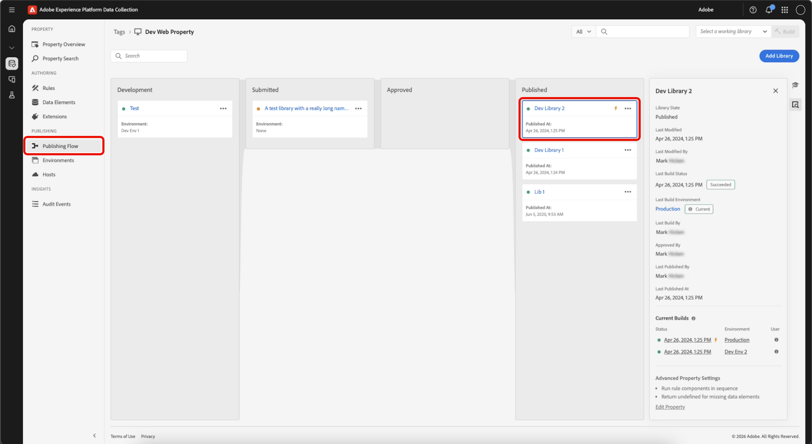

# Versiones

Una compilación es el conjunto de archivos que contiene todo el código que se ejecuta en el dispositivo cliente.

Es una combinación de los cambios que ha especificado en su biblioteca, así como todo lo que se ha enviado, aprobado o publicado antes.

La compilación consiste en archivos de código del lado del cliente que se hacen referencia entre sí. Estos archivos se envían a su ubicación de alojamiento con el entorno y el host que ha elegido para la biblioteca. El código que implementa en el sitio señala a esta misma ubicación para que los archivos se puedan cargar cuando un usuario acceda al sitio o a la aplicación.

## Contenido de archivo {#file-contents}

Una biblioteca define un conjunto discreto de recursos de etiquetas (extensiones, reglas y elementos de datos) que se deben incluir en ella.

Una compilación contiene todo el código del módulo (proporcionado por los desarrolladores de la extensión) y la configuración (introducida por usted) necesarios para poder activar los recursos contenidos en la biblioteca. Por ejemplo, si una extensión proporciona acciones que no se utilizan en las reglas, el código para realizar esas acciones no se incluye dentro de la compilación.

Las compilaciones se dividen en el archivo de biblioteca principal y en muchos archivos más pequeños. En el código incrustado se hace referencia al archivo de biblioteca principal, que se carga en la página en el tiempo de ejecución. Contiene:

* El motor de reglas
* Toda la configuración de extensiones
* Todo el código y la configuración de los elementos de datos
* Todo el código y la configuración de los eventos de reglas
* Todo el código y la configuración de las condiciones
* El código y la configuración de los eventos para cualquier regla que tenga como evento Library Loaded o Page Bottom (ya que sabemos que se necesitan inmediatamente).

Los archivos más pequeños contienen código y configuración para acciones individuales que se cargan en la página según sea necesario. Cuando se activa una regla y se evalúan sus condiciones de forma que sea necesario ejecutar las acciones, se recuperan el código y la configuración necesarios para esa acción específica de uno de los archivos más pequeños. Esto significa que solo se carga el código necesario para realizar las acciones necesarias en la página, lo que hace que la biblioteca principal sea lo más pequeña posible.

## Formato del archivo {#file-format}

El formato de archivo predeterminado para las compilaciones es un paquete de archivos que contienen todo el código necesario para que las extensiones, los elementos de datos y las reglas se ejecuten de la manera que desee.

Sin embargo, en determinados casos puede preferir un archivo .zip que incluya los archivos en lugar del archivo ejecutable con código del lado del cliente. Por ejemplo, puede crear un archivo si usted mismo aloja su propia compilación y desea utilizar la compilación en otra implementación. Si proporciona cualquier cosa en la ruta autoalojada al campo de biblioteca, puede guardar su entorno. Junto con su nuevo código, se crea un enlace a la descarga archivada. Una vez creada la biblioteca, tiene la opción de implementar un archivo zip en Akamai y descargarlo desde `assets.adobedtm.com/...`.

>[!NOTE]
>
>No existe nada en esa ubicación hasta que realice una compilación.

Independientemente del formato de archivo, la compilación siempre se envía a la ubicación especificada por el host.

Para completar una versión, seleccione una biblioteca y haga clic en la opción Versión que está disponible en ese nivel del proceso de publicación (Build for Development, Build for Staging, etc.).

## Minificación {#minification}

La minificación reduce el consumo de ancho de banda y mejora la velocidad al eliminar los datos que son innecesarios para la ejecución desde un archivo.

Para aumentar el rendimiento, Experience Platform minifica todo, incluso:

* La biblioteca principal de etiquetas
* El código de módulo proporcionado por los desarrolladores de extensiones como parte de una extensión
* El código personalizado proporcionado por los usuarios de Experience Platform

>[!NOTE]
>
>Si el código de módulo y el código personalizado ya se han minificado, Experience Platform vuelve a minificarlos. Esta segunda minificación no ofrece beneficios adicionales, pero no causa ningún daño y hace que Experience Platform sea menos complejo y fácil de mantener.

Cualquier código del lado del cliente proporcionado señala a la versión minificada del código. Esto se ve en los nombres de archivo que siguen la convención de nomenclatura estándar para los archivos minificados:

`launch-%environment_id%.min.js`

Si desea ver el código no minificado, quite .min del nombre del archivo:

`launch-%environment_id%.js`

Si un desarrollador de extensiones proporciona código minificado con su extensión, Experience Platform no proporciona código no minificado en la compilación no minificada. Del mismo modo, si un usuario de Experience Platform coloca el código minificado en un cuadro de código personalizado, ese código también se minifica en compilaciones no minificadas. Experience Platform no desminifica nada.

Para obtener más información acerca de la minificación, consulte [este artículo de Stackpath](https://blog.stackpath.com/glossary/minification/).

Al realizar una compilación, se construye primero la biblioteca no minificada y, a continuación, se minifica toda la biblioteca de una vez.

## Ver detalles de compilación {#build-details}

>[!IMPORTANT]
>
>Una biblioteca almacena las revisiones de los recursos de etiquetas, pero una **compilación** es una instantánea puntual de esa biblioteca que contiene los archivos que se entregan al sitio.

Se puede acceder a las compilaciones y a los detalles de la compilación desde una **biblioteca** o un **entorno** para ver las compilaciones activas actuales e inspeccionar lo que contiene una compilación (extensiones, elementos de datos y reglas).

### Ver detalles de compilación de una biblioteca

En su propiedad de etiquetas, abra **[!UICONTROL Publishing Flow]** y seleccione una biblioteca.

En el panel de detalles, puede revisar lo siguiente:

* **[!UICONTROL Last Build Environment]** — Vínculo al entorno que recibió la última compilación. Indica si esta biblioteca es la compilación actual para ese entorno (**Actual** o **No actual**).
* **[!UICONTROL Current Builds]**: compilaciones que se encuentran activas en sus entornos. Para las bibliotecas publicadas, la compilación de producción en directo se indica con el icono de rayo en esta sección.
* Para cada compilación enumerada, puede ver lo siguiente:
   * **[!UICONTROL Status]** - Cuando se creó la compilación.
   * **[!UICONTROL Environment]**: el entorno donde se implementó la compilación.
   * **[!UICONTROL User]** - Usuario que creó la compilación.

### Ver compilaciones desde un entorno

Una compilación está asociada a un entorno y a la biblioteca que se creó para ese entorno. La compilación es lo que realmente contiene los recursos compilados.

Seleccione **[!UICONTROL Environment]** en el panel de detalles. El panel Detalles del entorno muestra una lista de las compilaciones recientes, la versión activa actual y las bibliotecas relacionadas.

A continuación, seleccione una compilación para abrir sus detalles. Los detalles de la compilación muestran las **Extensiones**, **Elementos de datos** y **Reglas** incluidos en esa compilación.

>[!NOTE]
>
>Una compilación puede incluir más recursos que los enumerados solo en la biblioteca. Las **extensiones**, **elementos de datos** y **reglas** empaquetadas en la compilación incluyen el contenido de la biblioteca, así como el contenido del flujo ascendente. Es la instantánea completa que se publica en el sitio o la aplicación.

Utilice el panel de detalles para volver a **[!UICONTROL Environment]** o **[!UICONTROL Library]**.
