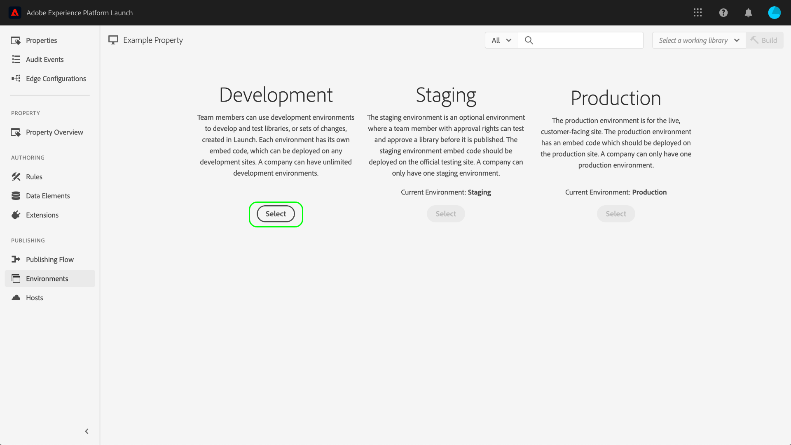

# Entornos

>[!NOTE]
>
>Adobe Experience Platform Launch se ha convertido en un conjunto de tecnologías de recopilación de datos en Adobe Experience Platform. Como resultado, se han implementado varios cambios terminológicos en la documentación del producto. Consulte el siguiente [documento](../../term-updates.md) para obtener una referencia consolidada de los cambios terminológicos.

Los entornos de etiquetas definen varios aspectos clave de las compilaciones de biblioteca que usted implementa en su sitio web o aplicación:

* El nombre del archivo de la compilación.
* Dominio y ruta de la compilación, según el host asignado del entorno.
* El formato de archivo de la compilación, según la opción de archivo elegida.

Al crear una compilación de biblioteca, debe asignarla a un entorno. Las extensiones, reglas y elementos de datos de la compilación se compilan y colocan en el entorno asignado. Cada entorno proporciona un código incrustado único que le permite integrar su compilación asignada en el sitio.

En cada entorno pueden existir diferentes artefactos. Esto le permite probar diferentes bibliotecas en entornos diferentes a medida que los va insertando en el flujo de trabajo.

Este documento proporciona pasos sobre cómo instalar, configurar y crear diferentes entornos en la interfaz de usuario de Recopilación de datos.

## Tipos de entorno

Las etiquetas admiten tres tipos de entornos diferentes, cada uno correspondiente a un estado diferente en el [flujo de trabajo de publicación](./publishing-flow.md):

| Tipo de entorno | Descripción |
| --- | --- |
| Desarrollo | Este entorno se corresponde con la columna **Desarrollo** del flujo de trabajo de publicación. |
| Ensayo | Este entorno se corresponde con las columnas **Enviado** y **Aprobado** en el flujo de trabajo de publicación. |
| Producción | Este entorno corresponde a la columna **Publicado** en el flujo de trabajo de publicación. |

En cada entorno pueden existir diferentes artefactos. Esto le permite probar diferentes bibliotecas en entornos diferentes a medida que los va insertando en el flujo de trabajo de publicación.

>[!NOTE]
>
>A cada entorno solo se le puede asignar una compilación de biblioteca a la vez. Sin embargo, se espera que un solo entorno contenga muchas compilaciones diferentes con el tiempo a medida que las mueva por el flujo de trabajo de publicación, reasignando las compilaciones entre entornos según sea necesario.

## Instalación {#installation}

Cada entorno tiene un conjunto de instrucciones para conectarlo a su aplicación. En las propiedades web, estas instrucciones proporcionan códigos incrustados. En las propiedades móviles, estas instrucciones proporcionan el código necesario para crear una instancia de las bibliotecas que utiliza y recuperar la configuración en el tiempo de ejecución.

>[!IMPORTANT]
>
>Cada tipo de entorno tiene sus propias instrucciones de instalación correspondientes. Según el entorno que utilice, debe asegurarse de que está utilizando los códigos incrustados o las dependencias correspondientes.
>
>Por ejemplo, el código incrustado de producción de una propiedad web admite el almacenamiento en caché del explorador, mientras que los códigos incrustados de desarrollo y ensayo no lo hacen. Como tal, no debe utilizar los códigos incrustados de desarrollo o ensayo en contextos de alto tráfico o producción.

Para acceder a las instrucciones de instalación de un entorno, vaya a la pestaña **[!UICONTROL Entornos]** de la propiedad y, a continuación, seleccione el icono **[!UICONTROL Instalar]** de ese entorno.

Si utiliza una propiedad web, se le proporcionará un código incrustado para utilizarlo en la etiqueta `<head>` de su documento. También se le ofrece la opción de implementar archivos de biblioteca sincrónica o asincrónicamente durante la ejecución. Según la configuración que elija, las instrucciones de instalación mostradas serán diferentes. Los códigos incrustados se explican con detalle más adelante en este documento.

Si utiliza una propiedad móvil, recibirá instrucciones independientes para la instalación de dependencias para Android (mediante [Gradle](https://gradle.org/)) e iOS (mediante [CocoaPods](https://cocoapods.org/)).

## Configuración móvil

En el caso de las propiedades móviles, puede ver las opciones de configuración de un entorno seleccionándolas en la lista. Aquí, puede cambiar el nombre del entorno. Actualmente, los entornos móviles solo pueden utilizar hosts administrados por Adobe.

Consulte la descripción general de [los hosts](./hosts/hosts-overview.md) para obtener más información.

## Configuración web

La configuración del entorno asignado determina lo siguiente para las propiedades web:

* **Host**: Ubicación del servidor en el que desea que se implemente la compilación.
* **Configuración de archivo**: Si el sistema debe generar un conjunto de archivos implementables o comprimirlos en un formato de archivo.
* **Código incrustado**: El código `<script>` que se va a incrustar en el HTML de las páginas del sitio web y que se utiliza para implementar la compilación de biblioteca en el tiempo de ejecución.

En la pestaña [!UICONTROL Entornos], seleccione un entorno de la lista para mostrar sus controles de configuración.

### Host {#host}

Seleccione **[!UICONTROL Host]** para elegir un host preconfigurado para el entorno desde el menú desplegable.

Cuando se crea una compilación, esta se envía a la ubicación especificada para el host asignado. Para obtener información sobre cómo crear y configurar hosts de etiquetas, consulte la [descripción general de hosts](./hosts/hosts-overview.md).

### Configuración de archivo {#archive}

La mayoría de las compilaciones consta de varios archivos. Las compilaciones de varios archivos contienen un archivo de biblioteca principal (enlazado en el código incrustado) que contiene referencias internas a los demás archivos que se recuperan según se necesiten.

El botón **[!UICONTROL Crear archivo]** permite alternar la configuración del archivo del entorno. De forma predeterminada, la opción de archivo está desactivada y la compilación se entrega en un formato que se ejecuta tal cual (JavaScript para propiedades web y JSON para propiedades móviles).

Si decide activar la configuración del archivo, en la IU aparecerán opciones de configuración adicionales que le permitirán cifrar el archivo y definir una ruta de acceso a la biblioteca si utiliza alojamiento propio.

La ruta puede ser una dirección URL completa o una ruta relativa que se puede utilizar en varios dominios. Esto es importante, ya que la mayoría de las compilaciones incluyen varios archivos que contienen referencias internas entre sí.

Si utiliza la opción de archivado, todos los archivos de compilación se envían como archivo ZIP. Esto puede resultar útil si:

1. Aloja la biblioteca en alojamiento propio, pero no desea configurar un host SFTP para su envío.
1. Debe ejecutar el análisis del código en la compilación antes de la implementación.
1. Solo desea ver el contenido de la compilación para ver qué incluye.

### Código incrustado {#embed-code}

Un código incrustado es una etiqueta `<script>` que debe colocarse en las secciones `<head>` de las páginas del sitio web para cargar y ejecutar el código que genere. Cada configuración de entorno genera automáticamente su propio código incrustado, por lo que solo necesita copiarlo y pegarlo en el sitio en las páginas en las que desee ejecutar las etiquetas.

Cuando vea las instrucciones de instalación, puede elegir que la secuencia de comandos cargue los archivos de biblioteca de forma sincrónica o asincrónica. Esta configuración no es persistente y no refleja la implementación real de las etiquetas en el sitio. En cambio, solo se trata de mostrar la forma adecuada de instalar el entorno.

>[!WARNING]
>
>Según el contenido de la biblioteca de etiquetas, el comportamiento de las reglas y otros elementos puede cambiar entre la implementación síncrona y asíncrona. Por lo tanto, es importante probar a fondo cualquier cambio que realice.

#### Implementación asíncrona

La implementación asincrónica permite al explorador continuar cargando el resto de la página mientras se recupera la biblioteca. Solo hay un código incrustado cuando se utiliza esta configuración, que debe colocarse en el documento `<head>`.

Para obtener más información sobre esta configuración, consulte la guía de [implementación asincrónica](../client-side/asynchronous-deployment.md).

#### Implementación sincrónica

Cuando el explorador lee un código incrustado mediante una implementación sincrónica, recupera la biblioteca de etiquetas y la ejecuta antes de continuar cargando la página.

Los códigos incrustados sincrónicos constan de dos etiquetas `<script>` que deben colocarse dentro del HTML del sitio web. Una etiqueta `<script>` debe colocarse en el documento `<head>`, mientras que la otra debe colocarse justo antes de la etiqueta `</body>` de cierre.

#### Incrustar actualizaciones de código

Dado que los códigos incrustados se generan en función de las configuraciones de entorno, algunos cambios de configuración actualizarán automáticamente el código incrustado del entorno en cuestión. Estos cambios incluyen:

* Cambio de un host gestionado por Adobe a un host SFTP (o viceversa).
* Cambiar la configuración del archivo.
* Actualizar el campo de ruta si la configuración del archivo está habilitada.

>[!WARNING]
>
>Cuando el código incrustado de un entorno cambia, debe actualizar manualmente los códigos incrustados en el HTML. Para evitar costosos trabajos de mantenimiento, solo debe actualizar el código incrustado cuando sea absolutamente necesario.

## Crear un entorno

Cuando se crea por primera vez una propiedad, se asignan automáticamente tres entornos a una propiedad: desarrollo, ensayo y producción. Esto basta para ejecutar el flujo de trabajo de publicación. Sin embargo, puede añadir entornos de desarrollo adicionales si lo desea, ya que esto puede resultar útil en equipos más grandes en los que varios desarrolladores trabajen en diferentes proyectos al mismo tiempo.

En la pestaña [!UICONTROL Entornos] de la propiedad, seleccione **[!UICONTROL Añadir entorno]**.

En la pantalla siguiente, seleccione la opción **[!UICONTROL Desarrollo]**.

La siguiente pantalla le permite asignar un nombre al nuevo entorno, seleccionar un host y elegir una configuración de archivo. Cuando termine, seleccione **[!UICONTROL Guardar]** para crear el entorno.

La pestaña [!UICONTROL Entornos] vuelve a aparecer y se muestran las instrucciones de instalación del nuevo entorno.

## Pasos siguientes

Al leer este documento, debería tener una comprensión práctica para configurar entornos en la IU e instalarlos en su sitio web o aplicación. Ya está listo para empezar a publicar las compilaciones de su biblioteca.

A medida que publica iteraciones de la biblioteca con el paso del tiempo, es posible que necesite realizar el seguimiento de las compilaciones anteriores y archivarlas para solucionar problemas y revertir a una versión anterior. Consulte la guía [Volver a publicar bibliotecas antiguas](./republish.md) para obtener más información.
