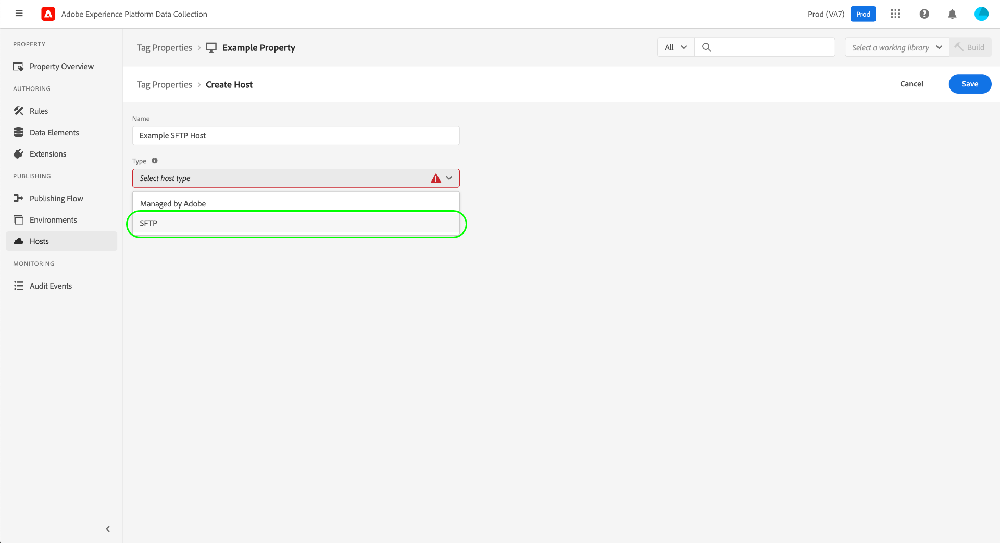

# Alojamientos de SFTP

>[!NOTE]
>
>Adobe Experience Platform Launch se ha convertido en un grupo de tecnologías de recopilación de datos en Adobe Experience Platform. Como resultado, se han implementado varios cambios terminológicos en la documentación del producto. Consulte el siguiente [documento](../../../term-updates.md) para obtener una referencia consolidada de los cambios terminológicos.

Adobe Experience Platform permite enviar compilaciones de biblioteca de etiquetas a un servidor SFTP protegido que aloje, lo que le proporciona un mayor control sobre cómo se almacenan y administran las compilaciones. Esta guía explica cómo configurar un host SFTP para una propiedad de etiquetas en la interfaz de usuario del Experience Platform o en la interfaz de usuario de recopilación de datos.

>[!NOTE]
>
>También puede optar por utilizar un host administrado por Adobe en su lugar. Consulte la guía de [hosts administrados por Adobe](./managed-by-adobe-host.md) para obtener más información.
>
>Para obtener información sobre las ventajas y limitaciones de las bibliotecas de alojamiento propio, consulte la [guía de alojamiento propio](./self-hosting-libraries.md).

## Configurar una clave de acceso para el servidor {#access-key}

Platform se conecta al sitio SFTP mediante una clave cifrada. Debe seguir algunos pasos para configurar esto correctamente:

### Crear un par de claves pública y privada

Debe tener un par de clave pública o privada instalado en el servidor SFTP. Puede generar estas claves en su servidor o generarlas en otro lugar e instalarlas en su servidor. Consulte la documentación de GitHub sobre [cómo generar claves SSH](https://help.github.com/articles/generating-a-new-ssh-key-and-adding-it-to-the-ssh-agent/#generating-a-new-ssh-key) para obtener más información.

### Cifrar las claves

La clave privada se utiliza para cifrar la clave pública. Debe proporcionar la clave privada durante el proceso de creación del host SFTP. Consulte la sección sobre [cifrado de valores](../../../api/guides/encrypting-values.md) en la guía de la API de Reactor para obtener instrucciones sobre el cifrado de claves públicas. Utilice la clave GPG del entorno de producción a menos que sepa que necesita una específica. Por último, puede cifrar la clave privada desde cualquier equipo, y no es necesario instalar GPG en el servidor para completar este paso.

### Direcciones IP de Lista de permitidos Platform

Es posible que deba aprobar un conjunto de direcciones IP para utilizarlo en el cortafuegos de su empresa a fin de permitir que Platform llegue al servidor SFTP y se conecte a él. Estas direcciones IP son:

* `184.72.239.68`
* `23.20.85.113`
* `54.226.193.184`

>[!NOTE]
>
>La estructura de las compilaciones de etiqueta ha cambiado con el paso del tiempo. Utilizan vínculos simbólicos (enlaces simbólicos) internamente para mantener la compatibilidad con versiones anteriores, de modo que los códigos incrustados anteriores seguirán funcionando con la estructura de versión más reciente. El servidor SFTP debe admitir el uso de enlaces simbólicos para que sirva como destino válido para las compilaciones de etiqueta.

Para obtener información más detallada, consulte el siguiente artículo de Medium sobre [cómo configurar los servidores SFTP para enviar una compilación](https://medium.com/launch-by-adobe/configuring-an-sftp-server-for-use-with-adobe-launch-bc626027e5a6).

## Creación de un host SFTP {#create}

Seleccione **[!UICONTROL Hosts]** en el panel de navegación izquierdo, seguido de **[!UICONTROL Agregar host]**.

Aparecerá el cuadro de diálogo de creación de hosts. Proporcione un nombre para el host y, en **[!UICONTROL Tipo]**, seleccione **[!UICONTROL SFTP]**.

### Configuración del host SFTP {#configure}

El cuadro de diálogo se amplía para incluir opciones de configuración adicionales para el host SFTP. Estas se explican a continuación.

| Campo de configuración | Descripción |
| --- | --- |
| [!UICONTROL No usar enlaces simbólicos] | De forma predeterminada, todos los hosts SFTP utilizan vínculos simbólicos (enlaces simbólicos) para hacer referencia a las [compilaciones](../builds.md) de la biblioteca que se guardan en el servidor. Sin embargo, no todos los servidores admiten el uso de enlaces simbólicos. Cuando se selecciona esta opción, el host utiliza una operación de copia para actualizar los recursos de la versión directamente en lugar de utilizar enlaces simbólicos. |
| [!UICONTROL URL del servidor SFTP] | Ruta de acceso base de URL del servidor. |
| [!UICONTROL Ruta] | Ruta de acceso que se anexará a la dirección URL del servidor base para este host. |
| [!UICONTROL Puerto] | El puerto debe ser uno de los siguientes:<ul><li>`21`</li><li>`22`</li><li>`201`</li><li>`200`</li><li>`2002`</li><li>`2018`</li><li>`2022`</li><li>`2200`</li><li>`2222`</li><li>`2333`</li><li>`2939`</li><li>`443`</li><li>`4343`</li><li>`80`</li><li>`8080`</li><li>`8888`</li></ul>Como práctica recomendada de seguridad, Adobe limita la cantidad de puertos que se pueden utilizar para el tráfico saliente. Los puertos seleccionados suelen permitirse a través de servidores de seguridad corporativos e incluyen algunos rangos de flexibilidad. |
| [!UICONTROL Nombre de usuario] | Nombre de usuario que se utilizará al acceder al servidor. |
| [!UICONTROL Clave privada cifrada] | La clave privada cifrada que creó en un [paso anterior](#access-key). |

Seleccione **[!UICONTROL Guardar]** para crear el host con la configuración seleccionada.

Al seleccionar **[!UICONTROL Guardar]**, se comprueba la conexión y la capacidad de enviar los archivos al servidor SFTP. Platform crea una carpeta, escribe un archivo dentro de esa carpeta, comprueba que el archivo esté allí y limpia la carpeta después. Si la cuenta de usuario del servidor SFTP (la que se adjunta al certificado seguro que ha proporcionado a Platform) no tiene los permisos necesarios para realizar esta acción, el host pasa a estar en estado &quot;failed&quot;.

## Pasos siguientes

En esta guía se explica cómo configurar un servidor SFTP autoalojado para utilizarlo en etiquetas. Una vez establecido el host, puede asociarlo con uno o más de sus [entornos](../environments.md) para publicar bibliotecas de etiquetas. Para obtener más información sobre el proceso de alto nivel de activación de las funcionalidades de etiquetas en las propiedades web o móviles, consulte [información general de publicación](../overview.md).
