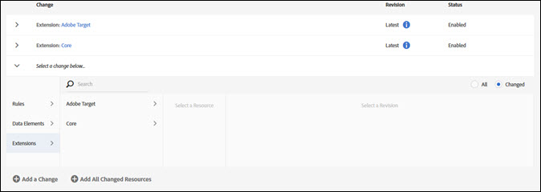

# Bibliotecas

>[!NOTE]
>
>Adobe Experience Platform Launch se ha convertido en un conjunto de tecnologías de recopilación de datos en Adobe Experience Platform. Como resultado, se han implementado varios cambios terminológicos en la documentación del producto. Consulte el siguiente [documento](../../term-updates.md) para obtener una referencia consolidada de los cambios terminológicos.

Una biblioteca es un conjunto de instrucciones que establece la interacción entre las extensiones, los elementos de datos y las reglas una vez que se han implementado. Al crear una biblioteca, debe especificar los cambios que desea realizar en la biblioteca. En la fase de compilación, estos cambios se combinan con todo lo que se ha enviado, aprobado o publicado en bibliotecas anteriores.

Las bibliotecas contienen la adición o eliminación de:

* Reglas
* Elementos
* Configuración de extensión

Deben asignarse las bibliotecas a un entorno para poder reunirlas en una compilación. Las bibliotecas se aprueban o rechazan en su totalidad. No puede aprobar ni rechazar elementos individuales dentro de una biblioteca. Una biblioteca se mueve entre varios entornos a medida que avanza por el flujo de trabajo de publicación.

## Crear una biblioteca. {#create-a-library}

Para crear una biblioteca, complete los siguientes pasos.

1. Abra la pestaña [!UICONTROL Publicación].

   En la página [!UICONTROL Publicación], se enumeran las bibliotecas de desarrollo y se proporcionan los medios para enviarlas para su aprobación, moverlas al entorno de ensayo o publicarlas en producción.

1. Seleccione **[!UICONTROL Añadir nueva biblioteca]**.

   

1. Asigne un nombre a la biblioteca.
1. Asigne la biblioteca a un entorno de desarrollo.
1. Añada un cambio a la biblioteca.
Para añadir un elemento, seleccione **[!UICONTROL Añadir un cambio]** y seleccione los elementos que desee añadir. Todo elemento que se haya editado o eliminado está disponible para su adición a la biblioteca elegida.

   

   Puede añadir lo siguiente a su biblioteca:

   * Reglas
   * Elementos de datos
   * Configuraciones de extensión

1. Para añadir recursos que hayan cambiado, seleccione **[!UICONTROL Añadir todos los recursos modificados]**.
1. Seleccione **[!UICONTROL Guardar]** o **[!UICONTROL Guardar y compilar para desarrollo]**.

   La implementación crea una compilación y la implementa en el entorno asignado.

Una vez creada la biblioteca, utilice el menú desplegable de la biblioteca para seleccionar una de las siguientes opciones:

* **Editar**: Esta opción le permite cambiar la configuración de la biblioteca.

* **Compilar para desarrollo**: Esta opción compila una compilación y la implementa en el entorno asignado.

* **Enviar para aprobación**: Esta opción hace que la biblioteca esté disponible para que un aprobador la mueva al siguiente paso del proceso de publicación.

* **Eliminar**: Esta opción elimina la biblioteca seleccionada actualmente del proceso de publicación.

## Añadir a una biblioteca {#add-to-a-library}

Para añadir a una biblioteca, complete los siguientes pasos.

1. Instala las [extensiones](../managing-resources/extensions/overview.md) que desee añadir.
1. Crea los [elementos de datos](../managing-resources/data-elements.md) y las reglas que desee añadir.
1. Abra la pestaña **[!UICONTROL Publicación]**.
1. Seleccione la [biblioteca](libraries.md) que desee cambiar y, a continuación, seleccione **[!UICONTROL Editar]**.
1. Utilice las reglas, los elementos de datos y los botones de extensiones para seleccionar los elementos que desee añadir a la biblioteca.
1. Guarde los cambios.

Los cambios realizados en la biblioteca se muestran en el registro de cambios “Contenido de la biblioteca”.

>[!NOTE]
>
>Los elementos de datos pueden depender de las extensiones. Las reglas pueden depender tanto de los elementos de datos como de las extensiones. Si no incluye todos los componentes necesarios en la biblioteca, la compilación no puede funcionar correctamente a la hora de compilar y necesita añadir los componentes necesarios antes de completar una compilación correcta. Se ha previsto que una versión futura incluya la opción de comprobar las dependencias al realizar cambios en una biblioteca.

## Eliminar de una biblioteca

Para eliminar algo de una biblioteca, debe desactivarlo y, a continuación, publicar el estado desactivado.

1. Desactive las extensiones que desee eliminar junto con cualquier elemento de datos y regla que dependan de esas extensiones.
1. Desactive los elementos de datos y las reglas que desee eliminar.
1. Abra la pestaña **[!UICONTROL Publicación]**.
1. Seleccione la biblioteca que desee modificar.
1. Utilice las reglas, los elementos de datos y los botones de extensión para seleccionar los elementos deshabilitados que desee eliminar de la biblioteca.
1. Guarde los cambios.

## Administrar los cambios de la biblioteca

Para editar las opciones de la biblioteca, complete los siguientes pasos.

1. Haga clic en una biblioteca y seleccione **[!UICONTROL Editar]** para ver los cambios de la biblioteca. Todos los cambios se muestran en la lista [!UICONTROL Contenidos de la biblioteca].

   

1. Seleccione un cambio para ver y seleccionar una revisión.

   

1. Seleccione si desea mostrar **todos** los elementos o los elementos **modificados**.
1. Seleccione la revisión y, a continuación, seleccione **[!UICONTROL Seleccionar revisión]**.
1. Seleccione **[!UICONTROL Añadir un cambio]** o **[!UICONTROL Añadir todos los recursos modificados]**.

## Biblioteca activa {#active-library}

Las bibliotecas reúnen un conjunto de cambios que desea realizar en el código implementado. La biblioteca activa facilita el proceso, lo que le permite iterar rápidamente los cambios y ver sus efectos.

Ahora, las extensiones, las reglas y los elementos de datos se pueden guardar directamente en la biblioteca en la que esté trabajando. Si es necesario, también se puede crear una nueva compilación o incluso una nueva biblioteca desde la lista desplegable [!UICONTROL Biblioteca principal].

La siguiente lista proporciona más información sobre la administración de una biblioteca activa.

1. [Creación de una nueva biblioteca](libraries.md#create-a-library).
1. Vaya a [Reglas](../managing-resources/rules.md), [Elementos de datos](../managing-resources/data-elements.md) o [Extensiones](../managing-resources/extensions/overview.md).
1. Seleccione su Biblioteca activa.
1. Realice los cambios y, a continuación, guarde y cree la biblioteca.
1. Pruebe los cambios y repita estos pasos según considere necesario.
