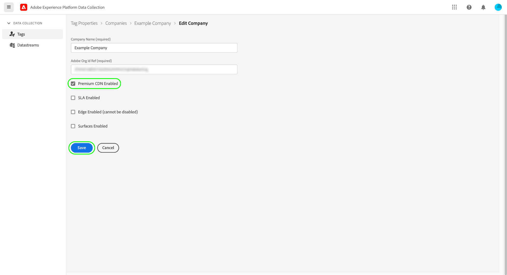

# Compatibilidad de CDN Premium con etiquetas (Beta)

>[!IMPORTANT]
>
>La función de CDN premium para etiquetas está actualmente en fase beta y es posible que su organización aún no tenga acceso a ella. Esta documentación está sujeta a cambios.

Cuando utilice un [host administrado por Adobe](./hosts/managed-by-adobe-host.md) para distribuir los recursos de etiquetas de Adobe Experience Platform en su sitio web, estos recursos se distribuyen entre varias redes de entrega de contenido (CDN) de todo el mundo para ofrecer la mayor velocidad de descarga. Sin embargo, hay ciertas regiones que requieren que todos los recursos del sitio web se dupliquen y alojen en un servidor dentro de esa región.

Para tener en cuenta esto, las etiquetas en Experience Platform proporcionan una función de CDN premium que le permite entregar contenido a estas regiones especiales.

La compatibilidad con CDN Premium es una función de pago que su organización debe adquirir para habilitarla y utilizarla. Esta guía explica cómo configurar y utilizar esta función en la interfaz de usuario de recopilación de datos después de comprarla.

## Habilitar CDN premium para una empresa

La CDN Premium está habilitada a nivel de empresa, lo que significa que debe tener permisos de edición de la empresa para habilitar la función.

En la interfaz de usuario de la recopilación de datos, vaya a **[!UICONTROL Etiquetas]** > **[!UICONTROL Compañías]**. Desde aquí, seleccione la empresa para la que desea habilitar la función y, a continuación, seleccione **[!UICONTROL Configurar]** .

En el cuadro de diálogo de configuración que aparece, seleccione la opción para **[!UICONTROL CDN Premium habilitado]** antes de seleccionar **[!UICONTROL Guardar]** para confirmar los cambios.

## Reconstruya e instale bibliotecas de etiquetas con códigos incrustados actualizados

Habilitar la función de CDN premium no significa que los recursos de etiquetas se replicen inmediatamente y estén listos para utilizarse en las nuevas regiones. Solo significa que ahora puede elegir cuándo activar esta funcionalidad.

>[!IMPORTANT]
>
>Las bibliotecas creadas antes de habilitar la CDN premium seguirán funcionando tal cual actualmente. Esto también se aplica a las bibliotecas que no están administradas por Adobe, ya que [entornos archivados](./environments.md#archive) utilice solo direcciones URL relativas para sus rutas de recursos. Tenga en cuenta que después de habilitar la CDN premium, cualquier biblioteca que cree que no esté administrada por Adobe se comportará como si la función CDN premium no estuviera habilitada.

Una vez que haya habilitado la CDN premium y haya reconstruido las bibliotecas que desee utilizar en las nuevas regiones de alojamiento, puede recuperar los nuevos códigos incrustados de las regiones de alojamiento para añadirlos a sus sitios web.

>[!NOTE]
>
>El código incrustado de la biblioteca que aparece en la sección [!UICONTROL Estándar] la región de alojamiento seguirá funcionando tal cual, así como los códigos incrustados Principio de página o Final de página que ya estén en sus sitios web.

Visite la **[!UICONTROL Entornos]** o vea las instrucciones de instalación del entorno desde la pantalla de edición de la biblioteca para encontrar los nuevos códigos incrustados. Cada nueva región de alojamiento admitida aparece después de la etiqueta [!UICONTROL Estándar] región de alojamiento (utilizada para zonas del mundo que son compatibles sin CDN premium). La captura de pantalla siguiente muestra un código incrustado para la región de China, que utiliza `.cn` como su dominio de nivel superior (TLD).

Elija el código incrustado apropiado para la página web y péguelo en el `<head>` del documento. Para obtener más información sobre el uso de códigos incrustados para instalar bibliotecas de etiquetas, consulte la [guía de interfaz de usuario de entornos](./environments.md#installation).

## Pasos siguientes

Esta guía explica cómo habilitar e instalar la función de CDN premium para la implementación de etiquetas. Para obtener más información sobre la instalación y prueba de bibliotecas de etiquetas en las propiedades web y móviles, consulte la [información general de publicación](./overview.md).
