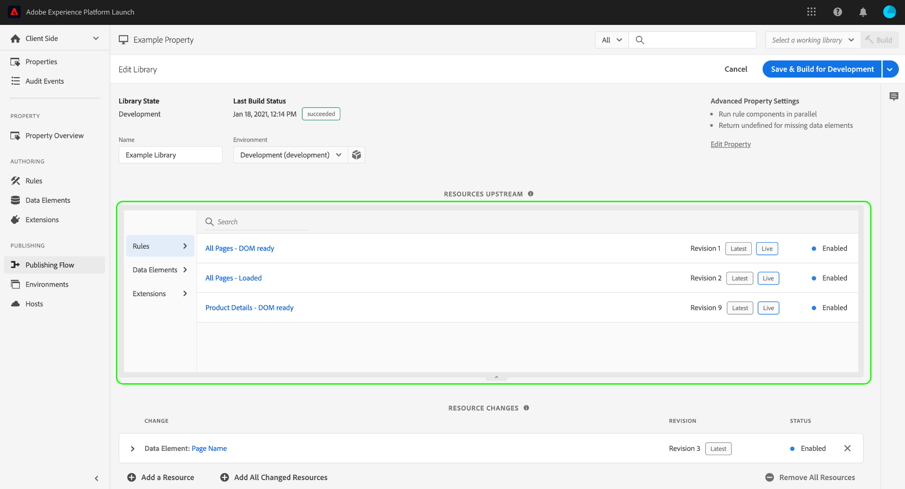

# Flujo de publicación {#publishing-flow}

>[!CONTEXTUALHELP]
>id="platform_tags_publishing_flow"
>title="Flujo de publicación"
>abstract="Comprenda los niveles de permisos de usuario necesarios para el flujo de publicación, incluidos los derechos de desarrollo, aprobación y publicación."

>[!NOTE]
>
>Adobe Experience Platform Launch se ha convertido en un grupo de tecnologías de recopilación de datos en Adobe Experience Platform. Como resultado, se han implementado varios cambios terminológicos en la documentación del producto. Consulte el siguiente [documento](../../term-updates.md) para obtener una referencia consolidada de los cambios terminológicos.

El flujo de publicación de etiquetas en Adobe Experience Platform hace referencia al proceso de creación de bibliotecas, prueba de compilaciones y aprobación para su producción.

Las acciones disponibles que se pueden realizar con una biblioteca dependen del estado de la biblioteca y del nivel de permiso que tenga. Además, el estado de una biblioteca también afecta a los recursos que contiene (reglas, elementos de datos y extensiones) en función de qué elementos hay en sentido ascendente en el flujo de publicación.

En las siguientes secciones se explican los permisos, el estado de la biblioteca y el flujo ascendente, ya que se refieren al flujo de publicación.

## Permisos {#permissions}

Existen diferentes niveles de permisos de usuario que son importantes para el flujo de publicación; en concreto, los derechos de propiedad [!UICONTROL Desarrollar], [!UICONTROL Aprobar] y [!UICONTROL Publicar]:

* **[!UICONTROL Desarrollar]**: Incluye la capacidad de creación de bibliotecas, compilación para desarrollo y envío para aprobación.
* **[!UICONTROL Aprobar]**: Incluye la capacidad de generar compilaciones de ensayo y aprobar las compilaciones una vez superados los ensayos.
* **[!UICONTROL Publicar]**: Incluye la capacidad de publicar una biblioteca aprobada.

Estos derechos no son inclusivos. Para que una sola persona realice el flujo de trabajo de principio a fin, se debe otorgar a esa persona los tres derechos dentro de una propiedad determinada.

Consulte la [guía de permisos de usuario](../administration/user-permissions.md) para obtener más información sobre la administración de permisos para etiquetas.

## Estado de la biblioteca {#state}

En cuanto al flujo de publicación, hay cuatro estados básicos en los que puede estar una biblioteca:

* [[!UICONTROL Desarrollo]](#development)
* [[!UICONTROL Enviado]](#submitted)
* [[!UICONTROL Aprobado]](#approved)
* [[!UICONTROL Publicado]](#published)

Estos cuatro estados se representan en columnas dentro de la ficha **[!UICONTROL Flujo de publicación]**.

Se deben realizar acciones específicas para cambiar de estado una biblioteca. El diagrama siguiente describe todas las acciones que mueven una biblioteca entre los diferentes estados:

### [!UICONTROL Desarrollo] {#development}

Cuando se crean nuevas bibliotecas, comienzan con el estado [!UICONTROL Desarrollo]. Los cambios realizados en una biblioteca deben hacerse mientras esta se encuentra en [!UICONTROL Desarrollo]. Cuando se completan las fases de desarrollo y pruebas, la biblioteca se puede enviar para su aprobación.

En la tabla siguiente se describen las acciones disponibles para una biblioteca en el estado [!UICONTROL Desarrollo]:

| Acción | Descripción |
| --- | --- |
| [!UICONTROL Editar] | Utilice la pantalla [!UICONTROL Editar biblioteca] para añadir o quitar componentes de la biblioteca. |
| [!UICONTROL Compilación para desarrollo] | Cree una compilación de la biblioteca. La compilación se genera y se implementa en el entorno al que se asigna la biblioteca. Este paso da error si la biblioteca no se ha asignado a un entorno o si contiene un cambio que ya está definido en el flujo ascendente. |
| [!UICONTROL Enviar para aprobación] | Cancele la asignación de la biblioteca del entorno de desarrollo y mueva la biblioteca a la columna [!UICONTROL Enviado] para que un usuario con permisos de aprobación pueda gestionarla. La última compilación de la biblioteca debe ser correcta para que esta opción esté habilitada. |
| [!UICONTROL Envío y compilación para ensayo] | Esto solo lo puede realizar un usuario con derechos de desarrollo y aprobación. Esta acción anula la asignación de la biblioteca del entorno de desarrollo, mueve la biblioteca al estado [!UICONTROL Enviado] y la compila en el entorno de ensayo. La última compilación de la biblioteca debe ser correcta para que esta opción esté habilitada. |
| [!UICONTROL Aprobar para publicación] | Esto solo lo puede realizar un usuario con derechos de desarrollo y aprobación. Esta acción anula la asignación de la biblioteca del entorno de desarrollo y la mueve al estado [!UICONTROL Aprobado], lo que omite el entorno de ensayo y el estado [!UICONTROL Enviado] por completo. La última compilación de la biblioteca debe ser correcta para que esta opción esté habilitada. |
| [!UICONTROL Aprobar y publicar en producción] | Esto solo lo puede realizar un usuario con derechos de desarrollo, aprobación y publicación. Esta acción anula la asignación de la biblioteca del entorno de desarrollo, la mueve al estado [!UICONTROL Aprobado] y la publica en producción. Una vez finalizada la compilación de la producción, la biblioteca pasará al estado [!UICONTROL Publicado]. La última compilación de la biblioteca debe ser correcta para que esta opción esté habilitada. |
| [!UICONTROL Eliminar] | Elimine la biblioteca del sistema. Esto no quita la compilación del entorno. |

### [!UICONTROL Enviado] {#submitted}

Cuando una biblioteca está en el estado [!UICONTROL Enviado], un usuario con permisos de aprobación puede probar la biblioteca en el entorno de ensayo. Cuando termina la prueba, la biblioteca se aprueba o se rechaza. Las compilaciones rechazadas vuelven a [!UICONTROL Desarrollo] para poder realizar los cambios pertinentes antes de reiniciar el flujo de publicación.

En la tabla siguiente se describen las acciones disponibles para una biblioteca en el estado [!UICONTROL Enviado]:

| Acción | Descripción |
| --- | --- |
| [!UICONTROL Abri] | Ver el contenido de la biblioteca. No se permiten cambios en las bibliotecas que no están en la columna [!UICONTROL Desarrollo]. Si es necesario realizar cambios, la biblioteca debe rechazarse para que se puedan realizar cambios en [!UICONTROL Desarrollo]. |
| [!UICONTROL Generar para ensayo] | Compile la biblioteca en el entorno de ensayo para su implementación. |
| [!UICONTROL Aprobar para publicación] | Mueva la biblioteca a la columna [!UICONTROL Aprobado] para que un usuario con permisos de publicación pueda gestionarla. |
| [!UICONTROL Aprobar y publicar en producción] | Esto solo lo puede realizar un usuario con derechos de aprobación y publicación. Esta acción anula la asignación de la biblioteca del entorno de ensayo, la mueve al estado [!UICONTROL Aprobado] y la publica en producción. Una vez finalizada la compilación de la producción, la biblioteca pasará al estado [!UICONTROL Publicado]. Esto se puede realizar con una compilación correcta en el entorno de ensayo o sin ella. |
| [!UICONTROL Rechazar] | Cancele la asignación de la biblioteca del entorno de ensayo y vuelva a moverla a la columna [!UICONTROL Desarrollo] para realizar más cambios. |

### [!UICONTROL Aprobado] {#approved}

Una vez aprobada una biblioteca, un usuario con permisos de publicación podrá publicarla o rechazarla. Las compilaciones rechazadas vuelven a [!UICONTROL Desarrollo] para que se puedan realizar los cambios pertinentes antes de que el flujo de publicación se inicie de nuevo.

En la tabla siguiente se describen las acciones disponibles para una biblioteca en el estado [!UICONTROL Aprobado]:

| Acción | Descripción |
| --- | --- |
| [!UICONTROL Abri] | Ver el contenido de la biblioteca. No se permiten cambios en las bibliotecas que no están en la columna [!UICONTROL Desarrollo]. Si es necesario realizar cambios, la biblioteca debe rechazarse para que se puedan realizar cambios en [!UICONTROL Desarrollo]. |
| [!UICONTROL Generar y publicar en producción] | Cancele la asignación de la biblioteca del entorno de ensayo, asigne la biblioteca al entorno de producción e impleméntela.  **Importante**: cuando se selecciona esta opción, la biblioteca se activa en el entorno de producción. Asegúrese de que la biblioteca contiene los cambios que desea antes de seleccionar esta opción. |
| [!UICONTROL Rechazar] | Cancele la asignación de la biblioteca del entorno de ensayo y mueva la biblioteca a la columna [!UICONTROL Desarrollo] para realizar los cambios pertinentes. |

### [!UICONTROL Publicadas] {#published}

La columna [!UICONTROL Publicado] muestra qué bibliotecas se han publicado y sus fechas de publicación. La biblioteca publicada actualmente se mostrará con un punto verde junto a ella. A menos que haya realizado una nueva publicación en una biblioteca anterior, esta será siempre la biblioteca situada en la parte superior de la columna.

| Acción | Descripción |
| --- | --- |
| [!UICONTROL Abri] | Ver el contenido de la biblioteca. No se permiten cambios en las bibliotecas que no están en la columna [!UICONTROL Desarrollo]. Si desea cambiar lo que hay en el entorno de producción, debe crear una nueva biblioteca y moverla a través del proceso de publicación completo. |
| [!UICONTROL Volver a publicar] | Esta acción solo está disponible en las cinco bibliotecas publicadas más recientemente y solo si el entorno de producción (A) está configurado con la opción Archivar desactivada y (B) utiliza un host [!UICONTROL Administrado por Adobe] en el momento de la compilación. |
| [!UICONTROL Descargar] | Esta acción solo está disponible en las cinco bibliotecas publicadas más recientemente y solo si el entorno de producción (A) está configurado con la opción Archivar en y (B) utiliza un host [!UICONTROL Administrado por Adobe] en el momento de la compilación. |

## Flujo ascendente {#upstream}

Después de publicar su primera biblioteca, es importante comprender el papel del flujo ascendente a medida que mueve bibliotecas más nuevas a través del flujo de publicación.

Si una biblioteca se encuentra actualmente en la fase [!UICONTROL Desarrollo], [!UICONTROL Enviado] o [!UICONTROL Aprobado], heredará las reglas, los elementos de datos y las extensiones de cualquier biblioteca que esté en el flujo ascendente. Estos recursos heredados constituyen una &quot;línea de base&quot; para cada biblioteca a medida que se desplazan por el flujo de publicación. Básicamente, cada nueva biblioteca podría considerarse simplemente como una serie de cambios que se realizan en la línea de base que establece el flujo ascendente. Esto garantiza que no se sobrescriba por accidente nada de lo que exista en una biblioteca anterior cuando se publique una nueva iteración.

Lo que se incluye en el flujo ascendente depende de la fase actual en que se encuentre la biblioteca. Por ejemplo, las bibliotecas de la columna [!UICONTROL Aprobado] solo heredan recursos de la biblioteca de [!UICONTROL Publicado], mientras que las bibliotecas de la columna [!UICONTROL Desarrollo] heredan recursos del resto de las columnas.

Al editar una biblioteca en la IU, todos los recursos heredados del flujo ascendente se representan en la sección **[!UICONTROL Recursos ascendentes]**. Para ver estos recursos, seleccione la pestaña Expandir debajo del encabezado de la sección.

La sección se expande para mostrar los recursos individuales que se heredan del flujo ascendente. Puede utilizar el carril izquierdo para filtrar entre [!UICONTROL Reglas], [!UICONTROL Elementos de datos] y [!UICONTROL Extensiones], o bien utilizar la barra de búsqueda para buscar un recurso específico por nombre.

## Pasos siguientes

En esta guía se proporciona una amplia descripción general del flujo de publicación para bibliotecas en Adobe Experience Platform. Para saber cómo publicar sus bibliotecas, consulte la [información general de publicación](./overview.md).
