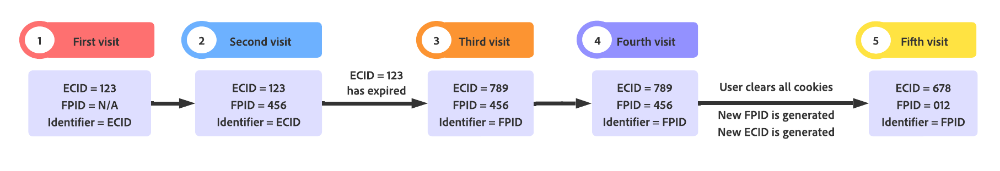

# Uso de ID de dispositivos de origen en Web SDK

Adobe Experience Platform Web SDK asigna [Adobe Experience Cloud ID (ECID)](https://experienceleague.adobe.com/docs/experience-platform/identity/ecid.html?lang=es) a los visitantes del sitio web que usan cookies para realizar un seguimiento del comportamiento del usuario. Para abordar las restricciones del explorador sobre la duración de las cookies, puede establecer y administrar sus propios identificadores de dispositivo, conocidos como ID de dispositivos de origen (FPID).

>[!NOTE]
>
>La compatibilidad con ID de dispositivos de origen solo está disponible al enviar datos a Experience Platform Edge Network a través de Web SDK.

>[!IMPORTANT]
>
>Los ID de dispositivos de origen no son compatibles con la funcionalidad [cookies de terceros](../../tags/extensions/client/web-sdk/web-sdk-extension-configuration.md#identity) en Web SDK. Puede utilizar ID de dispositivos de origen o cookies de terceros, pero no ambos simultáneamente.

## Requisitos previos {#prerequisites}

Antes de empezar, asegúrese de estar familiarizado con el funcionamiento de los datos de identidad en Web SDK, incluidos los ECID y `identityMap`. Consulte la descripción general de [datos de identidad en Web SDK](./overview.md) para obtener más información.

## Requisitos de formato de ID de dispositivo de origen {#formatting-requirements}

Edge Network solo acepta ID que cumplan con el [formato UUIDv4](https://datatracker.ietf.org/doc/html/rfc4122). Los ID de dispositivo que no tengan el formato UUIDv4 se rechazarán.

* [!DNL UUIDs] son únicos y aleatorios, con una probabilidad insignificante de colisión.
* [!DNL UUIDv4] no se puede inicializar usando direcciones IP ni ninguna otra información de identificación personal (PII).
* Las bibliotecas para generar [!DNL UUIDs] están disponibles para todos los lenguajes de programación.

## Establecer la cookie [!DNL FPID] con su propio servidor {#set-cookie-server}

Al configurar una cookie a través de su propio servidor, puede utilizar varios métodos para evitar que la cookie se restrinja debido a las políticas del explorador:

* Generación de cookies mediante lenguajes de scripts del lado del servidor
* Establecer cookies en respuesta a una solicitud de API realizada a un subdominio u otro extremo del sitio
* Generar cookies mediante [!DNL CMS]
* Generar cookies mediante [!DNL CDN]

Además, siempre debe establecer la cookie FPID en el registro `A` de su dominio.

>[!IMPORTANT]
>
>Las cookies configuradas mediante el método `document.cookie` de JavaScript casi nunca se protegerán de las directivas del explorador que restringen las duraciones de las cookies.

### Cuándo se establece la cookie {#when-to-set-cookie}

Lo ideal es configurar la cookie [!DNL FPID] antes de realizar cualquier solicitud a Edge Network. Sin embargo, en los casos en los que esto no sea posible, [!DNL ECID] se seguirá generando utilizando los métodos existentes y actuará como identificador principal siempre que exista la cookie.

Suponiendo que [!DNL ECID] se vea afectado finalmente por una directiva de eliminación de explorador, pero [!DNL FPID] no lo esté, [!DNL FPID] se convertirá en el identificador principal en la siguiente visita y se utilizará para inicializar [!DNL ECID] en cada visita posterior.

### Configuración de la caducidad de la cookie {#set-expiration}

Configurar la caducidad de una cookie es algo que debe tenerse en cuenta cuidadosamente al implementar la funcionalidad [!DNL FPID]. Al decidir esto, debe tener en cuenta los países o regiones en los que opera su organización junto con las leyes y políticas de cada una de esas regiones.

Como parte de esta decisión, es posible que desee adoptar una política de establecimiento de cookies para toda la compañía o una que varíe para los usuarios en cada configuración regional en la que opera.

Independientemente de la configuración que elija para la caducidad inicial de una cookie, debe asegurarse de incluir una lógica que amplíe la caducidad de la cookie cada vez que se produce una nueva visita al sitio.

## Impacto de los indicadores de cookies {#cookie-flag-impact}

Existen varios indicadores de cookies que afectan a cómo se tratan las cookies en los distintos exploradores:

* [`HTTPOnly`](#http-only)
* [`Secure`](#secure)
* [SameSite](#same-site)

### `HTTPOnly` {#http-only}

No se puede tener acceso a las cookies configuradas con el indicador `HTTPOnly` mediante scripts del lado del cliente. Esto significa que si establece un indicador `HTTPOnly` al configurar [!DNL FPID], debe usar un lenguaje de scripts del lado del servidor para leer el valor de la cookie para incluirlo en `identityMap`.

Si elige que Edge Network lea el valor de la cookie [!DNL FPID], establecer el indicador `HTTPOnly` garantiza que ningún script del lado del cliente pueda acceder al valor, pero no tendrá ningún impacto negativo en la capacidad de Edge Network para leer la cookie.

>[!NOTE]
>
>El uso del indicador `HTTPOnly` no afecta a las directivas de cookies que pueden restringir la duración de las cookies. Sin embargo, es algo que debe tener en cuenta al establecer y leer el valor de [!DNL FPID].

### `Secure` {#secure}

Las cookies configuradas con el atributo `Secure` solo se envían al servidor con una solicitud cifrada a través del protocolo [!DNL HTTPS]. El uso de este indicador puede ayudar a garantizar que los atacantes intermediarios no puedan acceder fácilmente al valor de la cookie. Siempre que sea posible, es aconsejable establecer el indicador `Secure`.

### `SameSite` {#same-site}

El atributo `SameSite` permite a los servidores determinar si las cookies se envían con solicitudes entre sitios. El atributo proporciona cierta protección contra ataques de falsificación entre sitios. Existen tres valores posibles: `Strict`, `Lax` y `None`. Consulte con su equipo interno para determinar qué configuración es correcta para su organización.

Si no se especifica ningún atributo `SameSite`, la configuración predeterminada para algunos exploradores es ahora `SameSite=Lax`.

## Jerarquía de ID {#id-hierarchy}

Cuando hay presentes tanto un [!DNL ECID] como un [!DNL FPID], se da prioridad al [!DNL ECID] en la identificación del usuario. Esto garantiza que cuando un(a) [!DNL ECID] existente esté presente en el almacén de cookies del explorador, permanezca como el identificador principal y que los recuentos de visitantes existentes no se vean afectados. Para los usuarios existentes, [!DNL FPID] no se convertirá en la identidad principal hasta que [!DNL ECID] caduque o se elimine como resultado de una directiva de explorador o un proceso manual.

Las identidades se priorizan en el siguiente orden:

1. [!DNL ECID] incluido en `identityMap`
1. [!DNL ECID] almacenado en una cookie
1. [!DNL FPID] incluido en `identityMap`
1. [!DNL FPID] almacenado en una cookie


## Migración a ID de dispositivos de origen {#migrating-to-fpid}

Si está migrando a ID de dispositivos de origen desde una implementación anterior, puede resultar difícil visualizar el aspecto que podría tener la transición en un nivel bajo.

Para ilustrar este proceso, considere un escenario que involucre a un cliente que ya haya visitado su sitio y el impacto que una migración de [!DNL FPID] tendría en la forma en que se identifica a ese cliente en las soluciones de Adobe.



>[!IMPORTANT]
>
>La cookie `ECID` siempre tiene prioridad sobre `FPID`.

| Visita | Descripción |
| --- | --- |
| Primera visita | Supongamos que aún no ha empezado a configurar la cookie [!DNL FPID]. El [!DNL ECID] contenido en la [cookie AMCV](https://experienceleague.adobe.com/docs/id-service/using/intro/cookies.html#section-c55af54828dc4cce89f6118655d694c8) será el identificador usado para identificar al visitante. |
| Segunda visita | Se ha iniciado el despliegue de la solución [!DNL FPID]. El(la) [!DNL ECID] existente aún está presente y sigue siendo el identificador principal para la identificación del visitante. |
| Tercera visita | Entre la segunda y la tercera visita, ha transcurrido tiempo suficiente como para que [!DNL ECID] se haya eliminado debido a la directiva del explorador. Sin embargo, debido a que [!DNL FPID] se estableció usando un registro [!DNL DNS] [!DNL A], el [!DNL FPID] persiste. [!DNL FPID] ahora se considera el ID principal y se usa para inicializar [!DNL ECID], que se escribe en el dispositivo del usuario final. Ahora se considerará que el usuario es un nuevo visitante en las soluciones Adobe Experience Platform y Experience Cloud. |
| Cuarta visita | Entre la tercera y la cuarta visita, ha transcurrido tiempo suficiente para que [!DNL ECID] se haya eliminado debido a la directiva del explorador. Al igual que la visita anterior, [!DNL FPID] se mantiene debido a la forma en que se configuró. Esta vez, se genera el mismo(a) [!DNL ECID] que la visita anterior. El usuario se ve en todas las soluciones de Experience Platform y Experience Cloud como el mismo usuario de la visita anterior. |
| Quinta visita | Entre la cuarta y la quinta visita, el usuario final borró todas las cookies del explorador. Se genera un nuevo(a) [!DNL FPID] que se usa para inicializar la creación de un nuevo(a) [!DNL ECID]. Ahora se considerará que el usuario es un nuevo visitante en las soluciones Adobe Experience Platform y Experience Cloud. |

{style="table-layout:auto"}

## Uso de ID de dispositivos de origen (FPID) {#using-fpid}

Los identificadores de dispositivos de origen ([!DNL FPIDs]) rastrean visitantes mediante cookies de origen. Las cookies de origen son más eficaces cuando se establecen con un servidor que usa un registro DNS [A](https://datatracker.ietf.org/doc/html/rfc1035) (para IPv4) o [registro AAAA](https://datatracker.ietf.org/doc/html/rfc3596) (para IPv6), a diferencia de un código DNS [!DNL CNAME] o [!DNL JavaScript].

>[!IMPORTANT]
>
>[!DNL A] o [!DNL AAAA] registros solo se admiten para configurar y rastrear cookies. El método principal de recopilación de datos es a través de [!DNL DNS CNAME]. [!DNL FPIDs] se han establecido utilizando un registro [!DNL A] o [!DNL AAAA] y se han enviado a Adobe utilizando [!DNL CNAME].
>
>El [programa de certificados administrados por Adobe](https://experienceleague.adobe.com/docs/core-services/interface/administration/ec-cookies/cookies-first-party.html#adobe-managed-certificate-program) también es compatible con la recopilación de datos de origen.

Una vez establecida una cookie [!DNL FPID], su valor se puede recuperar y enviar a Adobe a medida que se recopilan los datos del evento. Los [!DNL FPIDs] recopilados se utilizan para generar [!DNL ECIDs], que son los identificadores principales en las aplicaciones de Adobe Experience Cloud.

Puede usar [!DNL FPIDs] de dos maneras:

* **[Método 1](#setting-cookie-datastreams)**: configure un [!DNL CNAME] para sus llamadas a Web SDK e incluya el nombre de su cookie [!DNL FPID] en la configuración de su secuencia de datos.
* **[Método 2](#identityMap)**: incluya [!DNL FPID] en el mapa de identidad. Vea la sección más abajo en este documento sobre [el uso de FPID en `identityMap`](#identityMap) para obtener más información.

### Método 1: Configuración de un CNAME para las llamadas SDK web y establecimiento de una cookie de ID de origen en el conjunto de datos {#setting-cookie-datastreams}

Para establecer una cookie [!DNL FPID] desde su propio dominio, debe configurar su propio [!DNL CNAME] (nombre canónico) para sus llamadas SDK web y, a continuación, habilitar la funcionalidad [!DNL First Party ID Cookie] en la configuración de su secuencia de datos.

**Paso 1. Configure un CNAME para el dominio de implementación de Web SDK**

Un registro [!DNL CNAME] en su DNS le permite crear un alias de un nombre de dominio a otro. Esto puede ayudar a que los servicios de terceros aparezcan como si fueran parte de su propio dominio, lo que hace que sus cookies parezcan cookies de origen.

**Ejemplo**

Consideremos que desea implementar Web SDK en el sitio web `mywebsite.com`. Web SDK envía datos a Edge Network al dominio `edge.adobedc.net`.

| Sin [!DNL CNAME] | Con [!DNL CNAME] |
|---------|----------|
| <ul><li>El sitio web `mywebsite.com` utiliza el dominio de Web SDK `edge.adobedc.net` para enviar datos a Edge Network.</li><li>Las cookies configuradas por `edge.adobedc.net` se consideran cookies de terceros, ya que no provienen del dominio `mywebsite.com`. Según los exploradores de los usuarios, las cookies de terceros podrían bloquearse y los datos no llegan a Edge Network.</li></ul> | <ul><li>Cree un subdominio en el que implemente Web SDK, como `metrics.mywebsite.com`.</li><li>Estableció un registro [!DNL CNAME] en su sistema DNS para que `metrics.mywebsite.com` apunte a `edge.adobedc.net`.</li><li>Cuando el sitio web establece cookies a través de `metrics.mywebsite.com`, al explorador parecerán provenir de `mywebsite.com` (origen) en lugar de `edge.adobedc.net` (terceros). Esto hace que sea menos probable que la cookie de ID de origen se bloquee, lo que garantiza una recopilación de datos más precisa.</li></ul> |

Cuando la recopilación de datos de origen se habilita mediante [!DNL CNAME], todas las cookies de su dominio se enviarán en solicitudes realizadas al extremo de recopilación de datos.

Para utilizar esta funcionalidad, debe establecer la cookie [!DNL FPID] en el nivel superior de su dominio en lugar de un subdominio específico. Si lo establece en un subdominio, el valor de la cookie no se enviará a Edge Network y la solución [!DNL FPID] no funcionará como estaba previsto.

>[!IMPORTANT]
>
>Esta característica requiere que tenga habilitada la [recopilación de datos de origen](https://experienceleague.adobe.com/docs/core-services/interface/administration/ec-cookies/cookies-first-party.html?lang=en).

**Paso 2. Habilitar la funcionalidad**&#x200B;[!UICONTROL &#x200B; First Party ID Cookie &#x200B;]&#x200B;**para su secuencia de datos**

Una vez que haya configurado su CNAME, debe habilitar la opción **[!UICONTROL Cookie de ID de origen]** para su secuencia de datos. Esta configuración indica a Edge Network que haga referencia a una cookie especificada cuando busque un ID de dispositivo de origen, en lugar de buscar este valor en el [mapa de identidad](#identityMap).

Consulte la [documentación de configuración de secuencia de datos](../../datastreams/configure.md#advanced-options) para obtener información sobre cómo configurar su secuencia de datos.

Consulte la documentación de [cookies de origen](https://experienceleague.adobe.com/docs/core-services/interface/administration/ec-cookies/cookies-first-party.html?lang=es) para obtener más información sobre cómo funcionan con Adobe Experience Cloud.


Al habilitar esta configuración, debe proporcionar el nombre de la cookie donde se espera que se almacene [!DNL FPID].

>[!NOTE]
>
>Cuando utiliza ID de origen, no puede realizar sincronizaciones de ID de terceros. Las sincronizaciones de ID de terceros dependen del servicio [!DNL Visitor ID] y del `UUID` generado por ese servicio. Al utilizar la funcionalidad de ID de origen, [!DNL ECID] se genera sin el uso del servicio [!DNL Visitor ID], lo que hace imposible la sincronización de ID de terceros.
><br> Cuando usa ID de origen, no se admiten las capacidades de [Audience Manager](https://experienceleague.adobe.com/en/docs/audience-manager) dirigidas a la activación en plataformas de socios, dado que las sincronizaciones de ID de socios de Audience Manager se basan principalmente en `UUIDs` o `DIDs`. El [!DNL ECID] que se deriva de un identificador de origen no está vinculado a un `UUID`, por lo que no se puede direccionar.

## Método 2: usar FPID en `identityMap` {#identityMap}

Como alternativa al almacenamiento de [!DNL FPID] en su propia cookie, puede enviar [!DNL FPID] a Edge Network a través del mapa de identidad.

A continuación se muestra un ejemplo de cómo establecería un [!DNL FPID] en el `identityMap`:

```json
{
  "identityMap": {
    "FPID": [
      {
        "id": "123e4567-e89b-42d3-9456-426614174000",
        "authenticatedState": "ambiguous",
        "primary": true
      }
    ]
  }
}
```

Al igual que con otros tipos de identidad, puede incluir [!DNL FPID] con otras identidades dentro de `identityMap`. El siguiente es un ejemplo de [!DNL FPID] incluido con un [!DNL CRM ID] autenticado:

```json
{
  "identityMap": {
    "FPID": [
      {
        "id": "123e4567-e89b-42d3-9456-426614174000",
        "authenticatedState": "ambiguous",
        "primary": false
      }
    ],
    "EMAIL": [
      {
        "id": "email@mail.com",
        "authenticatedState": "authenticated",
        "primary": true
      }
    ]
  }
}
```

Si [!DNL FPID] está contenido en una cookie que está leyendo Edge Network cuando la recopilación de datos de origen está habilitada, solo debe capturar el [!DNL CRM ID] autenticado:

```json
{
  "identityMap": {
    "EMAIL": [
      {
        "id": "email@mail.com",
        "authenticatedState": "authenticated",
        "primary": true
      }
    ]
  }
}
```

Los(as) siguientes `identityMap` resultarían en una respuesta de error de Edge Network, ya que le falta el indicador `primary` para [!DNL FPID]. Al menos uno de los identificadores presentes en `identityMap` debe marcarse como `primary`.

```json
{
  "identityMap": {
    "FPID": [
      {
        "id": "123e4567-e89b-12d3-a456-426614174000",
        "authenticatedState": "ambiguous"
      }
    ],
    "EMAIL": [
      {
        "id": "email@mail.com",
        "authenticatedState": "authenticated"
      }
    ]
  }
}
```

La respuesta de error devuelta por Edge Network en este caso sería similar a la siguiente:

```json
{
    "type": "https://ns.adobe.com/aep/errors/EXEG-0306-400",
    "status": 400,
    "title": "No primary identity set in request (event)",
    "detail": "No primary identity found in the input event. Update the request accordingly to your schema and try again.",
    "report": {
        "requestId": "{REQUEST_ID}",
        "configId": "{CONFIG_ID}",
        "orgId": "{ORG_ID}"
    }
}
```

## Preguntas frecuentes {#faq}

A continuación se muestra una lista de respuestas a las preguntas frecuentes acerca de los ID de dispositivos de origen.

### ¿En qué se diferencia sembrar un ID de simplemente generarlo?

El concepto de inicialización es único en el sentido de que [!DNL FPID] pasado a Adobe Experience Cloud se convierte en un [!DNL ECID] mediante un algoritmo determinístico. Cada vez que se envíe el mismo(a) [!DNL FPID] a Edge Network, se sembrará el mismo(a) [!DNL ECID] desde [!DNL FPID].

### ¿Cuándo se debe generar el ID del dispositivo de origen?

Para reducir la inflación potencial de visitantes, [!DNL FPID] debe generarse antes de realizar la primera solicitud mediante Web SDK. Sin embargo, si no puede hacerlo, se generará un [!DNL ECID] para ese usuario y se utilizará como identificador principal. El [!DNL FPID] que se generó no se convertirá en el identificador principal hasta que el [!DNL ECID] ya no esté presente.

### ¿Qué métodos de recopilación de datos admiten los ID de dispositivos de origen?

Actualmente, solo Web SDK admite ID de dispositivos de origen.

### ¿Los ID de dispositivo de origen se almacenan en cualquier plataforma o solución de Experience Cloud?

Una vez que [!DNL FPID] se ha utilizado para inicializar [!DNL ECID], se quita de `identityMap` y se reemplaza por [!DNL ECID] que se ha generado. [!DNL FPID] no está almacenado en ninguna solución de Adobe Experience Platform o Experience Cloud.
