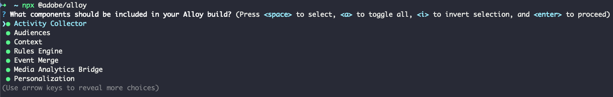
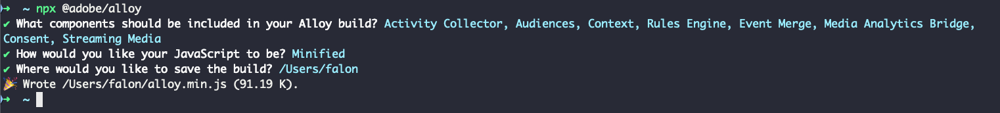

# Crear una compilación personalizada de Web SDK

La biblioteca Experience Platform Web SDK incluye varios módulos para varias funciones, como personalización, identidad, seguimiento de vínculos y mucho más. Según sus casos de uso, es posible que solo necesite funciones específicas en lugar de toda la biblioteca. La creación de una versión personalizada de Web SDK le permite seleccionar solo los módulos que necesita, reducir el tamaño de la biblioteca y mejorar el rendimiento.

## Casos de uso {#use-case}

Crear una compilación personalizada de Web SDK ayuda a reducir el tamaño de la biblioteca y a aumentar el rendimiento. Estos son algunos ejemplos:

### Eliminación de Media Analytics {#media-analytics-removal}

Si su sitio web no tiene contenido multimedia, puede excluir los módulos [!DNL Media Analytics] y [!DNL Streaming Media] de la compilación. Esto puede reducir el tamaño de la versión de Web SDK hasta en un 50 % y mejorar la velocidad de carga.

### Eliminación de Personalization {#personalization}

Si solo necesita recopilar métricas de usuario y no planea utilizar Adobe Target o Journey Optimizer para la personalización, puede excluir el módulo [!DNL Personalization]. Esto reduce el tamaño de la biblioteca y, al mismo tiempo, le permite recopilar las métricas necesarias.

## Requisitos previos {#prerequisites}

Para crear una compilación personalizada de Web SDK, necesita el paquete NPM de Web SDK. Asegúrese de que tiene [Node.js](https://nodejs.org/en/download/package-manager/all) instalado en el equipo. Consulte la documentación sobre cómo [instalar Web SDK con el paquete NPM](npm.md) para obtener más información.

## Componentes y dependencias {#components-dependencies}

Antes de crear una compilación personalizada de Web SDK, defina los componentes y comandos de Web SDK que desea utilizar. Algunos comandos dependen de módulos específicos que se incluyen en la compilación.

La tabla siguiente muestra la relación entre los módulos de Web SDK y los comandos que incluyen:

| Dependencia del módulo | Parámetros de configuración | Comandos | Categoría de tamaño |
|---------|----------|---------|---------|
| Recopilador de actividades | [`clickCollectionEnabled`](../commands/configure/clickcollectionenabled.md) | N/A | Medio |
| Públicos | N/A | N/A | Pequeño |
| Contexto | [`context`](../commands/configure/context.md) | N/A | Pequeño |
| Motor de reglas | `personalizationStorageEnabled` | | <ul><li>`evaluateRulesets`</li><li>[`subscribeRulesetItems`](../commands/subscriberulesetitems.md)</li></ul> | Medio |
| Combinación de eventos | N/A | `createEventMergeId` | Pequeño |
| Media Analytics Bridge | N/A | [`getMediaAnalyticsTracker`](../commands/getmediaanalyticstracker.md) | Grande |
| Personalización | <ul><li>[`prehidingStyle`](../commands/configure/prehidingstyle.md)</li><li>[`targetMigrationEnabled`](../commands/configure/targetmigrationenabled.md)</li><li>[`autoCollectPropositionInteractions`](../commands/configure/autocollectpropositioninteractions.md)</li></ul> | N/A | Grande |
| Consentimiento | [`defaultConsent`](../commands/configure/defaultconsent.md) | [`setConsent`](../commands/setconsent.md) | Pequeño |
| Medios de streaming | [`streamingMedia`](../commands/configure/streamingmedia.md) | <ul><li>[`createMediaSession`](../commands/createmediasession.md)</li><li>[`sendMediaEvent`](../commands/sendmediaevent.md)</li></ul> | Grande |

## Cree una compilación personalizada de Web SDK con el paquete NPM {#create-custom-build}

1. Abra el terminal y ejecute `npx @adobe/alloy`. Se le pide que seleccione los componentes de Web SDK que desea que incluya su compilación personalizada.

   

   Utilice las teclas de flecha para subir y bajar por la lista de módulos.

   * Presione **Espacio** para habilitar o deshabilitar el módulo seleccionado.
   * Pulse `A` para habilitar o deshabilitar todos los módulos.
   * Pulse `I` para invertir la selección.
   * Pulse `Enter` para confirmar la selección y continuar con el paso siguiente.

1. Después de seleccionar los módulos que desea incluir en la compilación personalizada, puede elegir entre guardar una versión minificada o no minificada de la compilación personalizada de la biblioteca de Web SDK. Seleccione la opción que desee y presione `Enter`.

   

1. A continuación, se le pregunta dónde desea guardar la compilación en el equipo local. Presione `Enter` para confirmar la ubicación preseleccionada o escriba una nueva ubicación.

   

1. Una vez confirmada la ubicación, se genera y guarda la compilación personalizada.

   

