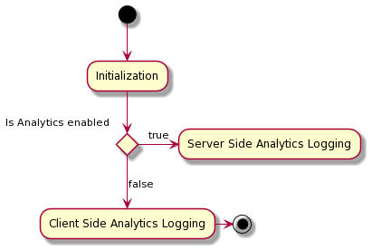

# Registro de Adobe Analytics for Target (A4T) en Experience Platform Web SDK

Al utilizar Adobe Target para la personalización, puede elegir qué sistema desea utilizar para la medición del rendimiento. Cada [actividad de Target](https://experienceleague.adobe.com/docs/target/using/activities/target-activities-guide.html) le permite seleccionar entre informes de Target y de Adobe Analytics.

Si utiliza los informes de Analytics, Adobe Target debe comunicar lo siguiente a Analytics:

* Qué actividad de Adobe Target han ingresado los visitantes
* Qué experiencia han visto
* Qué conversión se ha alcanzado

Adobe Experience Platform Web SDK admite dos tipos de registro de Analytics para casos de uso de Analytics for Target (A4T):

| Método de registro | Descripción |
| --- | --- |
| Registro de Analytics en el lado del servidor | Todas las visitas de Analytics enviadas a través de Edge Network se aumentan con los detalles de Target en el servidor, sin tener que pasar por el proceso de vinculación de visitas. |
| Registro de Analytics en el cliente | Los datos de destino se devuelven en el lado del cliente, lo que le permite aumentar y enviar datos manualmente a Analytics mediante la [API de inserción de datos](https://experienceleague.adobe.com/docs/analytics/import/c-data-insertion-api.html). |

El método de registro viene determinado por si tiene Adobe Analytics habilitado en su [secuencia de datos](../../../../datastreams/overview.md) configurada:

## Pasos siguientes

Este documento proporciona una breve introducción a los diferentes métodos de registro para datos de A4T en Web SDK. Para obtener información más detallada sobre cada uno de estos métodos, consulte la siguiente documentación:

* [Registro del lado del servidor para datos de A4T en Experience Platform Web SDK](./server-side.md)
* [Registro del lado del cliente para datos de A4T en Experience Platform Web SDK](./client-side.md)
