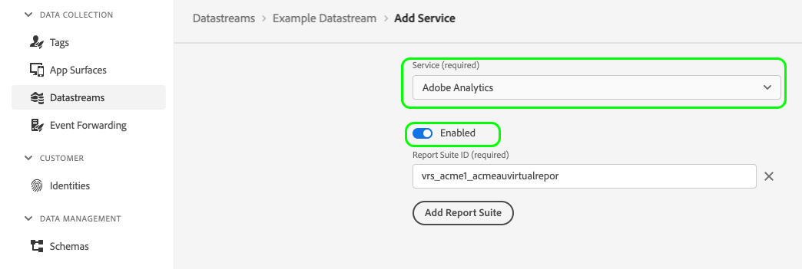

# Registro del lado del servidor para datos de A4T en Experience Platform Web SDK

Adobe Experience Platform Web SDK le permite implementar la funcionalidad de Adobe Analytics for Target (A4T) en Experience Platform Edge Network. Cuando el registro del lado del servidor está habilitado, todas las visitas de Analytics enviadas a través de Edge Network se aumentan con detalles de Target en el lado del servidor, sin tener que pasar por el proceso de vinculación de visitas.

El registro del lado del servidor para Analytics está habilitado cuando Analytics está habilitado en la configuración del flujo de datos:

El diagrama siguiente muestra cómo fluyen los datos a través del sistema cuando el registro de Analytics en el lado del servidor está habilitado:

## Pasos siguientes

En esta guía se describe el registro en el lado del servidor para datos de A4T en Web SDK. Consulte la guía de [registro en el lado del cliente](./client-side.md) para obtener más información sobre cómo administrar los datos de A4T en el lado del cliente.
