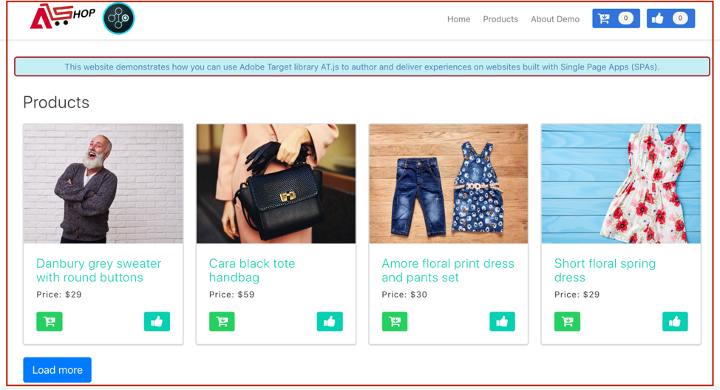
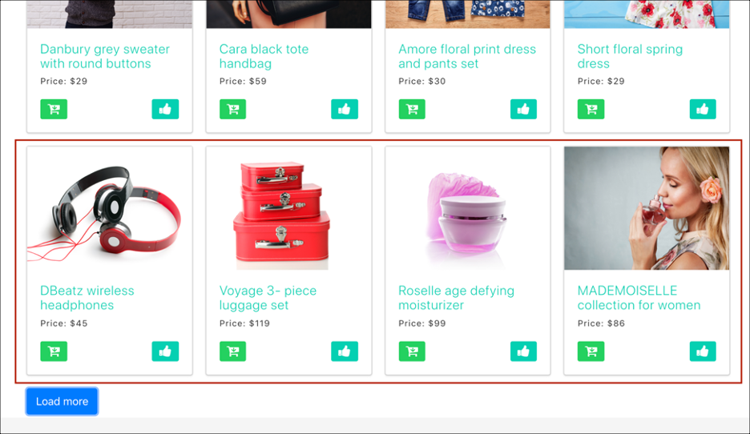
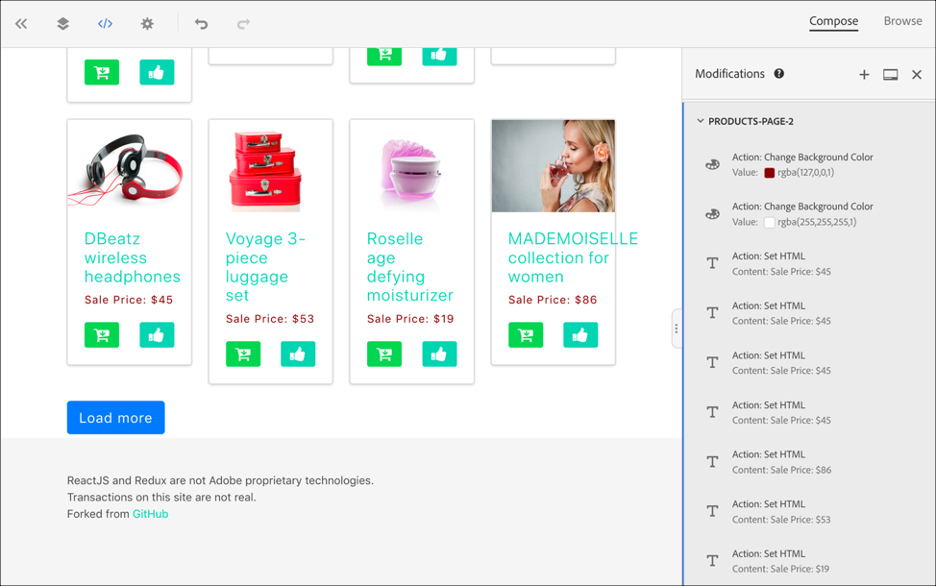
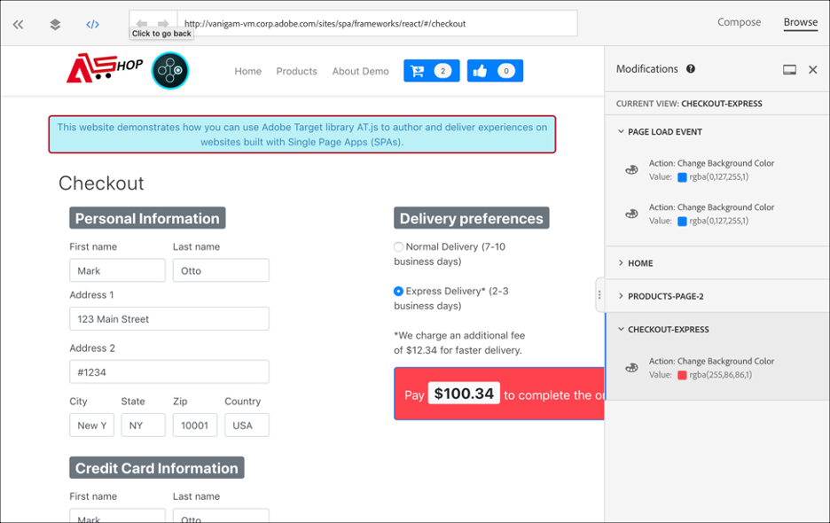

# Implementación de aplicación de una sola página

El SDK web de Adobe Experience Platform SPA proporciona funciones enriquecidas que permiten a su empresa ejecutar personalizaciones en tecnologías de próxima generación del lado del cliente, como aplicaciones de una sola página ().

Los sitios web tradicionales funcionaban en modelos de navegación &quot;página a página&quot;, conocidos como aplicaciones de varias páginas, en las que los diseños de sitios web se asociaban perfectamente a direcciones URL y transiciones de una página web a otra requerida para la carga de páginas.

Las aplicaciones web modernas, como las aplicaciones de una sola página, han adoptado un modelo que impulsa el uso rápido de la representación de la interfaz de usuario del explorador, que a menudo es independiente de las recargas de página. Estas experiencias se pueden activar mediante interacciones de clientes, como desplazamientos, clics y movimientos del cursor. A medida que los paradigmas de la web moderna evolucionan, la importancia de los eventos genéricos tradicionales, como la carga de páginas, para implementar la personalización y la experimentación, ya no es tanta.


## SPA Ventajas del SDK web de Platform para la creación de informes de

Estas son algunas ventajas de utilizar el SDK web de Adobe Experience Platform para aplicaciones de una sola página:

* Capacidad de almacenar en caché todas las ofertas de carga de página para reducir varias llamadas al servidor a una sola llamada al servidor.
* Enorme mejora de la experiencia del usuario en su sitio porque las ofertas se muestran inmediatamente a través de la caché sin agotar el tiempo introducido por las llamadas tradicionales al servidor.
* SPA Una sola línea de código y una configuración de desarrollador única permiten a los especialistas en marketing crear y ejecutar actividades A/B y de segmentación de experiencias (XT) a través del Compositor de experiencias visuales (VEC) en su.

## Vistas de XDM y aplicaciones de una sola página

El VEC de Adobe Target SPA SPA para la visualización de datos se basa en un concepto llamado Vistas: un grupo lógico de elementos visuales que, juntos, constituyen una experiencia de. Por lo tanto, una aplicación de una sola página puede considerarse como una transición entre vistas (en lugar de las direcciones URL) según las interacciones del usuario. Una vista suele representar un sitio completo o elementos visuales agrupados dentro de un sitio.

Para explicar más en detalle cuáles son las vistas, el siguiente ejemplo utiliza un sitio hipotético de comercio electrónico en línea implementado en React para explorar las vistas de ejemplo.

Después de navegar al sitio principal, una imagen promociona una venta de Pascua, así como los productos más recientes disponibles en el sitio. En este caso, se podría definir una Vista para toda la pantalla de inicio. Esta vista podría llamarse simplemente &quot;home&quot;.


A medida que el cliente se interesa más por los productos que vende la empresa, decide hacer clic en el **Productos** vínculo. De manera similar a la página de inicio, se puede definir todo el sitio del producto como una vista. Esta vista podría denominarse &quot;products-all&quot;.



Dado que una vista puede definirse como un sitio completo o un grupo de elementos visuales en un sitio, los cuatro productos mostrados en el sitio de productos pueden agruparse y considerarse como una vista. Esta vista podría llamarse &quot;productos&quot;.


Cuando el cliente decida hacer clic en **Cargar más** para explorar más productos en el sitio, la dirección URL del sitio web no cambia en este caso, pero se puede crear una vista aquí para representar solo la segunda fila de productos que se muestran. El nombre de la vista puede ser &quot;products-page-2&quot;.


El cliente decide adquirir algunos productos en el sitio y pasa a la pantalla de pago. En el sitio de cierre de compra, el cliente tiene la opción de elegir entre envío normal o exprés. Una vista puede ser cualquier grupo de elementos visuales en un sitio, por lo que se puede crear una vista para las preferencias de envío y llamarse &quot;Preferencias de envío&quot;.


El concepto de Vistas puede ampliarse mucho más. Estos son solo algunos ejemplos de vistas que se pueden definir en un sitio.

## Implementación de vistas XDM

Las vistas XDM se pueden aprovechar en Adobe Target SPA para que los especialistas en marketing puedan ejecutar pruebas A/B y XT en los usuarios a través del Compositor de experiencias visuales (VEC). Esto requiere realizar los siguientes pasos para completar una configuración de desarrollador única:

1. Instalar [SDK web de Adobe Experience Platform](/help/web-sdk/install/overview.md)
2. Determine todas las vistas XDM de la aplicación de una sola página que desee personalizar.
3. Después de definir las vistas XDM, para ofrecer actividades AB o XT de VEC, implemente la variable `sendEvent()` función con `renderDecisions` establezca en `true` y la vista XDM correspondiente en la aplicación de una sola página. Se debe pasar la vista XDM `xdm.web.webPageDetails.viewName`. Este paso permite a los especialistas en marketing aprovechar el Compositor de experiencias visuales para iniciar pruebas A/B y XT para esos XDM.

   ```javascript
   alloy("sendEvent", { 
     "renderDecisions": true, 
     "xdm": { 
       "web": { 
         "webPageDetails": { 
         "viewName":"home" 
         }
       } 
     } 
   });
   ```

>[!NOTE]
>
>En la primera `sendEvent()` Llamada de, se recuperarán y almacenarán en caché todas las vistas XDM que se deban procesar al usuario final. Posterior `sendEvent()` las llamadas de con vistas XDM pasadas se leerán desde la caché y se procesarán sin una llamada al servidor.

## `sendEvent()` ejemplos de funciones

Esta sección describe tres ejemplos que muestran cómo invocar el `sendEvent()` SPA función en React para un hipotético servicio de comercio electrónico

### Ejemplo 1: página principal de la prueba A/B

El equipo de marketing desea ejecutar pruebas A/B en toda la página de inicio.


Para ejecutar pruebas A/B en todo el sitio principal, `sendEvent()` se debe invocar con el XDM `viewName` establezca en `home`:

```jsx
function onViewChange() { 
  
  var viewName = window.location.hash; // or use window.location.pathName if router works on path and not hash 

  viewName = viewName || 'home'; // view name cannot be empty 

  // Sanitize viewName to get rid of any trailing symbols derived from URL 

  if (viewName.startsWith('#') || viewName.startsWith('/')) { 
    viewName = viewName.substr(1); 
  }
   
  alloy("sendEvent", { 
    "renderDecisions": true, 
    "xdm": { 
      "web": { 
        "webPageDetails": { 
          "viewName":"home" 
        } 
      } 
    }
  }); 
} 

// react router v4 

const history = syncHistoryWithStore(createBrowserHistory(), store); 

history.listen(onViewChange); 

// react router v3 

<Router history={hashHistory} onUpdate={onViewChange} > 
```

### Ejemplo 2: Productos personalizados

El equipo de marketing desea personalizar la segunda fila de productos cambiando el color de la etiqueta de precio a rojo después de que un usuario haga clic en **Cargar más**.



```jsx
function onViewChange(viewName) { 

  alloy("sendEvent", { 
    "renderDecisions": true, 
    "xdm": { 
      "web": { 
        "webPageDetails": { 
          "viewName": viewName
        }
      } 
    } 
  }); 
} 

class Products extends Component { 
  
  render() { 
    return ( 
      <button type="button" onClick={this.handleLoadMoreClicked}>Load more</button> 
    ); 
  } 

  handleLoadMoreClicked() { 
    var page = this.state.page + 1; // assuming page number is derived from component's state 
    this.setState({page: page}); 
    onViewChange('PRODUCTS-PAGE-' + page); 
  } 

} 
```

### Ejemplo 3: Preferencias de envío de la prueba A/B

El equipo de marketing desea ejecutar una prueba A/B para ver si el cambio del color del botón de azul a rojo al **Envío exprés** está seleccionado para mejorar las conversiones (en lugar de mantener el botón de color azul en ambas opciones de envío).


Para personalizar el contenido del sitio según las preferencias de envío que esté seleccionada, se puede crear una vista para cada preferencia de entrega. Cuándo **Envío normal** está seleccionado, la Vista puede llamarse &quot;checkout-normal&quot;. If **Envío exprés** está seleccionado, la Vista puede llamarse &quot;checkout-express&quot;.

```jsx
function onViewChange(viewName) { 
  alloy("sendEvent", { 
    "renderDecisions": true, 
    "xdm": { 
      "web": { 
        "webPageDetails": { 
          "viewName": viewName 
        }
      }
    }
  }); 
} 

class Checkout extends Component { 

  render() { 
    return ( 
      <div onChange={this.onDeliveryPreferenceChanged}> 
        <label> 
          <input type="radio" id="normal" name="deliveryPreference" value={"Normal Delivery"} defaultChecked={true}/> 
          <span> Normal Delivery (7-10 business days)</span> 
        </label> 
        <label> 
          <input type="radio" id="express" name="deliveryPreference" value={"Express Delivery"}/> 
          <span> Express Delivery* (2-3 business days)</span> 
        </label> 
      </div> 
    ); 
  } 

  onDeliveryPreferenceChanged(evt) { 
    var selectedPreferenceValue = evt.target.value; 
    onViewChange(selectedPreferenceValue); 
  } 

} 
```

## SPA Uso del Compositor de experiencias visuales para una experiencia de usuario

Cuando haya terminado de definir las vistas XDM e implementado `sendEvent()` Una vez pasadas las vistas XDM, el VEC podrá detectar estas vistas y permitir a los usuarios crear acciones y modificaciones para las actividades A/B o XT.

>[!NOTE]
>
>SPA Para utilizar el VEC para su, debe instalar y activar el [Firefox](https://addons.mozilla.org/en-US/firefox/addon/adobe-target-vec-helper/) o [Chrome](https://chrome.google.com/webstore/detail/adobe-target-vec-helper/ggjpideecfnbipkacplkhhaflkdjagak) Extensión de VEC Helper.

### Panel de modificaciones

El panel Modificaciones captura las acciones creadas para una vista en particular. Todas las acciones de una vista se agrupan debajo de esa vista.


### Acciones

Al hacer clic en una acción se resalta el elemento del sitio donde se aplicará esta acción. Cada acción del VEC creada en una Vista tiene los iconos siguientes: **Información**, **Editar**, **Clonar**, **Mover**, y **Eliminar**. Estos iconos se explican con más detalle en la tabla siguiente.


| Icono | Descripción |
|---|---|
| Información | Muestra los detalles de esta acción. |
| Editar | Permite editar las propiedades de esta acción directamente. |
| Clonar | Clona la acción a una o varias vistas del panel Modificaciones o a una o varias vistas a las que ha llegado a través del VEC. La acción no tiene que incluirse necesariamente en el panel Modificaciones.<br/><br/>**Nota:** Después de realizar una operación de clonado, debe navegar a la vista en el VEC a través de Examinar para ver si la acción clonada era una operación válida. Si la acción no se puede aplicar a la vista, aparecerá un error. |
| Mover | Mueve la acción a un Evento de carga de página o a cualquier otra Vista que ya se encuentre en el panel Modificaciones.<br/><br/>**Evento de carga de página:** Cualquier acción correspondiente al evento de carga de página se aplica en la carga inicial de la página web. <br/><br/>**Nota:** Después de realizar una operación de movimiento, debe navegar a la vista en el VEC a través de Examinar para ver si el movimiento era una operación válida. Si la acción no se puede aplicar a la vista, aparecerá un error. |
| Eliminar | Elimina la acción. |

## SPA Uso del VEC para ver ejemplos de la

En esta sección se describen tres ejemplos de cómo usar el Compositor de experiencias visuales para crear acciones y modificaciones para actividades A/B o XT.

### Ejemplo 1: Actualizar la vista &quot;principal&quot;

Anteriormente en este documento, se definía una vista denominada &quot;inicio&quot; para todo el sitio principal. Ahora, el equipo de marketing desea actualizar la vista &quot;principal&quot; de las siguientes maneras:

* Cambie el **Añadir al carro** y **Like** botones a una parte más clara de azul. Esto debería suceder durante la carga de la página, ya que implica cambiar los componentes del encabezado.
* Cambie el **Productos más recientes para 2019** etiquetar como **Productos más populares para 2019** y cambie el color del texto a morado.

Para realizar estas actualizaciones en el VEC, seleccione **Escribir** y aplique esos cambios a la vista &quot;principal&quot;.


### Ejemplo 2: Cambiar etiquetas de producto

Para la vista &quot;products-page-2&quot;, el equipo de marketing desea cambiar la **Precio** etiquetar como **Precio de venta** y cambie el color de la etiqueta a rojo.

Para realizar estas actualizaciones en el VEC, se requieren los siguientes pasos:

1. Seleccionar **Examinar** en el VEC.
2. Seleccionar **Productos** en la barra de navegación superior del sitio.
3. Seleccionar **Cargar más** una vez para ver la segunda fila de productos.
4. Seleccionar **Escribir** en el VEC.
5. Aplicar acciones para cambiar la etiqueta de texto a **Precio de venta** y el color al rojo.



### Ejemplo 3: Personalizar el estilo de preferencias de entrega

Las vistas se pueden definir a nivel granular, como un estado o una opción de un botón de opción. Anteriormente, en este documento, las vistas se definían para las preferencias de entrega, &quot;cierre de compra normal&quot; y &quot;cierre de compra exprés&quot;. El equipo de marketing desea cambiar el color del botón a rojo para la vista &quot;checkout-express&quot;.

Para realizar estas actualizaciones en el VEC, se requieren los siguientes pasos:

1. Seleccionar **Examinar** en el VEC.
2. Agregar productos al carro de compras en el sitio.
3. Seleccione el icono de carro de compras en la esquina superior derecha del sitio.
4. Seleccionar **Cierre su pedido**.
5. Seleccione el **Envío exprés** botón de opción debajo de **Preferencias de envío**.
6. Seleccionar **Escribir** en el VEC.
7. Cambie el **Pagar** color del botón en rojo.

>[!NOTE]
>
>La vista &quot;Pago y envío exprés&quot; no aparece en el panel Modificaciones hasta que aparece el mensaje **Envío exprés** botón de opción seleccionado. Esto se debe a que `sendEvent()` se ejecuta cuando la función **Envío exprés** El botón de opción está seleccionado, por lo tanto el VEC no tiene conocimiento de la vista &quot;checkout-express&quot; hasta que se selecciona el botón de opción.


