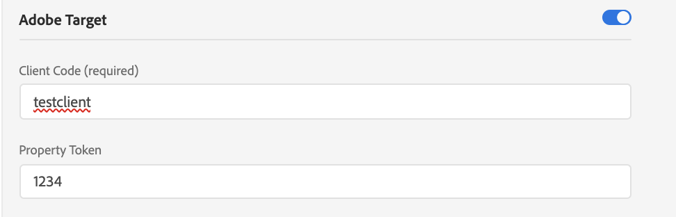

# Comparación de la biblioteca at.js con Web SDK

## Información general

Este artículo proporciona información general sobre las diferencias entre la biblioteca `at.js` y Experience Platform Web SDK.

## Instalación de las bibliotecas

### Instalación de at.js

Permitimos a nuestros clientes descargar la biblioteca directamente desde Adobe Experience Cloud, pestaña Implementación. La biblioteca at.js se personaliza con opciones que el cliente tiene como: clientCode, imsOrgId, etc.

### Instalación de Web SDK

La versión prediseñada está disponible en una CDN. Puede hacer referencia a la biblioteca en la CDN directamente en la página o descargarla y alojarla en su propia infraestructura. Está disponible en formatos minificado y no minificado. La versión no minificada es útil para la depuración.

Consulte [Instalar Web SDK mediante la biblioteca JavaScript](/help/web-sdk/install/library.md) para obtener más información.

## Configuración de las bibliotecas

### Configuración de at.js

Al final de cada archivo at.js encontrará una sección en la que creamos una instancia y pasamos un objeto de configuración. Es personalizable, en la descarga rellenamos esa sección con la configuración actual del cliente.

```javascript
window.adobe.target.init(window, document, {
  "clientCode": "demo",
  "imsOrgId": "",
  "serverDomain": "localhost:5000",
  "timeout": 2000,
  "globalMboxName": "target-global-mbox",
  "version": "2.0.0",
  "defaultContentHiddenStyle": "visibility: hidden;",
  "defaultContentVisibleStyle": "visibility: visible;",
  "bodyHiddenStyle": "body {opacity: 0 !important}",
  "bodyHidingEnabled": true,
  "deviceIdLifetime": 63244800000,
  "sessionIdLifetime": 1860000,
  "selectorsPollingTimeout": 5000,
  "visitorApiTimeout": 2000,
  "overrideMboxEdgeServer": false,
  "overrideMboxEdgeServerTimeout": 1860000,
  "optoutEnabled": false,
  "optinEnabled": false,
  "secureOnly": false,
  "supplementalDataIdParamTimeout": 30,
  "authoringScriptUrl": "//cdn.tt.omtrdc.net/cdn/target-vec.js",
  "urlSizeLimit": 2048,
  "endpoint": "/rest/v1/delivery",
  "pageLoadEnabled": true,
  "viewsEnabled": true,
  "analyticsLogging": "server_side",
  "serverState": {},
  "decisioningMethod": "server-side",
  "legacyBrowserSupport":  false
});
```

[Más información](https://experienceleague.adobe.com/docs/target/using/implement-target/client-side/at-js-implementation/functions-overview/targetgobalsettings.html?lang=es)


### Configuración de Web SDK

La configuración de SDK se completó con el comando [`configure`](/help/web-sdk/commands/configure/overview.md). Se llama primero al comando `configure` *siempre*.

## Cómo solicitar y procesar automáticamente ofertas de Page Load Target

### Uso de at.js

Con at.js 2.x, si habilita la configuración `pageLoadEnabled`, la biblioteca almacenará en déclencheur una llamada al Edge de Target con `execute -> pageLoad`. Si todos los ajustes se establecen en los valores predeterminados, no es necesaria ninguna codificación personalizada. Una vez que at.js se añade a la página y el explorador lo carga, se ejecuta una llamada de Edge de Target.

### Uso de Web SDK

El contenido creado en el [Compositor de experiencias visuales](https://experienceleague.adobe.com/docs/target/using/experiences/vec/visual-experience-composer.html?lang=es) de Adobe Target se puede recuperar y procesar automáticamente en SDK.

Para solicitar y procesar automáticamente ofertas de Target, use el comando `sendEvent` y establezca la opción `renderDecisions` en `true`. Al hacerlo, SDK debe procesar automáticamente todo el contenido personalizado que sea apto para el procesamiento automático.

Por ejemplo:

```javascript
alloy("sendEvent", {
  "renderDecisions": true,
  "xdm": {
    "commerce": {
      "order": {
        "purchaseID": "a8g784hjq1mnp3",
        "purchaseOrderNumber": "VAU3123",
        "currencyCode": "USD",
        "priceTotal": 999.98
      }
    }
  }
});
```

Experience Platform Web SDK envía automáticamente una notificación con las ofertas ejecutadas por WEB SDK. Este es un ejemplo del aspecto de una carga útil de solicitud de notificación:

```json
{
  "events": [{
      "xdm": {
        "_experience": {
          "decisioning": {
            "propositions": [
              {
                "id": "AT:eyJhY3Rpdml0eUlkIjoiMTI3MDE5IiwiZXhwZXJpZW5jZUlkIjoiMCJ9",
                "scope": "cart",
                "scopeDetails": {
                  "decisionProvider": "TGT",
                  "activity": {
                    "id": "127019"
                  },
                  "experience": {
                    "id": "0"
                  },
                  "strategies": [
                    {
                      "step": "entry",
                      "algorithmID": "0",
                      "trafficType": "0"
                    },
                    {
                      "step": "display",
                      "algorithmID": "0",
                      "trafficType": "0"
                    }
                  ],
                  "characteristics": {
                    "eventToken": "bKMxJ8dCR1XlPfDCx+2vSGqipfsIHvVzTQxHolz2IpSCnQ9Y9OaLL2gsdrWQTvE54PwSz67rmXWmSnkXpSSS2Q=="
                  }
                }
              }
            ]
          }
        },
        "eventType": "display",
        "web": {
          "webPageDetails": {
            "viewName": "cart",
            "URL": "https://alloyio.com/personalizationSpa/cart"
          },
          "webReferrer": {
            "URL": ""
          }
        },
        "device": {
          "screenHeight": 800,
          "screenWidth": 1280,
          "screenOrientation": "landscape"
        },
        "environment": {
          "type": "browser",
          "browserDetails": {
            "viewportWidth": 1280,
            "viewportHeight": 284
          }
        },
        "placeContext": {
          "localTime": "2021-12-10T15:50:34.467+02:00",
          "localTimezoneOffset": -120
        },
        "timestamp": "2021-12-10T13:50:34.467Z",
        "implementationDetails": {
          "name": "https://ns.adobe.com/experience/alloy",
          "version": "2.6.2",
          "environment": "browser"
        }
      }
    }
  ]
}
```

[Más información](../rendering-personalization-content.md)

## Cómo solicitar y NO procesar automáticamente ofertas de Page Load Target

### Uso de at.js

Hay dos maneras de activar una llamada a Target Edge que recuperará ofertas para la carga de página.

Ejemplo 1:

```javascript
adobe.target.getOffer({
   mbox: "target-global-mbox", 
   success: console.log,
   error: console.error
});
```

Ejemplo 2:

```javascript
adobe.target.getOffers({
    request: {
      execute: {
        pageLoad: {}
    }
  }
})
.then(console.log)
.catch(console.error);
```

[Más información](https://experienceleague.adobe.com/docs/target/using/implement-target/client-side/at-js-implementation/functions-overview/cmp-atjs-functions.html?lang=es)

### Uso de Web SDK

Ejecute un comando `sendEvent` con un ámbito especial en `decisionScopes`: `__view__`. Utilizamos este ámbito como señal para recuperar todas las actividades de carga de página de Target y recuperar previamente todas las vistas. Web SDK también intentará evaluar todas las actividades basadas en vistas del VEC. Actualmente, Web SDK no admite la deshabilitación de la recuperación previa de vistas.

Para acceder a cualquier contenido de personalización, puede proporcionar una función de llamada de retorno a la que se llamará después de que SDK reciba una respuesta correcta del servidor. La llamada de retorno se proporciona como un objeto result, que puede contener la propiedad propositions que contiene cualquier contenido de personalización devuelto.

Por ejemplo:

```javascript
alloy("sendEvent", {
    xdm: {...},
    decisionScopes: ["__view__"]
  }).then(function(result) {
    if (result.propositions) {
      result.propositions.forEach(proposition => {
        proposition.items.forEach(item => {
          if (item.schema === HTML_SCHEMA) {
            // manually apply offer
            document.getElementById("form-based-offer-container").innerHTML =
              item.data.content;
            const executedPropositions = [
              {
                id: proposition.id,
                scope: proposition.scope,
                scopeDetails: proposition.scopeDetails
              }
            ];
          // manually send the display notification event, so that Target/Analytics impressions aare increased
            alloy("sendEvent",{
              "xdm": {
                "eventType": "decisioning.propositionDisplay",
                "_experience": {
                  "decisioning": {
                    "propositions": executedPropositions
                  }
                }
              }
            });
          }
        });
      });
    }
  });
```

[Más información](../rendering-personalization-content.md#manually-rendering-content)


## Cómo solicitar mboxes específicos de Form Based Target


### Uso de at.js

Puede recuperar actividades del Compositor basado en formularios utilizando la función `getOffer`:

Ejemplo 1:

```javascript
adobe.target.getOffer({
   mbox: "hero-banner", 
   success: console.log,
   error: console.error
});
```

Ejemplo 2:

```javascript
adobe.target.getOffers({
    request: {
      execute: {
        mboxes: [
        {
          index: 0,
          name: "hero-banner"
        }]
    }
  }
})
.then(console.log)
.catch(console.error);
```

[Más información](https://experienceleague.adobe.com/docs/target/using/implement-target/client-side/at-js-implementation/functions-overview/cmp-atjs-functions.html?lang=es)


### Uso de Web SDK

Puede recuperar actividades basadas en el Compositor basado en formularios utilizando el comando `sendEvent` y pasando los nombres de mbox en la opción `decisionScopes`. El comando `sendEvent` devolverá una promesa que se resolverá con un objeto que contenga las actividades/propuestas solicitadas:
Este es el aspecto de la matriz `propositions`:

```javascript
[
  {
    "id": "AT:eyJhY3Rpdml0eUlkIjoiNDM0Njg5IiwiZXhwZXJpZW5jZUlkIjoiMCJ9",
    "scope": "hero-banner",
    "scopeDetails": {
      "decisionProvider": "TGT",
      "activity": {
        "id": "434689"
      },
      "experience": {
        "id": "0"
      },
      "strategies": [
        {
          "algorithmID": "0",
          "trafficType": "0"
        }
      ],
      "characteristics": {
        "eventToken": "2lTS5KA6gj4JuSjOdhqUhGqipfsIHvVzTQxHolz2IpTMromRrB5ztP5VMxjHbs7c6qPG9UF4rvQTJZniWgqbOw=="
      }
    },
    "items": [
      {
        "id": "1184844",
        "schema": "https://ns.adobe.com/personalization/html-content-item",
        "meta": {
          "geo.state": "bucuresti",
          "activity.id": "434689",
          "experience.id": "0",
          "activity.name": "a4t test form based activity",
          "offer.id": "1184844",
          "profile.tntId": "04608610399599289452943468926942466370-pybgfJ"
        },
        "data": {
          "id": "1184844",
          "format": "text/html",
          "content": "<div> analytics impressions </div>"
        }
      }
    ]
  },
  {
    "id": "AT:eyJhY3Rpdml0eUlkIjoiNDM0Njg5IiwiZXhwZXJpZW5jZUlkIjoiMCJ9",
    "scope": "hero-banner",
    "scopeDetails": {
      "decisionProvider": "TGT",
      "activity": {
        "id": "434689"
      },
      "characteristics": {
        "eventToken": "E0gb6q1+WyFW3FMbbQJmrg=="
      }
    },
    "items": [
      {
        "id": "434689",
        "schema": "https://ns.adobe.com/personalization/measurement",
        "data": {
          "type": "click",
          "format": "application/vnd.adobe.target.metric"
        }
      }
    ]
  }
]
```

Por ejemplo:

```javascript
alloy("sendEvent", {
  xdm: { ...},
  decisionScopes: ["hero-banner"]
}).then(function (result) {
  var propositions = result.propositions;

  if (propositions) {
    // Find the discount proposition, if it exists.
    for (var i = 0; i < propositions.length; i++) {
      var proposition = propositions[i];
      for (var j = 0; j < proposition.items; j++) {
        var item = proposition.items[j];
        if (item.schema === HTML_SCHEMA) {
          // apply offer
          document.getElementById("form-based-offer-container").innerHTML =
            item.data.content;
          const executedPropositions = [
            {
              id: proposition.id,
              scope: proposition.scope,
              scopeDetails: proposition.scopeDetails
            }
          ];

          alloy("sendEvent", {
            "xdm": {
              "eventType": "decisioning.propositionDisplay",
              "_experience": {
                "decisioning": {
                  "propositions": executedPropositions
                }
              }
            }
          });
        }
      }
    }
  }
});
```

[Más información](../rendering-personalization-content.md#manually-rendering-content)

## Aplicación de las actividades de Target

### Uso de at.js

Puede aplicar las actividades de Target usando la función `applyOffers`: `adobe.target.applyOffer(options)`

Por ejemplo:

```javascript
adobe.target.getOffers({...})
  .then(response => adobe.target.applyOffers({ response: response }))
  .then(() => console.log("Success"))
  .catch(error => console.log("Error", error));
```

Obtenga más información acerca del comando `applyOffers` en la [documentación dedicada](https://experienceleague.adobe.com/docs/target/using/implement-target/client-side/at-js-implementation/functions-overview/adobe-target-applyoffers-atjs-2.html?lang=es).


### Uso de Web SDK

Puede aplicar las actividades de Target usando el comando `applyPropositions`.

Por ejemplo:

```javascript
alloy("applyPropositions", {
    propositions: [...]
});
```

Obtenga más información acerca del comando `applyPropositions` en la [documentación dedicada](../../personalization/rendering-personalization-content.md#applypropositions).

## Seguimiento de eventos

### Uso de at.js

Puede realizar el seguimiento de eventos mediante la función `trackEvent` o mediante `sendNotifications`.

Esta función activa una solicitud para informar de las acciones del usuario, como clics y conversiones. No ofrece actividades en la respuesta.


**Ejemplo 1**

```javascript
adobe.target.trackEvent({ 
    "type": "click",
    "mbox": "some-mbox"
});
```

**Ejemplo 2**

```javascript
adobe.target.sendNotifications({ 
    request: {
       notifications: [{
          ...,
          mbox: {
            name: "some-mbox"
          },
          type: "click",
          ...
       }]
    }
});
```

[Más información](https://experienceleague.adobe.com/docs/target/using/implement-target/client-side/at-js-implementation/functions-overview/adobe-target-trackevent.html?lang=es)

### Uso de Web SDK

Puede realizar un seguimiento de eventos y acciones del usuario llamando al comando `sendEvent`, rellenando el grupo de campos XDM `_experience.decisioning.propositions` y estableciendo `eventType` en uno de los dos valores siguientes:

* `decisioning.propositionDisplay`: indica la representación de la actividad de Target.
* `decisioning.propositionInteract`: indica la interacción de un usuario con la actividad, como un clic del ratón.

El grupo de campos XDM `_experience.decisioning.propositions` es una matriz de objetos. Las propiedades de cada objeto se derivan del objeto `result.propositions` devuelto en el comando `sendEvent`: `{ id, scope, scopeDetails }`

**Ejemplo 1 - Rastrear un evento `decisioning.propositionDisplay` después de procesar una actividad**

```javascript
alloy("sendEvent", {
  xdm: {},
  decisionScopes: ['discount']
}).then(function(result) {
  var propositions = result.propositions;

  var discountProposition;
  if (propositions) {
    // Find the discount proposition, if it exists.
    for (var i = 0; i < propositions.length; i++) {
      var proposition = propositions[i];
      if (proposition.scope === "discount") {
        discountProposition = proposition;
        break;
      }
    }
  }

  if (discountProposition) {
    // Find the item from proposition that should be rendered.
    // Rather than assuming there a single item that has HTML
    // content, find the first item whose schema indicates
    // it contains HTML content.
    for (var j = 0; j < discountProposition.items.length; j++) {
      var discountPropositionItem = discountProposition.items[i];
      if (discountPropositionItem.schema === "https://ns.adobe.com/personalization/html-content-item") {
        var discountHtml = discountPropositionItem.data.content;
        // Render the content
        var dailySpecialElement = document.getElementById("daily-special");
        dailySpecialElement.innerHTML = discountHtml;
        
        // For this example, we assume there is only a single place to update in the HTML.
        break;  
      }
    }
    // Send a "decisioning.propositionDisplay" event signaling that the proposition has been rendered.
    alloy("sendEvent", {
      "xdm": {
        "eventType": "decisioning.propositionDisplay",
        "_experience": {
          "decisioning": {
            "propositions": [{
              "id": id,
              "scope": scope,
              "scopeDetails": scopeDetails
            }],
            "propositionEventType": {
              "display": 1
            }
          }
        }
      }
    });
  }
});
```

**Ejemplo 2 - Rastrear un evento `decisioning.propositionInteract` después de que se produzca una métrica de clics**

```javascript
alloy("sendEvent", {
  xdm: { ...},
  decisionScopes: ["hero-banner"]
}).then(function (result) {
  var propositions = result.propositions;

  if (propositions) {
    // Find the discount proposition, if it exists.
    for (var i = 0; i < propositions.length; i++) {
      var proposition = propositions[i];
      for (var j = 0; j < proposition.items.length; j++) {
        var item = proposition.items[j];

        if (item.schema === "https://ns.adobe.com/personalization/measurement") {
          // add metric to the DOM element
          const button = document.getElementById("form-based-click-metric");

          button.addEventListener("click", event => {
            const executedPropositions = [
              {
                id: proposition.id,
                scope: proposition.scope,
                scopeDetails: proposition.scopeDetails
              }
            ];
            // send the click track event
            alloy("sendEvent", {
              "xdm": {
                "eventType": "decisioning.propositionInteract",
                "_experience": {
                  "decisioning": {
                    "propositions": executedPropositions
                  }
                }
              }
            });
          });
        }
      }
    }
  }
});
```

[Más información](../rendering-personalization-content.md#manually-rendering-content)

**Ejemplo 3 - Rastrear un evento desencadenado después de realizar una acción**

Este ejemplo rastrea un evento que se activó después de realizar una acción específica, como hacer clic en un botón.
Puede agregar cualquier parámetro personalizado adicional a través del objeto de datos `__adobe.target`.

También puede agregar el objeto XDM `commerce`.

```js
alloy("sendEvent", {
    "xdm": {
        "_experience": {
            "decisioning": {
                "propositions": [
                    {
                        "scope": "orderConfirm" //example scope name
                    }
                ],
                "propositionEventType": {
                    "display": 1
                }
            }
        },
        "eventType": "decisioning.propositionDisplay"
    },
    "commerce": {
        "order": {
            "purchaseID": "a8g784hjq1mnp3",
            "purchaseOrderNumber": "VAU3123",
            "currencyCode": "USD",
            "priceTotal": 999.98
        }
    },
    "data": {
        "__adobe": {
            "target": {
                "pageType": "Order Confirmation",
                "user.categoryId": "Insurance"
            }
        }
    }
})
```

## Cómo almacenar en déclencheur un cambio de vista en una aplicación de una sola página

### Uso de at.js

Usar la función `adobe.target.triggerView`. Se puede llamar a esta función cada vez que se carga una página nueva o cuando se vuelve a procesar un componente de una página. adobe.target.triggerView() debe implementarse para aplicaciones de una sola página (SPA) a fin de utilizar el Compositor de experiencias visuales (VEC) para crear pruebas A/B y actividades de segmentación de experiencias (XT). Si adobe.target.triggerView() no se implementa en el sitio, el VEC no se puede utilizar para SPA.

**Ejemplo**

```javascript
adobe.target.triggerView("homeView")
```

[Más información](https://experienceleague.adobe.com/docs/target/using/implement-target/client-side/at-js-implementation/functions-overview/adobe-target-triggerview-atjs-2.html?lang=es)


### Uso de Web SDK

Para enviar un déclencheur o una señal de cambio de vista de aplicación de una sola página, establezca la propiedad `web.webPageDetails.viewName` en la opción `xdm` del comando `sendEvent`. Web SDK comprobará la caché de vistas; si hay ofertas para `viewName` especificado en `sendEvent`, las ejecutará y enviará un evento de notificación de visualización.

**Ejemplo**

```javascript
alloy("sendEvent", {
  renderDecisions: true,
  xdm:{
    web:{
      webPageDetails:{
        viewName: "homeView"
      }
    }
  }
});
```

[Más información](./spa-implementation.md#implementing-xdm-views)

## Cómo aprovechar los tokens de respuesta

El contenido de Personalization devuelto desde Adobe Target incluye [tokens de respuesta](https://experienceleague.adobe.com/docs/target/using/administer/response-tokens.html?lang=es), que son detalles acerca de la actividad, oferta, experiencia, perfil de usuario, información geográfica y más. Estos detalles se pueden compartir con herramientas de terceros o utilizar para la depuración. Los tokens de respuesta se pueden configurar en la interfaz de usuario de Adobe Target.

### Uso de at.js

Utilice eventos personalizados de at.js para detectar la respuesta de Target y leer los tokens de respuesta.

**Ejemplo**

```javascript
document.addEventListener(adobe.target.event.REQUEST_SUCCEEDED, function(e) { 
  console.log("Request succeeded", e.detail); 
}); 
```

[Más información](https://experienceleague.adobe.com/docs/target/using/administer/response-tokens.html?lang=es)


### Uso de Web SDK

>[!IMPORTANT]
>
>Compruebe que está utilizando la versión 2.6.0 o posterior de Experience Platform Web SDK.

Los tokens de respuesta se devuelven como parte de `propositions` que se exponen en el resultado del comando `sendEvent`. Cada propuesta contiene una matriz de `items` y cada elemento tendrá un objeto `meta` rellenado con tokens de respuesta si están habilitados en la interfaz de usuario de administración de Target. [Más información](https://experienceleague.adobe.com/docs/target/using/administer/response-tokens.html?lang=es)

**Ejemplo**

```javascript
alloy("sendEvent", {
    renderDecisions: true,
    xdm: {}
  }).then(function(result) {
    if (result.propositions) {
      // Format of result.propositions:
      /*
        [
            {
                "id": "",
                "scope": "",
                "items": [
                    {
                        "id": "",
                        "schema": "",
                        "data": {},
                        "meta": { // RESPONSE TOKENS
                            "activity.name": ...,
                            "offer.id": ...,
                            "profile.activeActivities": ...
                        }
                    }
                ],
                "scopeDetails": {}
                "renderAttempted": false
            }
        ]
      */
    }
  });
```

[Más información](./accessing-response-tokens.md)

## Cómo administrar el parpadeo

### Uso de at.js

Con at.js puede administrar el parpadeo configurando `bodyHidingEnabled: true` para que at.js sea el que se encargue de
preocultando los contenedores personalizados antes de recuperar y aplicar los cambios de DOM.
Las secciones de la página que contienen contenido personalizado se pueden ocultar previamente anulando at.js `bodyHiddenStyle`.
De forma predeterminada `bodyHiddenStyle` oculta todo el HTML `body`.
Ambas configuraciones se pueden anular usando `window.targetGlobalSettings`. `window.targetGlobalSettings` debe colocarse antes de cargar at.js.

### Uso de Web SDK

Con Web SDK, el cliente puede configurar su estilo de ocultamiento previo en el comando configure, como en el ejemplo siguiente:

```javascript
alloy("configure", {
  datastreamId: "configurationId",
  orgId: "orgId@AdobeOrg",
  debugEnabled: true,
  prehidingStyle: "body { opacity: 0 !important }"
});
```

Al cargar Web SDK de forma asíncrona, se recomienda insertar el siguiente fragmento en la página antes de insertar Web SDK:

```html
<script>
  !function(e,a,n,t){
  if (a) return;
  var i=e.head;if(i){
  var o=e.createElement("style");
  o.id="alloy-prehiding",o.innerText=n,i.appendChild(o),
  setTimeout(function(){o.parentNode&&o.parentNode.removeChild(o)},t)}}
  (document, document.location.href.indexOf("adobe_authoring_enabled") !== -1, "body { opacity: 0 !important }", 3000);
</script>
```

## Cómo se gestiona A4T

### Uso de at.js

Existen dos tipos de registro de A4T compatibles con at.js:

* Registro del lado del cliente de Analytics
* Registro en el servidor de Analytics

#### Registro del lado del cliente de Analytics

**Ejemplo 1: Usar la configuración global de Target**

El registro de cliente de Analytics se puede habilitar estableciendo `analyticsLogging: client_side` en la configuración de at.js o anulando el objeto `window.targetglobalSettings`.
Cuando se configura esta opción, el formato de la carga útil que se devuelve es el siguiente:

```json
{
  "analytics": {
    "payload": {
      "pe": "tnt",
      "tnta": "167169:0:0|0|100,167169:0:0|2|100,167169:0:0|1|100"
    }
  }
}
```

La carga útil se puede reenviar a Analytics mediante la API de inserción de datos.

Ejemplo 2: Configurándolo en cada función `getOffers`:

```javascript
adobe.target.getOffers({
      request: {
        experienceCloud: {
          analytics: {
            logging: "client_side"
          }
        },
        prefetch: {
          mboxes: [{
            index: 0,
            name: "a1-serverside-xt"
          }]
        }
      }
    })
    .then(console.log)
```

Este es el aspecto de la carga útil de respuesta:

```json
{
  "prefetch": {
    "mboxes": [{
      "index": 0,
      "name": "a1-serverside-xt",
      "options": [{
        "content": "",
        "type": "html",
        "eventToken": "n/K05qdH0MxsiyH4gX05/2qipfsIHvVzTQxHolz2IpSCnQ9Y9OaLL2gsdrWQTvE54PwSz67rmXWmSnkXpSSS2Q==",
        "responseTokens": {
          "profile.memberlevel": "0",
          "geo.city": "bucharest",
          "activity.id": "167169",
          "experience.name": "USA Experience",
          "geo.country": "romania"
        }
      }],
      "analytics": {
        "payload": {
          "pe": "tnt",
          "tnta": "167169:0:0|0|100,167169:0:0|2|100,167169:0:0|1|100"
        }
      }
    }]
  }
}
```

La carga útil de Analytics (`tnta` token) debe incluirse en la visita de Analytics mediante [API de inserción de datos](https://github.com/AdobeDocs/analytics-1.4-apis/blob/master/docs/data-insertion-api/index.md).

#### Registro en el servidor de Analytics

El registro en el servidor de Analytics se puede habilitar estableciendo `analyticsLogging: server_side` en la configuración de at.js o anulando el objeto `window.targetglobalSettings`.
A continuación, los datos fluyen de la siguiente manera:


[Más información](https://experienceleague.adobe.com/docs/target/using/integrate/a4t/a4timplementation.html?lang=es)

### Uso de Web SDK

Web SDK también admite:

* Registro en el lado del cliente de Analytics
* Registro en el servidor de Analytics

#### Registro del lado del cliente de Analytics

El registro del lado del cliente de Analytics está habilitado cuando Adobe Analytics está deshabilitado para esa configuración de DataStream.


El cliente tiene acceso al token de Analytics (`tnta`) que debe compartirse con Analytics mediante [API de inserción de datos](https://github.com/AdobeDocs/analytics-1.4-apis/blob/master/docs/data-insertion-api/index.md)
en encadenando el comando `sendEvent` e iterando a través de la matriz de propuestas resultante.

**Ejemplo**

```javascript
alloy("sendEvent", {
    "renderDecisions": true,
    "xdm": {
      "web": {
        "webPageDetails": {
          "name": "Home Page"
        }
      }
    }
  }
).then(function (results) {
  var analyticsPayloads = new Set();
  for (var i = 0; i < results.propositions.length; i++) {
    var proposition = results.propositions[i];
    var renderAttempted = proposition.renderAttempted;

    if (renderAttempted === true) {
      var analyticsPayload = getAnalyticsPayload(proposition);
      if (analyticsPayload !== undefined) {
        analyticsPayloads.add(analyticsPayload);
      }
    }
  }
  var analyticsPayloadsToken = concatenateAnalyticsPayloads(analyticsPayloads);
  // send the page view Analytics hit with collected Analytics payload using Data Insertion API
});
```

Este diagrama muestra cómo fluyen los datos cuando Analytics Client Side está habilitado:


#### Registro en el servidor de Analytics

El registro del lado del servidor de Analytics está habilitado cuando Analytics está habilitado para esa configuración de DataStream.


Cuando el registro de Analytics en el servidor está habilitado, la carga útil de A4T debe compartirse con Analytics para que se muestren los informes de Analytics
las impresiones y conversiones correctas se comparten en el nivel de Edge Network, de modo que el cliente no tiene que realizar ningún procesamiento adicional.

Así es como los datos fluyen a nuestros sistemas cuando el registro de Analytics en el servidor está habilitado:


## Cómo establecer la configuración global de Target

### Uso de at.js

En lugar de definir la configuración en la interfaz de usuario de Target Standard/Premium, puede anular la configuración de la biblioteca at.js mediante `window.targetGlobalSettings` o usar las API de REST.

La anulación debe definirse antes de que se cargue at.js o en Administración > Implementación > Editar la configuración de at.js > Configuración del código > Encabezado de la biblioteca.

Por ejemplo:

```javascript
window.targetGlobalSettings = {  
   timeout: 200, // using custom timeout  
   visitorApiTimeout: 500, // using custom API timeout  
   enabled: document.location.href.indexOf('https://www.adobe.com') >= 0 // enabled ONLY on adobe.com  
};
```

[Más información](https://experienceleague.adobe.com/docs/target/using/implement-target/client-side/at-js-implementation/functions-overview/targetgobalsettings.html?lang=es)

### Uso de Web SDK

Esta función no se admite en Web SDK.

## Actualización de los atributos de perfil de Target

### Uso de at.js

**Ejemplo 1**

```javascript
adobe.target.getOffer({
   mbox: "target-global-mbox",
   params: {
     "profile.name": "test",
     "profile.gender": "female"
   },
   success: console.log,
   error: console.error
});
```

**Ejemplo 2**

```javascript
adobe.target.getOffers({
    request: {
      execute: {
        pageLoad: {
          profileParameters: {
            name: "test",
            gender: "female"
          }
        }
    }
  }
})
.then(console.log)
.catch(console.error);
```

### Uso de Web SDK

Para actualizar un perfil de Target, use el comando `sendEvent` y establezca la propiedad `data.__adobe.target`, prefiriendo los nombres de clave con `profile`.

**Ejemplo**

```javascript
alloy("sendEvent", {
  renderDecisions: true,
  data: {
    __adobe: {
      target: {
        "profile.gender": "female",
        "profile.age": 30
      }
    }
  }
});
```

## ¿Cómo utilizo Target Recommendations?

### Uso de at.js

**Ejemplo 1**

```javascript
adobe.target.getOffer({
   mbox: "target-global-mbox",
   params: {
     "entity.name": "T-shirt",
     "entity.id": "1234"
   },
   success: console.log,
   error: console.error
});
```

**Ejemplo 2**

```javascript
adobe.target.getOffers({
    request: {
      execute: {
        pageLoad: {
          parameters: {
            "entity.name": "T-shirt",
            "entity.id": "1234"
          }
        }
    }
  }
})
.then(console.log)
.catch(console.error);
```

[Más información](https://experienceleague.adobe.com/docs/target/using/implement-target/client-side/at-js-implementation/functions-overview/adobe-target-getoffers-atjs-2.html?lang=es)


### Uso de Web SDK

Para enviar datos de Recommendations, use el comando `sendEvent` y establezca la propiedad `data.__adobe.target`, prefiriendo los nombres de clave con `entity`.

**Ejemplo**

```javascript
alloy("sendEvent", {
  renderDecisions: true,
  data: {
    __adobe: {
      target: {
        "entity.name": "T-shirt",
        "entity.id": "1234"
      }
    }
  }
});
```

## ¿Cómo utilizo ID de terceros?

### Uso de at.js

Con at.js hay varias formas de enviar `mbox3rdPartyId`, con `getOffer` o `getOffers`:

**Ejemplo 1**

```javascript
adobe.target.getOffer({
  mbox:"test",
  params:{
    "mbox3rdPartyId": "1234"
  },
  success: console.log,
  error: console.error
});
```

**Ejemplo 2**

```javascript
adobe.target.getOffers({
    request: {
      id:{
        thirdPartyId: "1234"
      },
      execute: {
        pageLoad: {}
    }
  }
})
.then(console.log)
.catch(console.error);
```

O existe una forma de configurar `mbox3rdPartyId` en `targetPageParams` o `targetPageParamsAll`.
Al establecerlo en `targetPageParams`, se enviará en las solicitudes de `target-global-mbox`, también conocidas como `pag-lLoad`.
La recomendación se debe establecer usando `targetPageParamsAll`, ya que se enviará en cada solicitud de destino.
La ventaja de usar `targetPageParamsAll` es que puede definir `mbox3rdPartyId` en la página una sola vez, lo que garantizará que todas las solicitudes de destino tengan el derecho `mbox3rdPartyId`.

```javascript
window.targetPageParamsAll = function() {
      return {
        "mbox3rdPartyId": "1234"
      };
    };
```

```javascript
window.targetPageParams = function() {
  return {
    "mbox3rdPartyId": "1234"
  };
};
```

[Más información](https://experienceleague.adobe.com/docs/target/using/implement-target/client-side/at-js-implementation/functions-overview/targetpageparams.html?lang=es)

### Uso de Web SDK

Web SDK admite el ID de terceros de Target. Sin embargo, se requieren algunos pasos más. Antes de sumergirse en la solución, deberíamos hablar un poco sobre `identityMap`.
El mapa de identidad permite a los clientes enviar varias identidades. Todas las identidades tienen un espacio de nombres. Cada área de nombres puede tener una o más identidades. Una identidad en particular se puede marcar como principal.
Con este conocimiento en mente, podemos ver cuáles son los pasos necesarios para configurar el sdk web para utilizar el ID de terceros de Target.

1. Configure el área de nombres que contendrá el ID de terceros de Target en la página de configuración del conjunto de datos:


1. Envíe ese área de nombres de identidad en cada comando sendEvent como se muestra a continuación:

```javascript
alloy("sendEvent", {
  "renderDecisions": true,
  "xdm": {
    "identityMap": {
      "TGT3PID": [
        {
          "id": "1234",
          "primary": true
        }
      ]
    }
  }
});
```

## ¿Cómo se establecen los tokens de propiedad?

### Uso de at.js

Con at.js hay dos formas de configurar los tokens de propiedad, ya sea mediante `targetPageParams` o `targetPageParamsAll`. Usar `targetPageParams` agrega el token de propiedad a la llamada `target-global-mbox`, pero usar `targetPageParamsAll` agrega el token a todas las llamadas de destino:

**Ejemplo 1**

```javascript
   window.targetPageParamsAll = function() {
      return {
        "at_property": "1234"
      };
    };
```

**Ejemplo 2**

```javascript
window.targetPageParams = function() {
      return {
        "at_property": "1234"
      };
    };
```

### Uso de Web SDK

Con Web SDK, los clientes pueden configurar la propiedad en un nivel superior, al configurar la secuencia de datos, en el área de nombres de Adobe Target:

Esto significa que cada llamada de Target para esa configuración de flujo de datos específica va a contener ese token de propiedad.

## ¿Cómo puedo recuperar previamente los mboxes?

### Uso de at.js

Esta funcionalidad solo está disponible en at.js 2.x. at.js 2.x tiene una nueva función denominada `getOffers`. `getOffers` permite que los clientes recuperen previamente el contenido de uno o más mboxes. Vea el siguiente ejemplo:

```javascript
adobe.target.getOffers({
    request: {
      prefetch: {
        mboxes: [{
          index: 0,
          name: "test-mbox",
          parameters: {
            ...
          },
          profileParameters: {
            ...
          }
        }]
    }
  }
})
.then(console.log)
.catch(console.error);
```

NOTA: Se recomienda encarecidamente asegurarse de que cada `mbox` de la matriz `mboxes` tenga su propio índice. Normalmente, el primer mbox tiene `index=0`, el siguiente `index=1`, etc.

### Uso de Web SDK

Actualmente, esta funcionalidad no se admite en Web SDK.

## Cómo depuro mi implementación de Target

### Uso de at.js

At.js expone estas funciones de depuración:

* Deshabilitar mbox: deshabilitar Target para que no recupere ni procese para comprobar si la página está rota sin interacciones de Target
* Depuración de mbox: at.js registra todas las acciones
* Seguimiento de destino: con un token de seguimiento de mbox generado en Bullseye, un objeto de seguimiento con detalles que participaron en el proceso de toma de decisiones está disponible en el objeto `window.___target_trace`

Nota: Todas estas características de depuración están disponibles con capacidades mejoradas en [Adobe Experience Platform Debugger](https://chrome.google.com/webstore/detail/adobe-experience-platform/bfnnokhpnncpkdmbokanobigaccjkpob)

### Uso de Web SDK

Dispone de varias funciones de depuración al utilizar Web SDK:

* Usando [Assurance](/help/assurance/home.md)
* [Depuración de Web SDK habilitada](/help/web-sdk/use-cases/debugging.md)
* Utilizar [vínculos de supervisión de Web SDK](https://github.com/adobe/alloy/wiki/Monitoring-Hooks)
* Usar [Adobe Experience Platform Debugger](/help/debugger/home.md)
* Seguimiento de destino
