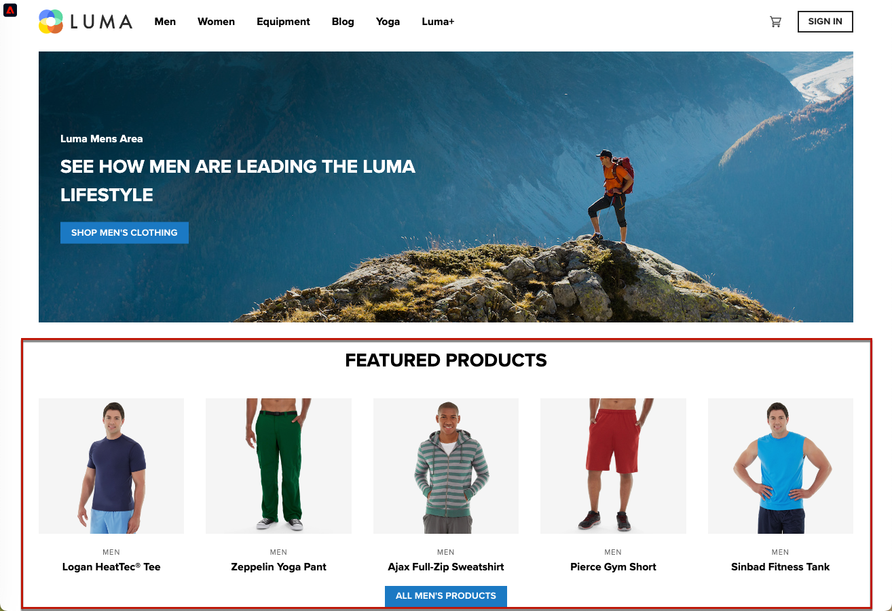

# SPA Implementación de aplicaciones de una sola página () {#web-spa-implementation}

El SDK web de Adobe Experience Platform SPA proporciona funciones enriquecidas que permiten a su empresa ejecutar personalizaciones en tecnologías de próxima generación del lado del cliente, como aplicaciones de una sola página ().

Los sitios web tradicionales funcionan en modelos de navegación &quot;página a página&quot;, conocidos como aplicaciones de varias páginas, en las que los diseños de sitios web están perfectamente asociados a direcciones URL y las transiciones de una página web a otra requieren la carga de una página.

SPA Las aplicaciones web modernas, como las aplicaciones de una sola página (), han adoptado un modelo que impulsa el uso rápido de la representación de la interfaz de usuario del explorador, que a menudo es independiente de las recargas de página. Estas experiencias se pueden activar mediante interacciones de clientes, como desplazamientos, clics y movimientos del cursor. A medida que los paradigmas de la web moderna evolucionan, la importancia de los eventos genéricos tradicionales, como la carga de páginas, para implementar la personalización y la experimentación, ya no funciona.


## SPA Ventajas de utilizar el SDK web para la creación de informes de {#web-spa-benefits}

Estas son algunas ventajas de utilizar el SDK web para aplicaciones de una sola página:

* Capacidad de almacenar en caché todas las ofertas de carga de página para reducir varias llamadas al servidor a una sola llamada al servidor.
* Enorme mejora de la experiencia del usuario en su sitio porque las ofertas se muestran inmediatamente a través de la caché, sin retraso introducido por las llamadas tradicionales al servidor.
* La configuración de desarrollador único permite a los especialistas en marketing crear y ejecutar actividades de personalización y experimentación a través del editor visual web de Adobe Journey Optimizer SPA en su.

## Vistas de XDM y aplicaciones de una sola página {#web-spa-xdm}

El editor web de Journey Optimizer aprovecha un concepto llamado _vistas_.

SPA Las vistas son un grupo lógico de elementos visuales que, juntos, constituyen una experiencia de la. Por lo tanto, una aplicación de una sola página puede considerarse como una transición entre vistas (en lugar de las direcciones URL) según las interacciones del usuario. Una vista suele representar un sitio completo, una sola página o elementos visuales agrupados dentro de una página.

Para explicar más en detalle cuáles son las vistas, el siguiente ejemplo utiliza un sitio hipotético de comercio electrónico en línea.

* Después de navegar a la página de inicio, una imagen promociona las colecciones de temporada, así como los diferentes catálogos de productos disponibles en el sitio. En este caso, se podría definir una vista para toda la pantalla de inicio. Esta vista podría llamarse simplemente &quot;home&quot;.

  

* A medida que el cliente se interesa más por los productos que vende la empresa, decide hacer clic en el **Hombres** vínculo. De forma similar a la página principal, todo el **Hombres** La página se puede definir como una vista. Esta vista podría llamarse &quot;men&quot;.

  

* Dado que una vista puede definirse como un sitio completo o un grupo de elementos visuales en un sitio, los cuatro productos mostrados en el sitio de productos pueden agruparse y considerarse como una vista. Esta vista podría llamarse &quot;productos&quot;.

  

* Cuando el cliente decida hacer clic en **TODOS LOS PRODUCTOS PARA HOMBRE** para explorar más productos en el sitio, la URL del sitio web no cambia en este caso, pero se puede crear una vista aquí para representar solo la segunda fila de productos que se muestran. El nombre de la vista puede ser &quot;products-page-2&quot;.

* El cliente decide adquirir algunos productos en el sitio y pasa a la pantalla de pago. La propia pantalla del carro de compras se puede asociar a una vista denominada &quot;carro de compras&quot;. O podría tener una vista diferente dentro de la pantalla de cierre de compra para administrar los productos recomendados a continuación.

  

El concepto de puntos de vista puede ampliarse mucho más. Estos son solo algunos ejemplos de vistas que se pueden definir en un sitio.

## Implementación de vistas XDM {#implement-xdm-views}

Las vistas XDM se pueden aprovechar en Adobe Journey Optimizer SPA para que los especialistas en marketing puedan ejecutar campañas de personalización y experimentación web en el formato de datos, a través del editor visual web de Journey Optimizer.

Esto requiere realizar los siguientes pasos para completar una configuración de desarrollador única:

1. Instalar [SDK web de Adobe Experience Platform](/help/web-sdk/install/overview.md) y compruebe la [requisitos previos del canal web](https://experienceleague.adobe.com/docs/journey-optimizer/using/web/configure-web-channel/web-prerequisites.html) página.

2. Determine todas las vistas XDM de la aplicación de una sola página que desee personalizar.

3. Después de definir las vistas XDM, para enviar contenido a esas vistas, debe implementar el `sendEvent()` función con `renderDecisions` establezca en `true` y la vista XDM correspondiente en la aplicación de una sola página. Se debe pasar la vista XDM `xdm.web.webPageDetails.viewName`. Este paso permite a los especialistas en marketing descubrir estas vistas dentro del editor web de Journey Optimizer y aplicar modificaciones de contenido para ellas:

```js
 alloy("sendEvent", {
  "renderDecisions": true,
  "xdm": {
   "web": {
    "webPageDetails": {
    "viewName":"home"
   }
  }
 }
});
```

>[!NOTE]
>
>En la primera `sendEvent()` Llamada de, se recuperarán y almacenarán en caché todas las vistas XDM que se deban procesar al usuario final. Posterior `sendEvent()` las llamadas de con vistas XDM pasadas se leerán desde la caché y se procesarán sin una llamada al servidor.

## `sendEvent()` ejemplos de funciones

Esta sección describe dos ejemplos que muestran cómo invocar el `sendEvent()` SPA función en React para un hipotético servicio de comercio electrónico

### Ejemplo 1: página principal de la prueba A/B {#web-spa-sample-1}

El equipo de marketing desea ejecutar pruebas A/B en toda la página de inicio.


Para ejecutar pruebas A/B en todo el sitio principal, `sendEvent()` se debe invocar con el XDM `viewName` establezca en `home`:

```js
function onViewChange() {

  var viewName = window.location.hash; // or use window.location.pathName if router works on path and not hash

  viewName = viewName || 'home'; // view name cannot be empty

  // Sanitize viewName to get rid of any trailing symbols derived from URL

  if (viewName.startsWith('#') || viewName.startsWith('/')) {
    viewName = viewName.substr(1);
  }

  alloy("sendEvent", {
    "renderDecisions": true,

    "xdm": {
      "web": {
        "webPageDetails": {
          "viewName":"home"
        }
      }
    }
  });
}

// react router v4

const history = syncHistoryWithStore(createBrowserHistory(), store);

history.listen(onViewChange);

// react router v3

<Router history={hashHistory} onUpdate={onViewChange} >
```

### Ejemplo 2: Productos personalizados {#web-spa-sample-2}

El equipo de marketing desea personalizar la segunda fila de productos cambiando el color de la etiqueta de precio a rojo después de que un usuario haga clic para ver todos los productos para hombre.


```js
function onViewChange(viewName) {

    alloy("sendEvent", {
        "renderDecisions": true,
        "xdm": {
            "web": {
                "webPageDetails": {
                    "viewName": viewName
                }
            }
        }
    });
}

class Products extends Component {

    render() {
        return (

            <
            button type = "button"
            onClick = {
                this.handleLoadMoreClicked
            } > All Men 's Products</button>
        );
    }

    handleLoadMoreClicked() {
        var page = this.state.page + 1; // assuming page number is derived from component's state
        this.setState({
            page: page
        });
        onViewChange('PRODUCTS-PAGE-' + page);
    }
}
```
