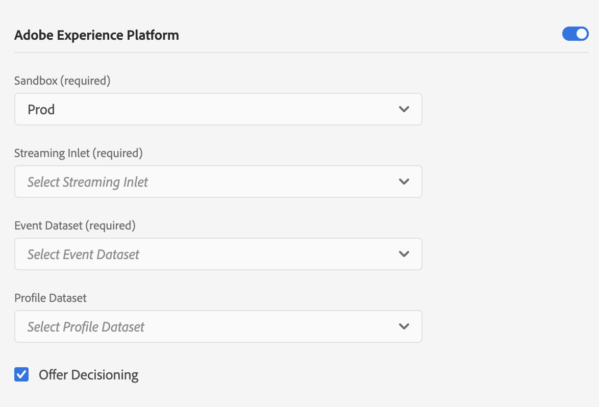
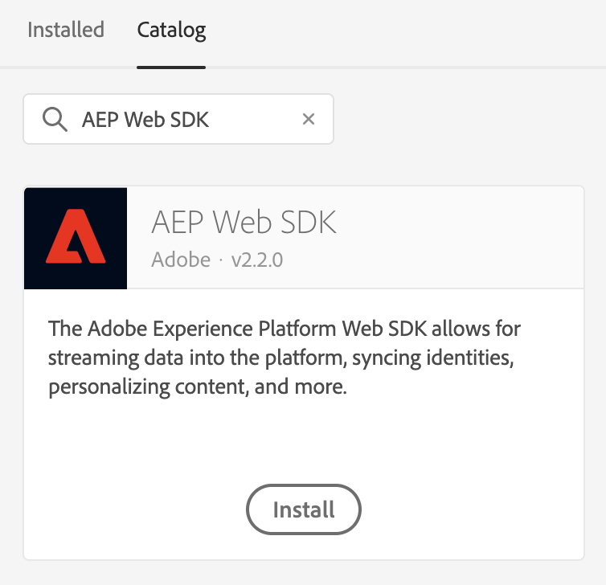
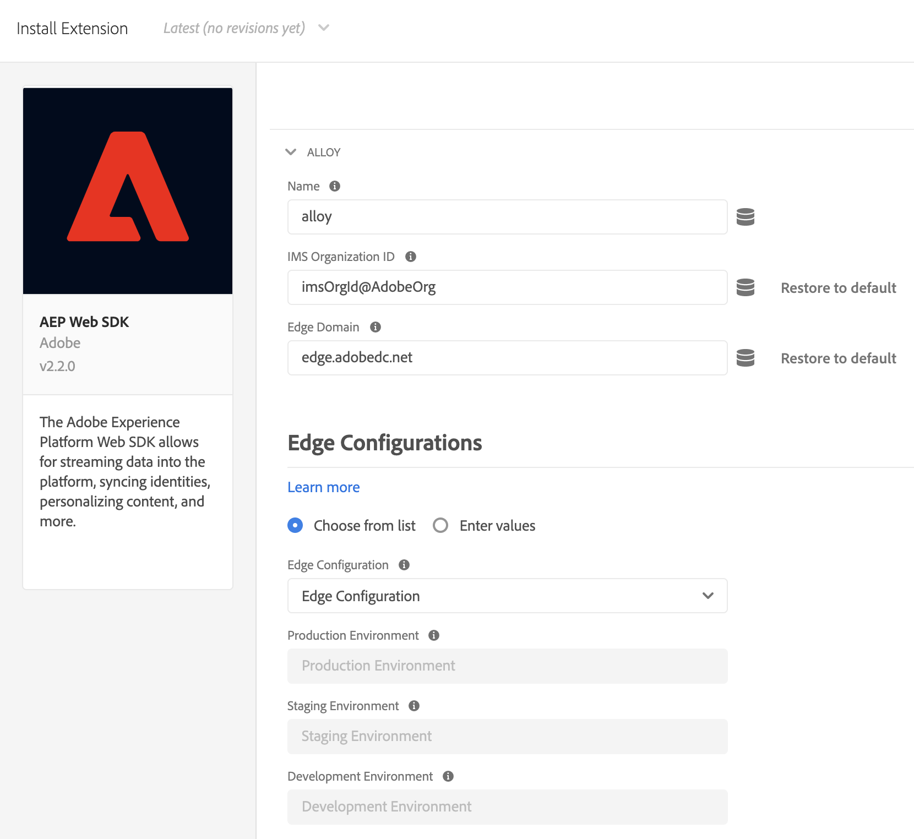

# Uso de Offer Decisioning con Experience Platform Web SDK

Adobe Experience Platform [!DNL Web SDK] puede entregar y procesar ofertas personalizadas que se administran en Offer Decisioning. Puede crear sus ofertas y otros objetos relacionados mediante la interfaz de usuario (IU) o las API de Offer Decisioning.

## Requisitos previos

* La organización está habilitada para la toma de decisiones perimetrales
* Ofertas, Actividades creadas
* Flujo de datos publicado

## Terminología

Es importante comprender la siguiente terminología al trabajar con Offer Decisioning. Para obtener más información y ver términos adicionales, visite el [glosario de Offer Decisioning](https://experienceleague.adobe.com/docs/offer-decisioning/using/get-started/glossary.html).

* **Ámbitos de decisión:** Para Offer Decisioning, los ámbitos de decisión son cadenas JSON codificadas en Base64 que contienen los identificadores de actividad y ubicación que desea que el servicio de Offer Decisioning use para proponer ofertas.

  *Ámbito de decisión JSON:*

  ```json
  {
    "activityId":"xcore:offer-activity:11cfb1fa93381aca",
    "placementId":"xcore:offer-placement:1175009612b0100c"
  }
  ```

  *Cadena codificada en Base64 del ámbito de decisión:*

  ```json
  "eyJhY3Rpdml0eUlkIjoieGNvcmU6b2ZmZXItYWN0aXZpdHk6MTFjZmIxZmE5MzM4MWFjYSIsInBsYWNlbWVudElkIjoieGNvcmU6b2ZmZXItcGxhY2VtZW50OjExNzUwMDk2MTJiMDEwMGMifQ=="
  ```

  >[!TIP]
  >
  >Puede copiar el valor del ámbito de decisión desde la página **Información general de actividad** en la interfaz de usuario.

  

* **Flujos de datos:** Para obtener más información, lea la documentación de [flujos de datos](/help/datastreams/overview.md).

* **Identidad**: para obtener más información, lea esta documentación que describe cómo [Experience Platform Web SDK usa el servicio de identidad](../../identity/overview.md).

## Habilitación de Offer Decisioning

Para habilitar Offer Decisioning, realice los siguientes pasos:

1. Habilitó Adobe Experience Platform en su [secuencia de datos](/help/datastreams/overview.md) y marque la casilla &quot;Offer Decisioning&quot;

   

1. Siga las instrucciones para [instalar SDK](/help/web-sdk/install/overview.md) (SDK se puede instalar de forma independiente o a través de la interfaz de usuario. Consulte la [guía de inicio rápido de etiquetas](/help/tags/quick-start/quick-start.md)) para obtener más información.
1. Configure SDK para Offer Decisioning con `personalization.decisionScopes`. A continuación se proporcionan pasos adicionales específicos de Offer Decisioning.

   * Instalación del SDK independiente

      1. Configurar la acción &quot;sendEvent&quot; con `personalization.decisionScopes`

     ```javascript
     alloy("sendEvent", {
       ...
       "personalization": {
         "decisionScopes": [
           "eyJhY3Rpdml0eUlkIjoieGNvcmU6b2ZmZXItYWN0aXZpdHk6MTIxYWIwOWMxM2JkZDIyNCIsInBsYWNlbWVudElkIjoieGNvcmU6b2ZmZXItcGxhY2VtZW50OjEyMWFiMDZhODRkMDViMTEifQ==",
           "eyJhY3Rpdml0eUlkIjoieGNvcmU6b2ZmZXItYWN0aXZpdHk6MTIxYWIyNWI5NTUwNWIxZiIsInBsYWNlbWVudElkIjoieGNvcmU6b2ZmZXItcGxhY2VtZW50OjEyMWFiMjFmOTQzMDE0MmIifQ=="
         ]
       }
     });
     ```

   * Instalación de SDK mediante etiquetas

      1. [Creación de una propiedad de etiqueta](/help/tags/ui/administration/companies-and-properties.md)
      1. [Agregar el código incrustado](https://experienceleague.adobe.com/docs/core-services-learn/implementing-in-websites-with-launch/configure-launch/launch-add-embed.html)
      1. Instale y configure la extensión de Experience Platform Web SDK con la secuencia de datos que ha creado seleccionando la configuración en la lista desplegable &quot;Secuencia de datos&quot;. Consulte la documentación sobre [extensiones](/help/tags/ui/managing-resources/extensions/overview.md).

         

         

      1. Cree los [elementos de datos](/help/tags/ui/managing-resources/data-elements.md) necesarios. Como mínimo, debe crear un mapa de identidad de Experience Platform Web SDK y un elemento de datos de objeto XDM de Experience Platform Web SDK.

         

         

      1. Cree sus [reglas](/help/tags/ui/managing-resources/rules.md).

         * Agregue una acción Enviar evento de Experience Platform Web SDK y agregue el elemento `decisionScopes` correspondiente a la configuración de dicha acción

         

      1. [Cree y publique una biblioteca](/help/tags/ui/publishing/libraries.md) que contenga todas las reglas, elementos de datos y extensiones relevantes que haya configurado

## Solicitudes y respuestas de ejemplo

### Un valor `decisionScopes`

**Solicitud**

```json
{
  "events": [
    {
      "xdm": {
        "identityMap": {
          "ECID": [
            {
              "id": "91133425615229052182584359620783097099"
            }
          ]
        }
      },
      "query": {
        "personalization": {
          "decisionScopes": [
            "eyJhY3Rpdml0eUlkIjoieGNvcmU6b2ZmZXItYWN0aXZpdHk6MTFjZmIxZmE5MzM4MWFjYSIsInBsYWNlbWVudElkIjoieGNvcmU6b2ZmZXItcGxhY2VtZW50OjExNzUwMDk2MTJiMDEwMGMifQ=="
          ]
        }
      }
    }
  ]
}
```

| Propiedad | Requerido | Descripción | Límites | Ejemplo |
|---|---|---|---|---|
| `identityMap` | Sí | Consulte esta [documentación del servicio de identidad](../../identity/overview.md). | Una identidad por solicitud. | `{ "identityMap": { "ECID": [ { "id": "91133425615229052182584359620783097099" } ] } }`. <br><br> Nota: Los usuarios no necesitan incluir el parámetro `ECID` en la llamada de API. Este parámetro se agrega automáticamente a la llamada de si es necesario. |
| `decisionScopes` | Sí | Matriz de cadenas JSON codificadas en Base64 que contiene los ID de actividad y ubicación. | Máximo 30 `decisionScopes` por solicitud. | `"decisionScopes": ["eyJhY3Rpdml0eUlkIjoieGNvcmU6b2ZmZXItYWN0aXZpdHk6MTFjZmIxZmE5MzM4MWFjYSIsInBsYWNlbWVudElkIjoieGNvcmU6b2ZmZXItcGxhY2VtZW50OjExNzUwMDk2MTJiMDEwMGMifQ=="]` |

**Respuesta**

```json
{
  "requestId": "94c4f2f1-9218-43ce-afd3-eb0d853c5174",
  "handle": [
    {
      "payload": [
        {
          "id": "2862bb89-5df2-4bc6-85c2-d8f7e1a091de",
          "scope": "eyJhY3Rpdml0eUlkIjoieGNvcmU6b2ZmZXItYWN0aXZpdHk6MTFjZmIxZmE5MzM4MWFjYSIsInBsYWNlbWVudElkIjoieGNvcmU6b2ZmZXItcGxhY2VtZW50OjExNzUwMDk2MTJiMDEwMGMifQ==",
          "activity": {
            "id": "xcore:offer-activity:11cfb1fa93381aca",
            "etag": "2"
          },
          "placement": {
            "id": "xcore:offer-placement:1175009612b0100c",
            "etag": "1"
          },
          "items": [
            {
              "id": "xcore:personalized-offer:124cc332095cfa74",
              "schema": "https://ns.adobe.com/experience/offer-management/content-component-html",
              "etag": "1",
              "data": {
                "id": "xcore:personalized-offer:124cc332095cfa74",
                "format": "text/html",
                "language": [
                  "en-US"
                ],
                "content": "<p>20% Off on shipping</p>",
                "characteristics": {
                  "foo": "bar",
                  "foo1": "bar1"
                }
              }
            }
          ]
        }
      ],
      "type": "personalization:decisions",
      "eventIndex": 0
    }
  ]
}
```

| Propiedad | Descripción | Ejemplo |
|---|---|---|
| `scope` | Ámbito de decisión que dio lugar a las ofertas propuestas. | `"scope": "eyJhY3Rpdml0eUlkIjoieGNvcmU6b2ZmZXItYWN0aXZpdHk6MTFjZmIxZmE5MzM4MWFjYSIsInBsYWNlbWVudElkIjoieGNvcmU6b2ZmZXItcGxhY2VtZW50OjExNzUwMDk2MTJiMDEwMGMifQ=="` |
| `activity.id` | ID único de la actividad de oferta. | `"id": "xcore:offer-activity:11cfb1fa93381aca"` |
| `placement.id` | ID único de la ubicación de la oferta. | `"id": "xcore:offer-placement:1175009612b0100c"` |
| `items.id` | El ID de la oferta propuesta. | `"id": "xcore:personalized-offer:124cc332095cfa74"` |
| `schema` | El esquema del contenido asociado con la oferta propuesta. | `"schema": "https://ns.adobe.com/experience/offer-management/content-component-html"` |
| `data.id` | El ID de la oferta propuesta. | `"id": "xcore:personalized-offer:124cc332095cfa74"` |
| `format` | El formato del contenido asociado con la oferta propuesta. | `"format": "text/html"` |
| `language` | Una matriz de idiomas asociados con el contenido de la oferta propuesta. | `"language": [ "en-US" ]` |
| `content` | Contenido asociado con la oferta propuesta en formato de cadena. | `"content": "<p style="color:red;">20% Off on shipping</p>"` |
| `deliveryUrl` | Contenido de imagen asociado con la oferta propuesta en formato de dirección URL. | `"deliveryURL": "https://image.jpeg"` |
| `characteristics` | Características asociadas con la oferta propuesta en formato de objeto JSON. | `"characteristics": { "foo": "bar", "foo1": "bar1" }` |

### Varios valores `decisionScopes`

**Solicitud**

```json
{
  "events": [
    {
      "xdm": {
        "identityMap": {
          "ECID": [
            {
              "id": "91133425615229052182584359620783097099"
            }
          ]
        }
      },
      "query": {
        "personalization": {
          "decisionScopes": [
            "eyJhY3Rpdml0eUlkIjoieGNvcmU6b2ZmZXItYWN0aXZpdHk6MTFjZmIxZmE5MzM4MWFjYSIsInBsYWNlbWVudElkIjoieGNvcmU6b2ZmZXItcGxhY2VtZW50OjExNzUwMDk2MTJiMDEwMGMifQ==",
            "eyJhY3Rpdml0eUlkIjoieGNvcmU6b2ZmZXItYWN0aXZpdHk6MTIyMjA4YjNhODc0MDU1OCIsInBsYWNlbWVudElkIjoieGNvcmU6b2ZmZXItcGxhY2VtZW50OjEyMjIwNDUyOTUxNGEyYzAifQ==",
            "eyJhY3Rpdml0eUlkIjoieGNvcmU6b2ZmZXItYWN0aXZpdHk6MTIyYzkxMzg1Mjc2MDE4YyIsInBsYWNlbWVudElkIjoieGNvcmU6b2ZmZXItcGxhY2VtZW50OjEyMzMxZjU2MTYyYWEyZjcifQ=="
          ]
        }
      }
    }
  ]
}
```

| Propiedad | Requerido | Descripción | Límites | Ejemplo |
|---|---|---|---|---|
| `identityMap` | Sí | Consulte esta [documentación del servicio de identidad](../../identity/overview.md). | Una identidad por solicitud. | `{ "identityMap": { "ECID": [ { "id": "91133425615229052182584359620783097099" } ] } }`. <br><br> Nota: Los usuarios no necesitan incluir el parámetro `ECID` en la llamada de API. Este parámetro se agrega automáticamente a la llamada de si es necesario. |
| `decisionScopes` | Sí | Matriz de cadenas JSON codificadas en Base64 que contiene los ID de actividad y ubicación. | Máximo 30 `decisionScopes` por solicitud. | `"decisionScopes":["eyJhY3Rpdml0eUlkIjoieGNvcmU6b2ZmZXItYWN0aXZpdHk6MTFjZmIxZmE5MzM4MWFjYSIsInBsYWNlbWVudElkIjoieGNvcmU6b2ZmZXItcGxhY2VtZW50OjExNzUwMDk2MTJiMDEwMGMifQ==", "eyJhY3Rpdml0eUlkIjoieGNvcmU6b2ZmZXItYWN0aXZpdHk6MTIyMjA4YjNhODc0MDU1OCIsInBsYWNlbWVudElkIjoieGNvcmU6b2ZmZXItcGxhY2VtZW50OjEyMjIwNDUyOTUxNGEyYzAifQ=="` |

**Respuesta**

```json
{
  "requestId": "94c4f2f1-9218-43ce-afd3-eb0d853c5174",
  "handle": [
    {
      "payload": [
        {
          "id": "a2804dfb-a0ec-4df9-8311-59d3ecdeb642",
          "scope": "eyJhY3Rpdml0eUlkIjoieGNvcmU6b2ZmZXItYWN0aXZpdHk6MTFjZmIxZmE5MzM4MTEyMyIsInBsYWNlbWVudElkIjoieGNvcmU6b2ZmZXItcGxhY2VtZW50OjExNzUwMDk2MTJiMDExMjMifQ==",
          "activity": {
            "id": "xcore:offer-activity:11cfb1fa93381123",
            "etag": "1"
          },
          "placement": {
            "id": "xcore:offer-placement:1175009612b01123",
            "etag": "3"
          },
          "items": [
            {
              "id": "xcore:personalized-offer:11e36d4a22954123",
              "schema": "https://ns.adobe.com/experience/offer-management/content-component-text",
              "etag": "2",
              "data": {
                "id": "xcore:personalized-offer:11e36d4a22954123",
                "format": "text/text",
                "language": [
                  "en"
                ],
                "content": "20% Off on shipping",
                "characteristics": {
                  "foo2": "bar2"
                }
              }
            }
          ]
        },
        {
          "id": "a2804dfb-a0ec-4df9-8311-59d3ecdeb642",
          "scope": "eyJhY3Rpdml0eUlkIjoieGNvcmU6b2ZmZXItYWN0aXZpdHk6MTFjZmIxZmE5MzM4MWFjYSIsInBsYWNlbWVudElkIjoieGNvcmU6b2ZmZXItcGxhY2VtZW50OjExNzUwMDk2MTJiMDEwMGMifQ==",
          "activity": {
            "id": "xcore:offer-activity:11cfb1fa93381aca",
            "etag": "2"
          },
          "placement": {
            "id": "xcore:offer-placement:1175009612b0100c",
            "etag": "1"
          },
          "items": [
            {
              "id": "xcore:personalized-offer:11e36d4a2295415d",
              "schema": "https://ns.adobe.com/experience/offer-management/content-component-imagelink",
              "etag": "1",
              "data": {
                "id": "xcore:personalized-offer:11e36d4a2295415d",
                "format": "image/png",
                "language": [
                  "en"
                ],
                "deliveryURL": "https://image.jpeg",
                "characteristics": {
                  "foo": "bar",
                  "foo1": "bar1"
                }
              }
            }
          ]
        }
      ],
      "type": "personalization:decisions",
      "eventIndex": 0
    }
  ]
}
```

| Propiedad | Descripción | Ejemplo |
|---|---|---|
| `scope` | Ámbito de decisión que dio lugar a las ofertas propuestas. | `"scope": "eyJhY3Rpdml0eUlkIjoieGNvcmU6b2ZmZXItYWN0aXZpdHk6MTFjZmIxZmE5MzM4MWFjYSIsInBsYWNlbWVudElkIjoieGNvcmU6b2ZmZXItcGxhY2VtZW50OjExNzUwMDk2MTJiMDEwMGMifQ=="` |
| `activity.id` | ID único de la actividad de oferta. | `"id": "xcore:offer-activity:11cfb1fa93381123"` |
| `placement.id` | ID único de la ubicación de la oferta. | `"xcore:offer-placement:1175009612b01123"` |
| `items.id` | El ID de la oferta propuesta. | `"id": "xcore:personalized-offer:11e36d4a22954123"` |
| `schema` | El esquema del contenido asociado con la oferta propuesta. | `"schema": "https://ns.adobe.com/experience/offer-management/content-component-text"` |
| `data.id` | El ID de la oferta propuesta. | `"id": "xcore:personalized-offer:11e36d4a22954123"` |
| `format` | El formato del contenido asociado con la oferta propuesta. | `"format": "text/text"` |
| `language` | Una matriz de idiomas asociados con el contenido de la oferta propuesta. | `"language": [ "en-US" ]` |
| `content` | Contenido asociado con la oferta propuesta en formato de cadena. | `"content": "<p style="color:red;">20% Off on shipping</p>"` |
| `deliveryUrl` | Contenido de imagen asociado con la oferta propuesta en formato de dirección URL. | `"deliveryURL": "https://image.jpeg"` |
| `characteristics` | Características asociadas con la oferta propuesta en formato de objeto JSON. | `"characteristics": { "foo": "bar", "foo1": "bar1" }` |

## Limitaciones

Actualmente, algunas restricciones de oferta no son compatibles con los flujos de trabajo de Edge Network móviles, por ejemplo, Límite. El valor del campo Límite especifica el número de veces que se puede presentar una oferta entre todos los usuarios. Para obtener más información, consulte [Documentación sobre reglas de elegibilidad de ofertas y restricciones](https://experienceleague.adobe.com/docs/offer-decisioning/using/managing-offers-in-the-offer-library/creating-personalized-offers.html#eligibility).
