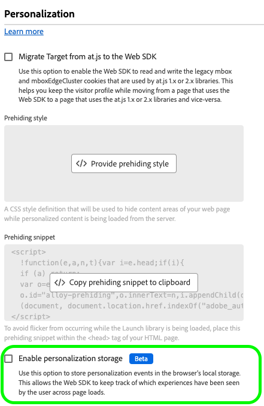

# Configuración de la compatibilidad con la mensajería web en la aplicación en Web SDK

Los mensajes en la aplicación son notificaciones que puede enviar a los usuarios dentro de su aplicación web, guiándolos a puntos de interés específicos.

Puede utilizar estas notificaciones para diferentes fines, como promocionar nuevas funciones, presentar ofertas especiales o facilitar la incorporación del usuario.

Con los mensajes en la aplicación, puede interactuar de forma eficaz con su audiencia y dirigirla a aspectos importantes de su aplicación.

>[!IMPORTANT]
>
>La mensajería en la aplicación web es una característica de [Adobe Journey Optimizer](https://experienceleague.adobe.com/docs/journey-optimizer/using/ajo-home.html?lang=es) que usa Web SDK para entregar el contenido personalizado.
>
>Para obtener instrucciones detalladas sobre cómo configurar su campaña de mensajería en aplicación web, consulte la documentación[&#128279;](https://experienceleague.adobe.com/docs/journey-optimizer/using/in-app/create-in-app-web.html) de Adobe Systems Journey Optimizer.


## Requisitos previos {#prerequisites}

### Versión de extensión de etiqueta del SDK web {#extension-version}

La funcionalidad Web In-app mensajería requiere la versión más reciente de la extensión Web SDK etiqueta.

### Configuración de un CSP para mensajería web en la aplicación {#csp}

Al configurar [Mensajería en la aplicación web](../personalization/web-in-app-messaging.md), debe incluir la siguiente directiva en su CSP:

```
default-src  blob:;
```

Para obtener más información acerca de cómo configurar un CSP, consulte la [documentación dedicada](../use-cases/configuring-a-csp.md).

## Configuración de la mensajería en la aplicación web mediante la extensión de etiquetas Web SDK {#tag-extension}

Consulte la [página de configuración de la extensión de etiquetas Web SDK](../../tags/extensions/client/web-sdk/web-sdk-extension-configuration.md) para saber dónde puede encontrar la configuración que se describe a continuación.

Después de instalar [&#128279;](../../tags/extensions/client/web-sdk/web-sdk-extension-configuration.md#install-the-web-sdk-tag-extension) la extensión de etiqueta del SDK web, seguir los pasos que se indican a continuación para configurar la extensión para la mensajería web en la aplicación.

En la **[!UICONTROL sección Personalización]** , marque la opción Habilitar personalización **[!UICONTROL almacenamiento]** . Esta opción permite al SDK web realizar un seguimiento de las experiencias que han visto los usuario a través de Página cargas.




La mensajería web en la aplicación admite dos tipos de déclencheur:

* [Envío de datos a Experience Platform](#send-data-platform)
* [Activación manual de mensajes](#manual-trigger)

Consulte las secciones siguientes para configurar la extensión de etiquetas Web SDK según los déclencheur que desee utilizar.

### Pasos de configuración para el déclencheur **[!UICONTROL Enviar datos al Experience Platform]** {#send-data-platform}

Seleccione la propiedad tag que contiene su extensión Web SDK y [cree una nueva regla](../../tags/ui/managing-resources/rules.md##create-a-rule) con la siguiente configuración:

1. **[!UICONTROL Extensión]**: [!UICONTROL Principal]
2. **[!UICONTROL Tipo de evento]**: [!UICONTROL Biblioteca cargada (Principio de página)]

   

3. Seleccione **[!UICONTROL Conservar cambios]** para guardar la configuración del evento.

Siguiente, debe agregar una acción a la regla creada.

1. En la [!DNL Actions] sección, seleccione **[!UICONTROL añadir]**.
   

2. Usar la siguiente configuración de **[!UICONTROL Acción]**:
   * **[!UICONTROL Extensión]**: [!UICONTROL Adobe Experience Platform Web SDK]
   * **[!UICONTROL Tipo de acción]**: [!UICONTROL Enviar evento]

     

3. En el lado derecho de la pantalla, en la **[!UICONTROL sección Personalización]** , habilite la **[!UICONTROL opción Procesar decisiones de personalización]** visual.
   

4. En el lado derecho de la pantalla, en la **[!UICONTROL sección Contexto]** de decisión, defina los pares clave/**[!UICONTROL Valor]** que utilizó en la **&#x200B;**&#x200B;configuración del campaña para poder recibir el mensaje en la aplicación.
   

5. Seleccione **[!UICONTROL Conservar cambios]** para guardar la configuración.


A continuación, debe agregar la regla recién creada a la biblioteca de propiedades de etiquetas. Para ello, vaya a **[!UICONTROL Flujo de publicación]** y seleccione la regla que creó anteriormente.


Después de agregar la regla a la biblioteca, seleccione **[!UICONTROL Guardar y generar en desarrollo]**.


El proceso de configuración ha finalizado y el mensaje está listo para mostrarse a los usuarios.

### Pasos de configuración para utilizar activadores manuales {#manual-trigger}

Seleccione la Propiedad de etiqueta que contiene la extensión del SDK web y [cree una nueva regla](../../tags/ui/managing-resources/rules.md##create-a-rule) con la siguiente configuración:

1. **[!UICONTROL Extensión]**: [!UICONTROL Core]
2. **[!UICONTROL Tipo de evento]**: [!UICONTROL Haga clic]
3. Establezca el déclencheur de un elemento específico de la página, identificado por un selector CSS de su elección.

   


Siguiente, debe agregar una acción a la regla creada.

1. En la [!DNL Actions] sección, seleccione **[!UICONTROL añadir]**.
   

2. Utilice la siguiente **[!UICONTROL configuración de acción]** :
   * **[!UICONTROL Extensión]**: [!UICONTROL Adobe Experience Platform Web SDK]
   * **[!UICONTROL Tipo de acción]**: [!UICONTROL Evaluar conjuntos de reglas]

     

3. En el lado derecho de la pantalla, habilite la opción **[!UICONTROL Procesar decisiones de personalización visuales]**.
   


4. En el lado derecho de la pantalla, en la sección **[!UICONTROL Contexto de decisión]**, defina los pares de **[!UICONTROL Clave]**/**[!UICONTROL Valor]** que utilizó en la configuración de su campaña para cumplir los requisitos para el mensaje en la aplicación.
   

5. Seleccione **[!UICONTROL Conservar cambios]** para guardar la configuración.

A continuación, debe agregar la regla recién creada a la biblioteca de propiedades de etiquetas. Para ello, vaya a **[!UICONTROL Flujo de publicación]** y seleccione la regla que creó anteriormente.


Después de agregar el regla al biblioteca, seleccione **[!UICONTROL Guardar y generar en desarrollo]**.


El proceso de configuración ha finalizado y el mensaje está listo para mostrarse a los usuarios.

## Configuración de la mensajería web en la aplicación mediante la biblioteca web JavaScript de SDK {#js-library}

Como alternativa al uso de la extensión de etiquetas Web SDK, también puede configurar la mensajería en la aplicación web directamente desde la biblioteca JavaScript de Web SDK.


Puede mostrar mensajes web en la aplicación desde Adobe Journey Optimizer de dos formas.

### Método 1: Recuperación automática del contenido personalizado {#automatic}

Para que Web SDK recupere automáticamente el contenido de personalización al cargar la página, utilice el comando `sendEvent`, como se muestra en el ejemplo siguiente.

```js
  alloy("sendEvent", {
      renderDecisions: true,
      personalization: {
          surfaces: ['#welcome']
      }
  });
```

### Método 2: Recuperación manual del contenido de personalización en función de la acción del usuario {#manual}

Para mostrar el contenido personalización solo después de que el usuario realice una acción específica, use el `evaluateRulesets` comando como se muestra en el ejemplo siguiente.

En este ejemplo, el contenido personalización se muestra cuando un usuario hace clic en el botón Comprar ahora **&#x200B;**&#x200B;del sitio Web.

```js
 alloy("evaluateRulesets", {
     renderDecisions: true,
     personalization: {
         decisionContext: {
             "userAction": "buy_now"
         }
     }
 });
```

### Configuración del almacenamiento de personalización {#personalization-storage}

Puede elegir mostrar mensajes en la aplicación a los usuarios una cantidad determinada de veces, o cada vez que visiten una página, mediante la opción de configuración `personalizationStorageEnabled`.

En la [configuración de Web SDK](../commands/configure/overview.md) establezca la opción `personalizationStorageEnabled` según sus necesidades:

* `personalizationStorageEnabled: true` almacena en déclencheur el mensaje en la aplicación con la frecuencia que definió en [Adobe Journey Optimizer campaign](https://experienceleague.adobe.com/docs/journey-optimizer/using/in-app/create-in-app-web.html#configure-inapp).
* `personalizationStorageEnabled: false` almacena en déclencheur el mensaje en la aplicación en cada carga de página.
