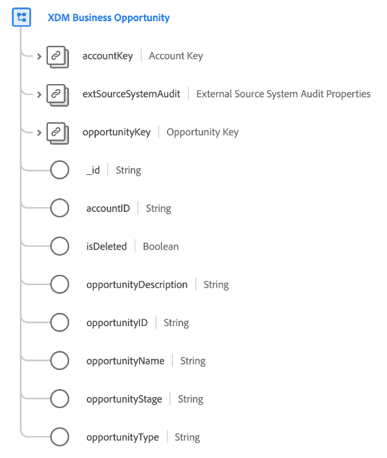

# [!UICONTROL Clase de ] oportunidad empresarial XDM (Beta)

>[!IMPORTANT]
>
>Esta clase está disponible como parte de la plataforma de datos del cliente en tiempo real B2B Edition, que actualmente está en versión beta. La documentación y la funcionalidad están sujetas a cambios.

[!UICONTROL XDM Business ] Oportunityes una clase estándar de Experience Data Model (XDM) que captura las propiedades mínimas requeridas de una oportunidad comercial.

| Propiedad | Tipo de datos | Descripción |
| --- | --- | --- |
| `accountKey` | [[!UICONTROL Fuente B2B]](../../data-types/b2b-source.md) | Identificador compuesto de la cuenta a la que se asocia esta oportunidad. |
| `extSourceSystemAudit` | [[!UICONTROL Atributos de auditoría del sistema de fuentes externas]](../../data-types/external-source-system-audit-attributes.md) | Si la oportunidad proviene de un sistema de origen externo, este objeto captura los atributos de auditoría de ese sistema. |
| `opportunityKey` | [[!UICONTROL Fuente B2B]](../../data-types/b2b-source.md) | Identificador compuesto de la entidad de oportunidad. |
| `_id` | Cadena | Identificador único del registro. Se trata de un valor generado por el sistema que es independiente del `opportunityID`. |
| `accountID` | Cadena | Un ID único para la cuenta a la que se asocia esta oportunidad. |
| `opportunityDescription` | Cadena | Una descripción de la oportunidad. |
| `opportunityID` | Cadena | Un ID único para la entidad de oportunidad. |
| `opportunityName` | Cadena | El nombre de la oportunidad. |
| `opportunityStage` | Cadena | La fase de ventas de la oportunidad. |
| `opportunityType` | Cadena | El tipo de oportunidad. |

{style=&quot;table-layout:auto&quot;}

Consulte la guía sobre las [relaciones de esquema en tiempo real CDP B2B Edition](../../tutorials/relationship-b2b.md) para conocer cómo se relaciona esta clase conceptualmente con las otras clases B2B y cómo puede establecer estas relaciones en la interfaz de usuario de Adobe Experience Platform.
