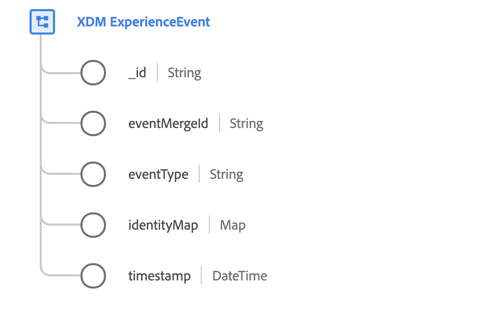

# [!DNL XDM ExperienceEvent] clase

[!DNL XDM ExperienceEvent] es una clase XDM estándar que le permite crear una instantánea con marca de hora del sistema cuando se produce un evento específico o cuando se alcanza un conjunto determinado de condiciones.

Un Evento de experiencias es un registro de hechos de lo que ha ocurrido, incluido el momento y la identidad del individuo involucrado. Los eventos pueden ser explícitos (acciones humanas directamente observables) o implícitos (se plantean sin una acción humana directa) y se registran sin agregación ni interpretación. Para obtener más información de alto nivel sobre el uso de esta clase en el ecosistema de la Plataforma, consulte la descripción general [de](../home.md#data-behaviors)XDM.

La [!DNL XDM ExperienceEvent] clase misma proporciona varios campos relacionados con series temporales a un esquema. Los valores de algunos de estos campos se rellenan automáticamente al ingestar los datos:

 

| Propiedad | Descripción |
| --- | --- |
| `_id` | Identificador de cadena único generado por el sistema para el evento. Este campo se utiliza para rastrear la singularidad de un evento individual, evitar la duplicación de datos y buscar ese evento en los servicios posteriores. Dado que este campo es generado por el sistema, no debe proporcionarse un valor explícito durante la ingestión de datos.  Es importante distinguir que este campo **no** representa una identidad relacionada con una persona individual, sino más bien el propio registro de datos. Los datos de identidad relativos a una persona deben relegarse a campos [de](../schema/composition.md#identity) identidad. |
| `eventMergeId` | ID del lote ingestado que provocó la creación del registro. El sistema rellena automáticamente este campo tras la ingestión de datos. |
| `eventType` | Una cadena que indica el tipo de evento principal del registro. Los valores aceptados y sus definiciones se proporcionan en la sección [del](#eventType)apéndice. |
| `identityMap` | Campo de mapa que contiene un conjunto de identidades con espacio de nombres para el individuo al que se aplica el evento. El sistema actualiza automáticamente este campo a medida que se ingestan datos de identidad. Para utilizar este campo correctamente para el Perfil [del cliente en tiempo](../../profile/home.md)real, no intente actualizar manualmente el contenido del campo en sus operaciones de datos.  Consulte la sección sobre mapas de identidad en los [conceptos básicos de la composición](../schema/composition.md#identityMap) de esquemas para obtener más información sobre su caso de uso. |
| `timestamp` | Hora en la que se produjo el evento o la observación. |

## Mezclas compatibles {#mixins}

Adobe proporciona varias mezclas estándar para su uso con la [!DNL XDM ExperienceEvent] clase. A continuación se presenta una lista de algunas mezclas utilizadas habitualmente para la clase:

* [[!UICONTROL ID de usuario final de ExperienceEvent]](../mixins/event/enduserids.md)
* [[!UICONTROL Detalles del entorno de ExperienceEvent]](../mixins/event/environment-details.md)

## Apéndice

La siguiente sección contiene información adicional sobre la clase [!UICONTROL XDM ExperienceEvent] .

### Valores aceptados para xdm:eventType {#eventType}

La siguiente tabla describe los valores aceptados para `xdm:eventType`, junto con sus definiciones:

| Valor | Definición |
| --- | --- |
| `advertising.completes` | Se ha observado hasta la finalización un recurso de medios temporizados. Esto no significa necesariamente que el usuario haya visto todo el vídeo, ya que el visor podría haber omitido el vídeo. |
| `advertising.timePlayed` | Describe la cantidad de tiempo que un usuario emplea en un recurso de medios temporizados específico. |
| `advertising.federated` | Indica si se ha creado un Evento de experiencias mediante la federación de datos (uso compartido de datos entre clientes). |
| `advertising.clicks` | Haga clic en las acciones de un anuncio. |
| `advertising.conversions` | Acciones predefinidas realizadas por un cliente que activan un evento para la evaluación del rendimiento. |
| `advertising.firstQuartiles` | Un anuncio de vídeo digital se ha reproducido a una velocidad normal durante el 25 % de su duración. |
| `advertising.impressions` | Impresión(s) de un anuncio a un cliente con el potencial de ser visto. |
| `advertising.midpoints` | Un anuncio de vídeo digital se ha reproducido a una velocidad normal durante el 50 % de su duración. |
| `advertising.starts` | Se ha empezado a reproducir un anuncio de vídeo digital. |
| `advertising.thirdQuartiles` | Un anuncio de vídeo digital se ha reproducido a una velocidad normal durante el 75 % de su duración. |
| `web.webpagedetails.pageViews` | Una página web ha recibido una o más vistas. |
| `web.webinteraction.linkClicks` | Un vínculo ha recibido uno o más clics. |
| `commerce.checkouts` | Se ha producido un evento de cierre de compra para una lista de producto. Puede haber más de un evento de cierre de compra si hay varios pasos en un proceso de cierre de compra. Si hay varios pasos, la marca de tiempo y la página o experiencia a las que se hace referencia para cada evento se utilizan para identificar cada evento individual (paso), representado en orden. |
| `commerce.productListAdds` | Se ha agregado un producto a la lista del producto o al carro de compras. |
| `commerce.productListOpens` | Se ha inicializado o creado una nueva lista de productos (carro de compras). |
| `commerce.productListRemovals` | Una o más entradas de productos se han eliminado de una lista de productos o del carro de compras. |
| `commerce.productListReopens` | Una lista de producto (carro de compras) que ya no era accesible (abandonada) ha sido reactivada por un cliente, por ejemplo a través de una actividad de remercadotecnia. |
| `commerce.productListViews` | Una lista de producto o carro de compras ha recibido una o más vistas. |
| `commerce.productViews` | Un producto ha recibido una o más vistas. |
| `commerce.purchases` | Se ha aceptado una orden. Esta es la única acción necesaria en una conversión de comercio. Un evento de compra debe tener una lista de producto referenciada. |
| `commerce.saveForLaters` | Se ha guardado una lista de producto para uso futuro, como una lista de deseos de producto. |
| `delivery.feedback` | Eventos de comentarios para un envío, como un envío de correo electrónico. |
| `message.feedback` | Eventos de comentarios como enviado/devolución/error para los mensajes enviados a un cliente. |
| `message.tracking` | Seguimiento de eventos como acciones de apertura/clic/personalización en mensajes enviados a un cliente. |