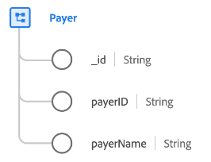

# [!UICONTROL Pagador] clase

En Experience Data Model (XDM), la clase [!UICONTROL Pagador] captura el conjunto mínimo de propiedades que definen una entidad comercial pagadora que recopila datos pertenecientes a compañías de seguros (como el seguro de salud).

| Propiedad | Tipo de datos | Descripción |
| --- | --- | --- |
| `_id` | [!UICONTROL Cadena] | Un identificador de cadena único generado por el sistema para el registro. Este campo se utiliza para realizar un seguimiento de la exclusividad de un registro individual, evitar la duplicación de datos y buscar ese registro en servicios descendentes.  Dado que este campo es generado por el sistema, no se le proporciona un valor explícito durante la ingesta de datos. Sin embargo, puede optar por proporcionar sus propios valores de ID únicos si lo desea. |
| `payerId` | [!UICONTROL Cadena] | Un identificador único del pagador. |
| `payerName` | [!UICONTROL Cadena] | El nombre del pagador. |

{style="table-layout:auto"}
