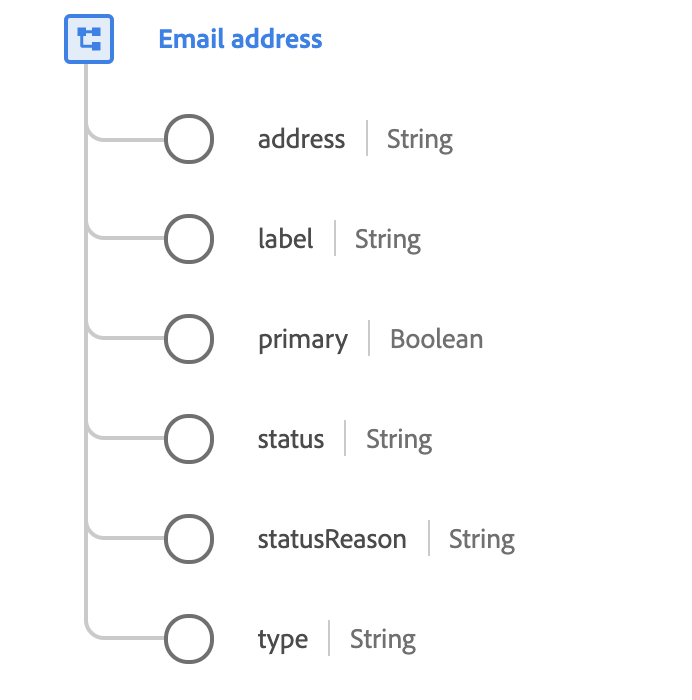

# [!UICONTROL Tipo de datos de dirección] de correo electrónico

[!UICONTROL La dirección] de correo electrónico es un tipo de datos XDM estándar que describe los detalles de una dirección de correo electrónico.

 

| Propiedad | Descripción |
| --- | --- |
| `address` | La dirección técnica del correo electrónico tal como se define comúnmente en RFC2822 y en las normas posteriores (por ejemplo, `name@domain.com`). |
| `label` | Información adicional de visualización que puede estar disponible. Por ejemplo, si un correo electrónico tiene una pantalla de dirección enriquecida de Microsoft Outlook, `John Smith smithjr@company.uk`, `John Smith` se colocará en este campo. |
| `primary` | Indica si esta es la dirección de correo electrónico principal del individuo. Un perfil solo puede tener una `primary` dirección de correo electrónico en un momento dado. |
| `status` | Indica si se puede utilizar la dirección de correo electrónico en este momento |
| `statusReason` | Una descripción del `status`. |
| `type` | La forma en que la cuenta se relaciona con la persona (por ejemplo, `work` o `personal`). |

Para obtener más información sobre el tipo de datos de dirección de correo electrónico, consulte el repositorio público XDM:

* [Ejemplo rellenado](https://github.com/adobe/xdm/blob/master/components/datatypes/emailaddress.example.1.json)
* [Esquema completo](https://github.com/adobe/xdm/blob/master/components/datatypes/emailaddress.schema.json)