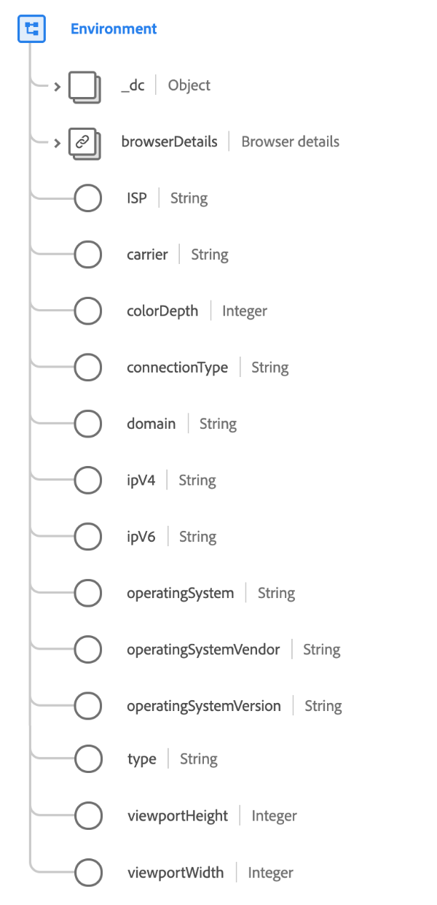

# Tipo de datos [!UICONTROL Entorno]

[!UICONTROL Entorno] es un tipo de datos XDM estándar que describe el entorno circundante de un evento observado, detallando específicamente información transitoria como versiones de red y software.

>[!IMPORTANT]
>
>Todos los valores deben estar alineados con la base de datos [DeviceAtlas](https://deviceatlas.com), con licencia de Adobe.

{width=400}

| Propiedad | Tipo de datos | Descripción |
| --- | --- | --- |
| `_dc` | Objeto | Un objeto que contiene un solo campo, `language`, que indica el idioma del entorno para representar las preferencias lingüísticas, geográficas o culturales del usuario para la presentación de datos. Los idiomas se especifican en el código de idioma tal como se definen en [IETF RFC 3066](https://www.ietf.org/rfc/rfc3066.txt). |
| `browserDetails` | [Detalles del explorador](./browser-details.md) | Describe los detalles específicos del entorno para el explorador, como el nombre, la versión, la versión de JavaScript, la cadena del agente de usuario y el idioma aceptado. |
| `ISP` | Cadena | El nombre del proveedor de servicios de Internet del usuario. |
| `carrier` | Cadena | El nombre del operador de red móvil o MNO (también conocido como proveedor de servicios inalámbricos, operador de telefonía móvil, compañía de telefonía móvil u operador de red móvil) que vende y ofrece servicios de comunicación al usuario. |
| `colorDepth` | Entero | El número de bits utilizados para cada componente de color de un solo píxel. |
| `connectionType` | Cadena | El tipo de conexión a Internet. Los valores aceptados incluyen: <ul><li>`dialup`</li><li>`isdn`</li><li>`bisdn`</li><li>`dsl`</li><li>`cable`</li><li>`wireless_wifi`</li><li>`mobile`</li><li>`mobile_edge`</li><li>`mobile_2g`</li><li>`mobile_3g`</li><li>`mobile_lte`</li><li>`t1`</li><li>`t3`</li><li>`oc3`</li><li>`lan`</li><li>`modem`</li></ul> |
| `domain` | Cadena | El dominio del ISP del usuario. |
| `ipV4` | Cadena | La etiqueta numérica asignada a un dispositivo que participa en una red informática que utiliza el protocolo de Internet para la comunicación (32 bits). |
| `ipV6` | Cadena | La etiqueta numérica asignada a un dispositivo que participa en una red informática que utiliza el protocolo de Internet para la comunicación (128 bits). |
| `operatingSystem` | Cadena | El nombre del sistema operativo utilizado cuando se realizó la observación. El atributo no debe contener información de versión, como `10.5.3`, sino designaciones de &quot;edición&quot;, como `Ultimate` o `Professional`. |
| `operatingSystemVendor` | Cadena | El nombre del proveedor del sistema operativo usado cuando se realizó la observación. |
| `operatingSystemVersion` | Cadena | El identificador de versión completa del sistema operativo utilizado cuando se realizó la observación. Las versiones suelen estar compuestas por números, pero pueden estar en un formato definido por el proveedor. |
| `type` | Cadena | El tipo de entorno de la aplicación. Consulte el [apéndice](#type) para obtener los valores aceptados. |
| `viewportHeight` | Entero | El tamaño vertical en píxeles de la ventana en la que se mostró la experiencia. En el caso de los eventos de visualización web, esta es la altura de la ventanilla del explorador. |
| `viewPortWidth` | Entero | El tamaño horizontal en píxeles de la ventana en la que se mostró la experiencia. En un evento de visualización web, esta es la anchura de la ventanilla del explorador. |

{style="table-layout:auto"}

Para obtener más información sobre el tipo de datos, consulte el repositorio XDM público:

* [Ejemplo completado](https://github.com/adobe/xdm/blob/master/components/datatypes/environment.example.1.json)
* [Esquema completo](https://github.com/adobe/xdm/blob/master/components/datatypes/environment.schema.json)

## Apéndice

La siguiente sección contiene información adicional sobre el tipo de datos [!UICONTROL Dispositivo].

## Valores aceptados para el tipo {#type}

En la tabla siguiente se describen los valores aceptados para `type` y sus significados asociados:

| Valor | Descripción |
| --- | --- |
| `browser` | Explorador |
| `application` | Aplicación |
| `iot` | Internet de las cosas |
| `external` | Sistema externo |
| `widget` | Extensión de aplicación |
