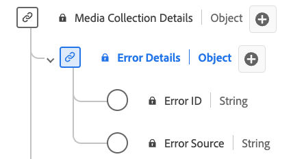

# [!UICONTROL Detalles del error] Tipo de datos de colección

[!UICONTROL Detalles del error] La colección es un tipo de datos estándar del Modelo de datos de experiencia (XDM) que describe los detalles del error. Utilice el tipo de datos de colección [!UICONTROL Detalles del error] para capturar los detalles del origen y la identificación del error. El ID de error identifica el error y el origen del error especifica si se origina desde el reproductor o desde un origen externo.

| Nombre para mostrar | Propiedad | Tipo de datos | Requerido | Descripción |
|----------------------------|--------------|-----------|----------|-----------------------------------------------|
| [!UICONTROL ID de error] | `name` | cadena | No | ID de error. |
| [!UICONTROL Error de Source] | `source` | cadena | No | Origen del error. Enumerado: &quot;reproductor&quot;, &quot;externo&quot; con los significados respectivos. |

{style="table-layout:auto"}
