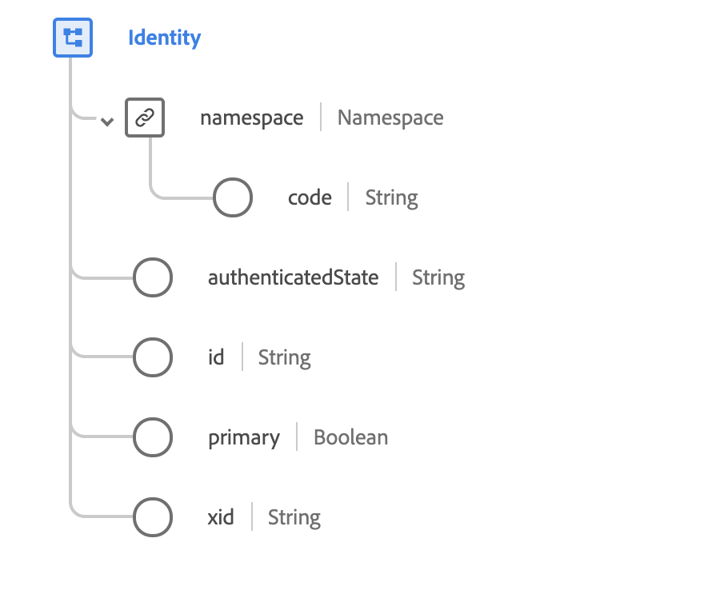

# [!UICONTROL Tipo ] de datos de identificación

 Identityis es un tipo de datos XDM estándar que se utiliza para distinguir claramente a las personas que interactúan con experiencias digitales. La identidad la establece un proveedor de identidad, al que se hace referencia en un atributo `namespace`. Dentro de cada `namespace`, la identidad es única.

 

| Propiedad | Tipo de datos | Descripción |
| --- | --- | --- |
| `namespace` | Objeto | Un objeto que contiene un solo campo de cadena (`code`), que indica la Área de nombres asociada al atributo proporcionado `id`. |
| `authenticatedState` | Cadena | Estado autenticado para esta identidad en el momento del Evento de experiencias observado. Consulte el [apéndice](#authenticatedState) para conocer los valores y las definiciones aceptados. |
| `id` | Cadena | La identidad del consumidor en la Área de nombres correspondiente. |
| `primary` | Booleano | Indica si esta es la identidad principal del individuo. Cada individuo sólo puede tener una identidad primaria. |
| `xid` | Cadena | Cuando está presente, este valor representa un identificador de Área de nombres cruzada que es único en todos los identificadores de ámbito de Área de nombres en todas las Áreas de nombres. |

Para obtener más información sobre la mezcla, consulte el repositorio público XDM:

* [Ejemplo rellenado](https://github.com/adobe/xdm/blob/master/components/datatypes/identity.example.1.json)
* [Esquema completo](https://github.com/adobe/xdm/blob/master/components/datatypes/identity.schema.json)

## Apéndice

La siguiente sección contiene información adicional sobre el tipo de datos [!UICONTROL Identity].

## Valores aceptados para authenticationState {#authenticatedState}

La siguiente tabla describe los valores aceptados para `authenticatedState` y sus significados asociados:

| Valor | Descripción |
| --- | --- |
| `ambiguous` | El estado autenticado es ambiguo. |
| `authenticated` | El usuario se identificó mediante un inicio de sesión o una acción similar que era válida en el momento de la observación de evento. |
| `loggedOut` | El usuario se identificó mediante una acción de inicio de sesión en algún momento anterior, pero no se inició en el momento de la observación de evento. |