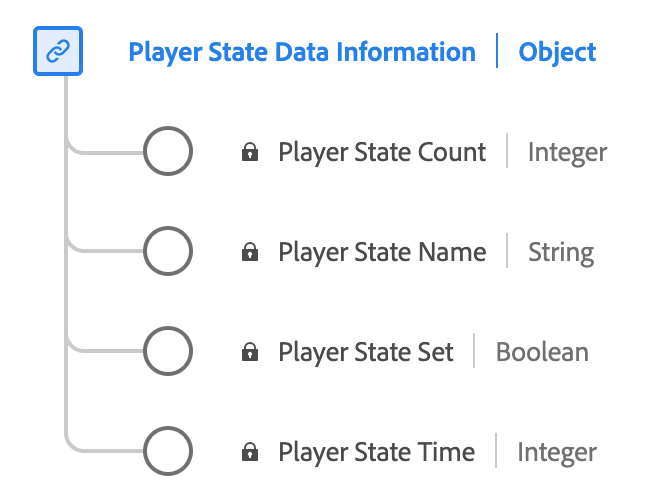

# [!UICONTROL Información de datos de estado del reproductor] tipo de datos

[!UICONTROL Información de datos de estado del reproductor] es un tipo de datos estándar del Modelo de datos de experiencia (XDM) que describe los distintos estados y sus ocurrencias dentro de un reproductor de contenido. Utilice el [!UICONTROL Información de datos de estado del reproductor] tipo de datos para capturar diferentes estados del reproductor, como pantalla completa, silencio, subtítulos, imagen en imagen y estados de enfoque. Para cada estado, registra si se establece el estado, el recuento de ocurrencias y la duración total que permanece activa durante la reproducción del contenido.

| Nombre para mostrar | Propiedad | Tipo de datos | Descripción |
|-------------------|----------------|-----------|----------------------------------------------|
| [!UICONTROL Nombre del estado del reproductor] | `name` | string | Nombre del estado del reproductor. Enumerado: &quot;pantalla completa&quot;, &quot;silenciar&quot;, &quot;closedCaptioning&quot;, &quot;pictureInPicture&quot;, &quot;inFocus&quot; con los significados respectivos. |
| [!UICONTROL Conjunto de estado del reproductor] | `isSet` | Booleano | Si el estado del reproductor está en ese estado o no. |
| [!UICONTROL Recuento de estados del reproductor] | `count` | entero | La cantidad de veces que se estableció el estado del reproductor en el flujo. |
| [!UICONTROL Hora de estado del reproductor] | `time` | entero | La duración total del estado del reproductor. |

{style="table-layout:auto"}

Para obtener más información sobre el grupo de campos, consulte la [repositorio XDM público](https://github.com/adobe/xdm/blob/master/components/datatypes/playerstatedata.schema.json)
