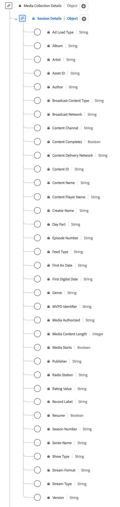

# [!UICONTROL Session Details] tipo de datos de colección

La colección [!UICONTROL Session Details] es un tipo de datos estándar del Modelo de datos de experiencia (XDM) que hace un seguimiento de los datos relacionados con las sesiones de reproducción de contenido. Los campos de recopilación de medios se utilizan para capturar datos que se envían a otros servicios de Adobe para un procesamiento posterior. Este esquema engloba una amplia gama de propiedades que se pueden utilizar para proporcionar perspectivas sobre el comportamiento del usuario y los patrones de consumo de contenido. Utilice el tipo de datos de colección [!UICONTROL Session Details] para capturar la participación del usuario mediante el registro de eventos de reproducción, interacciones de publicidad, marcadores de progreso, pausas y otras métricas.

+++Seleccione esta opción para mostrar un diagrama de la recopilación de detalles de la sesión.

+++

>[!NOTE]
>
>Cada nombre para mostrar contiene un vínculo a información adicional sobre sus parámetros de audio y vídeo. Las páginas vinculadas contienen detalles sobre el vídeo y los datos recopilados por Adobe, los valores de implementación, los parámetros de red, los informes y otros aspectos importantes.

| Nombre para mostrar | Propiedad | Tipo de datos | Requerido | Descripción |
|--------------------------------------------------------------------------------------------------------------------------------------------------------------------------|------------------|-----------|----------|---------------------------------------------------------------------------------------|
| [!UICONTROL Ad Load Type] | `adLoad` | Cadena | No | El tipo de anuncio cargado según lo definido por la representación interna de cada cliente. |
| [[!UICONTROL Album]](https://experienceleague.adobe.com/docs/media-analytics/using/implementation/variables/audio-video-parameters.html#album) | `album` | Cadena | No | El nombre del álbum al que pertenece la grabación musical o el vídeo. |
| [[!UICONTROL Artist]](https://experienceleague.adobe.com/docs/media-analytics/using/implementation/variables/audio-video-parameters.html#artist) | `artist` | Cadena | No | El nombre del artista del álbum o del grupo que realiza la grabación musical o el vídeo. |
| [[!UICONTROL Asset ID]](https://experienceleague.adobe.com/docs/media-analytics/using/implementation/variables/audio-video-parameters.html#asset-id) | `assetID` | Cadena | No | [!UICONTROL Asset ID] es el identificador único del contenido del recurso multimedia, como el identificador de episodio de series de TV, el identificador de recursos de película o el identificador de eventos en directo. Normalmente, estos ID se derivan de autoridades de metadatos como EIDR, TMS/Gracenote o Rovi. Estos identificadores también pueden proceder de otros sistemas propietarios o internos. |
| [[!UICONTROL Author]](https://experienceleague.adobe.com/docs/media-analytics/using/implementation/variables/audio-video-parameters.html#author) | `author` | Cadena | No | Nombre del autor de los medios. |
| [[!UICONTROL Broadcast Content Type]](https://experienceleague.adobe.com/docs/media-analytics/using/implementation/variables/audio-video-parameters.html#content-type) | `contentType` | Cadena | Sí | El [!UICONTROL Broadcast Content Type] del envío de flujo. Los valores disponibles por [!UICONTROL Stream Type] incluyen: Audio: &quot;song&quot;, &quot;podcast&quot;, &quot;audiobook&quot; y &quot;radio&quot;; Video: &quot;VoD&quot;, &quot;Live&quot;, &quot;Linear&quot;, &quot;UGC&quot; y &quot;DVoD&quot;. Los clientes pueden proporcionar valores personalizados para este parámetro. |
| [[!UICONTROL Broadcast Network]](https://experienceleague.adobe.com/docs/media-analytics/using/implementation/variables/audio-video-parameters.html#network) | `network` | Cadena | No | El nombre de la red/canal. |
| [[!UICONTROL Content Channel]](https://experienceleague.adobe.com/docs/media-analytics/using/implementation/variables/audio-video-parameters.html#content-channel) | `channel` | Cadena | Sí | [!UICONTROL Content Channel] es el canal de distribución desde el que se reprodujo el contenido. |
| [!UICONTROL Content Delivery Network] | `cdn` | Cadena | No | Se reprodujo el [!UICONTROL Content Delivery Network] del contenido. |
| [[!UICONTROL Content ID]](https://experienceleague.adobe.com/docs/media-analytics/using/implementation/variables/audio-video-parameters.html#content-id) | `name` | cadena | Sí | [!UICONTROL Content ID] es un identificador único del contenido. Se puede utilizar para volver a vincularse a otros ID de CMS o del sector. |
| [[!UICONTROL Content Name]](https://experienceleague.adobe.com/docs/media-analytics/using/implementation/variables/audio-video-parameters.html#content-name-(variable)) | `friendlyName` | Cadena | No | [!UICONTROL Content Name] es el nombre &quot;descriptivo&quot; (en lenguaje natural) del contenido. |
| [[!UICONTROL Content Player Name]](https://experienceleague.adobe.com/docs/media-analytics/using/implementation/variables/audio-video-parameters.html#content-player-name) | `playerName` | Cadena | Sí | Nombre del reproductor de contenido. |
| [[!UICONTROL Creator Name]](https://experienceleague.adobe.com/docs/media-analytics/using/implementation/variables/audio-video-parameters.html#originator) | `originator` | Cadena | No | Nombre del creador del contenido. |
| [[!UICONTROL Day Part]](https://experienceleague.adobe.com/docs/media-analytics/using/implementation/variables/audio-video-parameters.html#day-part) | `dayPart` | Cadena | No | Propiedad que define la hora del día a la que se emitió o reprodujo el contenido. Podría tener cualquier valor establecido como petición del cliente |
| [[!UICONTROL Episode Number]](https://experienceleague.adobe.com/docs/media-analytics/using/implementation/variables/audio-video-parameters.html#episode) | `episode` | Cadena | No | El número del episodio. |
| [[!UICONTROL Feed Type]](https://experienceleague.adobe.com/docs/media-analytics/using/implementation/variables/audio-video-parameters.html#media-feed-type) | `feed` | Cadena | No | El tipo de fuente, que puede representar datos reales relacionados con la fuente, como EAST HD o SD, o el origen de la fuente, como una dirección URL. |
| [[!UICONTROL First Air Date]](https://experienceleague.adobe.com/docs/media-analytics/using/implementation/variables/audio-video-parameters.html#first-air-date) | `firstAirDate` | Cadena | No | La fecha en la que el contenido se emitió por primera vez en televisión. Cualquier formato de fecha es aceptable, pero Adobe recomienda: AAAA-MM-DD. |
| [[!UICONTROL First Digital Date]](https://experienceleague.adobe.com/docs/media-analytics/using/implementation/variables/audio-video-parameters.html#first-digital-date) | `firstDigitalDate` | Cadena | No | La fecha en la que el contenido se emitió por primera vez en cualquier canal o plataforma digital. Cualquier formato de fecha es aceptable, pero Adobe recomienda: AAAA-MM-DD. |
| [[!UICONTROL Genre]](https://experienceleague.adobe.com/docs/media-analytics/using/implementation/variables/audio-video-parameters.html#genre) | `genre` | Cadena | No | El tipo o agrupación de contenido según lo definido por el productor de contenido. Los valores deben estar delimitados por comas en la implementación de variables. |
| [[!UICONTROL Media Authorized]](https://experienceleague.adobe.com/docs/media-analytics/using/implementation/variables/audio-video-parameters.html#authorized) | `authorized` | Cadena | No | Confirma si el usuario ha sido autorizado a través de la autenticación de Adobe. |
| [[!UICONTROL Media Content Length]](https://experienceleague.adobe.com/docs/media-analytics/using/implementation/variables/audio-video-parameters.html#content-length-(variable)) | `length` | Número entero | Sí | [!UICONTROL Media Content Length] contiene la duración/duración del clip: Es la longitud (o duración) máxima del contenido que se está consumiendo (en segundos). |
| [[!UICONTROL MVPD Identifier]](https://experienceleague.adobe.com/docs/media-analytics/using/implementation/variables/audio-video-parameters.html#mvpd) | `mvpd` | Cadena | No | El identificador de Multi-channel Video Programming Distributor (MVPD) proporcionado mediante autenticación de Adobe. |
| [[!UICONTROL Publisher]](https://experienceleague.adobe.com/docs/media-analytics/using/implementation/variables/audio-video-parameters.html#publisher) | `publisher` | Cadena | No | Nombre del editor del contenido de audio. |
| [[!UICONTROL Radio Station]](https://experienceleague.adobe.com/docs/media-analytics/using/implementation/variables/audio-video-parameters.html#station) | `station` | Cadena | No | Nombre de la emisora de radio en la que se reproduce el audio. |
| [[!UICONTROL Rating Value]](https://experienceleague.adobe.com/docs/media-analytics/using/implementation/variables/audio-video-parameters.html#content-rating) | `rating` | Cadena | No | La clasificación definida por las pautas de clasificación por edades de la TV. |
| [[!UICONTROL Record Label]](https://experienceleague.adobe.com/docs/media-analytics/using/implementation/variables/audio-video-parameters.html#label) | `label` | Cadena | No | El nombre de la discográfica. |
| [[!UICONTROL Resume]](https://experienceleague.adobe.com/docs/media-analytics/using/implementation/variables/audio-video-parameters.html#content-resumes) | `hasResume` | Booleano | No | Marca cada reproducción que se reanudó después de más de 30 minutos de búfer, pausa o detención. |
| [[!UICONTROL Season Number]](https://experienceleague.adobe.com/docs/media-analytics/using/implementation/variables/audio-video-parameters.html#season) | `season` | Cadena | No | [!UICONTROL Season Number] al que pertenece el programa. La temporada solo es necesaria si el programa es parte de una serie. |
| [[!UICONTROL Series Name]](https://experienceleague.adobe.com/docs/media-analytics/using/implementation/variables/audio-video-parameters.html#show) | `show` | Cadena | No | El Nombre Del Programa O La Serie. El Nombre del programa solo es necesario si el programa forma parte de una serie. |
| [[!UICONTROL Show Type]](https://experienceleague.adobe.com/docs/media-analytics/using/implementation/variables/audio-video-parameters.html#show-type) | `showType` | Cadena | No | El tipo de contenido. Por ejemplo, un tráiler o un episodio completo. El tipo de contenido se expresa como un número entero entre 0 y 3. Por ejemplo, &quot;0&quot; = episodio completo; &quot;1&quot; = Vista previa/trailer; &quot;2&quot; = Clip; &quot;3&quot; = Otro. |
| [[!UICONTROL Stream Format]](https://experienceleague.adobe.com/docs/media-analytics/using/implementation/variables/audio-video-parameters.html#stream-format) | `streamFormat` | Cadena | No | El formato de la emisión (HD, SD). |
| [[!UICONTROL Stream Type]](https://experienceleague.adobe.com/docs/media-analytics/using/implementation/variables/audio-video-parameters.html#stream-type) | `streamType` | Cadena | No | El tipo de flujo de medios. |
| [[!UICONTROL Version]](https://experienceleague.adobe.com/docs/media-analytics/using/implementation/variables/audio-video-parameters.html#sdk-version) | `appVersion` | Cadena | No | La versión de SDK utilizada por el reproductor. Podría tener cualquier valor personalizado que sea adecuado para el reproductor. |

{style="table-layout:auto"}
