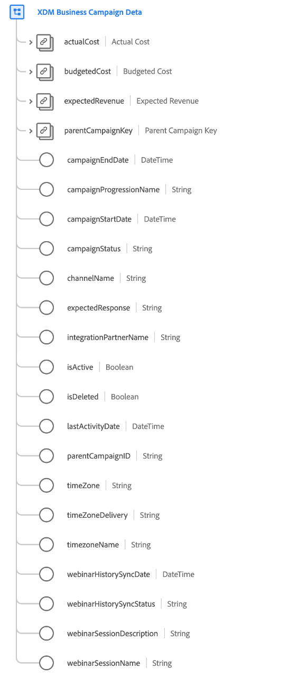

# [!UICONTROL Detalles de la campaña empresarial XDM] grupo de campos de esquema

[!UICONTROL Detalles de la campaña empresarial XDM] es un grupo de campos de esquema estándar para la variable [[!UICONTROL Campaña empresarial XDM] class](../../classes/b2b/business-campaign.md), que captura información detallada sobre una campaña empresarial.

| Propiedad | Tipo de datos | Descripción |
| --- | --- | --- |
| `actualCost` | [[!UICONTROL Moneda]](../../data-types/currency.md) | Representa el coste real de la campaña empresarial. |
| `budgetedCost` | [[!UICONTROL Moneda]](../../data-types/currency.md) | Representa el coste presupuestado de la campaña empresarial. |
| `expectedRevenue` | [[!UICONTROL Moneda]](../../data-types/currency.md) | Representa los ingresos que se espera que genere la campaña empresarial. |
| `parentCampaignKey` | [[!UICONTROL Fuente B2B]](../../data-types/b2b-source.md) | El ID compuesto para una campaña principal, si corresponde. |
| `campaignEndDate` | [!UICONTROL DateTime] | Marca de fecha y hora ISO 8601 del momento en que finalizó la campaña o finalizará. |
| `campaignProgressionName` | [!UICONTROL Cadena] | El nombre de la progresión de la campaña. |
| `campaignStartDate` | [!UICONTROL DateTime] | Marca de fecha y hora ISO 8601 del inicio o del inicio de la campaña. |
| `campaignStatus` | [!UICONTROL Cadena] | Estado actual de la campaña. |
| `channelName` | [!UICONTROL Cadena] | Nombre del canal asociado con esta campaña. |
| `expectedResponse` | [!UICONTROL Cadena] | La respuesta esperada para la campaña. |
| `integrationPartnerName` | [!UICONTROL Cadena] | Nombre del socio que se ha integrado con esta campaña. |
| `isActive` | [!UICONTROL Booleana] | Indica si esta campaña está activa. |
| `isDeleted` | [!UICONTROL Booleana] | Indica si esta campaña se ha eliminado en el Marketo Engage.  Al usar la variable [Conector de origen de Marketo](../../../sources/connectors/adobe-applications/marketo/marketo.md), cualquier registro que se elimine en Marketo se reflejará automáticamente en el perfil del cliente en tiempo real. Sin embargo, los registros relacionados con estos perfiles pueden persistir en el lago de datos. Si configura `isDeleted` a `true`, puede utilizar el campo para filtrar qué registros se han eliminado de sus orígenes al consultar el lago de datos. |
| `lastActivityDate` | [!UICONTROL DateTime] | Marca de tiempo ISO 8601 de la última actividad asociada a la campaña. |
| `timeZone` | [!UICONTROL Cadena] | Zona horaria en la que opera la campaña. |
| `timeZoneDelivery` | [!UICONTROL Cadena] | Zona horaria de entrega en la que opera la campaña. |
| `timeZoneName` | [!UICONTROL Cadena] | Nombre de la zona horaria en la que opera la campaña. |
| `webinarHistorySyncDate` | [!UICONTROL DateTime] | Marca de fecha y hora ISO 8601 de la última sincronización del historial del seminario web para esta campaña. |
| `webinarHistorySyncStatus` | [!UICONTROL Cadena] | Estado de la sincronización del historial de seminarios web para esta campaña. |
| `webinarSessionDescription` | [!UICONTROL Cadena] | Descripción de la sesión del seminario web asociada a esta campaña. |
| `webinarSessionName` | [!UICONTROL Cadena] | Nombre de la sesión del seminario web asociada a esta campaña. |

{style=&quot;table-layout:auto&quot;}

Para obtener más información sobre el grupo de campos, consulte la [repositorio XDM público](https://github.com/adobe/xdm/blob/master/components/fieldgroups/campaign/campaign-details.schema.json).
