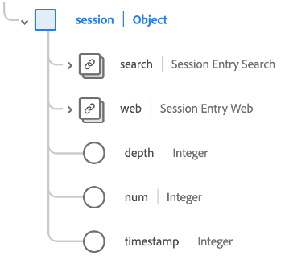

# [!UICONTROL Extensión completa de Adobe Analytics ExperienceEvent] grupo de campos de esquema

[!UICONTROL Adobe Analytics ExperienceEvent Full Extension] es un grupo de campos de esquema estándar para la [[!DNL XDM ExperienceEvent] clase](../../classes/experienceevent.md), que captura métricas comunes recopiladas por Adobe Analytics.

Este documento describe la estructura y el caso de uso del grupo de campos Extensión de Analytics.

>[!NOTE]
>
>Debido al tamaño y la cantidad de elementos repetidos en este grupo de campos, muchos de los campos mostrados en esta guía se han contraído para ahorrar espacio. Para explorar la estructura completa de este grupo de campos, puede [buscarlo en la interfaz de usuario de Experience Platform](../../ui/explore.md) o ver el esquema completo en el [repositorio XDM público](https://github.com/adobe/xdm/blob/master/extensions/adobe/experience/analytics/experienceevent-all.schema.json).

## Estructura del grupo de campos

El grupo de campos proporciona un único objeto `_experience` a un esquema, que a su vez contiene un único objeto `analytics`.

| Propiedad | Tipo de datos | Descripción |
| --- | --- | --- |
| `customDimensions` | Objeto | Registra dimensiones personalizadas de las que Analytics realiza un seguimiento. Vea la [subsección debajo de](#custom-dimensions) para obtener más información sobre el contenido de este objeto. |
| `endUser` | Objeto | Registra los detalles de interacción web del usuario final que activó el evento. Vea la [subsección debajo de](#end-user) para obtener más información sobre el contenido de este objeto. |
| `environment` | Objeto | Registra información sobre el explorador y el sistema operativo que activó el evento. Vea la [subsección debajo de](#environment) para obtener más información sobre el contenido de este objeto. |
| `event1to100`  `event101to200`  `event201to300`  `event301to400`  `event401to500`  `event501to100`  `event601to700`  `event701to800`  `event801to900`  `event901to1000` | Objeto | El grupo de campos proporciona campos de objeto para capturar hasta 1000 eventos personalizados. Vea la [subsección debajo de](#events) para obtener más información sobre estos campos. |
| `session` | Objeto | Registra información sobre la sesión que activó el evento. Vea la [subsección debajo de](#session) para obtener más información sobre el contenido de este objeto. |

{style="table-layout:auto"}

## `customDimensions` {#custom-dimensions}

`customDimensions` captura [dimensiones](https://experienceleague.adobe.com/docs/analytics/components/dimensions/overview.html?lang=es) personalizadas de las que Analytics realiza un seguimiento.

| Propiedad | Tipo de datos | Descripción |
| --- | --- | --- |
| `eVars` | Objeto | Un objeto que captura hasta 250 variables de conversión ([eVars](https://experienceleague.adobe.com/docs/analytics/components/dimensions/evar.html?lang=es)). Las propiedades de este objeto tienen la clave `eVar1` en `eVar250` y solo aceptan cadenas para su tipo de datos. |
| `hierarchies` | Objeto | Objeto que captura hasta cinco variables de jerarquía personalizada ([hiers](https://experienceleague.adobe.com/docs/analytics/implementation/vars/page-vars/hier.html?lang=es)). Las propiedades de este objeto tienen claves de `hier1` a `hier5`, que son objetos con las siguientes subpropiedades:<ul><li>`delimiter`: el delimitador original utilizado para generar la lista proporcionada en `values`.</li><li>`values`: lista delimitada de nombres de nivel de jerarquía, representados como una cadena.</li></ul> |
| `listProps` | Objeto | Un objeto que captura hasta 75 [props de lista](https://experienceleague.adobe.com/docs/analytics/implementation/vars/page-vars/prop.html?lang=es#list-props). Las propiedades de este objeto tienen claves de `prop1` a `prop75`, que son objetos con las siguientes subpropiedades:<ul><li>`delimiter`: el delimitador original utilizado para generar la lista proporcionada en `values`.</li><li>`values`: una lista delimitada de valores para la propiedad, representada como una cadena.</li></ul> |
| `lists` | Objeto | Un objeto que captura hasta tres [listas](https://experienceleague.adobe.com/docs/analytics/implementation/vars/page-vars/list.html?lang=es). Las propiedades de este objeto tienen claves de `list1` a `list3`. Cada una de estas propiedades contiene una sola matriz `list` de [[!UICONTROL pares de valores clave]](../../data-types/key-value-pair.md) tipos de datos. |
| `props` | Objeto | Un objeto que captura hasta 75 [props](https://experienceleague.adobe.com/docs/analytics/implementation/vars/page-vars/prop.html?lang=es). Las propiedades de este objeto tienen la clave `prop1` en `prop75` y solo aceptan cadenas para su tipo de datos. |
| `postalCode` | Cadena | Un código postal proporcionado por el cliente. |
| `stateProvince` | Cadena | Una ubicación de estado o provincia proporcionada por el cliente. |

{style="table-layout:auto"}

## `endUser` {#end-user}

`endUser` captura los detalles de interacción web del usuario final que activó el evento.

| Propiedad | Tipo de datos | Descripción |
| --- | --- | --- |
| `firstWeb` | [[!UICONTROL Información web]](../../data-types/web-information.md) | La información relacionada con la página web, el vínculo y el referente del primer evento de experiencia de este usuario final. |
| `firstTimestamp` | Entero | Una marca de tiempo Unix para el primer ExperienceEvent de este usuario final. |

## `environment` {#environment}

`environment` captura información sobre el explorador y el sistema operativo que activó el evento.

| Propiedad | Tipo de datos | Descripción |
| --- | --- | --- |
| `browserIDStr` | Cadena | El identificador de Adobe Analytics para el navegador utilizado (también conocido como [dimensión de tipo de navegador](https://experienceleague.adobe.com/docs/analytics/components/dimensions/browser-type.html?lang=es)). |
| `operatingSystemIDStr` | Cadena | El identificador de Adobe Analytics del sistema operativo utilizado (también conocido como [dimensión de tipo de sistema operativo](https://experienceleague.adobe.com/docs/analytics/components/dimensions/operating-system-types.html?lang=es)). |

## Campos de evento personalizados {#events}

El grupo de campos de extensión de Analytics proporciona diez campos de objeto que capturan hasta 100 [métricas de evento personalizadas](https://experienceleague.adobe.com/docs/analytics/components/metrics/custom-events.html?lang=es) cada una, lo que hace un total de 1000 para el grupo de campos.

Cada objeto de evento de nivel superior contiene los objetos de evento individuales para su intervalo respectivo. Por ejemplo, `event101to200` contiene los eventos con claves desde `event101` hasta `event200`.

Cada objeto de evento utiliza el tipo de datos [[!UICONTROL Measure]](../../data-types/measure.md), lo que proporciona un identificador único y un valor cuantificable.

## `session` {#session}

`session` captura información sobre la sesión que activó el evento.

| Propiedad | Tipo de datos | Descripción |
| --- | --- | --- |
| `search` | [[!UICONTROL Buscar]](../../data-types/search.md) | Registra información relacionada con la búsqueda web o móvil de la entrada de sesión. |
| `web` | [[!UICONTROL Información web]](../../data-types/web-information.md) | Registra información sobre los clics en vínculos, los detalles de página web, la información del referente y los detalles del explorador para la entrada de sesión. |
| `depth` | Entero | La profundidad de la sesión actual (como el número de página) para el usuario final. |
| `num` | Entero | Número de la sesión actual del usuario final. |
| `timestamp` | Entero | Una marca de tiempo Unix para la entrada de sesión. |

## Pasos siguientes

Este documento abarcaba la estructura y el caso de uso del grupo de campos Extensión de Analytics. Para obtener más información sobre el propio grupo de campos, consulte el [repositorio XDM público](https://github.com/adobe/xdm/blob/master/extensions/adobe/experience/analytics/experienceevent-all.schema.json).

Si utiliza este grupo de campos para recopilar datos de Analytics mediante Adobe Experience Platform Web SDK, consulte la guía sobre [configuración de una secuencia de datos](../../../datastreams/overview.md) para obtener información sobre cómo asignar datos a XDM en el servidor.
