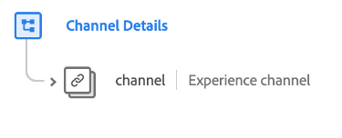

# [!UICONTROL Detalles de canal] grupo de campos de esquema

>[!NOTE]
>
>Los nombres de varios grupos de campos de esquema han cambiado. Consulte el documento sobre [actualizaciones de nombre de grupo de campos](../name-updates.md) para obtener más información.

[!UICONTROL Detalles de canal] es un grupo de campos de esquema estándar para la [[!DNL XDM ExperienceEvent] clase](../../classes/experienceevent.md), que se usa para describir información de canal como ID, tipo de canal, tipo de medios y tipo de ubicación.

| Propiedad | Tipo de datos | Descripción |
| --- | --- | --- |
| `channel` | [Canal de experiencia](../../data-types/experience-channel.md) | Un objeto que describe las devoluciones de productos, el registro de garantías y los procesos del carro de compras/pedido. |

{style="table-layout:auto"}

Para obtener más información sobre el grupo de campos, consulte el repositorio XDM público:

* [Ejemplo completado](https://github.com/adobe/xdm/blob/master/components/fieldgroups/experience-event/experienceevent-channel.example.1.json)
* [Esquema completo](https://github.com/adobe/xdm/blob/master/components/fieldgroups/experience-event/experienceevent-channel.schema.json)
