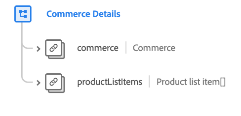

# [!UICONTROL Detalles del comercio] grupo de campos de esquema

>[!NOTE]
>
>Los nombres de varios grupos de campos de esquema han cambiado. Consulte el documento en [actualizaciones del nombre del grupo de campos](../name-updates.md) para obtener más información.

[!UICONTROL Detalles del comercio] es un grupo de campos de esquema estándar para la variable [[!DNL XDM ExperienceEvent] class](../../classes/experienceevent.md), se usa para describir datos de comercio como información de producto (SKU, nombre, cantidad) y operaciones estándar del carro de compras (pedido, cierre de compra, abandono).

| Propiedad | Tipo de datos | Descripción |
| --- | --- | --- |
| `commerce` | [Commerce](../../data-types/commerce.md) | Un objeto que describe devoluciones de productos, registro de garantías y procesos de carro/pedido de compras. |
| `productListItems` | Matriz de [Elementos de la lista de productos](../../data-types/product-list-item.md) | Lista de artículos que representan los productos seleccionados por un cliente, con opciones y precios específicos en un momento específico (que pueden diferir del registro del producto). |

{style=&quot;table-layout:auto&quot;}

Para obtener más información sobre el grupo de campos, consulte el repositorio XDM público:

* [Ejemplo rellenado](https://github.com/adobe/xdm/blob/master/components/fieldgroups/experience-event/experienceevent-commerce.example.1.json)
* [Esquema completo](https://github.com/adobe/xdm/blob/master/components/fieldgroups/experience-event/experienceevent-commerce.schema.json)
