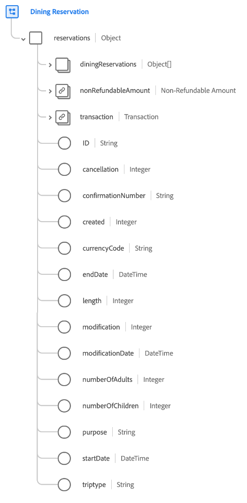

# [!UICONTROL Reserva de restaurante] grupo de campos de esquema

[!UICONTROL Reserva de restaurante] es un grupo de campos de esquema estándar para [[!DNL XDM ExperienceEvent] clase](../../classes/experienceevent.md) se utiliza para recopilar información sobre una reserva de restaurante.

El grupo de campos es una extensión de [!UICONTROL Detalles de reserva] grupo de campos, y contiene todos los mismos campos en un único campo de tipo de objeto, `reservations`. Además de estos campos genéricos, [!UICONTROL Reserva de restaurante] también incluye `diningReservations` matriz. Esta matriz de objetos se utiliza para describir una o más reservas con propiedades específicas de restaurantes.

>[!NOTE]
>
>Este documento describe los detalles de la `diningReservations` matriz. Para obtener información sobre los demás campos, consulte la `reservations` objeto, consulte la [[!UICONTROL Detalles de reserva] referencia de grupo de campos](./reservation-details.md).

## `diningReservations`

`diningReservations` es una matriz de objetos que representa una lista de reservas de restaurantes. Si un evento de reserva implica reservas en varios restaurantes diferentes en distintas horas del día, por ejemplo, estas reservas pueden enumerarse como objetos individuales en `diningReservations` para un solo evento.

La estructura de cada objeto proporcionada en `diningReservations` se proporciona a continuación.

| Propiedad | Tipo de datos | Descripción |
| --- | --- | --- |
| `ID` | Cadena | El número o identificador de la reserva. |
| `cancellation` | Número entero | Este valor se registra cuando se cancela una reserva. |
| `confirmationNumber` | Cadena | El número o identificador de confirmación de la reserva. |
| `created` | Número entero | Este valor se registra cuando se crea una reserva. |
| `cuisine` | Número entero | El tipo de cocina del restaurante. |
| `currencyCode` | Cadena | El código de divisa en formato ISO 4217 usado para realizar la compra. |
| `deliveryPartners` | Cadena | Socios de entrega disponibles en el restaurante. |
| `diningOptions` | Cadena | Opciones para comer y de envío disponibles en el restaurante. |
| `groupReservation` | Booleano | Indica si la reserva es para un grupo. |
| `length` | Número entero | Número total de días de la reserva. |
| `loyaltyID` | Cadena | El ID del programa de fidelización del huésped que figura en la reserva. |
| `modification` | Número entero | Este valor se registra cuando se modifica una reserva. |
| `modificationDate` | DateTime | Hora a la que se modificó la reserva por última vez. |
| `numberOfAdults` | Número entero | El número de adultos asociados con la reserva. |
| `numberOfChildren` | Número entero | El número de niños asociados con la reserva. |
| `numberOfRooms` | Número entero | El número de habitaciones asociadas con la reserva. |
| `partySize` | Número entero | El número de personas en el comedor. |
| `priceCategory` | Cadena | La categoría de precio de la reserva que se está realizando. |
| `purpose` | Cadena | El propósito de la reserva, por lo general, ya sea comercial o personal. |
| `reservationTime` | DateTime | La hora de reserva de la mesa. |
| `restaurantID` | Cadena | Identificador de la ubicación del restaurante o la mesa. |
| `reservationStatus` | Cadena | El estado de la reserva. |
| `specialOccasion` | Booleano | Indica si la reserva es para una ocasión especial. |
| `status` | Número entero | El estado de reserva de la mesa. |

{style="table-layout:auto"}

Para obtener más información sobre el grupo de campos, consulte el repositorio XDM público:

* [Ejemplo completado](https://github.com/adobe/xdm/blob/master/components/fieldgroups/experience-event/industry-verticals/experienceevent-dining-reservation.example.1.json)
* [Esquema completo](https://github.com/adobe/xdm/blob/master/components/fieldgroups/experience-event/industry-verticals/experienceevent-dining-reservation.schema.json)
