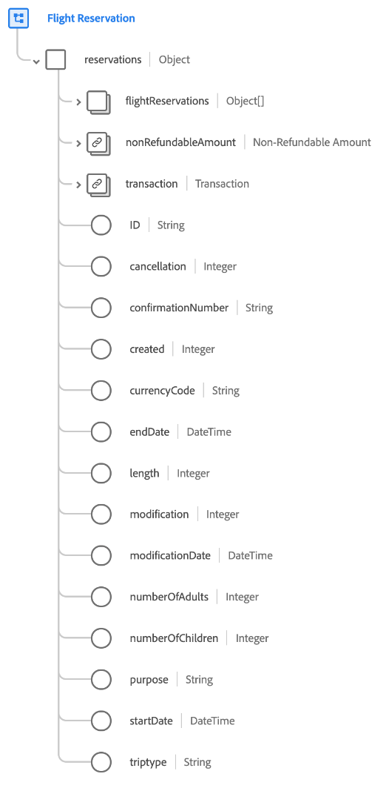

# [!UICONTROL Reserva de vuelo] grupo de campos de esquema

[!UICONTROL Reserva de vuelo] es un grupo de campos de esquema estándar para [[!DNL XDM ExperienceEvent] clase](../../classes/experienceevent.md) se utiliza para recopilar información sobre una reserva de vuelo.

El grupo de campos es una extensión de [!UICONTROL Detalles de reserva] grupo de campos, y contiene todos los mismos campos en un único campo de tipo de objeto, `reservations`. Además de estos campos genéricos, [!UICONTROL Reserva de vuelo] también incluye `flightReservations` matriz. Esta matriz de objetos se utiliza para describir una o más reservas con propiedades exclusivas del transporte aéreo.

>[!NOTE]
>
>Este documento describe los detalles de la `flightReservations` matriz. Para obtener información sobre los demás campos, consulte la `reservations` objeto, consulte la [[!UICONTROL Detalles de reserva] referencia de grupo de campos](./reservation-details.md).

## `flightReservations`

`flightReservations` es una matriz de objetos que representa una lista de reservas de vuelo. Si un evento de reserva implica reservas para varios vuelos de conexión en un viaje, por ejemplo, estas reservas pueden enumerarse como objetos individuales en `flightReservations` para un solo evento.

La estructura de cada objeto proporcionada en `flightReservations` se proporciona a continuación.

| Propiedad | Tipo de datos | Descripción |
| --- | --- | --- |
| `flightCheckIn` | Objeto | Registra detalles sobre el check-in del vuelo. El objeto incluye las siguientes propiedades:<ul><li>`arrivalAirportCode`: (Cadena) El código de aeropuerto de la ciudad de llegada.</li><li>`boardingGroup`: (cadena) indicador específico de la aerolínea del orden de embarque.</li><li>`checkInMethod`: (cadena) método utilizado para el registro, como mostrador, en línea, quiosco o autoservicio.</li><li>`checkedBags`: (Número entero) El número de maletas facturadas para el vuelo.</li><li>`checkedPassengers`: (Número entero) El número de pasajeros registrados para el vuelo, si existen varios pasajeros para el mismo número de reserva.</li><li>`confirmationNumber`: (cadena) número o identificador de confirmación de la reserva.</li><li>`departureAirportCode`: (Cadena) El código de aeropuerto de la ciudad de salida.</li><li>`flightNumber`: (Cadena) Número de vuelo del vuelo que se está reservando.</li></ul> |
| `flightStatusSearch` | Objeto | Registra los detalles devueltos cuando se busca el estado del vuelo. El objeto incluye las siguientes propiedades:<ul><li>`arrivalAirportCode`: (Cadena) El código de aeropuerto de la ciudad de llegada.</li><li>`boardingGroup`: (cadena) indicador específico de la aerolínea del orden de embarque.</li><li>`departureAirportCode`: (Cadena) El código de aeropuerto de la ciudad de salida.</li><li>`departureDate`: (DateTime) La fecha de salida del vuelo que se está reservando.</li><li>`flightNumber`: (Cadena) Número de vuelo del vuelo que se está reservando.</li><li>`searchCount`: (entero) El número de veces que se ha buscado el estado del vuelo reservado.</li></ul> |
| `agentID` | Cadena | El agente o reservador responsable de reservar la reserva, si corresponde. |
| `aircraftID` | Cadena | Un identificador de la aeronave. |
| `aircraftType` | Cadena | El tipo de avión. |
| `arrivalAirportCode` | Cadena | El código del aeropuerto de la ciudad de llegada. |
| `arrivalDate` | DateTime | La fecha de llegada del vuelo que se está reservando. |
| `cancellation` | Número entero | Este valor se registra cuando se cancela una reserva. |
| `confirmationNumber` | Cadena | El número o identificador de confirmación de la reserva. |
| `created` | Cadena | Este valor se registra cuando se crea una reserva. |
| `currencyCode` | Cadena | El código de divisa en formato ISO 4217 usado para realizar la compra. |
| `departureAirportCode` | Cadena | El código del aeropuerto de la ciudad de salida. |
| `departureDate` | DateTime | La fecha de salida del vuelo que se está reservando. |
| `fareClass` | Cadena | La clase de tarifa del vuelo que se está reservando. |
| `flightNumber` | Cadena | El número de vuelo del vuelo que se está reservando. |
| `length` | Número entero | Número total de días de la reserva. |
| `loyaltyID` | Cadena | El ID del programa de fidelización o recompensas del pasajero que figura en la reserva. |
| `modification` | Número entero | Este valor se registra cuando se modifica una reserva. |
| `modificationDate` | DateTime | Hora a la que se modificó la reserva por última vez. |
| `numberOfAdults` | Número entero | El número de adultos asociados con la reserva. |
| `numberOfChildren` | Número entero | El número de niños asociados con la reserva. |
| `passengerID` | Cadena | Información del pasajero asociada con la reserva. |
| `purpose` | Cadena | El propósito de la reserva, por lo general, ya sea comercial o personal. |
| `salesChannel` | Cadena | El canal de ventas desde el que se reservó la reserva. |
| `securityScreening` | Cadena | El tipo de control de seguridad al que está sujeto el pasajero. |
| `status` | Cadena | El estado de reserva del vuelo. |
| `ticketNumber` | Cadena | El número o identificador de la reserva. |
| `tripType` | Cadena | Indica si la reserva es para un viaje de ida, de ida y vuelta o de varias ciudades. |

{style="table-layout:auto"}

Para obtener más información sobre el grupo de campos, consulte el repositorio XDM público:

* [Ejemplo completado](https://github.com/adobe/xdm/blob/master/components/fieldgroups/experience-event/industry-verticals/experienceevent-flight-reservation.example.1.json)
* [Esquema completo](https://github.com/adobe/xdm/blob/master/components/fieldgroups/experience-event/industry-verticals/experienceevent-flight-reservation.schema.json)
