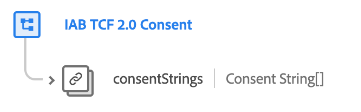

# [!UICONTROL Consentimiento TCF 2.0 de IAB] grupo de campos para esquemas de eventos

>[!IMPORTANT]
>
>Este documento cubre el [!UICONTROL Consentimiento TCF 2.0 de IAB] grupo de campos de esquema para la clase XDM ExperienceEvent . Este grupo de campos solo debe utilizarse si tiene intención de rastrear eventos de cambio de consentimiento a lo largo del tiempo.
>
>Tenga en cuenta que los valores de consentimiento registrados en los datos de evento no se respetan en los flujos de trabajo de aplicación automática. Para que se realice la aplicación automática, los valores de consentimiento deben ingerirse en la clase de Perfil individual XDM y habilitarse para Perfil del cliente en tiempo real.
>
>Para el grupo de campos diseñado para la clase XDM Individual Profile, consulte lo siguiente [documento](../profile/iab.md) en su lugar.

[!UICONTROL Consentimiento TCF 2.0 de IAB] es un grupo de campos de esquema estándar para la variable [[!DNL XDM ExperienceEvent] class](../../classes/experienceevent.md) se utiliza para capturar una serie con marca de hora de cadenas de consentimiento IAB, con el fin de rastrear patrones de cambio de consentimiento a lo largo del tiempo.

| Propiedad | Tipo de datos | Descripción |
| --- | --- | --- |
| `consentStrings` | Matriz de [Cadenas de consentimiento](../../data-types/consent-string.md) | Matriz de valores de cadena de consentimiento asociados al evento. |

{style=&quot;table-layout:auto&quot;}

Consulte la guía de [Compatibilidad con IAB TCF 2.0 en Platform](../../../landing/governance-privacy-security/consent/iab/overview.md) para obtener más información sobre el caso de uso de este grupo de campos. Para obtener más información sobre el propio grupo de campos, consulte el repositorio XDM público:

* [Ejemplo rellenado](https://github.com/adobe/xdm/blob/master/components/fieldgroups/experience-event/experienceevent-privacy.example.1.json)
* [Esquema completo](https://github.com/adobe/xdm/blob/master/components/fieldgroups/experience-event/experienceevent-privacy.schema.json)
