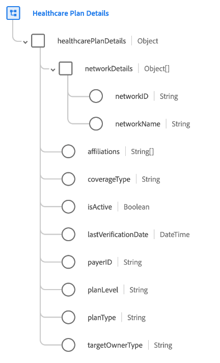

# [!UICONTROL Detalles del plan de atención médica] grupo de campos de esquema

[!UICONTROL Detalles del plan de atención médica] es un grupo de campo de esquema estándar para la clase [[!UICONTROL Plan]](../../classes/plan.md). Proporciona un único campo de tipo de objeto `healthcarePlanDetails` que captura las propiedades relacionadas con un plan médico.

| Propiedad | Tipo de datos | Descripción |
| --- | --- | --- |
| `networkDetails` | Matriz de objetos | Enumera los detalles de las redes de proveedores definidas por el asegurador a las que el beneficiario puede solicitar tratamiento, y se cubrirán a la tasa &quot;dentro de la red&quot;. Cada objeto incluye las siguientes propiedades: <ul><li>`networkID`: (Cadena) Id. específico del asegurador para la red.</li><li>`networkName`: (cadena) nombre específico del asegurador para la red.</li></ul> |
| `affiliations` | Matriz de cadenas | Una lista de entidades comerciales afiliadas al plan. |
| `coverageType` | Cadena | El tipo de cobertura del plan. Los valores aceptados son:<ul><li>`medical`</li><li>`dental`</li><li>`vision`</li><li>`accident`</li></ul> |
| `isActive` | Booleano | Indica si el plan está activo. |
| `lastVerificationDate` | Fecha/Hora | La fecha en la que se verificó por última vez el plan. |
| `payerID` | Cadena | El identificador único del pagador (es decir, el proveedor de seguros del plan). |
| `planLevel` | Cadena | Indica el nivel de plan. Los valores aceptados son:<ul><li>`primary`</li><li>`secondary`</li><li>`tertiary`</li><li>`quaternary`</li></ul> |
| `planType` | Cadena | Indica el tipo de plan. Los valores aceptados son:<ul><li>`hmo`</li><li>`epo`</li><li>`pos`</li><li>`hdhp`</li></ul> |
| `targetOwnerType` | Cadena | El tipo de propietario para el que se prepara un plan. Algunos ejemplos son individual, grupo, organización, etc. |

{style="table-layout:auto"}

Para obtener más información sobre el grupo de campos, consulte el [repositorio XDM público](https://github.com/adobe/xdm/blob/master/docs/reference/fieldgroups/plan/healthcare-plan-details.schema.json).
