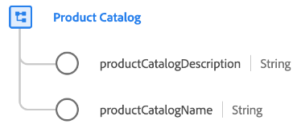

# [!UICONTROL Catálogo de productos] grupo de campos de esquema

[!UICONTROL Catálogo de productos] es un grupo de campos de esquema estándar para [[!UICONTROL Product] clase](../../classes/product.md) que captura propiedades relacionadas con un catálogo de productos.

| Propiedad | Tipo de datos | Descripción |
| --- | --- | --- |
| `productCatalogDescription` | Cadena | Descripción del catálogo de productos. |
| `productCatalogName` | Cadena | Nombre del catálogo de productos. |

{style="table-layout:auto"}

Para obtener más información sobre el grupo de campos, consulte la [repositorio XDM público](https://github.com/adobe/xdm/blob/master/docs/reference/fieldgroups/product/product-catalog.schema.json).
