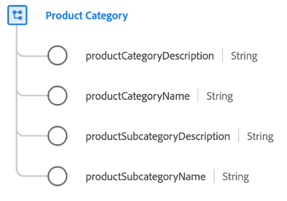

# [!UICONTROL Categoría de productos] grupo de campos de esquema

[!UICONTROL Categoría de productos] es un grupo de campos de esquema estándar para [[!UICONTROL Product] clase](../../classes/product.md) que captura propiedades relacionadas con la categoría de un producto.

| Propiedad | Tipo de datos | Descripción |
| --- | --- | --- |
| `productCategoryDescription` | Cadena | Una descripción para la categoría del producto. |
| `productCategoryName` | Cadena | El nombre de la categoría del producto. |
| `productSubcategoryDescription` | Cadena | Una descripción para la subcategoría de productos. |
| `productSubcategoryName` | Cadena | Nombre de la subcategoría de productos. |

{style="table-layout:auto"}

Para obtener más información sobre el grupo de campos, consulte la [repositorio XDM público](https://github.com/adobe/xdm/blob/master/docs/reference/fieldgroups/product/product-category.schema.json).
