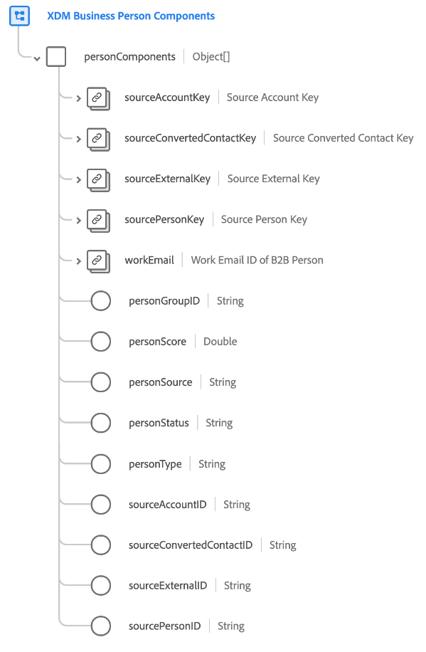

# [!UICONTROL Componentes de persona de negocios XDM] grupo de campos de esquema

[!UICONTROL Componentes de persona de negocios de XDM] es un grupo de campos de esquema estándar para la [[!DNL XDM Individual Profile] clase](../../classes/individual-profile.md) que captura varios registros de origen para una persona, y otros atributos que son necesarios para la segmentación de personas.

Cuando se crea un perfil para una persona a través de [Perfil del cliente en tiempo real](../../../profile/home.md) en B2B edition of Real-Time CDP, la información utilizada para crear ese perfil podría provenir de muchos registros de origen. Por ejemplo, si una persona trabaja para dos empresas diferentes, muchos sistemas CRM crearían una copia duplicada intencionalmente de esa persona para que una copia esté vinculada a la compañía A, mientras que la otra está vinculada a la compañía B. Al llevar esos datos a Adobe Experience Platform, este grupo de campos se utiliza para combinar esos registros de origen diferentes en una sola representación.

El grupo de campos proporciona un campo `personComponents` de nivel raíz, que es una matriz de objetos. Cada objeto de la matriz representa un registro de origen diferente.

>[!IMPORTANT]
>
>Debe seguir los patrones de ingesta tal como se describe en la [documentación de orígenes](../../../rtcdp/sources/b2b.md). No se garantiza que funcionen otros métodos de asignación de campos.
>
>Por ejemplo, cada objeto de la matriz `personComponents` se envía individualmente durante los patrones de ingesta estándar y Experience Platform lo agrega a la matriz. Si se agrega manualmente una matriz de objetos al componente Persona de negocios, se devolverá un error.
>Debe utilizar la utilidad de generación automática al crear esquemas para los datos B2B. Consulte la documentación para obtener instrucciones sobre cómo usar el espacio de nombres [B2B y la utilidad de generación automática de esquemas](../../../sources/connectors/adobe-applications/marketo/marketo-namespaces.md). Si no usa la utilidad de generación automática y tiene intención de asignar manualmente su modelo de datos, asegúrese de leer la documentación de las [clases XDM de Adobe Real-Time Customer Data Platform B2B edition](../../../rtcdp/schemas/b2b.md) antes de asignar sus datos.
>
>Consulte el [tutorial completo](../../../rtcdp/b2b-tutorial.md) para obtener información sobre los flujos de trabajo recomendados para los datos B2B.

| Propiedad | Tipo de datos | Descripción |
| --- | --- | --- |
| `sourceAccountKey` | [[!UICONTROL Source B2B]](../../data-types/b2b-source.md) | Un identificador compuesto de la cuenta asociada con la persona. |
| `sourceConvertedContactKey` | [[!UICONTROL Source B2B]](../../data-types/b2b-source.md) | Un identificador compuesto para el contacto relacionado si se convirtió este posible cliente. |
| `sourceExternalKey` | [[!UICONTROL Source B2B]](../../data-types/b2b-source.md) | Un identificador compuesto para el sistema de origen desde el que se originaron los datos de la persona. |
| `sourcePersonKey` | [[!UICONTROL Source B2B]](../../data-types/b2b-source.md) | Un identificador compuesto de la persona. |
| `workEmail` | [[!UICONTROL Dirección de correo electrónico]](../../data-types/b2b-source.md) | El ID de correo electrónico de trabajo de la persona. |
| `personGroupID` | Cadena | Un identificador de grupo de la persona. |
| `personScore` | Cadena | Una puntuación generada para la persona por un sistema CRM. |
| `personSource` | Cadena | Un identificador único basado en cadenas para el sistema de origen desde el que se originaron los datos de la persona. |
| `personStatus` | Cadena | El estado actual de marketing o ventas de la persona. |
| `personType` | Cadena | El tipo de persona en un contexto B2B. |
| `sourceAccountID` | Cadena | Un identificador único basado en cadenas para la cuenta en el sistema de origen asociado con la persona. El sistema utiliza este campo como clave externa para buscar las distintas compañías para las que trabaja esta persona. |
| `sourceConvertedContactID` | Cadena | Identificador único basado en cadenas para el contacto relacionado si se convirtió este posible cliente. |
| `sourceExternalID` | Cadena | Identificador único basado en cadenas del sistema de origen desde el que se originaron los datos de la persona. |
| `sourcePersonID` | Cadena | Un identificador único basado en cadenas para la persona. |

{style="table-layout:auto"}

Para obtener más información sobre el grupo de campos, consulte el repositorio XDM público:

* [Ejemplo completado](https://github.com/adobe/xdm/blob/master/components/fieldgroups/profile/b2b-person-components.example.1.json)
* [Esquema completo](https://github.com/adobe/xdm/blob/master/components/fieldgroups/profile/b2b-person-components.schema.json)
