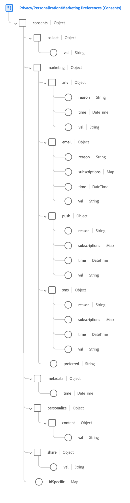

# [!UICONTROL Consentimientos y preferencias] grupo de campos

[!UICONTROL Consentimientos y preferencias] es un grupo de campos estándar para la [[!DNL XDM Individual Profile] clase](../../classes/individual-profile.md) que captura la información de preferencias y consentimiento de un cliente individual.

>[!NOTE]
>
>Dado que este grupo de campos solo es compatible con [!DNL XDM Individual Profile], no se puede usar para [!DNL XDM ExperienceEvent] esquemas. Si desea incluir datos de consentimiento y preferencia en el esquema de Experience Event, agregue el tipo de datos [[!UICONTROL Consentimiento para preferencias de privacidad, Personalization y marketing]](../../data-types/consents.md) al esquema mediante el uso de un [grupo de campos personalizados](../../ui/resources/field-groups.md#create).

## Estructura del grupo de campos {#structure}

El grupo de campos [!UICONTROL Consentimientos y preferencias] proporciona un único campo de tipo de objeto, `consents`, para capturar información de preferencias y consentimiento. Este campo amplía el tipo de datos [[!UICONTROL Consentimiento para preferencias de privacidad, Personalization y marketing]](../../data-types/consents.md), eliminando el campo `adID` y agregando un campo de asignación `idSpecific`.



>[!TIP]
>
>Consulte la guía de [exploración de recursos XDM](../../ui/explore.md) para ver los pasos sobre cómo buscar cualquier recurso XDM e inspeccionar su estructura en la interfaz de usuario de Platform.

El siguiente JSON muestra un ejemplo del tipo de datos que el grupo de campos [!UICONTROL Consentimientos y preferencias] puede procesar. Para obtener información sobre cómo usar la mayoría de los campos proporcionados por el grupo de campos, consulte la guía del tipo de datos [Consentimientos y preferencias](../../data-types/consents.md). Las subsecciones siguientes se centran en los atributos únicos que el grupo de campos añade al tipo de datos.

```json
{
  "consents": {
    "collect": {
      "val": "VI"
    },
    "share": {
      "val": "y"
    },
    "personalize": {
      "content": {
        "val": "y"
      }
    },
    "marketing": {
      "preferred": "email",
      "any": {
        "val": "y"
      },
      "email": {
        "val": "y"
      }
    },
    "idSpecific": {
      "ECID": {
        "37784337855396895622558625508046772577": {
          "adID": {
            "val": "n",
          },
          "share": {
            "val": "n"
          },
          "marketing": {
            "push": {
              "val": "n",
              "time": "2020-09-30T01:02:33+00:00",
              "reason": "not relevant"
            }
          }
        }
      },
      "email": {
        "john@xyz.com": {
          "marketing": {
            "email": {
              "val": "y"
            }
          }
        }
      }
    },
    "metadata": {
      "time": "2019-01-01T15:52:25+00:00"
    }
  }
}
```

>[!TIP]
>
>Puede generar datos JSON de muestra para cualquier esquema XDM que defina en Experience Platform para visualizar cómo se deben asignar los datos de preferencia y consentimiento del cliente. Consulte la siguiente documentación para obtener más información:
>
>* [Generar datos de ejemplo en la interfaz de usuario](../../ui/sample.md)
>* [Generar datos de ejemplo en la API](../../api/sample-data.md)

### `idSpecific`

`idSpecific` se puede usar cuando un consentimiento o preferencia en particular no se aplica universalmente a un cliente, pero está restringido a un único dispositivo o ID. Por ejemplo, un cliente puede excluirse de la recepción de correos electrónicos en una dirección y permitir potencialmente que se envíen correos electrónicos en otra.

>[!IMPORTANT]
>
>Los consentimientos y preferencias de nivel de canal (es decir, los proporcionados en `consents` fuera de `idSpecific`) se aplican a todos los ID dentro de ese canal. Por lo tanto, todos los consentimientos y preferencias de nivel de canal afectan directamente si se respetan configuraciones equivalentes específicas del ID o del dispositivo:
>
>* Si el cliente se ha excluido en el nivel de canal, se omitirá cualquier consentimiento o preferencia equivalente en `idSpecific`.
>* Si no se establece el consentimiento o la preferencia de nivel de canal, o si el cliente ha elegido la inclusión, se respetarán los consentimientos o preferencias equivalentes de `idSpecific`.

Cada clave del objeto `idSpecific` representa un área de nombres de identidad específica reconocida por el servicio de identidad de Adobe Experience Platform. Aunque puede definir sus propias áreas de nombres personalizadas para categorizar distintos identificadores, se recomienda utilizar una de las áreas de nombres estándar proporcionadas por el servicio de identidad para reducir los tamaños de almacenamiento de Perfil del cliente en tiempo real. Para obtener más información sobre áreas de nombres de identidad, consulte la [descripción general del área de nombres de identidad](../../../identity-service/features/namespaces.md) en la documentación del servicio de identidad.

Las claves de cada objeto de área de nombres representan los valores de identidad únicos para los que el cliente ha establecido preferencias. Cada valor de identidad puede contener un conjunto completo de consentimientos y preferencias, con el formato `consents`.

```json
"idSpecific": {
  "email": {
    "jdoe@example.com": {
      "marketing": {
        "email": {
          "val": "n"
        }
      }
    }
  },
  "ECID": {
    "37784337855396895622558625508046772577": {
      "collect": {
        "val": "y"
      },
      "adID": {
        "val": "n"
      },
      "marketing": {
        "push": {
          "val": "n"
        }
      }
    }
  }
}
```

Dentro de los objetos `marketing` proporcionados en la sección `idSpecific`, no se admiten los campos `any` y `preferred`. Estos campos solo se pueden configurar en el nivel de usuario. Además, las preferencias de marketing de `idSpecific` para `email`, `sms` y `push` no admiten los campos de `subscriptions`.

También existe un consentimiento que solo se puede proporcionar en la sección `idSpecific`: `adID`. Este campo se trata en la subsección siguiente.

#### `adID`

El consentimiento de `adID` representa el consentimiento del cliente para saber si se puede usar un ID de anunciante (IDFA o GAID) para vincular al cliente entre aplicaciones en este dispositivo. Este valor sólo se puede configurar en el área de nombres de identidad `ECID` en la sección `idSpecific`, y no se puede establecer para otras áreas de nombres ni en el nivel de usuario para este grupo de campos.

```json
"idSpecific": {
  "ECID": {
    "37784337855396895622558625508046772577": {
      "collect": {
        "val": "y"
      },
      "adID": {
        "val": "n"
      },
      "marketing": {
        "push": {
          "val": "n"
        }
      }
    }
  }
}
```

>[!NOTE]
>
>No se espera que establezca este valor directamente, ya que el SDK de Adobe Experience Platform Mobile lo establece automáticamente cuando corresponde.

## Ingesta de datos mediante el grupo de campos {#ingest}

Para usar el grupo de campos [!UICONTROL Consentimientos y preferencias] para introducir datos de consentimiento de sus clientes, debe crear un conjunto de datos basado en un esquema que contenga ese grupo de campos.

Consulte el tutorial de [creación de un esquema en la interfaz de usuario](https://www.adobe.com/go/xdm-schema-editor-tutorial-en) para ver los pasos sobre cómo asignar grupos de campos a los campos. Una vez que haya creado un esquema que contiene un campo con el grupo de campos [!UICONTROL Consentimientos y preferencias], consulte la sección sobre [creación de un conjunto de datos](../../../catalog/datasets/user-guide.md#create) en la guía del usuario del conjunto de datos, siguiendo los pasos para crear un conjunto de datos con un esquema existente.

>[!IMPORTANT]
>
>Si desea enviar datos de consentimiento a [!DNL Real-Time Customer Profile], debe crear un esquema habilitado para [!DNL Profile] basado en la clase [!DNL XDM Individual Profile] que contiene el grupo de campos [!UICONTROL Consentimientos y preferencias]. El conjunto de datos que cree en función de ese esquema también debe estar habilitado para [!DNL Profile]. Consulte los tutoriales vinculados arriba para ver los pasos específicos relacionados con los requisitos de [!DNL Real-Time Customer Profile] para esquemas y conjuntos de datos.
>
>Además, también debe asegurarse de que las políticas de combinación estén configuradas para priorizar los conjuntos de datos que contienen los datos de consentimiento y preferencia más recientes, a fin de que los perfiles de los clientes se actualicen correctamente. Consulte la descripción general de [políticas de combinación](../../../rtcdp/profile/merge-policies.md) para obtener más información.

## Gestión de cambios de consentimiento y preferencia

Cuando un cliente cambia sus consentimientos o preferencias en su sitio web, estos cambios deben recopilarse y aplicarse de inmediato mediante el [SDK web de Adobe Experience Platform](../../../web-sdk/commands/setconsent.md). Si un cliente se excluye de la recopilación de datos, toda la recopilación de datos debe interrumpirse inmediatamente. Si un cliente se excluye de la personalización, no debe haber ninguna personalización presente en la siguiente página que visite.

## Pasos siguientes

Este documento cubre la estructura y el uso del grupo de campos [!UICONTROL Consentimientos y preferencias]. Para obtener más información sobre los demás campos proporcionados por el grupo de campos, consulte el documento sobre [[!UICONTROL Consentimiento para preferencias de privacidad, Personalization y marketing] tipo de datos](../../data-types/consents.md).
