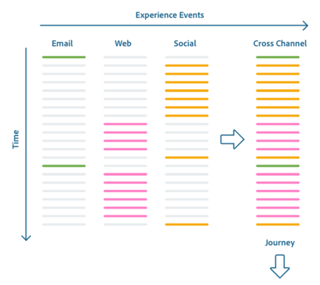

# Descripción general del sistema XDM

La estandarización y la interoperabilidad son conceptos clave para Adobe Experience Platform. [!DNL Experience Data Model] (XDM), impulsado por el Adobe, es un esfuerzo para estandarizar los datos de experiencia del cliente y definir esquemas para la administración de la experiencia del cliente.

XDM es una especificación públicamente documentada diseñada para mejorar el poder de las experiencias digitales. Proporciona estructuras y definiciones comunes para cualquier aplicación que se utilice para comunicarse con [!DNL Platform] los servicios. Al cumplir con los estándares XDM, todos los datos de experiencia del cliente se pueden incorporar a una representación común que puede ofrecer perspectivas de una manera más rápida e integrada. Puede obtener perspectivas valiosas de las acciones de los clientes, definir audiencias de clientes a través de segmentos y expresar atributos de clientes para fines de personalización.

XDM es el marco fundamental que permite a Adobe Experience Cloud, con [!DNL Experience Platform]tecnología, entregar el mensaje correcto a la persona correcta, en el canal correcto, en el momento preciso. La metodología sobre la que [!DNL Experience Platform] se construye, Sistema XDM, hace funcionar [!DNL Experience Data Model] esquemas para su uso por [!DNL Platform] los servicios.

Este documento proporciona una visión general de la función del sistema XDM dentro de [!DNL Experience Platform].

## Esquemas XDM

[!DNL Experience Platform] utiliza esquemas para describir la estructura de los datos de una manera uniforme y reutilizable. Al definir los datos de manera uniforme en todos los sistemas, resulta más fácil conservar el significado y, por lo tanto, obtener valor de los datos.

Para poder ingerir datos en [!DNL Platform], se debe crear un esquema que describa la estructura de los datos y proporcione restricciones al tipo de datos que se puede incluir en cada campo. Los esquemas consisten en una clase base y cero o más mezclas.

Para obtener más información sobre el modelo de composición de esquema, incluidos los principios y las prácticas recomendadas de diseño, consulte los [conceptos básicos de la composición](schema/composition.md)de esquemas.

### [!DNL Schema Registry] y [!DNL Schema Library]

El **[!DNL Schema Registry]** proporciona una interfaz de usuario y una API RESTful desde la cual puede realizar la vista y administración de todos los recursos relacionados con el esquema en Adobe Experience Platform **[!DNL Schema Library]**. El [!DNL Schema Library] contiene recursos estándar del sector que se ponen a su disposición por Adobe, así como recursos de [!DNL Experience Platform] socios y proveedores cuyas aplicaciones se utilizan. La interfaz de usuario y la API del Registro de Esquema también se pueden usar para crear y administrar nuevos esquemas y recursos que son exclusivos de su organización.

Para obtener una guía completa de las principales operaciones disponibles en el [!DNL Schema Registry], consulte la guía [para desarrolladores de](api/getting-started.md)Esquema Registry.

## Comportamientos de datos en el sistema XDM {#data-behaviors}

Los datos destinados a utilizarse en [!DNL Experience Platform] se agrupan en dos tipos de comportamiento:

* **Registrar datos**: Proporciona información sobre los atributos de un asunto. Un tema podría ser una organización o un individuo.
* **Datos** de series temporales: Proporciona una instantánea del sistema en el momento en que un sujeto de registro realizó una acción directa o indirecta.

Todos los esquemas XDM describen datos que pueden clasificarse como registros o series temporales. El comportamiento de los datos de un esquema lo define la clase del esquema, que se asigna a un esquema cuando se crea por primera vez. Las clases XDM describen el menor número de propiedades que debe contener un esquema para representar un comportamiento de datos concreto.

Aunque puede definir sus propias clases dentro del [!DNL Schema Registry], se recomienda utilizar las clases preferidas **[!DNL XDM Individual Profile]** y **[!DNL XDM ExperienceEvent]** para los datos de registros y series temporales, respectivamente. Estas clases se describen con más detalle a continuación.

### [!DNL XDM Individual Profile] (#xdm-individual-perfil)

[!DNL XDM Individual Profile] es una clase basada en registros que forma una representación singular de los atributos de los sujetos identificados y parcialmente identificados. Los perfiles altamente identificados pueden utilizarse para comunicaciones personales o participaciones específicas, y pueden contener información personal detallada como nombre, sexo, fecha de nacimiento, ubicación e información de contacto, incluidos números de teléfono y direcciones de correo electrónico.

Los perfiles menos identificados pueden consistir únicamente en señales conductuales anónimas como las cookies del explorador. En este caso, los datos de perfil dispersos se utilizan para crear una base de información en la que se recopilan y almacenan los intereses y preferencias del perfil anónimo. Estos identificadores pueden ser más detallados con el tiempo a medida que el sujeto se registra para recibir notificaciones, suscripciones, compras, etc. Este aumento en los atributos del perfil puede resultar en un asunto identificado y permitir un mayor grado de compromiso objetivo.

A medida que el perfil de los consumidores sigue creciendo, se convierte en un sólido repositorio de la información personal, la información de identificación, los datos de contacto y las preferencias de comunicación de un individuo.

### [!DNL XDM ExperienceEvent] {#xdm-experience-event}

XDM ExperienceEvent es una clase basada en series temporales que se utiliza para capturar el estado del sistema cuando se produce un evento (o conjunto de eventos), incluido el punto en el tiempo y la identidad del sujeto involucrado. Los Eventos de experiencias son registros de hechos de lo que ocurrió, por lo que son inmutables y representan lo que ocurrió sin agregación ni interpretación. Son fundamentales para el análisis de dominio de tiempo, ya que se pueden utilizar para analizar los cambios que se producen en una ventana de tiempo determinada y para comparar varias ventanas de tiempo para rastrear tendencias.

Los Eventos de experiencias pueden ser explícitos o implícitos. Los eventos explícitos son acciones humanas directamente observables que tienen lugar durante un período de un viaje. Los eventos implícitos son eventos que se crían sin una acción humana directa, pero que siguen estando relacionados con una persona. Algunos ejemplos de eventos implícitos pueden incluir el envío programado de boletines informativos por correo electrónico o la tensión de la batería que alcanza un determinado umbral.

Aunque no todos los eventos se clasifican fácilmente en todas las fuentes de datos, resulta extremadamente valioso armonizar eventos similares en tipos similares cuando sea posible para su procesamiento.

## Esquemas y [!DNL Experience Platform] servicios XDM

[!DNL Experience Platform] es un esquema agnóstico, lo que significa que cualquier esquema que se ajuste al estándar XDM está disponible para su uso por [!DNL Platform] los servicios. A continuación se detallan las formas en que los distintos [!DNL Platform] servicios utilizan esquemas.

### [!DNL Catalog Service], [!DNL Data Ingestion] &amp; [!DNL Data Lake]

[!DNL Catalog Service] es el sistema de registro de [!DNL Experience Platform] los activos y sus esquemas conexos. [!DNL Catalog] no son los archivos o directorios reales que contienen datos, sino que contienen los metadatos y las descripciones de esos archivos y directorios.

[!DNL Catalog] los datos se almacenan en el [!DNL Data Lake], un almacén de datos altamente granular que contiene todos los datos administrados por [!DNL Platform], independientemente del formato de archivo o origen.

Para empezar a ingerir datos en [!DNL Experience Platform], se crea un conjunto de datos mediante [!DNL Catalog Service]. El conjunto de datos hace referencia a un esquema XDM que describe la estructura de los datos que se van a ingestar. Si se crea un conjunto de datos sin esquema, [!DNL Experience Platform] se obtendrá un &quot;esquema observado&quot; inspeccionando el tipo y el contenido de los campos de datos ingestados. A continuación, se realiza un seguimiento de los conjuntos de datos [!DNL Catalog] y se almacenan en ellos [!DNL Data Lake] junto con los esquemas y esquemas observados en los que se basan.

Para obtener más información sobre [!DNL Catalog], consulte la descripción general [del servicio de](../catalog/home.md)catálogos. Para obtener más información sobre la ingestión de datos de Adobe Experience Platform, consulte la información general [sobre la ingestión de](../ingestion/home.md)datos.

### [!DNL Query Service]

Adobe Experience Platform [!DNL Query Service] permite utilizar SQL estándar para la consulta de datos [!DNL Experience Platform] a fin de admitir muchos casos de uso diferentes.

Después de que se haya compuesto un esquema y se haya creado un conjunto de datos que haga referencia a ese esquema, los datos se ingieren y almacenan en el [!DNL Data Lake]. Con [!DNL Query Service], puede unir cualquier conjunto de datos en el [!DNL Data Lake] y capturar los resultados de la consulta como un nuevo conjunto de datos para su uso en el sistema de informes, el aprendizaje automático o la ingestión en [!DNL Real-time Customer Profile].

Para obtener más información sobre [!DNL Query Service], consulte la introducción [del servicio de](../query-service/home.md)Consulta.

### [!DNL Real-time Customer Profile]

El Perfil de clientes en tiempo real proporciona un perfil de consumo centralizado para la administración personalizada y dirigida de la experiencia. Cada perfil contiene datos agregados en todos los sistemas, así como cuentas con marca de hora procesables de eventos que involucran al individuo que han tenido lugar en cualquiera de los sistemas con los que se utiliza [!DNL Experience Platform].

[!DNL Real-time Customer Profile] consume datos con formato de esquema en función de las clases [!DNL XDM Individual Profile] o [!DNL XDM ExperienceEvent] y responde a consultas basadas en esos datos. [!DNL Profile] no admite el uso de esquemas basados en otras clases.

[!DNL Profile] mantiene una instancia de cada perfil de cliente, combinando los datos para formar una &quot;única fuente de verdad&quot; para el individuo. Estos datos unificados se representan usando lo que se conoce como &quot;vista de unión&quot;. Una vista de unión agrega los campos de todos los esquemas que implementan la misma clase en un solo esquema.  Al componer un esquema mediante la interfaz de usuario o la API, puede activar el esquema para utilizarlo con [!DNL Real-time Customer Profile] y etiquetarlo para incluirlo en la vista de unión. El esquema etiquetado participará en la definición de esquema a la que se alimenta [!DNL Profile].

A medida que [!DNL XDM Individual Profile] y [!DNL XDM ExperienceEvent] los datos son ingestados y administrados por [!DNL Catalog], se desencadena [!DNL Real-time Customer Profile] la ingesta de datos habilitados para su uso. Cuanto más interacciones y detalles se ingieran, más robustos se volverán los perfiles individuales.

[!DNL XDM Individual Profile] los datos ayudan a informar y potenciar las acciones en cualquier integración de soluciones de canal o Adobe, y cuando se combinan con un historial rico de datos de comportamiento e interacción, estos datos se utilizan para impulsar el aprendizaje automático. La [!DNL Real-time Customer Profile] API también puede utilizarse para enriquecer la funcionalidad de soluciones de terceros, CRM y soluciones propietarias.

Consulte la descripción general [del Perfil del cliente en tiempo](../profile/home.md) real para obtener más información.

### [!DNL Data Science Workspace]

Adobe Experience Platform [!DNL Data Science Workspace] utiliza el aprendizaje automático y la inteligencia artificial para obtener perspectivas de los datos almacenados en [!DNL Experience Platform]. [!DNL Data Science Workspace] permite a los científicos de datos crear fórmulas basadas en XDM Individual [!DNL Profile] y en datos [!DNL XDM ExperienceEvent] sobre clientes y sus actividades, lo que facilita predicciones como la propensión a comprar y ofertas recomendadas que el individuo probablemente apreciará y usará.

Con [!DNL Data Science Workspace], los científicos de datos pueden crear fácilmente API de servicios inteligentes con tecnología de aprendizaje automático. Estos servicios funcionan con otras soluciones de Adobe, incluidas Adobe Target y Adobe Analytics Cloud, para ayudarle a automatizar experiencias digitales personalizadas y dirigidas.

Para obtener más información sobre el uso de [!DNL Experience Platform] datos para activar perspectivas, consulte la información general [de](../data-science-workspace/home.md)Data Science Workspace.

### [!DNL Decisioning Service]

[!DNL Decisioning Service] proporciona la capacidad de configurar decisiones de oferta personalizadas en aplicaciones [!DNL Platform]integradas. Las ofertas pueden ser recomendaciones de productos, componentes de contenido para una experiencia web, secuencias de comandos de conversación y acciones a realizar.

[!DNL Decisioning Service] aprovecha [!DNL Real-time Customer Profile] los datos y, por lo tanto, solo es compatible con conjuntos de datos basados en esquemas que implementan la [!DNL XDM Individual Profile] clase o [!DNL XDM ExperienceEvent] .

Consulte la información general [del servicio de](../decisioning-service/home.md) decisiones para obtener más información.

## Próximos pasos y recursos adicionales

Ahora que comprendes mejor el rol de los esquemas a lo largo de todo [!DNL Experience Platform]tiempo, estás listo para el inicio de componer el tuyo propio. Para seguir complementando su aprendizaje, lea la documentación sugerida y vea el siguiente vídeo.

Para aprender los principios de diseño y las prácticas recomendadas para componer esquemas con los que se va a utilizar [!DNL Experience Platform], lea los [conceptos básicos de la composición](schema/composition.md)de esquemas. Para obtener instrucciones paso a paso sobre cómo crear un esquema, consulte los tutoriales sobre cómo crear un esquema [con la API](tutorials/create-schema-api.md) o [con la interfaz](tutorials/create-schema-ui.md)de usuario.

Para reforzar su comprensión de [!DNL XDM System] en [!DNL Experience Platform], vea el siguiente vídeo:

>[!VIDEO](https://video.tv.adobe.com/v/27105?quality=12&learn=on)

