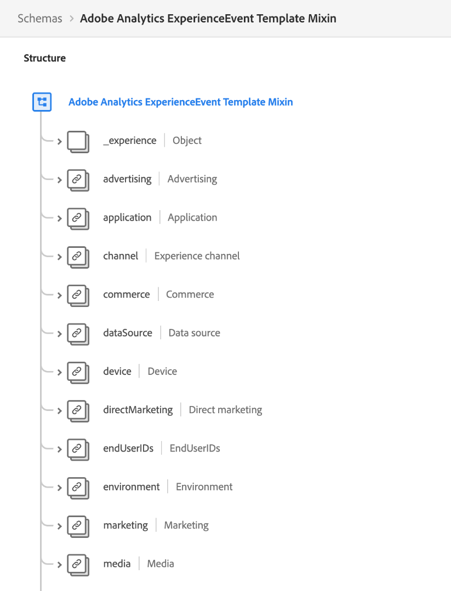

# Prácticas recomendadas para el modelado de datos en Adobe Experience Platform

[!DNL Experience Data Model] (XDM) es el marco de trabajo principal que estandariza los datos de experiencia del cliente proporcionando estructuras y definiciones comunes para su uso en los servicios de Adobe Experience Platform descendentes. Al cumplir con los estándares XDM, todos los datos de experiencia del cliente se pueden incorporar a una representación común que le permite obtener valiosas perspectivas de las acciones de los clientes, definir audiencias de clientes a través de segmentos y expresar atributos del cliente con fines de personalización.

Dado que XDM es extremadamente versátil y personalizable por diseño, es importante seguir las optimizaciones para el modelado de datos al diseñar sus esquemas. Este documento cubre las decisiones y consideraciones clave que debe tomar al asignar los datos de experiencia del cliente a XDM.

## Primeros pasos

Antes de leer esta guía, consulte la descripción general [del sistema](../home.md) XDM para obtener una introducción de alto nivel sobre XDM y su función en Experience Platform.

Además, esta guía se centra exclusivamente en consideraciones clave relativas al diseño de esquemas. Por lo tanto, se recomienda encarecidamente que consulte los [conceptos básicos de la composición](./composition.md) de los esquemas para obtener explicaciones detalladas de los distintos elementos del esquema mencionados en esta guía.

## Resumen de prácticas recomendadas

El método recomendado para diseñar el modelo de datos para su uso en Experience Platform se puede resumir de la siguiente manera:

1. Comprender los casos de uso comercial de sus datos.
1. Identifique las fuentes de datos principales a las que se debe recurrir [!DNL Platform] para abordar esos casos de uso.
1. Identifique las fuentes de datos secundarias que también puedan ser de interés. Por ejemplo: si actualmente solo una unidad de negocio de la organización está interesada en transferir sus datos a [!DNL Platform], una unidad de negocio similar también podría estar interesada en portar datos similares en el futuro. El tener en cuenta estas fuentes secundarias ayuda a estandarizar el modelo de datos en toda la organización.
1. Cree un diagrama de relaciones de entidad de alto nivel (ERD) para las fuentes de datos que se han identificado.
1. Convierta el ERD de alto nivel en un ERD [!DNL Platform]centrado (incluidos perfiles, Eventos de experiencias y entidades de búsqueda).

Los pasos relacionados con la identificación de las fuentes de datos aplicables que se requieren para llevar a cabo los casos de uso comercial variarán de una organización a otra. Mientras que el resto de las secciones de este documento se centran en los últimos pasos para organizar y construir un ERD después de que se hayan identificado las fuentes de datos, las explicaciones de los diversos componentes del diagrama pueden servir de base para sus decisiones sobre a qué fuentes de datos debe migrarse [!DNL Platform].

## Crear un ERD de alto nivel

Una vez que haya determinado las fuentes de datos en las que desea incluir [!DNL Platform], cree un ERD de alto nivel para ayudar a guiar el proceso de asignación de datos a esquemas XDM.

El ejemplo siguiente representa un ERD simplificado para una compañía que desea introducir datos en [!DNL Platform]. El diagrama resalta las entidades esenciales que deben clasificarse en clases XDM, incluyendo cuentas de cliente, hoteles, direcciones y varios eventos comunes de comercio electrónico.

## Ordenar las entidades en categorías de perfil, búsqueda y evento

Una vez que haya creado un ERD para identificar las entidades esenciales en las que desea participar [!DNL Platform], estas entidades deben ordenarse en categorías de perfil, búsqueda y evento:

| Categoría | Descripción |
| --- | --- |
| Entidades perfil | Las entidades de perfil representan atributos relacionados con una persona individual, normalmente un cliente. Las entidades comprendidas en esta categoría deben estar representadas por esquemas basados en la **[!DNL XDM Individual Profile]clase**. |
| Entidades de búsqueda | Las entidades de búsqueda representan conceptos que pueden relacionarse con una persona individual, pero que no pueden utilizarse directamente para identificarla. Las entidades incluidas en esta categoría deben estar representadas por esquemas basados en clases **** personalizadas. |
| Entidades evento | Las entidades de evento representan conceptos relacionados con acciones que un cliente puede realizar, eventos del sistema o cualquier otro concepto en el que desee rastrear los cambios con el tiempo. Las entidades comprendidas en esta categoría deben estar representadas por esquemas basados en la **[!DNL XDM ExperienceEvent]clase**. |

### Consideraciones para la clasificación de entidades

Las secciones a continuación proporcionan una guía adicional sobre cómo clasificar las entidades en las categorías anteriores.

#### Atributos del cliente

Si una entidad contiene atributos relacionados con un cliente individual, lo más probable es que sea una entidad perfil. Algunos ejemplos de atributos del cliente son:

* Datos personales como nombre, fecha de nacimiento, sexo e ID de cuenta.
* Información de ubicación como direcciones e información de GPS.
* Información de contacto como números de teléfono y direcciones de correo electrónico.

#### Seguimiento de datos con el paso del tiempo

Si desea analizar cómo ciertos atributos de una entidad cambian con el tiempo, lo más probable es que se trate de una entidad de evento. Por ejemplo: la adición de elementos de producto a un carro de compras se puede rastrear como eventos de adiciones al carro de compras en [!DNL Platform]:

| ID de cliente | Tipo | ID del producto | Cantidad | Marca de tiempo |
| --- | --- | --- | --- | --- |
| 1234567 | Add | 275098 | 2 | 1 de octubre, 10:32 AM |
| 1234567 | Eliminar | 275098 | 1 | 1 de octubre, 10:33 AM |
| 1234567 | Add | 486502 | 1 | 1 de octubre, 10:41 AM |
| 1234567 | Add | 910482 | 5 | 3 de octubre, 2:15 PM |

#### Casos de uso de segmentación

Al categorizar las entidades, es importante tener en cuenta los segmentos de audiencia que desee crear para abordar los casos de uso comercial en particular.

Por ejemplo, una compañía quiere conocer a todos los miembros &quot;Gold&quot; o &quot;Platinum&quot; de su programa de lealtad que han realizado más de cinco compras en el último año. Sobre la base de esta lógica de segmentos, pueden extraerse las siguientes conclusiones sobre la forma en que deben representarse las entidades pertinentes:

* &quot;Oro&quot; y &quot;Platino&quot; representan estados de lealtad aplicables a un cliente individual. Dado que la lógica de segmentos solo se refiere al estado de lealtad actual de los clientes, estos datos se pueden modelar como parte de un esquema de perfil. Si desea rastrear los cambios en el estado de lealtad con el paso del tiempo, también puede crear un esquema de evento adicional para los cambios en el estado de lealtad.
* Las compras son eventos que se producen en un momento determinado y la lógica del segmento se refiere a los eventos de compra dentro de un período de tiempo especificado. Por consiguiente, estos datos deben modelarse como un esquema de evento.

#### Casos de uso de activación

Además de las consideraciones relativas a los casos de uso de segmentación, también debe revisar los casos de uso de activación para esos segmentos a fin de identificar atributos relevantes adicionales.

Por ejemplo, una compañía ha creado un segmento de audiencia basado en la regla que `country = US`. A continuación, cuando se activa ese segmento con determinados destinatarios descendentes, la compañía desea filtrar todos los perfiles exportados en función del estado de origen. Por lo tanto, también se debe capturar un `state` atributo en la entidad de perfil aplicable.

#### Valores agregados

Según el caso de uso y la granularidad de los datos, debe decidir si ciertos valores deben agregarse previamente antes de incluirse en una entidad de perfil o evento.

Por ejemplo, una compañía desea generar un segmento en base al número de compras del carro de compras. Puede optar por incorporar estos datos en la granularidad más baja incluyendo cada evento de compra con marca de hora como su propia entidad. Sin embargo, a veces esto puede aumentar el número de eventos registrados de forma exponencial. Para reducir el número de eventos ingestados, puede elegir crear un valor acumulado `numberOfPurchases` durante un período de una semana o un mes. Otras funciones acumuladas como MIN y MAX también se pueden aplicar a estas situaciones.

>[!CAUTION]
>
>Actualmente, el Experience Platform no realiza la agregación automática de valores, aunque está planificado para futuras versiones. Si decide utilizar valores agregados, debe realizar los cálculos externamente antes de enviar los datos a [!DNL Platform].

#### Cardinalidad

Las cardinalidades establecidas en su ERD también pueden proporcionar algunas pistas sobre cómo clasificar sus entidades. Si hay una relación uno a varios entre dos entidades, la entidad que representa los &quot;muchos&quot; será probablemente una entidad evento. Sin embargo, también hay casos en los que &quot;varios&quot; es un conjunto de entidades de búsqueda que se proporcionan como una matriz dentro de una entidad de perfil.

>[!NOTE]
>
>Dado que no existe un enfoque universal que se ajuste a todos los casos de uso, es importante tener en cuenta las ventajas y desventajas de cada situación al clasificar las entidades en función de la cardinalidad. Consulte la [siguiente sección](#pros-and-cons) para obtener más información.

La siguiente tabla describe algunas relaciones de entidad comunes y las categorías que se pueden derivar de ellas:

| Relación | Cardinalidad | Categorías de entidad |
| --- | --- | --- |
| Clientes y cierres de compra | Uno a muchos | Un único cliente puede tener muchos cierres de compra, que son eventos que se pueden rastrear con el paso del tiempo. Por lo tanto, los clientes serían una entidad de perfil, mientras que los cierres de compra serían una entidad de evento. |
| Clientes y cuentas de lealtad | Uno a uno | Un solo cliente solo puede tener una cuenta de fidelidad y viceversa. Dado que la relación es uno a uno, tanto los clientes como las cuentas de lealtad representan las entidades de perfil. |
| Clientes y Suscripciones | Uno a muchos | Un solo cliente puede tener muchas suscripciones. Dado que la compañía solo se ocupa de las suscripciones actuales de un cliente, Customers es una entidad de perfil, mientras que Suscripciones es una entidad de búsqueda. |

### Ventajas y desventajas de diferentes clases de entidades {#pros-and-cons}

Aunque en la sección anterior se proporcionaban algunas directrices generales para decidir cómo clasificar las entidades, es importante comprender que a menudo puede haber ventajas y desventajas para elegir una categoría de entidad en lugar de otra. El siguiente caso práctico tiene por objeto ilustrar cómo puede considerar sus opciones en estas situaciones.

Una compañía rastrea suscripciones activas para sus clientes, donde un cliente puede tener muchas suscripciones. La compañía también desea incluir suscripciones para casos de uso de segmentación, como la búsqueda de todos los usuarios con suscripciones activas.

En este escenario, la compañía tiene dos opciones potenciales para representar las suscripciones de un cliente en su modelo de datos:

1. [Usar atributos de perfil](#profile-approach)
1. [Usar entidades evento](#event-approach)

#### Enfoque 1: Usar atributos de perfil {#profile-approach}

El primer método sería incluir una matriz de suscripciones como atributos dentro de la entidad perfil para clientes. Los objetos de esta matriz contendrían campos para `category`, `status`, `planName`, `startDate`y `endDate`.

 

**Pros**

* La segmentación es viable para el caso de uso previsto.
* El esquema sólo conservará los registros de suscripción más recientes para un cliente.

**Cons**

* La matriz completa debe replantarse cada vez que se produzcan cambios en cualquier campo de la matriz.
* Si diferentes fuentes de datos o unidades de negocio están incluyendo datos en el arreglo de discos, será difícil mantener el arreglo de discos actualizado más reciente sincronizado en todos los canales.

#### Enfoque 2: Usar entidades evento {#event-approach}

El segundo enfoque sería utilizar esquemas de evento para representar suscripciones. Esto implica ingerir los mismos campos de suscripción que el primer método, con la adición de un ID de suscripción, un ID de cliente y una marca de hora de cuándo se produjo el evento de suscripción.

 

**Pros**

* Las reglas de segmentación pueden ser más flexibles (por ejemplo, para encontrar a todos los clientes que cambiaron sus suscripciones en los últimos 30 días).
* Cuando cambia el estado de suscripción de un cliente, ya no tiene que actualizar una matriz larga y potencialmente compleja dentro de los atributos de perfil del cliente. Esto resulta especialmente útil si se producen cambios simultáneos en la lista de suscripción del cliente desde múltiples fuentes.

**Cons**

* La segmentación se vuelve más compleja para el caso de uso previsto original (identificando el estado de las suscripciones más recientes de los clientes). El segmento ahora necesita lógica adicional para marcar el último evento de suscripción de un cliente a fin de comprobar su estado.

## Crear esquemas en función de las entidades por categorías

Una vez que haya clasificado las entidades en categorías de perfil, búsqueda y evento, puede convertir el modelo de datos en esquemas XDM en inicios. A efectos de demostración, el modelo de datos de ejemplo que se muestra anteriormente se ha clasificado en categorías adecuadas en el diagrama siguiente:

 

La categoría en la que se ha ordenado una entidad debe determinar la clase XDM en la que se basa su esquema. Reiterar:

* Las entidades de perfil deben utilizar la [!DNL XDM Individual Profile] clase.
* Las entidades de evento deben utilizar la [!DNL XDM ExperienceEvent] clase.
* Las entidades de búsqueda deben utilizar clases XDM personalizadas definidas por su organización.

>[!NOTE]
>
>Aunque las entidades de evento estarán representadas casi siempre por esquemas separados, las entidades de las categorías de perfil o de búsqueda pueden combinarse en un único esquema XDM, según su cardinalidad.
>
>Por ejemplo, como la entidad Customers tiene una relación uno a uno con la entidad LoyaltyAccounts, el esquema de la entidad Customers también puede incluir un `LoyaltyAccount` objeto que contenga los campos de lealtad correspondientes para cada cliente. Sin embargo, si la relación es una con muchos, la entidad que representa los &quot;muchos&quot; podría estar representada por un esquema separado o por una matriz de atributos de perfil, según su complejidad.

Las secciones que figuran a continuación proporcionan orientación general sobre la construcción de esquemas basados en su ERD.

### Adoptar un enfoque de modelado iterativo

Las [reglas de la evolución](./composition.md#evolution) del esquema dictan que sólo se pueden hacer cambios no destructivos en los esquemas una vez que se han implementado. En otras palabras, una vez que se agrega un campo a un esquema y se han ingestado datos en ese campo, ya no se puede quitar el campo. Por lo tanto, es esencial adoptar un enfoque de modelado iterativo cuando se crean los esquemas por primera vez, comenzando con una implementación simplificada que aumenta progresivamente la complejidad con el paso del tiempo.

Si no está seguro de si es necesario incluir un campo concreto en un esquema, lo mejor es excluirlo. Si posteriormente se determina que el campo es necesario, siempre se puede agregar en la siguiente iteración del esquema.

### Campos de identidad

En Experience Platform, los campos XDM marcados como identidades se utilizan para unir información sobre clientes individuales provenientes de múltiples fuentes de datos. Aunque un esquema puede tener varios campos marcados como identidades, se debe definir una sola identidad principal para que el esquema esté habilitado para su uso en [!DNL Real-time Customer Profile]. Consulte la sección sobre campos [de](./composition.md#identity) identidad en los conceptos básicos de la composición de esquemas para obtener información más detallada sobre el caso de uso de estos campos.

Al diseñar sus esquemas, cualquier clave principal de las tablas de la base de datos relacional probablemente sea un candidato para identidades principales. Otros ejemplos de campos de identidad aplicables son direcciones de correo electrónico de clientes, números de teléfono, ID de cuenta y [ECID](../../identity-service/ecid.md).

### Mezclas de aplicación de Adobe

Experience Platform proporciona varias mezclas XDM integradas para capturar datos relacionados con las siguientes aplicaciones de Adobe:

* Adobe Analytics
* Adobe Audience Manager
* Adobe Campaign
* Adobe Target

Por ejemplo, la combinación [[!UICONTROL de plantillas]](https://github.com/adobe/xdm/blob/master/extensions/adobe/experience/analytics/experienceevent-all.schema.json) Adobe Analytics ExperienceEvent permite asignar campos [!DNL Analytics]específicos a sus esquemas XDM. Dependiendo de las aplicaciones de Adobe con las que trabaje, debe estar utilizando estas mezclas de Adobe en sus esquemas.

 

Las mezclas de aplicaciones Adobe asignan automáticamente una identidad principal predeterminada mediante el uso del `identityMap` campo, que es un objeto generado por el sistema y de sólo lectura que asigna valores de identidad estándar para un cliente individual.

Para Adobe Analytics, ECID es la identidad principal predeterminada. Si un cliente no proporciona un valor ECID, la identidad principal pasará a ser AAID de forma predeterminada.

>[!IMPORTANT]
>
>Al utilizar mezclas de aplicaciones Adobe, no se debe marcar ningún otro campo como identidad principal. Si hay propiedades adicionales que deben marcarse como identidades, estos campos deben asignarse como identidades secundarias en su lugar.

## Pasos siguientes

Este documento abarcaba las directrices generales y las optimizaciones para diseñar el modelo de datos para el Experience Platform. Para resumir:

* Utilice un enfoque descendente ordenando las tablas de datos en categorías de perfil, búsqueda y evento antes de construir los esquemas.
* A menudo hay múltiples enfoques y opciones cuando se trata de diseñar esquemas para diferentes propósitos.
* El modelo de datos debe admitir casos de uso de segmentación.
* Haga sus esquemas lo más sencillos posible, y sólo agregue campos nuevos cuando sea absolutamente necesario.

Una vez que esté listo, consulte el tutorial sobre la [creación de un esquema en la interfaz de usuario](../tutorials/create-schema-ui.md) para obtener instrucciones paso a paso sobre cómo crear un esquema, asignar la clase adecuada para la entidad y agregar campos para asignar los datos.