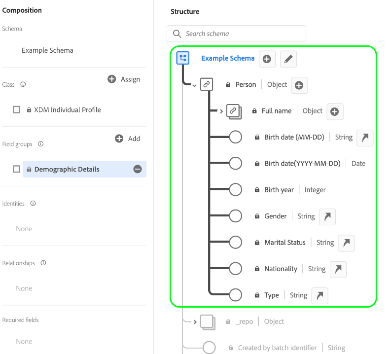

# Aspectos básicos de la composición del esquema

Este documento proporciona una introducción a [!DNL Experience Data Model] (XDM) esquemas y los componentes, principios y prácticas recomendadas para la composición de esquemas que se van a utilizar en Adobe Experience Platform. Para obtener información general sobre XDM y cómo se utiliza en [!DNL Platform], consulte la [Información general del sistema XDM](../home.md).

## Explicación de los esquemas

Un esquema es un conjunto de reglas que representan y validan la estructura y el formato de los datos. En un nivel superior, los esquemas proporcionan una definición abstracta de un objeto real (como una persona) y describen qué datos deben incluirse en cada instancia de ese objeto (como nombre, apellido, cumpleaños, etc.).

Además de describir la estructura de los datos, los esquemas aplican restricciones y expectativas a los datos para que se puedan validar a medida que se desplaza de un sistema a otro. Estas definiciones estándar permiten interpretar los datos de forma coherente, independientemente del origen, y eliminan la necesidad de realizar traducciones entre aplicaciones.

[!DNL Experience Platform] mantiene esta normalización semántica utilizando esquemas. Los esquemas son la forma estándar de describir los datos en [!DNL Experience Platform], lo que permite reutilizar en una organización sin conflictos todos los datos que se ajustan a esquemas, o incluso compartirlos entre varias organizaciones.

Los esquemas XDM son ideales para almacenar grandes cantidades de datos complejos en un formato independiente. Consulte las secciones de [objetos incrustados](#embedded) y [big data](#big-data) en el apéndice de este documento para obtener más información sobre cómo lo consigue XDM.

### Flujos de trabajo basados en esquemas en [!DNL Experience Platform]

La estandarización es un concepto clave [!DNL Experience Platform]. XDM, impulsado por el Adobe, es un esfuerzo para estandarizar los datos de experiencia del cliente y definir esquemas estándar para la administración de experiencias del cliente.

La infraestructura en la que [!DNL Experience Platform] se crea, se conoce como [!DNL XDM System], facilita los flujos de trabajo basados en esquemas e incluye el [!DNL Schema Registry], [!DNL Schema Editor], metadatos de esquema y patrones de consumo de servicio. Consulte la [Información general del sistema XDM](../home.md) para obtener más información.

Existen varias ventajas clave para aprovechar los esquemas en [!DNL Experience Platform]. En primer lugar, los esquemas permiten un mejor control de los datos y la minimización de los mismos, lo que es especialmente importante con las regulaciones de privacidad. En segundo lugar, la creación de esquemas con los componentes estándar de Adobe permite obtener perspectivas integradas y utilizar servicios AI/ML con personalizaciones mínimas. Por último, los esquemas proporcionan infraestructura para la información sobre el uso compartido de datos y la orquestación eficiente.

## Planificación del esquema

El primer paso para crear un esquema es determinar el concepto, o objeto real, que está intentando capturar en el esquema. Una vez identificado el concepto que intenta describir, puede empezar a planificar el esquema pensando en cosas como el tipo de datos, los campos de identidad potenciales y cómo puede evolucionar el esquema en el futuro.

### Comportamientos de datos en [!DNL Experience Platform]

Datos destinados a ser utilizados en [!DNL Experience Platform] se agrupa en dos tipos de comportamiento:

* **Registrar datos**: Proporciona información sobre los atributos de un asunto. Un tema podría ser una organización o un individuo.
* **Datos de series temporales**: Proporciona una instantánea del sistema en el momento en que un sujeto de registro realizó una acción directa o indirectamente.

Todos los esquemas XDM describen datos que pueden clasificarse como registros o series temporales. El comportamiento de los datos de un esquema se define mediante la clase del esquema, que se asigna a un esquema cuando se crea por primera vez. Las clases XDM se describen en detalle más adelante en este documento.

Los esquemas de registros y series temporales contienen un mapa de identidades (`xdm:identityMap`). Este campo contiene la representación de identidad de un asunto, extraída de campos marcados como &quot;Identidad&quot; como se describe en la siguiente sección.

### [!UICONTROL Identidad] {#identity}

>[!CONTEXTUALHELP]
>id="platform_schemas_identities"
>title="Identidades en esquemas"
>abstract="Las identidades son campos clave dentro de un esquema que pueden utilizarse para identificar un asunto, como una dirección de correo electrónico o un ID de marketing. Estos campos se utilizan para construir el gráfico de identidad para cada individuo y crear perfiles de cliente. Consulte la documentación para obtener más información sobre las identidades en los esquemas."

Los esquemas se utilizan para introducir datos en [!DNL Experience Platform]. Estos datos se pueden utilizar en varios servicios para crear una única vista unificada de una entidad individual. Por lo tanto, es importante, al pensar en esquemas, pensar en las identidades de los clientes y en qué campos se pueden utilizar para identificar un sujeto independientemente de su origen.

Para ayudar con este proceso, los campos clave dentro de los esquemas se pueden marcar como identidades. Al ingerir los datos, los datos de esos campos se insertan en el campo[!UICONTROL Gráfico de identidad]&quot; para ese individuo. A continuación, se puede acceder a los datos del gráfico mediante [[!DNL Real-time Customer Profile]](../../profile/home.md) y otros [!DNL Experience Platform] para proporcionar una vista unida de cada cliente individual.

Campos que suelen marcarse como &quot;[!UICONTROL Identidad]&quot; incluyen: dirección de correo electrónico, número de teléfono, [[!DNL Experience Cloud ID (ECID)]](https://experienceleague.adobe.com/docs/id-service/using/home.html?lang=es), ID de CRM u otros campos de ID únicos. También debe tener en cuenta cualquier identificador único específico de su organización, ya que puede ser bueno &quot;[!UICONTROL Identidad]&quot; también.

Es importante tener en cuenta las identidades de los clientes durante la fase de planificación del esquema para garantizar que los datos se recopilen y creen el perfil más sólido posible. Consulte la descripción general sobre [Servicio de identidad de Adobe Experience Platform](../../identity-service/home.md) para obtener más información sobre cómo la información de identidad puede ayudarle a ofrecer experiencias digitales a sus clientes.

Existen dos maneras de enviar datos de identidad a Platform:

1. Añadir descriptores de identidad a campos individuales, bien a través de la variable [IU del Editor de esquemas](../ui/fields/identity.md) o utilizando [API del Registro de esquemas](../api/descriptors.md#create)
1. Uso de un [`identityMap` field](#identityMap)

#### `identityMap` {#identityMap}

`identityMap` es un campo de tipo map que describe los distintos valores de identidad de un individuo, junto con sus áreas de nombres asociadas. Este campo se puede utilizar para proporcionar información de identidad para los esquemas, en lugar de definir valores de identidad dentro de la estructura del propio esquema.

El principal inconveniente de utilizar `identityMap` es que las identidades se incrustan en los datos y, como resultado, se vuelven menos visibles. Si va a introducir datos sin procesar, debe definir campos de identidad individuales dentro de la estructura de esquema real.

>[!NOTE]
>
>Un esquema que utiliza `identityMap` puede utilizarse como esquema de origen en una relación, pero no como esquema de destino. Esto se debe a que todos los esquemas de destino deben tener una identidad visible que se pueda asignar en un campo de referencia dentro del esquema de origen. Consulte la guía de IU sobre [relaciones](../tutorials/relationship-ui.md) para obtener más información sobre los requisitos de los esquemas de origen y destino.

Sin embargo, los mapas de identidad pueden resultar especialmente útiles si reúne datos de fuentes que almacenan identidades (como [!DNL Airship] o Adobe Audience Manager), o cuando hay un número variable de identidades para un esquema. Además, se requieren mapas de identidad si utiliza la variable [SDK de Adobe Experience Platform Mobile](https://aep-sdks.gitbook.io/docs/).

Un ejemplo de mapa de identidad simple sería el siguiente:

```json
"identityMap": {
  "email": [
    {
      "id": "jsmith@example.com",
      "primary": false
    }
  ],
  "ECID": [
    {
      "id": "87098882279810196101440938110216748923",
      "primary": false
    },
    {
      "id": "55019962992006103186215643814973128178",
      "primary": false
    }
  ],
  "loyaltyId": [
    {
      "id": "2e33192000007456-0365c00000000000",
      "primary": true
    }
  ]
}
```

Como se muestra en el ejemplo anterior, cada clave de la variable `identityMap` representa un área de nombres de identidad. El valor de cada clave es una matriz de objetos que representan los valores de identidad (`id`) para el área de nombres correspondiente. Consulte la [!DNL Identity Service] documentación para un [lista de áreas de nombres de identidad estándar](../../identity-service/troubleshooting-guide.md#standard-namespaces) reconocido por las aplicaciones de Adobe.

>[!NOTE]
>
>Un valor booleano para si el valor es una identidad principal (`primary`) también se puede proporcionar para cada valor de identidad. Solo es necesario establecer identidades primarias para los esquemas que se van a utilizar en [!DNL Real-time Customer Profile]. Consulte la sección sobre [esquemas de unión](#union) para obtener más información.

### Principios de evolución del esquema {#evolution}

A medida que la naturaleza de las experiencias digitales sigue evolucionando, también lo hacen los esquemas utilizados para representarlas. Por lo tanto, un esquema bien diseñado puede adaptarse y evolucionar según sea necesario, sin causar cambios destructivos en versiones anteriores del esquema.

Dado que mantener la compatibilidad con versiones anteriores es crucial para la evolución del esquema, [!DNL Experience Platform] aplica un principio de versiones puramente aditivo. Este principio garantiza que cualquier revisión del esquema solo produzca actualizaciones y cambios no destructivos. En otras palabras, **no se admiten los cambios de interrupción.**

>[!NOTE]
>
>Si aún no se ha utilizado un esquema para introducir datos en [!DNL Experience Platform] y no se ha habilitado para su uso en el perfil del cliente en tiempo real, puede introducir un cambio radical en ese esquema. Sin embargo, una vez que el esquema se ha utilizado en [!DNL Platform], debe adherirse a la directiva de versiones aditivas.

En la tabla siguiente se desglosan los cambios compatibles al editar esquemas, grupos de campos y tipos de datos:

| Cambios admitidos | Cambios que se rompen (no compatible) |
| --- | --- |
| <ul><li>Adición de nuevos campos al recurso</li><li>Hacer opcional un campo obligatorio</li><li>Introducción de nuevos campos obligatorios*</li><li>Cambio del nombre para mostrar y la descripción del recurso</li><li>Activación del esquema para participar en el perfil</li></ul> | <ul><li>Eliminación de campos definidos previamente</li><li>Cambio del nombre o redefinición de campos existentes</li><li>Eliminación o restricción de los valores de campo admitidos anteriormente</li><li>Mover los campos existentes a una ubicación diferente del árbol</li><li>Eliminación del esquema</li><li>Desactivación de la participación del esquema en el perfil</li></ul> |

\**Consulte la sección siguiente para conocer las consideraciones importantes sobre [configuración de nuevos campos obligatorios](#post-ingestion-required-fields).*

### Campos requeridos

Los campos de esquema individuales pueden [marcado como obligatorio](../ui/fields/required.md), lo que significa que los registros ingestados deben contener datos en esos campos para pasar la validación. Por ejemplo, si se establece el campo de identidad principal de un esquema como sea necesario, puede ayudar a garantizar que todos los registros ingestados participen en el Perfil del cliente en tiempo real, mientras que al establecer un campo de marca de tiempo como sea necesario, se garantiza que todos los eventos de series temporales se conserven cronológicamente.

>[!IMPORTANT]
>
>Independientemente de si un campo de esquema es obligatorio o no, Platform no acepta `null` o valores vacíos para cualquier campo introducido. Si no hay ningún valor para un campo concreto de un registro o evento, la clave de ese campo debe excluirse de la carga útil de ingesta.

#### Configuración de los campos como sea necesario después de la ingesta {#post-ingestion-required-fields}

Si se ha utilizado un campo para introducir datos y no se ha establecido originalmente como requerido, ese campo puede tener un valor nulo para algunos registros. Si establece este campo como obligatorio después de la ingesta, todos los registros futuros deben contener un valor para este campo aunque los registros históricos puedan ser nulos.

Cuando configure un campo opcional anteriormente como sea necesario, tenga en cuenta lo siguiente:

1. Si consulta datos históricos y escribe los resultados en un nuevo conjunto de datos, algunas filas producirán errores porque contienen valores nulos para el campo requerido.
1. Si el campo participa en [Perfil del cliente en tiempo real](../../profile/home.md) y los datos se exportan antes de configurarlos como sea necesario, puede que sean nulos para algunos perfiles.
1. Puede utilizar la API del Registro de esquemas para ver un registro de cambios con marca de tiempo para todos los recursos XDM de Platform, incluidos los nuevos campos obligatorios. Consulte la guía de [extremo del registro de auditoría](../api/audit-log.md) para obtener más información.

### Esquemas e ingesta de datos

Para introducir datos en [!DNL Experience Platform], primero debe crearse un conjunto de datos. Los conjuntos de datos son los componentes básicos para la transformación y el seguimiento de datos [[!DNL Catalog Service]](../../catalog/home.md), y generalmente representan tablas o archivos que contienen datos introducidos. Todos los conjuntos de datos se basan en esquemas XDM existentes, que proporcionan restricciones sobre qué deben contener los datos ingestados y cómo deben estructurarse. Consulte la descripción general sobre [Incorporación de datos de Adobe Experience Platform](../../ingestion/home.md) para obtener más información.

## Componentes de un esquema

[!DNL Experience Platform] utiliza un enfoque de composición en el que se combinan los componentes básicos estándar para crear esquemas. Este enfoque promueve la reutilización de los componentes existentes e impulsa la estandarización en toda la industria para admitir esquemas y componentes de proveedores en [!DNL Platform].

Los esquemas se componen con la siguiente fórmula:

**Clase + Grupo de campos de esquema&amp;ast; = Esquema XDM**

&amp;ast;Un esquema está compuesto por una clase y cero o más grupos de campos de esquema. Esto significa que puede componer un esquema de conjunto de datos sin usar grupos de campos en absoluto.

### Clase {#class}

>[!CONTEXTUALHELP]
>id="platform_schemas_class"
>title="Clase"
>abstract="Cada esquema se basa en una sola clase. La clase define el comportamiento del esquema y las propiedades comunes que deben contener todos los esquemas basados en esa clase. Consulte la documentación para obtener más información sobre cómo participan las clases en la composición de esquemas."

La composición de un esquema comienza asignando una clase. Las clases definen los aspectos de comportamiento de los datos que contendrá el esquema (registro o serie temporal). Además de esto, las clases describen el menor número de propiedades comunes que todos los esquemas basados en esa clase necesitarían para incluir y proporcionar una forma de combinar varios conjuntos de datos compatibles.

La clase de un esquema determina qué grupos de campos pueden utilizarse en ese esquema. Esto se analiza con más detalle en la sección [sección siguiente](#field-group).

Adobe proporciona varias clases XDM estándar (&quot;core&quot;). Dos de estas clases, [!DNL XDM Individual Profile] y [!DNL XDM ExperienceEvent], son necesarios para casi todos los procesos de Platform descendentes. Además de estas clases principales, también puede crear sus propias clases personalizadas para describir casos de uso más específicos para su organización. Las clases personalizadas las define una organización cuando no hay clases principales definidas por el Adobe disponibles para describir un caso de uso único.

La siguiente captura de pantalla muestra cómo se representan las clases en la interfaz de usuario de Platform. Dado que el esquema de ejemplo mostrado no contiene ningún grupo de campos, la clase del esquema proporciona todos los campos mostrados ([!UICONTROL Perfil individual XDM]).


Para obtener la lista más actualizada de las clases XDM estándar disponibles, consulte la [repositorio oficial XDM](https://github.com/adobe/xdm/tree/master/components/classes). También puede consultar la guía de [exploración de componentes XDM](../ui/explore.md) si prefiere ver los recursos en la interfaz de usuario.

### Grupo de campos {#field-group}

>[!CONTEXTUALHELP]
>id="platform_schemas_fieldgroup"
>title="Grupo de campos"
>abstract="Los grupos de campos son componentes reutilizables que permiten ampliar esquemas con atributos adicionales. La mayoría de los grupos de campos solo son compatibles con ciertas clases. Puede utilizar grupos de campos estándar definidos por el Adobe o puede definir manualmente sus propios grupos de campos personalizados. Consulte la documentación para obtener más información sobre cómo participan los grupos de campos en la composición del esquema."

Un grupo de campos es un componente reutilizable que define uno o más campos que implementan ciertas funciones, como detalles personales, preferencias de hotel o dirección. Los grupos de campos están pensados para incluirse como parte de un esquema que implemente una clase compatible.

Los grupos de campos definen con qué clases son compatibles en función del comportamiento de los datos que representan (registro o serie temporal). Esto significa que no todos los grupos de campos están disponibles para su uso con todas las clases.

[!DNL Experience Platform] incluye muchos grupos de campos de Adobe estándar, al mismo tiempo que permite a los proveedores definir grupos de campos para los usuarios, y a los usuarios individuales definir grupos de campos para sus propios conceptos específicos.

Por ejemplo, para capturar detalles como &quot;[!UICONTROL Nombre]&quot; y &quot;[!UICONTROL Dirección principal]&quot; para su &quot;[!UICONTROL Miembros de fidelidad]&quot;, podría utilizar grupos de campos estándar que definan esos conceptos comunes. Sin embargo, los conceptos específicos de los casos de uso menos comunes (como &quot;[!UICONTROL Nivel de programa de fidelidad]&quot;) no suelen tener un grupo de campos predefinido. En este caso, debe definir su propio grupo de campos para capturar esta información.

>[!NOTE]
>
>Se recomienda encarecidamente utilizar grupos de campos estándar siempre que sea posible en los esquemas, ya que estos campos son entendidos implícitamente por [!DNL Experience Platform] servicios y proporcionar buena coherencia cuando se utilizan en [!DNL Platform] componentes.
>
>Los campos que proporcionan los componentes estándar (como &quot;Nombre&quot; y &quot;Dirección de correo electrónico&quot;) contienen connotaciones añadidas más allá de los tipos de campo escalar básicos, lo que indica [!DNL Platform] que cualquier campo que comparta el mismo tipo de datos se comportará de la misma manera. Se puede confiar en que este comportamiento sea coherente independientemente de la procedencia de los datos o de la procedencia de los mismos [!DNL Platform] servicio de los datos que se están utilizando.

Recuerde que los esquemas están compuestos de &quot;cero o más&quot; grupos de campos, por lo que esto significa que puede componer un esquema válido sin utilizar ningún grupo de campos.

La siguiente captura de pantalla muestra cómo se representan los grupos de campos en la interfaz de usuario de Platform. Un solo grupo de campos ([!UICONTROL Detalles demográficos]) se agrega a un esquema en este ejemplo, que proporciona una agrupación de campos a la estructura del esquema.



Para obtener la lista más actualizada de los grupos de campos XDM estándar disponibles, consulte la [repositorio oficial XDM](https://github.com/adobe/xdm/tree/master/components/fieldgroups). También puede consultar la guía de [exploración de componentes XDM](../ui/explore.md) si prefiere ver los recursos en la interfaz de usuario.

### Tipo de datos {#data-type}

Los tipos de datos se utilizan como tipos de campos de referencia en clases o esquemas del mismo modo que los campos literales básicos. La diferencia clave es que los tipos de datos pueden definir varios subcampos. Al igual que un grupo de campos, un tipo de datos permite el uso coherente de una estructura de varios campos, pero tiene más flexibilidad que un grupo de campos, ya que un tipo de datos se puede incluir en cualquier parte de un esquema al agregarlo como el &quot;tipo de datos&quot; de un campo.

[!DNL Experience Platform] proporciona varios tipos de datos comunes como parte del [!DNL Schema Registry] para admitir el uso de patrones estándar para describir estructuras de datos comunes. Esto se explica con más detalle en la sección [!DNL Schema Registry] tutoriales, en los que resultará más claro a medida que siga los pasos para definir los tipos de datos.

La siguiente captura de pantalla muestra cómo se representan los tipos de datos en la interfaz de usuario de Platform. Uno de los campos proporcionados por el [!UICONTROL Detalles demográficos] el grupo de campos usa el[!UICONTROL Nombre de la persona]&quot; tipo de datos, tal como indica el texto que sigue al carácter de barra vertical (`|`) junto al nombre del campo. Este tipo de datos concreto proporciona varios subcampos relacionados con el nombre de una persona individual, una construcción que puede reutilizarse para otros campos en los que es necesario capturar el nombre de una persona.


Para obtener la lista más actualizada de los tipos de datos XDM estándar disponibles, consulte la [repositorio oficial XDM](https://github.com/adobe/xdm/tree/master/components/datatypes). También puede consultar la guía de [exploración de componentes XDM](../ui/explore.md) si prefiere ver los recursos en la interfaz de usuario.

### Campo

Un campo es el bloque de creación más básico de un esquema. Los campos proporcionan restricciones con respecto al tipo de datos que pueden contener al definir un tipo de datos específico. Estos tipos de datos básicos definen un solo campo, mientras que la variable [tipos de datos](#data-type) antes mencionados permiten definir varios subcampos y reutilizar la misma estructura de varios campos en varios esquemas. Por lo tanto, además de definir el &quot;tipo de datos&quot; de un campo como uno de los tipos de datos definidos en el registro, [!DNL Experience Platform] admite tipos escalares básicos como:

* Cadena
* Número entero
* Duplicada
* Booleano
* Matriz
* Objeto

>[!TIP]
>
>Consulte la [apéndice](#objects-v-freeform) para obtener información sobre las ventajas y desventajas de utilizar campos de formulario libre en campos de tipo objeto.

Los intervalos válidos de estos tipos escalares pueden restringirse aún más a ciertos patrones, formatos, mínimos/máximos o valores predefinidos. Con estas restricciones, se puede representar una amplia gama de tipos de campo más específicos, incluidos:

* Enum
* Largo
* Corto
* Byte
* Fecha
* Fecha y hora
* Mapa

>[!NOTE]
>
>El tipo de campo &quot;map&quot; permite obtener datos de pares de clave-valor, incluidos varios valores para una sola clave. Los mapas se pueden encontrar en clases XDM estándar y grupos de campos, pero también se pueden definir mapas personalizados mediante la API del Registro de esquemas. Consulte el tutorial en [definición de campos personalizados](../tutorials/custom-fields-api.md#maps) para obtener más información.

## Ejemplo de composición

Los esquemas representan el formato y la estructura de los datos que se incorporarán en [!DNL Platform]y se crean utilizando un modelo de composición. Como se ha mencionado anteriormente, estos esquemas están compuestos por una clase y cero o más grupos de campos compatibles con esa clase.

Por ejemplo, un esquema que describa las compras realizadas en una tienda minorista puede llamarse &quot;[!UICONTROL Transacciones de almacén]&quot;. El esquema implementa el [!DNL XDM ExperienceEvent] clase combinada con el estándar [!UICONTROL Comercio] grupo de campos y definido por el usuario [!UICONTROL Información del producto] grupo de campos.

Otro esquema que rastree el tráfico del sitio web puede llamarse &quot;[!UICONTROL Visitas web]&quot;. También implementa el [!DNL XDM ExperienceEvent] pero esta vez combina el estándar [!UICONTROL Web] grupo de campos.

El diagrama siguiente muestra estos esquemas y los campos contribuidos por cada grupo de campos. También contiene dos esquemas basados en la variable [!DNL XDM Individual Profile] , incluido el[!UICONTROL Miembros de fidelidad]&quot; esquema mencionado anteriormente en esta guía.


### Union {#union}

While [!DNL Experience Platform] le permite componer esquemas para casos de uso particulares, también le permite ver una &quot;unión&quot; de esquemas para un tipo de clase específico. El diagrama anterior muestra dos esquemas basados en la clase XDM ExperienceEvent y dos esquemas basados en [!DNL XDM Individual Profile] Clase . La unión, que se muestra a continuación, agrega los campos de todos los esquemas que comparten la misma clase ([!DNL XDM ExperienceEvent] y [!DNL XDM Individual Profile], respectivamente).


Al habilitar un esquema para utilizarlo con [!DNL Real-time Customer Profile], se incluirá en la unión para ese tipo de clase. [!DNL Profile] ofrece perfiles sólidos y centralizados de atributos del cliente, así como una cuenta con marca de tiempo de cada evento que el cliente haya tenido en cualquier sistema integrado con [!DNL Platform]. [!DNL Profile] utiliza la vista de unión para representar estos datos y proporcionar una vista holística de cada cliente individual.

Para obtener más información sobre cómo trabajar con [!DNL Profile], consulte la [Resumen del perfil del cliente en tiempo real](../../profile/home.md).

## Asignación de archivos de datos a esquemas XDM

Todos los archivos de datos que se incorporan en [!DNL Experience Platform] debe ajustarse a la estructura de un esquema XDM. Para obtener más información sobre cómo dar formato a los archivos de datos para que cumplan con las jerarquías XDM (incluidos los archivos de muestra), consulte el documento sobre [transformaciones de ETL de muestra](../../etl/transformations.md). Para obtener información general sobre la ingesta de archivos de datos en [!DNL Experience Platform], consulte la [información general sobre la ingesta de lotes](../../ingestion/batch-ingestion/overview.md).

## Esquemas para segmentos externos

Si va a introducir segmentos de sistemas externos en Platform, debe utilizar los siguientes componentes para capturarlos en los esquemas:

* [[!UICONTROL Definición del segmento] class](../classes/segment-definition.md): Utilice esta clase estándar para capturar los atributos clave de una definición de segmento externa.
* [[!UICONTROL Detalles de pertenencia a segmentos] grupo de campos](../field-groups/profile/segmentation.md): Agregue este grupo de campos a la [!UICONTROL Perfil individual XDM] para asociar perfiles de cliente con segmentos específicos.

## Pasos siguientes

Ahora que comprende los conceptos básicos de la composición del esquema, está listo para empezar a explorar y crear esquemas utilizando la variable [!DNL Schema Registry].

Para revisar la estructura de las dos clases XDM principales y sus grupos de campos compatibles de uso común, consulte la siguiente documentación de referencia:

* [[!DNL XDM Individual Profile]](../classes/individual-profile.md)
* [[!DNL XDM ExperienceEvent]](../classes/experienceevent.md)

La variable [!DNL Schema Registry] se utiliza para acceder a la variable [!DNL Schema Library] en Adobe Experience Platform, y proporciona una interfaz de usuario y una API de RESTful desde las que se puede acceder a todos los recursos de biblioteca disponibles. La variable [!DNL Schema Library] contiene los recursos del sector definidos por el Adobe, los recursos del proveedor definidos por [!DNL Experience Platform] socios y clases, grupos de campos, tipos de datos y esquemas que han sido compuestos por miembros de su organización.

Para empezar a componer un esquema con la interfaz de usuario, siga con [Tutorial del Editor de esquemas](../tutorials/create-schema-ui.md) para crear el esquema &quot;Miembros de lealtad&quot; mencionado en este documento.

Para empezar a usar la variable [!DNL Schema Registry] API, comience leyendo [Guía del desarrollador de API del Registro del Esquema](../api/getting-started.md). Después de leer la guía para desarrolladores, siga los pasos descritos en el tutorial sobre [creación de un esquema mediante la API del Registro de esquemas](../tutorials/create-schema-api.md).

## Apéndice

Las secciones siguientes contienen información adicional sobre los principios de la composición del esquema.

### Tablas relacionales frente a objetos incrustados {#embedded}

Cuando se trabaja con bases de datos relacionales, las prácticas recomendadas implican normalizar datos o tomar una entidad y dividirla en partes discretas que luego se muestran en varias tablas. Para leer los datos en su conjunto o actualizar la entidad, las operaciones de lectura y escritura deben realizarse en muchas tablas individuales utilizando JOIN.

Mediante el uso de objetos incrustados, los esquemas XDM pueden representar directamente datos complejos y almacenarlos en documentos independientes con una estructura jerárquica. Una de las principales ventajas de esta estructura es que le permite consultar los datos sin tener que reconstruir la entidad mediante costosas uniones a varias tablas no normalizadas. No existen restricciones estrictas para cuántos niveles puede ser la jerarquía de esquema.

### Esquemas y big data {#big-data}

Los sistemas digitales modernos generan grandes cantidades de señales de comportamiento (datos de transacciones, registros web, Internet de cosas, visualización, etc.). Estos grandes datos ofrecen oportunidades extraordinarias para optimizar experiencias, pero es un desafío usar debido a la escala y variedad de los datos. Para obtener valor de los datos, su estructura, formato y definiciones deben estar estandarizados para que se puedan procesar de manera consistente y eficiente.

Los esquemas solucionan este problema al permitir que los datos se integren desde múltiples fuentes, se estandaricen a través de estructuras y definiciones comunes y se compartan entre soluciones. Esto permite que los procesos y servicios subsiguientes respondan a cualquier tipo de pregunta que se formule sobre los datos, alejándose del enfoque tradicional de la modelización de datos, en el que todas las preguntas que se formularán sobre los datos se conocen de antemano y los datos se modelan para ajustarse a esas expectativas.

### Objetos frente a campos de formulario libre {#objects-v-freeform}

A la hora de diseñar los esquemas, deben tenerse en cuenta algunos factores clave a la hora de elegir objetos en lugar de campos de formulario libre:

| Objetos | Campos de forma libre |
| --- | --- |
| Aumenta la anidación | Menos o no anidar |
| Crea agrupaciones de campos lógicos | Los campos se colocan en ubicaciones ad hoc |

{style=&quot;table-layout:auto&quot;}

#### Objetos

A continuación se enumeran las ventajas y desventajas de utilizar objetos sobre campos de formulario libre.

**Pros**:

* La mejor forma de utilizar los objetos es crear una agrupación lógica de determinados campos.
* Los objetos organizan el esquema de forma más estructurada.
* Los objetos ayudan indirectamente a crear una buena estructura de menú en la interfaz de usuario del Generador de segmentos. Los campos agrupados dentro del esquema se reflejan directamente en la estructura de carpetas proporcionada en la interfaz de usuario del Generador de segmentos.

**Contras**:

* Los campos se anidan más.
* Al usar [Servicio de consultas de Adobe Experience Platform](../../query-service/home.md), se deben proporcionar cadenas de referencia más largas a los campos de consulta anidados en objetos.

#### Campos de forma libre

A continuación se enumeran las ventajas y desventajas de utilizar campos de formulario libre sobre objetos.

**Pros**:

* Los campos de formulario libre se crean directamente en el objeto raíz del esquema (`_tenantId`), lo que aumenta la visibilidad.
* Las cadenas de referencia para los campos de forma libre tienden a ser más cortas al utilizar el servicio de consulta.

**Contras**:

* La ubicación de los campos de forma libre dentro del esquema es ad hoc, lo que significa que aparecen en orden alfabético dentro del Editor de esquemas. Esto puede hacer que los esquemas sean menos estructurados y que campos de forma libre similares puedan terminar estando muy separados según sus nombres.
