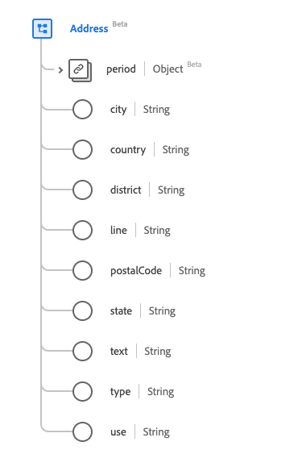

# Tipo de datos [!UICONTROL Dirección]

[!UICONTROL Dirección] es un tipo de datos XDM (Experience Data Model) estándar que describe una dirección expresada mediante convenciones postales (a diferencia de GPS u otros formatos de definición de ubicación). Este tipo de datos se crea de acuerdo con las especificaciones de la versión 5 de HL7 FHIR.

| Nombre para mostrar | Propiedad | Tipo de datos | Descripción |
| --- | --- | --- | --- |
| [!UICONTROL Período] | `period` | [[!UICONTROL Período]](../data-types/period.md) | Período de tiempo en el que la dirección estaba/está en uso. |
| [!UICONTROL Ciudad] | `city` | Cadena | Nombre de la ciudad. |
| [!UICONTROL País] | `country` | Cadena | El código de país descrito en la norma internacional ISO 3166. El código puede ser alpha-2 o alpha-3. |
| [!UICONTROL Distrito] | `district` | Cadena | El nombre del distrito. |
| [!UICONTROL Línea] | `line` | Cadena | El nombre de la calle, número, dirección, apartado postal o similar. |
| [!UICONTROL Código postal] | `postalCode` | Cadena | El código postal. |
| [!UICONTROL Estado] | `state` | Cadena | La subunidad de un país. Las abreviaciones son aceptables. |
| [!UICONTROL Texto] | `text` | Cadena | La representación de texto de la dirección. |
| [!UICONTROL Tipo] | `type` | Cadena | El tipo de dirección. El valor de esta propiedad debe ser igual a uno de los siguientes valores de enumeración conocidos. <li> `postal` </li> <li> `physical` </li> <li> `both` </li> |
| [!UICONTROL Usar] | `use` | Cadena | El propósito de la dirección. El valor de esta propiedad debe ser igual a uno de los siguientes valores de enumeración conocidos. <li> `home` </li> <li> `work` </li> <li> `temp` </li> <li> `old`</li> <li> `billing`</li> |

Para obtener más información sobre el tipo de datos, consulte el repositorio XDM público:

* [Ejemplo completado](https://github.com/adobe/xdm/blob/master/extensions/industry/healthcare/fhir/datatypes/address.example.1.json)
* [Esquema completo](https://github.com/adobe/xdm/blob/master/extensions/industry/healthcare/fhir/datatypes/address.schema.json)
