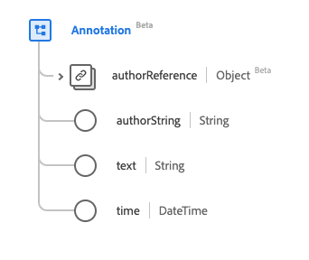

# [!UICONTROL Tipo de datos de anotación]

[!UICONTROL Anotación] es un tipo de datos estándar del Modelo de datos de experiencia (XDM) que contiene un nodo de texto con atribución al autor. Este tipo de datos se crea de acuerdo con las especificaciones de la versión 5 de HL7 FHIR.

| Nombre para mostrar | Propiedad | Tipo de datos | Descripción |
| --- | --- | --- | --- |
| [!UICONTROL Referencia de autor] | `authorReference` | [[!UICONTROL Referencia]](../data-types/reference.md) | Una referencia al autor. |
| [!UICONTROL Autor] | `authorString` | Cadena | Persona responsable de la anotación. |
| [!UICONTROL Texto] | `text` | Cadena | El contenido de la anotación. |
| [!UICONTROL Fecha] | `time` | Fecha/Hora | Cuando se realizó la anotación. |

Para obtener más información sobre el tipo de datos, consulte el repositorio XDM público:

* [Ejemplo completado](https://github.com/adobe/xdm/blob/master/extensions/industry/healthcare/fhir/datatypes/annotation.example.1.json)
* [Esquema completo](https://github.com/adobe/xdm/blob/master/extensions/industry/healthcare/fhir/datatypes/annotation.schema.json)
