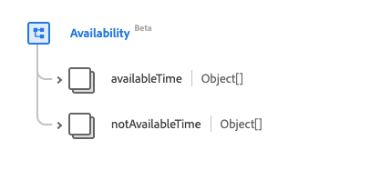

# [!UICONTROL Disponibilidad] tipo de datos

[!UICONTROL Disponibilidad] es un tipo de datos estándar del Modelo de datos de experiencia (XDM) que describe los datos de disponibilidad de un artículo. Este tipo de datos se crea de acuerdo con las especificaciones de la versión 5 de HL7 FHIR.

| Nombre para mostrar | Propiedad | Tipo de datos | Descripción |
| --- | --- | --- | --- |
| [!UICONTROL Tiempo disponible] | `availableTime` | Matriz de objetos | Las horas en que el artículo está disponible. Consulte la [sección siguiente](#available-time) para obtener más información. |
| [!UICONTROL Tiempo no disponible] | `notAvailableTime` | Cadena | Las horas en que el artículo no está disponible, con un motivo proporcionado. Consulte la [sección siguiente](#not-available-time) para obtener más información. |

Para obtener más información sobre el tipo de datos, consulte el repositorio XDM público:

* [Ejemplo completado](https://github.com/adobe/xdm/blob/master/extensions/industry/healthcare/fhir/datatypes/availability.example.1.json)
* [Esquema completo](https://github.com/adobe/xdm/blob/master/extensions/industry/healthcare/fhir/datatypes/availability.schema.json)

## `availableTime` {#available-time}

`availableTime` se proporciona como una matriz de objetos. A continuación se describe la estructura de cada objeto.

| Nombre para mostrar | Propiedad | Tipo de datos | Descripción |
| --- | --- | --- | --- |
| [!UICONTROL Todo el día] | `allDay` | Booleano | Un booleano que indica si el elemento siempre está disponible. |
| [!UICONTROL Tiempo de finalización disponible] | `availableEndTime` | Cadena | La hora del día en que el artículo deja de estar disponible. Esto se omitirá si `allDay` es `true`. |
| [!UICONTROL Hora de inicio disponible] | `availableStartTime` | Cadena | Hora del día a la que el elemento empieza a estar disponible. Esto se omitirá si `allDay` es `true`. |
| [!UICONTROL Días De La Semana] | `daysOfWeek` | Matriz de cadenas | Matriz de cadenas que detalla los días disponibles. Los valores de esta propiedad deben ser iguales a uno o varios de los siguientes valores de enumeración conocidos. <li> `mon` </li> <li> `tues` </li> <li> `wed` </li> <li> `thurs`</li>  <li> `fri` </li> <li> `sat`</li> <li> `sun`</li> |

## `notAvailableTime` {#not-available-time}

`notAvailableTime` se proporciona como una matriz de objetos. A continuación se describe la estructura de cada objeto.

| Nombre para mostrar | Propiedad | Tipo de datos | Descripción |
| --- | --- | --- | --- |
| [!UICONTROL Durante] | `during` | [[!UICONTROL Período]](../data-types/period.md) | Período de tiempo durante el cual el elemento deja de estar disponible. |
| [!UICONTROL Descripción] | `description` | Cadena | El motivo por el que el artículo no está disponible. |
