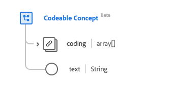

# [!UICONTROL Tipo de datos del concepto codificable]

[!UICONTROL Concepto codificable] es un tipo de datos estándar del Modelo de datos de experiencia (XDM) que describe una referencia de un recurso a otro. Este tipo de datos se crea de acuerdo con las especificaciones de la versión 5 de HL7 FHIR.

| Nombre para mostrar | Propiedad | Tipo de datos | Descripción |
| --- | --- | --- | --- |
| [!UICONTROL Codificación] | `coding` | Matriz de [[!UICONTROL codificación]](../data-types/coding.md) | Código definido por un sistema terminológico. |
| [!UICONTROL Texto] | `text` | Cadena | La representación de texto sin formato del concepto. |

Para obtener más información sobre el tipo de datos, consulte el repositorio XDM público:

* [Ejemplo completado](https://github.com/adobe/xdm/blob/master/extensions/industry/healthcare/fhir/datatypes/codeablereference.example.1.json)
* [Esquema completo](https://github.com/adobe/xdm/blob/master/extensions/industry/healthcare/fhir/datatypes/codeableconcept.schema.json)
