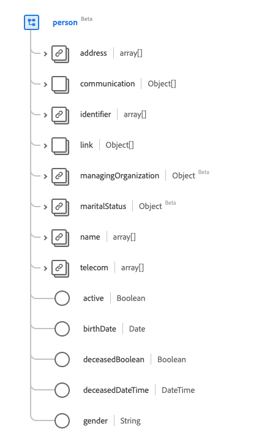

# Tipo de datos [!UICONTROL Persona]

[!UICONTROL Persona] es un tipo de datos estándar del Modelo de datos de experiencia (XDM) que proporciona información sobre un registro de persona genérico. Este tipo de datos se crea de acuerdo con las especificaciones de la versión 5 de HL7 FHIR.

| Nombre para mostrar | Propiedad | Tipo de datos | Descripción |
| --- | --- | --- | --- |
| [!UICONTROL Dirección] | `address` | Matriz de [[!UICONTROL dirección]](../data-types/address.md) | Una o más direcciones de la persona. |
| [!UICONTROL Comunicación] | `communication` | Matriz de objetos | Lenguaje que puede utilizarse para comunicarse con la persona acerca de su salud. Consulte la [sección siguiente](#communication) para obtener más información. |
| [!UICONTROL Identificador] | `identifier` | Matriz de [[!UICONTROL identificador]](../data-types/identifier.md) | Un identificador humano para esta persona. |
| [!UICONTROL Detalles de vínculo de persona] | `link` | Matriz de objetos | Un vínculo a un recurso que afecta a la misma persona real. Consulte la [sección siguiente](#link) para obtener más información. |
| [!UICONTROL Administrar organización] | `managingOrganization` | [[!UICONTROL Referencia]](../data-types/reference.md) | La organización que es la custodia de la historia clínica del paciente. |
| [!UICONTROL Estado civil] | `maritalStatus` | [[!UICONTROL Concepto codificable]](../data-types/codeable-concept.md) | El estado civil de una persona |
| [!UICONTROL Nombre] | `name` | Matriz de [[!UICONTROL nombre humano]](../data-types/human-name.md) | Los nombres asociados con una persona. |
| [!UICONTROL Detalles de contacto] | `telecom` | Matriz de [[!UICONTROL punto de contacto]] | Los datos de contacto mediante los cuales se puede contactar a la persona. |
| [!UICONTROL Activo] | `active` | Booleano | Indica si el registro de la persona está en uso activo. |
| [!UICONTROL Fecha de nacimiento] | `birthDate` | Fecha | La fecha de nacimiento de la persona. |
| [!UICONTROL Indicador fallecido] | `deceasedBoolean` | Booleano | Indica si la persona ha fallecido o no. |
| [!UICONTROL Hora de la fecha de fallecimiento] | `deceasedDateTime` | Fecha/Hora | La fecha y hora de la muerte si la persona ha fallecido. |
| [!UICONTROL Sexo] | `gender` | Cadena | La identidad de género de la persona. El valor de esta propiedad debe ser igual a uno de los siguientes valores de enumeración conocidos. <li> `female` </li> <li> `male` </li> <li> `other` </li> <li> `unknown`</li> |

Para obtener más información sobre el tipo de datos, consulte el repositorio XDM público:

* [Ejemplo completado](https://github.com/adobe/xdm/blob/master/extensions/industry/healthcare/fhir/datatypes/identifier.example.1.json)
* [Esquema completo](https://github.com/adobe/xdm/blob/master/extensions/industry/healthcare/fhir/datatypes/identifier.schema.json)

## `communication` {#communication}

`communication` se proporciona como una matriz de objetos. A continuación se describe la estructura de cada objeto.

| Nombre para mostrar | Propiedad | Tipo de datos | Descripción |
| --- | --- | --- | --- |
| [!UICONTROL Idioma] | `language` | [[!UICONTROL Concepto codificable]](../data-types/codeable-concept.md) | El idioma que puede usarse para comunicarse con la persona sobre su salud. |
| [!UICONTROL Es El Idioma Preferido] | `preferred` | Booleano | Indica si el idioma es su idioma preferido o no. |

## `link` {#link}

`link` se proporciona como una matriz de objetos. A continuación se describe la estructura de cada objeto.

| Nombre para mostrar | Propiedad | Tipo de datos | Descripción |
| --- | --- | --- | --- |
| [!UICONTROL Target] | `target` | [[!UICONTROL Referencia]](../data-types/reference.md) | El recurso al que está asociada esta persona real. |
| [!UICONTROL Assurance] | `assurance` | Cadena | El nivel de garantía asociado al vínculo. Los valores de esta propiedad deben ser iguales a uno o varios de los siguientes valores de enumeración conocidos. <li> `level1` </li> <li> `level2` </li> <li> `level3` </li> <li> `level4` </li> |
