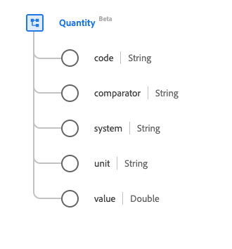

# [!UICONTROL Cantidad] tipo de datos

[!UICONTROL Cantidad] es un tipo de datos estándar del Modelo de datos de experiencia (XDM) que proporciona una cantidad medida o medible. Este tipo de datos se crea de acuerdo con las especificaciones de la versión 5 de HL7 FHIR.

| Nombre para mostrar | Propiedad | Tipo de datos | Descripción |
| --- | --- | --- | --- |
| [!UICONTROL Código] | `code` | Cadena | La forma codificada de la unidad. |
| [!UICONTROL Comparador] | `comparator` | Cadena | El operador de comparación. El valor de esta propiedad debe ser igual a uno de los siguientes valores de enumeración conocidos. <li> `<` </li> <li> `<=` </li> <li> `>=` </li> <li> `>`</li> <li> `ad`</li> |
| [!UICONTROL Sistema] | `system` | Cadena | Sistema que define la forma de unidad codificada, representada como URI. |
| [!UICONTROL Unidad] | `unit` | Cadena | La representación de la unidad. |
| [!UICONTROL Valor] | `value` | Duplicada | El valor numérico. |

Para obtener más información sobre el tipo de datos, consulte el repositorio XDM público:

* [Ejemplo completado](https://github.com/adobe/xdm/blob/master/extensions/industry/healthcare/fhir/datatypes/quantity.example.1.json)
* [Esquema completo](https://github.com/adobe/xdm/blob/master/extensions/industry/healthcare/fhir/datatypes/quantity.schema.json)
